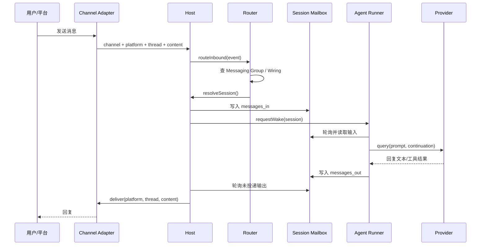
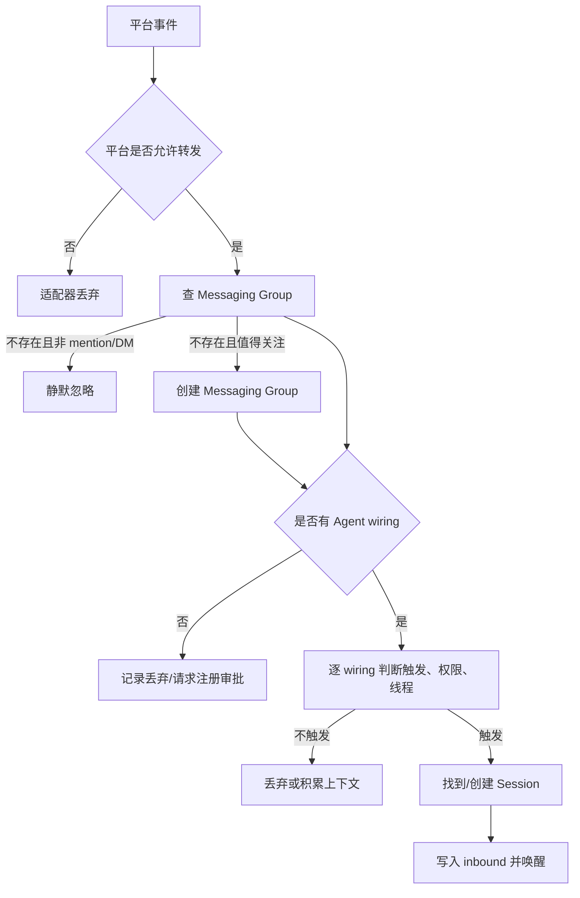
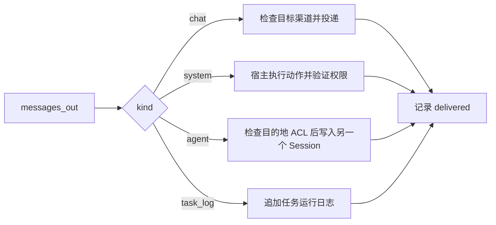

# 核心业务流程

## 普通聊天的完整链条

```mermaid
sequenceDiagram
    participant U as 用户/平台
    participant C as Channel Adapter
    participant H as Host
    participant R as Router
    participant M as Session Mailbox
    participant A as Agent Runner
    participant P as Provider

    U->>C: 发送消息
    C->>H: channel + platform + thread + content
    H->>R: routeInbound(event)
    R->>R: 查 Messaging Group / Wiring
    R->>H: resolveSession()
    H->>M: 写入 messages_in
    H->>A: requestWake(session)
    A->>M: 轮询并读取输入
    A->>P: query(prompt, continuation)
    P-->>A: 回复文本/工具结果
    A->>M: 写入 messages_out
    H->>M: 轮询未投递输出
    H->>C: deliver(platform, thread, content)
    C-->>U: 回复
```

## 路由分支

```mermaid
flowchart TD
    E[平台事件] --> T{平台是否允许转发}
    T -- 否 --> D1[适配器丢弃]
    T -- 是 --> G[查 Messaging Group]
    G -->|不存在且非 mention/DM| D2[静默忽略]
    G -->|不存在且值得关注| N[创建 Messaging Group]
    N --> W{是否有 Agent wiring}
    G --> W
    W -- 否 --> A1[记录丢弃/请求注册审批]
    W -- 是 --> F[逐 wiring 判断触发、权限、线程]
    F -->|不触发| D3[丢弃或积累上下文]
    F -->|触发| S[找到/创建 Session]
    S --> I[写入 inbound 并唤醒]
```

## 出站分支

```mermaid
flowchart LR
    O[messages_out] --> K{kind}
    K -->|chat| C[检查目标渠道并投递]
    K -->|system| X[宿主执行动作并验证权限]
    K -->|agent| A[检查目的地 ACL 后写入另一个 Session]
    K -->|task_log| L[追加任务运行日志]
    C --> M[记录 delivered]
    X --> M
    A --> M
    L --> M
```

## 课程切入点

第 1 课只实现上述链条最左侧的一个极小投影：`本地文本 → 回复文本`。渠道、
路由、会话、邮箱和容器会在后续需求出现时依次加入，而不是在第一课搭好最终
架构。
