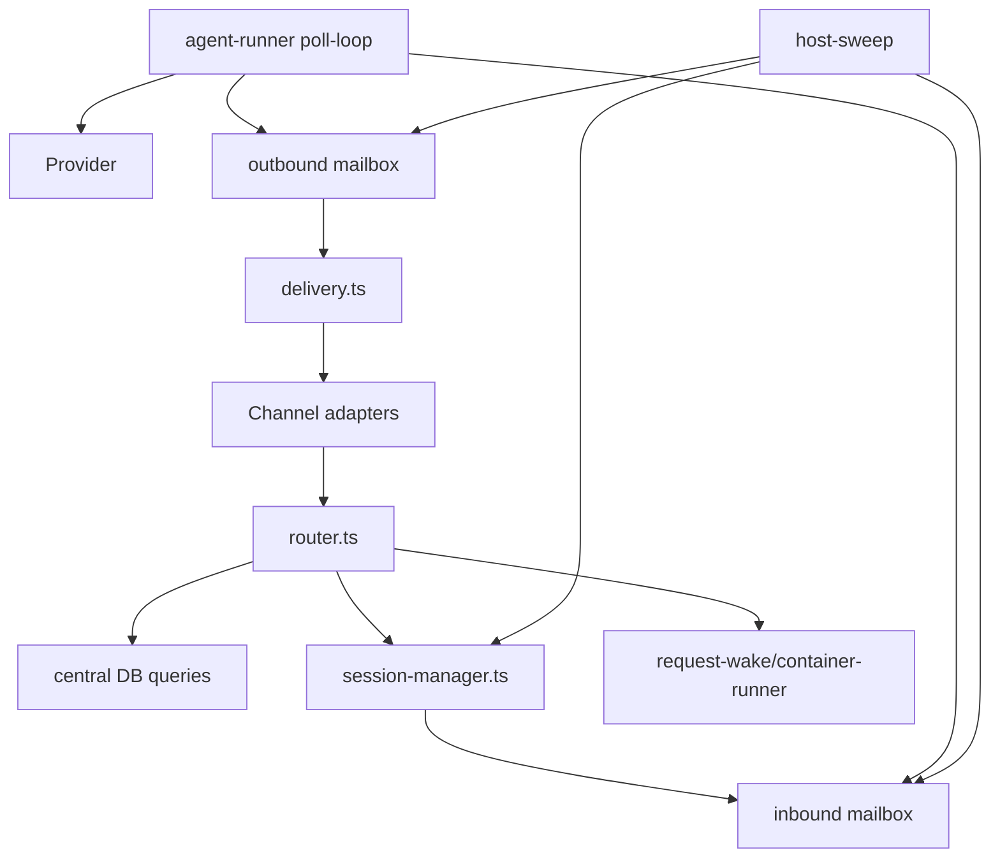

# 模块关系

## 原项目模块分层



## 责任表

| 模块 | 责任 | 不应该负责 |
|---|---|---|
| Channel Adapter | 连接平台、筛选/解析平台事件、投递输出 | Agent Group/Session 业务决策 |
| Router | 根据 wiring 选择 Agent 和 Session、写入消息、触发唤醒 | 直接调用模型或平台 API |
| Central DB | 保存实体、关系和路由配置 | 保存容器内全部上下文 |
| Session Manager | 创建会话目录/邮箱、写入消息、维护容器状态 | 判断某平台是否触发 |
| Container Runner | 启停隔离容器、准备挂载和配置 | 解析用户业务内容 |
| Agent Runner | 轮询消息、组织 prompt、调用 Provider、写出消息 | 直接修改宿主中心库 |
| Provider | 对接某一种模型运行时 | 决定平台投递到哪里 |
| Delivery | 读取出站消息、权限检查、投递、重试 | 生成模型回复 |
| Host Sweep | 定时补偿 pending、stale、due delivery 和 recurrence | 取代正常消息链 |

## 教学重建的模块演化

教学项目不会一开始复制这张图：

```text
第 1 课：reply.ts + main.ts
→ 第 3 课：增加具体的 Conversation 状态
→ 第 5 课：增加按 channelId 查会话的具体映射
→ 第 6/7 课：拆出队列、入口和投递
→ 第 8/9 课：数据库和会话邮箱
→ 第 10/11 课：容器和 Provider
→ 第 12～15 课：路由扇出、调度、可靠性和治理
```

每次拆模块前都要在当课教案说明旧代码的具体痛点。
