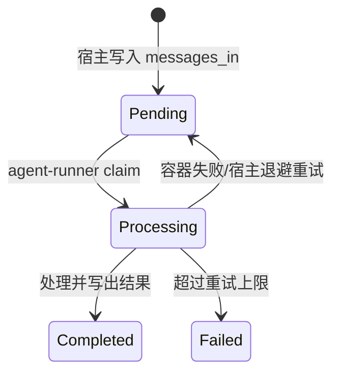
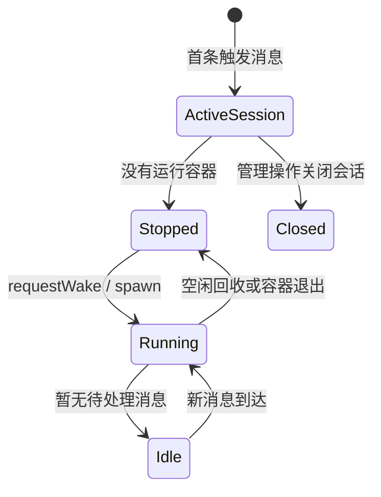
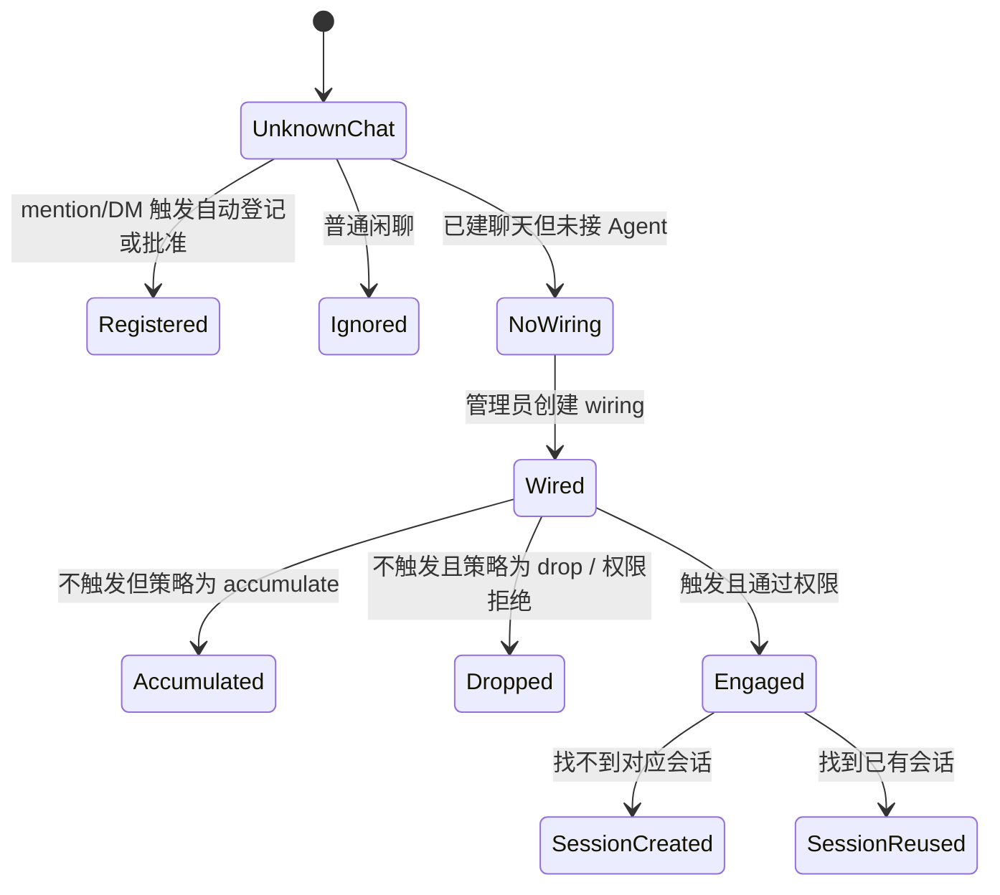

# 状态模型

## 消息生命周期



`messages_in.status` 由宿主拥有；容器因为只读打开 inbound.db，不能直接改变
它，而是在 outbound.db 写 `processing_ack`，宿主再同步终态。这是“谁拥有状态”
很重要的例子。

## 会话和容器生命周期



Session 记录业务身份和容器状态；心跳文件、处理确认和宿主 sweep 共同判断
运行中的容器是否还活着。

## Router 的触发状态



## 第 1 课的状态

第 1 课还没有持久状态或异步状态。每次 CLI 调用都是：

```text
输入字符串 → 调用 replyToText → 输出字符串 → 进程结束
```

因此不画假的 pending/running 状态；状态视角会在第 3 课真正需要上下文时再引入。
