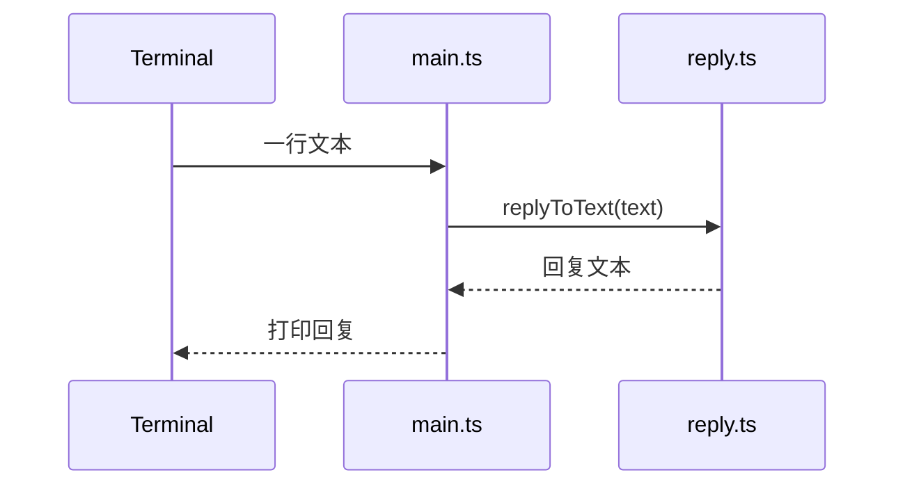

# 第 1 课：最小单次对话闭环

## 1. 前言

NanoClaw 最终是一个能从聊天平台接收消息、调用隔离 Agent、再把回复送回去的
个人 AI 助手。但项目刚开始时，我们还没有渠道、数据库、容器，也没有理由先
写这些结构。

现在先提出一个足够真实、又足够小的需求：**用户在本地给助手输入一句话，
助手应该给出一句可见的回复**。如果连这个闭环都没有，后面讨论消息路由、会话
记忆和容器隔离就没有落脚点。

本课的旧方案是“什么都没有”。我们只增加一个最小文本处理函数和一个一次性
命令行入口。回复暂时采用确定性的本地回显，故意不连接真实模型：当前目标是
验证业务链条，而不是提前解决模型凭据、网络和 Provider 选择。

本课结束时，数据只走一条同步链：

```text
标准输入的一段文字 → replyToText() → 标准输出的一段文字
```

这不是最终架构，而是后续演化的起点。下一课会出现第一个真实问题：聊天中
并非每句话都在呼叫助手，因此“输入就回复”的规则需要被需求推翻。

## 2. 主要内容

### 2.1 本课要做什么

1. 建立一个最小 TypeScript 工程，能编译源码和测试。
2. 写一个只做一件事的 `replyToText` 函数：接收文本，返回确定的回复文本。
3. 写一个 Happy Path 测试，固定输入和输出，先让测试成为需求的可执行描述。
4. 提供 `main.ts` 一次性读取标准输入，调用回复函数，把结果打印到终端。
5. 不增加会话、消息对象、渠道接口、模型 SDK、数据库、Docker 或“未来扩展”层。

### 2.2 代码阅读链条

从一次终端输入开始阅读：

1. `src/main.ts` 的 `runCli()` 读取一行标准输入，得到字符串 `text`。
2. `runCli()` 调用 `src/reply.ts` 的 `replyToText(text)`。
3. `replyToText()` 把输入拼成 `NanoClaw: ${text}`，返回一个字符串。
4. `runCli()` 把返回值写入标准输出并结束本次调用。

测试链条单独阅读：

1. `test/reply.test.ts` 构造输入 `你好，NanoClaw`。
2. 测试直接调用 `replyToText()`，不经过终端，减少本课无关的环境噪声。
3. 断言返回值是 `NanoClaw: 你好，NanoClaw`。

### 2.3 和原项目的对应关系

本课还没有原项目中的 `ChannelAdapter`、`router`、`Session`、`messages_in`、
`agent-runner` 或 `delivery`。它只保留最终链条的最小业务投影：**有输入，调用
处理步骤，有输出**。这是一个小的同步环节，不是完整的跨进程链条。

### 2.4 本课的抽象层次

当前只有一种输入（标准输入）、一种处理方式（本地回显）和一种输出（标准输出）。
所以直接使用函数是最清楚的做法。现在写 `Message` 接口、`Provider` 接口或
`ChannelAdapter` 会让学生看到名字，却看不到它们解决的具体问题；等第二种
实现或新的数据形态出现时，再让旧代码暴露不足。

## 3. 技术要点

### 3.0 环境配置是基础

本课使用 Node.js 22+、pnpm 10+ 和 TypeScript。工程配置位于重建项目根目录：

- `package.json`：`build`、`start`、`test` 命令和最小开发依赖；
- `tsconfig.json`：把 `src/` 和 `test/` 编译到 `dist/`；
- VS Code 中可通过左侧 Testing 面板运行编译后的测试，也可以在 Terminal 执行
  `pnpm test`。正式推进时先由学生运行，再根据实际输出继续。

当前不需要安装真实模型 SDK、SQLite、Docker 或任何渠道包。

### 3.1 坐标：当前代码位于哪里

从最终系统的纵向层次看：

```text
用户输入层 → 本课的业务处理函数 → 用户输出层
```

从横向模块看，目前只有一个“本地 CLI 入口”和一个“回复逻辑”。它们都在宿主
进程内同步运行；没有持久化层、异步层、隔离执行层或平台适配层。

### 3.2 代码是中心

`reply.ts` 负责当前唯一的业务规则。`replyToText(text: string): string` 的
输入是用户输入的普通字符串，输出是给用户看的普通字符串；它没有副作用，
也没有读取环境变量或调用网络。

`main.ts` 只负责命令行边界。`runCli()` 从标准输入拿到一行文字，把业务委托
给 `replyToText()`，再把结果写回标准输出。这样，测试可以直接测试业务函数，
而不用启动一个真实聊天平台。

代码故事是刻意平的：因为当前只需要回答一次，所以先有一个函数；因为用户
需要从终端调用，才增加 CLI 入口；因为要防止以后改坏最小行为，才同步增加
一个测试。没有为了未来插入空的服务层。

### 3.3 数据是着眼点

本课只有两个内存字符串，没有数据库或文件：

```text
输入："你好，NanoClaw"
  ↓ replyToText(text)
中间结果/返回值："NanoClaw: 你好，NanoClaw"
  ↓ process.stdout.write
终端可见输出：NanoClaw: 你好，NanoClaw
```

`text` 在 `runCli()` 和 `replyToText()` 之间传递时没有改变数据类型，也没有
新增字段。这种简单性是暂时的；第 2 课需要知道“是否触发”，第 3 课需要保存
多条消息，届时才会有真正的数据模型。

### 3.4 状态视角

本课不引入持久状态。一次运行结束，字符串就随进程结束而消失，因此不能假装
已经有 Session 生命周期：



真正的状态流会在“需要记住上下文”时出现；那时我们再讨论内存、文件和会话
状态的所有者。

### 3.5 流程图：本课新增的链条


和“什么都没有”相比，本课增加的是一条最小同步链，而不是分支或异步环节。

### 3.6 细节技术点

- `string` 是本课唯一的数据类型；函数签名直接表达输入和输出。
- TypeScript 编译器把 `src/` 和 `test/` 转成 Node 可执行的 ESM JavaScript；
  学生先理解编译前后的职责，不需要在本课深入类型系统。
- 测试使用 Node 的测试断言链路（项目脚本统一调用编译后的测试），断言失败
  时会显示实际值和期望值。
- 回复采用本地确定文本是测试替身式的最小实现，但此时还不叫 Provider：项目
  只有一种实现，尚未出现需要替换的具体问题。

#### VS Code 为什么要选择 Workspace TypeScript

VS Code 自己内置了一份 TypeScript，项目的 `node_modules/typescript` 中也安装了
一份。它们的职责不同：

- VS Code 内置版本供编辑器提供补全、跳转和红线诊断；
- 工作区版本是本项目通过 `package.json` 安装并锁定的版本，也是团队更容易保持
  一致的版本；
- `pnpm build` 直接调用项目内的 `tsc`，不依赖编辑器当前选择。

选择 `TypeScript: Select TypeScript Version → Use Workspace Version` 后，VS Code
改用项目的 TypeScript，并重新读取根目录 `tsconfig.json`、`package.json` 和
`@types/node`。`@types/node` 告诉 TypeScript：Node 运行时具有 `process` 全局对象，
也具有 `node:path`、`node:url` 等内置模块。因此这次切换后红线会立刻消失。

这说明原问题在“编辑器用哪套类型环境理解代码”，不是 Node 运行时真的缺少模块。

#### `node:path` 与变量 `path`

```ts
import path from 'node:path';
```

大白话理解：Node 自带一套“处理文件路径”的工具箱，这行代码把整个工具箱取来，
在当前文件中命名为 `path`。`node:` 前缀明确表示这是 Node 内置模块，不是从
`node_modules` 下载的第三方包。

当前代码使用：

```ts
path.resolve(process.argv[1])
```

`resolve()` 把可能是相对路径的启动文件名转换为绝对路径，便于和当前文件的绝对
路径可靠比较。

#### `import.meta.url` 与 `fileURLToPath()`

项目使用 ESM（`package.json` 中有 `"type": "module"`）。在 ESM 中，每个模块
可以通过 `import.meta` 读取自己的模块信息；其中 `import.meta.url` 表示“当前
这个模块自己的 URL”。它通常长这样：

```text
file:///home/shitanli/ln_rebuild/nanoclaw/nanoclaw-st/dist/src/main.js
```

它是 `file:` URL，不是普通 Linux 路径。因此：

```ts
import { fileURLToPath } from 'node:url';
const currentFile = fileURLToPath(import.meta.url);
```

`fileURLToPath()` 负责把它安全转换为：

```text
/home/shitanli/ln_rebuild/nanoclaw/nanoclaw-st/dist/src/main.js
```

`node:url` 也是 Node 内置模块；花括号表示这里只取其中名为 `fileURLToPath` 的
函数。

#### `process` 是谁

`process` 是 Node 运行时自动提供的全局对象，不需要 `import`。它代表“当前正在
运行的 Node 进程”。本课用到三个位置：

- `process.stdin`：当前进程的标准输入，接收终端里输入的文字；
- `process.stdout`：当前进程的标准输出，把回复显示到终端；
- `process.argv`：启动命令携带的参数数组，`process.argv[1]` 通常是被执行的脚本。

因此 `process` 不是浏览器 JavaScript 的默认能力。TypeScript 必须通过
`@types/node` 才知道这些字段的类型。

#### 为什么要比较 `currentFile` 和 `invokedFile`

```ts
if (currentFile === invokedFile) {
  await runCli();
}
```

同一个 `main.ts` 可能有两种使用方式：

1. 用户直接执行它：应该启动 CLI，等待输入；
2. 其它代码或测试导入它：只想使用 `runCli()`，不应该突然等待终端输入。

`currentFile` 表示“这段代码所在的文件”，`invokedFile` 表示“Node 本次直接启动
的文件”。两者相同才调用 `runCli()`。这种写法是 ESM 环境下判断“是否直接执行”
的办法，不是业务路由或未来插件机制。

#### 为什么 TypeScript 导入的是 `./reply.js`

源码文件明明叫 `reply.ts`，却写：

```ts
import { replyToText } from './reply.js';
```

原因是 TypeScript 源码编译后，真正交给 Node 运行的是 `reply.js`。当前使用
`NodeNext` 模块规则，TypeScript 会在编译期把这个 `.js` 地址对应回 `reply.ts`
做类型检查，同时保留 `.js` 地址给运行时。这样生成的 ESM JavaScript 可以被
Node 直接加载。

## 4. 测试与验收

### 4.1 Happy Path 测试

**目的**：验证最小业务价值——一段用户文本能变成一段确定回复。

**输入**：

```text
你好，NanoClaw
```

**预期**：

```text
NanoClaw: 你好，NanoClaw
```

**这个测试证明了什么**：`replyToText()` 的当前规则存在且没有被后续改动破坏。
它不证明网络、模型、渠道、会话或容器可用，因为本课根本没有这些组件。

### 4.2 验收顺序（正式教学时由学生执行）

1. 先运行本课测试，确认 Happy Path 通过。
2. 再构建并运行 CLI，手动输入一行文本，观察终端输出。
3. 对照 `src/main.ts → src/reply.ts → test/reply.test.ts` 说出数据流。
4. 学生反馈实际终端输出或问题后，再决定是否进入第 2 课；没有提前生成第 2 课教案。

## 5. 总结

本课比空目录多了一条可运行、可测试的单次本地对话链：输入字符串经过一个
直接函数，变成输出字符串。我们没有提前设计渠道、Provider、Session 或数据库，
因为当前没有第二种实现、没有持久化需求，也没有跨进程边界。

这个实现很快会遇到第一个真实限制：如果用户在群聊里说普通话，助手也会无条件
回复；如果要支持连续对话，当前函数也没有上下文可读。下一课将由“只在被呼叫
时回复”的需求推动第一个分支，而不是由某个设计模式名称推动代码。
