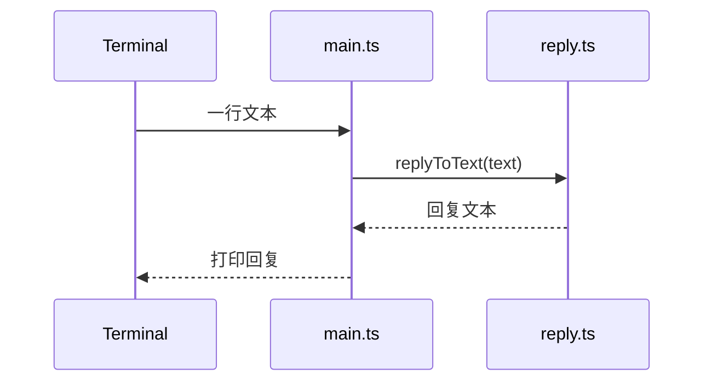

# 第 1 课：最小单次对话闭环

## 1. 前言

NanoClaw 最终要做成一个个人 AI 助手：它能从聊天平台接收消息，调用被隔离开
的 Agent 来生成回复，再把回复送回去。不过项目才刚刚起步，渠道、数据库、
容器这些结构现在都还没有，而且当前也没有理由先把它们写出来。

所以本课先提出一个足够真实、又足够小的需求：**用户在本地给助手输入一句话，
助手应该给出一句可见的回复**。这个需求看起来朴素，却是整条业务链的雏形——
如果连"一句话进、一句话出"的闭环都跑不通，后面讨论消息路由、会话记忆和
容器隔离时就没有落脚点。

对比一下起点：本课开始之前的方案是"什么都没有"。我们只增加两样东西——
一个最小文本处理函数，和一个一次性的命令行入口。回复暂时采用确定性的本地
回显，并且故意不连接真实模型：因为本课的目标是验证业务链条本身，而不是
提前去解决模型凭据、网络和 Provider 选择这些外围问题。

本课结束时，数据只走一条同步链：

```text
标准输入的一段文字 → replyToText() → 标准输出的一段文字
```

这不是最终架构，而是后续演化的起点。下一课会出现第一个真实问题：聊天中
并非每句话都在呼叫助手，因此"输入就回复"这条规则需要被需求推翻。

## 2. 主要内容

### 2.1 本课要做什么

按顺序，本课要做五件事：

1. 建立一个最小的 TypeScript 工程，让它能把源码和测试都编译出来。
2. 写一个只做一件事的 `replyToText` 函数：接收文本，返回确定的回复文本。
3. 为它写一个 Happy Path（一切按预期顺利进行的主路径）测试：把输入和输出
   都固定下来，让测试先成为需求的可执行描述。
4. 提供 `main.ts`，一次性读取标准输入，调用回复函数，再把结果打印到终端。
5. 明确不增加的东西：会话、消息对象、渠道接口、模型 SDK、数据库、Docker，
   以及各种"为未来准备"的扩展层。

### 2.2 代码阅读链条

阅读代码时，从一次终端输入开始，顺着数据走：

1. `src/main.ts` 的 `runCli()` 读取一行标准输入，得到字符串 `text`。
2. `runCli()` 调用 `src/reply.ts` 的 `replyToText(text)`。
3. `replyToText()` 把输入拼成 `NanoClaw: ${text}` 的形式，返回一个字符串。
4. `runCli()` 把这个返回值写入标准输出，然后结束本次调用。

测试链条则单独阅读：

1. `test/reply.test.ts` 构造输入 `你好，NanoClaw`。
2. 测试直接调用 `replyToText()`，不经过终端——这样可以减少与本课无关的
   环境噪声。
3. 最后断言返回值是 `NanoClaw: 你好，NanoClaw`。

### 2.3 和原项目的对应关系

原项目里的那些结构——`ChannelAdapter`、`router`、`Session`、`messages_in`、
`agent-runner`、`delivery`——本课一个都还没有。本课只保留最终链条中最小的
一块业务投影：**有输入，调用处理步骤，有输出**。换句话说，这是一个很小的
同步环节，还不是完整的跨进程链条。

### 2.4 本课的抽象层次

当前系统只有一种输入（标准输入）、一种处理方式（本地回显）和一种输出
（标准输出），所以直接使用一个函数是最清楚的做法。如果现在就写出 `Message`
接口、`Provider` 接口或 `ChannelAdapter`，学生只会看到这些名字，却看不到
它们各自解决的具体问题。更合适的时机是：等第二种实现或新的数据形态出现，
让旧代码自己暴露出不足，再顺势引入抽象。

## 3. 技术要点

### 3.0 环境配置是基础

本课使用 Node.js 22+、pnpm 10+ 和 TypeScript。工程配置文件位于重建项目的
根目录：

- `package.json`：定义了 `build`、`start`、`test` 三个命令和最小的一组
  开发依赖；
- `tsconfig.json`：负责把 `src/` 和 `test/` 编译到 `dist/`；
- VS Code 中可以通过左侧 Testing 面板运行编译后的测试，也可以在 Terminal
  里执行 `pnpm test`。正式推进课程时，先由学生自己运行，再根据实际输出
  继续。

当前不需要安装真实模型 SDK、SQLite、Docker 或任何渠道包。

### 3.1 坐标：当前代码位于哪里

从最终系统的纵向层次看，本课的代码处在最简单的一条通路上：

```text
用户输入层 → 本课的业务处理函数 → 用户输出层
```

从横向模块看，目前只有两个成员：一个"本地 CLI 入口"和一个"回复逻辑"。
它们都在宿主进程内同步运行；持久化层、异步层、隔离执行层、平台适配层，
现在都还不存在。

### 3.2 代码是中心

`reply.ts` 承担当前唯一的业务规则。`replyToText(text: string): string` 的
输入是用户输入的普通字符串，输出是给用户看的普通字符串；它没有副作用，
也不读取环境变量、不调用网络。

`main.ts` 只负责命令行这一层边界。`runCli()` 从标准输入拿到一行文字，把
业务委托给 `replyToText()`，再把结果写回标准输出。这样划分有一个直接好处：
测试可以直接测业务函数本身，而不用先启动一个真实聊天平台。

代码故事是刻意保持"平"的：因为当前只需要回答一次，所以先有一个函数；因为
用户需要从终端调用，才增加 CLI 入口；因为要防止以后改坏这个最小行为，才
同步增加一个测试。没有为了想象中的未来而插入空的服务层。

### 3.3 数据是着眼点

本课全程只有两个内存字符串，没有数据库，也没有文件：

```text
输入："你好，NanoClaw"
  ↓ replyToText(text)
中间结果/返回值："NanoClaw: 你好，NanoClaw"
  ↓ process.stdout.write
终端可见输出：NanoClaw: 你好，NanoClaw
```

`text` 在 `runCli()` 和 `replyToText()` 之间传递时，既没有改变数据类型，
也没有新增字段。这种简单性是暂时的：第 2 课需要知道"这条输入是否触发了
助手"，第 3 课需要保存多条消息，到那时才会有真正的数据模型。

### 3.4 状态视角

本课不引入任何持久状态。一次运行结束，字符串就随进程一起消失，所以我们
也不能假装系统里已经有了 Session 生命周期：



真正的状态流要等到"需要记住上下文"这个需求出现时才会出现；那时我们再来
讨论内存、文件和会话状态分别归谁所有。

### 3.5 流程图：本课新增的链条


和"什么都没有"相比，本课增加的是一条最小同步链，而不是分支，也不是异步
环节。

### 3.6 细节技术点

- `string` 是本课唯一用到的数据类型；函数签名本身就把输入和输出表达清楚
  了。
- TypeScript 编译器把 `src/` 和 `test/` 转成 Node 可执行的 ESM JavaScript；
  学生先理解编译前后的职责即可，不需要在本课深入类型系统。
- 测试使用 Node 的测试断言链路（项目脚本统一调用编译后的测试），断言失败
  时会同时显示实际值和期望值。
- 回复采用本地确定文本，这本质上是测试替身式的最小实现——先用一个确定的
  假回复顶替将来真实模型的回复——但此时它还不叫 Provider：项目只有一种
  实现，"需要替换"的具体问题尚未出现。

#### VS Code 为什么要选择 Workspace TypeScript

VS Code 自己内置了一份 TypeScript，项目的 `node_modules/typescript` 里又
安装了一份。这两份各管各的事：

- VS Code 内置版本供编辑器提供补全、跳转和红线诊断；
- 工作区版本是本项目通过 `package.json` 安装并锁定的版本，也是团队更容易
  保持一致的版本；
- `pnpm build` 直接调用项目内的 `tsc`，不依赖编辑器当前选择的是哪一份。

执行 `TypeScript: Select TypeScript Version → Use Workspace Version` 之后，
VS Code 改用项目的 TypeScript，并重新读取根目录的 `tsconfig.json`、
`package.json` 和 `@types/node`。其中 `@types/node` 告诉 TypeScript：Node
运行时具有 `process` 这个全局对象，也具有 `node:path`、`node:url` 等内置
模块。所以这次切换之后，红线会立刻消失。

这也说明了最初的问题出在哪：是"编辑器用哪套类型环境理解代码"，而不是
Node 运行时真的缺少某个模块。

#### `node:path` 与变量 `path`

```ts
import path from 'node:path';
```

用大白话理解：Node 自带一套"处理文件路径"的工具箱，这行代码把整个工具箱
取过来，在当前文件里给它起名叫 `path`。`node:` 前缀明确表示这是 Node 的
内置模块，不是从 `node_modules` 下载的第三方包。

当前代码使用的是：

```ts
path.resolve(process.argv[1])
```

`resolve()` 的作用是把可能是相对路径的启动文件名转换成绝对路径，这样才
便于和当前文件的绝对路径做可靠比较。

#### `import.meta.url` 与 `fileURLToPath()`

项目使用 ESM（`package.json` 中写了 `"type": "module"`）。在 ESM 中，每个
模块都可以通过 `import.meta` 读取自己的模块信息；其中 `import.meta.url`
表示"当前这个模块自己的 URL"。它通常长这样：

```text
file:///home/shitanli/ln_rebuild/nanoclaw/nanoclaw-st/dist/src/main.js
```

注意，它是一个 `file:` URL，不是普通的 Linux 路径，因此需要一次转换：

```ts
import { fileURLToPath } from 'node:url';
const currentFile = fileURLToPath(import.meta.url);
```

`fileURLToPath()` 负责把它安全地转换成下面这种形式：

```text
/home/shitanli/ln_rebuild/nanoclaw/nanoclaw-st/dist/src/main.js
```

`node:url` 同样是 Node 的内置模块；花括号的意思是只从里面取名为
`fileURLToPath` 的那一个函数。

#### `process` 是谁

`process` 是 Node 运行时自动提供的全局对象，不需要 `import`，它代表"当前
正在运行的 Node 进程"。本课用到它的三个位置：

- `process.stdin`：当前进程的标准输入，接收终端里输入的文字；
- `process.stdout`：当前进程的标准输出，把回复显示到终端；
- `process.argv`：启动命令携带的参数数组，`process.argv[1]` 通常是被执行
  的脚本。

所以，`process` 不是浏览器 JavaScript 的默认能力；TypeScript 必须通过
`@types/node` 才知道这些字段的类型。

#### 为什么要比较 `currentFile` 和 `invokedFile`

```ts
if (currentFile === invokedFile) {
  await runCli();
}
```

同一个 `main.ts` 可能有两种使用方式：

1. 用户直接执行它：这时应该启动 CLI，等待输入；
2. 其它代码或测试导入它：这时只想使用 `runCli()`，不应该突然停下来等待
   终端输入。

`currentFile` 表示"这段代码所在的文件"，`invokedFile` 表示"Node 本次直接
启动的文件"。两者相同，说明确实是用户直接运行的，这时才调用 `runCli()`。
这种写法是 ESM 环境下判断"是否被直接执行"的办法，不是业务路由，也不是
什么未来的插件机制。

#### 为什么 TypeScript 导入的是 `./reply.js`

源码文件明明叫 `reply.ts`，代码里却写成：

```ts
import { replyToText } from './reply.js';
```

原因是：TypeScript 源码编译之后，真正交给 Node 运行的文件是 `reply.js`。
当前项目使用 `NodeNext` 模块规则，TypeScript 会在编译期把这个 `.js` 地址
对应回 `reply.ts` 做类型检查，同时把 `.js` 地址保留给运行时。这样生成的
ESM JavaScript 就可以被 Node 直接加载。

## 4. 测试与验收

### 4.1 Happy Path 测试

**目的**：验证最小业务价值——一段用户文本能变成一段确定回复。

**输入**：

```text
你好，NanoClaw
```

**预期**：

```text
NanoClaw: 你好，NanoClaw
```

**这个测试证明了什么**：`replyToText()` 的当前规则确实存在，而且没有被
后续改动破坏。它不证明网络、模型、渠道、会话或容器可用——因为本课根本
没有这些组件。

### 4.2 验收顺序（正式教学时由学生执行）

1. 先运行本课测试，确认 Happy Path 通过。
2. 再构建并运行 CLI，手动输入一行文本，观察终端输出。
3. 能对照 `src/main.ts → src/reply.ts → test/reply.test.ts` 说出数据流。
4. 等学生反馈实际终端输出或问题之后，再决定是否进入第 2 课；本课不提前
   生成第 2 课教案。

## 5. 总结

本课比一个空目录多出来的，是一条可运行、可测试的单次本地对话链：输入
字符串经过一个直接函数，变成输出字符串。我们没有提前设计渠道、Provider、
Session 或数据库，因为当前既没有第二种实现，没有持久化需求，也没有跨进程
边界。

这个实现很快就会遇到第一个真实限制：如果用户在群聊里说一句普通话，助手
也会无条件回复；如果要支持连续对话，当前函数又没有任何上下文可读。下一课
将由"只在被呼叫时回复"这个需求推动第一个分支的产生，而不是由某个设计
模式的名称来推动代码。
