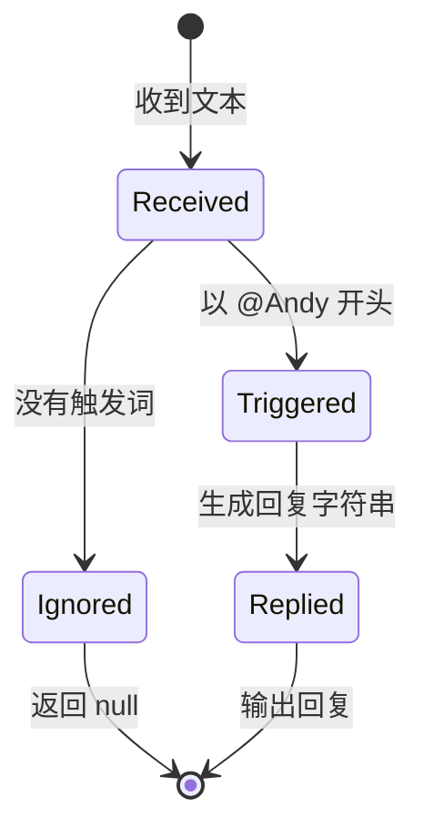
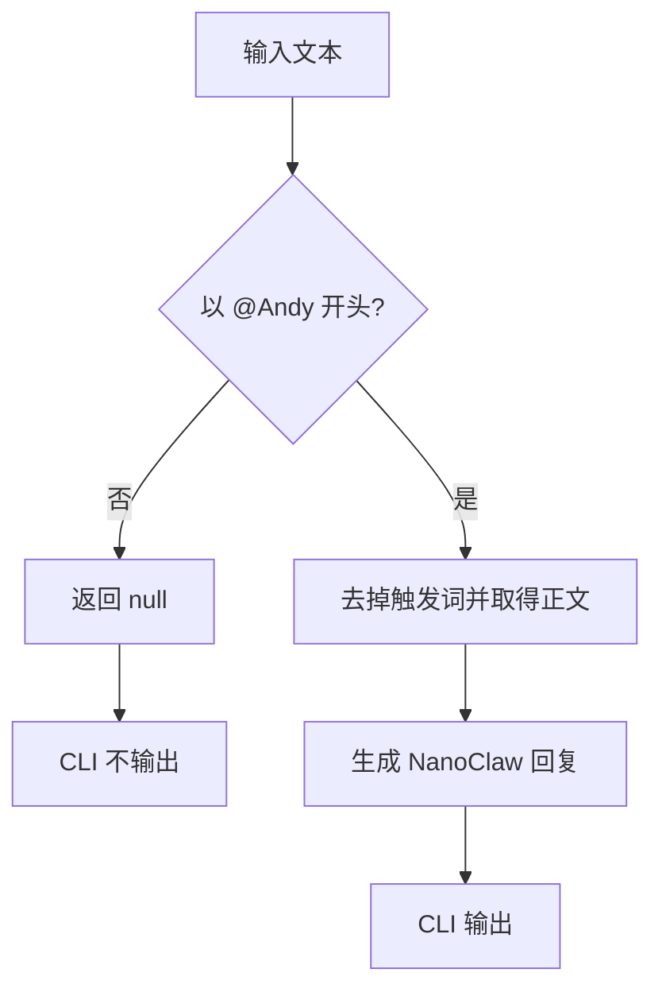

# 第 2 课：只响应真正发给助手的消息

## 1. 前言

上一课已经完成一条最小链条：用户输入一句话，`replyToText()` 生成回复，CLI
把回复显示在终端。这个实现用于证明核心闭环完全够用，但它隐含了一个过于
乐观的假设：**收到的每句话都在对助手说。**

把它放进真实群聊就会马上出问题：

```text
小王：大家下午三点开会。
NanoClaw：大家下午三点开会。
```

小王是在通知同事，并没有呼叫助手。一个对所有消息都插话的机器人既打扰用户，
也会浪费未来真实模型的调用成本。

本课出现的新需求是：用户以 `@Andy` 开头时，助手才处理后面的正文；没有这个
触发词时，本次输入应该被忽略。这个需求让上一课的单线流程第一次产生分支。

现在仍然只有一个助手名字和一种触发方式，所以我们直接判断固定字符串，不增加
配置文件、正则表达式、Trigger 接口或 Router。原项目复杂的 `engage_mode` 是
多平台、多 wiring 需求逐步积累后的结果，不应该被复制到第二课。

## 2. 主要内容

### 2.1 本课要做什么

1. 用测试描述被呼叫的消息：输入 `@Andy 你好`，回复时去掉触发词，只处理 `你好`。
2. 用测试描述普通聊天：输入 `大家好`，返回 `null`，表示本次不应产生回复。
3. 修改 `replyToText()`：判断固定前缀，未触发时尽早返回，触发时截取正文。
4. 修改 `runCli()`：只有函数返回真实字符串时才写入标准输出。
5. 运行测试并阅读结果，确认两个需求都得到满足。

本课的测试和最小实现一次提供给学生阅读。阅读顺序先看测试里的需求，再看
`replyToText()` 如何选择分支，最后看 `runCli()` 如何处理 `null`。

### 2.2 代码阅读链条

触发消息链：

```text
输入 "@Andy 你好"
→ runCli() 读取 text
→ replyToText(text) 判断以 "@Andy" 开头
→ 截取并整理正文 "你好"
→ 返回 "NanoClaw: 你好"
→ runCli() 输出回复
```

普通消息分支：

```text
输入 "大家好"
→ runCli() 读取 text
→ replyToText(text) 发现没有 "@Andy" 前缀
→ 返回 null
→ runCli() 不写出回复
→ 程序结束
```

测试阅读链：

```text
test/reply.test.ts 构造输入
→ 直接调用 replyToText()
→ assert.equal() 比较实际返回值与业务预期
→ 断言验证触发消息得到正文回复、普通消息得到 null
```

### 2.3 相比上一课发生了什么

上一课只有一条无条件链：任何字符串都会到达回复。现在新增了一个**分支**：

- 触发分支继续进入原有回复环节；
- 忽略分支提前结束，不产生输出。

这是业务判断的增加，还不是新模块。`reply.ts` 仍负责当前全部文本规则，`main.ts`
仍只负责终端输入输出。

### 2.4 本课刻意不做什么

- 不把 `Andy` 放进环境变量或配置文件，因为当前没有修改名字的需求；
- 不使用正则表达式，因为固定前缀判断已经足够；
- 不创建 `Message` 数据类，因为输入仍然只有一个字符串；
- 不创建 Router/Trigger/Adapter，因为只有一条具体规则；
- 不支持大小写、多个空格、多个助手或平台 mention，这些都要等真实需求出现。

## 3. 技术要点

### 3.0 环境配置

本课不增加依赖，继续使用第 1 课的 Node.js、项目工作区 TypeScript 和 Node 测试
运行器。VS Code 应保持 `Use Workspace Version`，确保编辑器和 `pnpm build`
使用同一套 TypeScript 与 `@types/node`。

运行 `pnpm test` 时，两个测试都应通过。若编辑器标红，先检查是否选择了项目的
Workspace TypeScript，以及是否已安装依赖。

### 3.1 坐标：判断位于系统哪里

```text
终端输入
→ [本课新增：是否呼叫助手]
   ├─ 否：结束
   └─ 是：提取正文 → 原有回复逻辑 → 终端输出
```

这个判断位于业务处理函数内部。CLI 不负责识别 `@Andy`，否则以后增加第二个
输入入口时，触发规则会被迫复制一份。

原项目中相似问题最终位于 Router 的 wiring/engage 判断；教学项目还没有多聊天、
多 Agent 和持久化 routing，因此现在不引入 Router 模块。

### 3.2 代码是中心

本课将让 `replyToText()` 的返回类型从：

```ts
string
```

演化为：

```ts
string | null
```

大白话理解：函数现在有两种合法结果——需要回复时给出文本，不需要回复时给出
明确的“没有回复”。调用者必须面对这两种可能，不能再假定永远有字符串。

预期的最小逻辑顺序是：

```text
先检查是否以 @Andy 开头
→ 不是：返回 null
→ 是：截取 @Andy 后面的正文
→ 返回回复字符串
```

`runCli()` 随后检查结果是否为 `null`。只有非 `null` 才调用
`process.stdout.write()`；否则保持安静。

### 3.3 数据是着眼点

触发消息的数据变化：

```text
原始输入："@Andy 你好"
触发词：  "@Andy"
正文：    "你好"
返回值：  "NanoClaw: 你好"
```

普通消息的数据变化：

```text
原始输入："大家好"
匹配结果：未触发
返回值：  null
标准输出：没有新增文字
```

`null` 和空字符串 `""` 不相同：空字符串仍然是一个真实字符串，只是长度为零；
`null` 明确表示“这里没有回复值”。本课选择 `null`，让业务含义比空字符串清楚。

### 3.4 状态视角

本课仍然没有跨调用保存的状态，但单次处理出现了两个业务结果：



这些不是数据库状态，也不会保存到文件；它们只是解释一次函数调用如何分叉。

### 3.5 流程图：本课新增的分支



### 3.6 细节技术点

#### `startsWith()`：判断固定前缀

字符串的 `startsWith(prefix)` 会回答“这个字符串是否从指定内容开始”，返回
`boolean`：

```ts
'@Andy 你好'.startsWith('@Andy') // true
'大家好'.startsWith('@Andy')     // false
```

它比正则表达式更适合当前固定规则，读代码时也更直白。

#### `slice()`：截取正文

`slice(start)` 从指定下标开始取得剩余字符串。触发词长度已知时，可以从
`'@Andy'.length` 之后取得正文。它不会修改原字符串，而是产生一个新字符串。

#### `trimStart()`：只整理正文开头

去掉 `@Andy` 后通常还会剩一个空格：`" 你好"`。`trimStart()` 只删除开头空白，
保留正文末尾原貌，比 `trim()` 更精确地表达当前需求。

#### `boolean` 与 `if`

`startsWith()` 产生 `true` 或 `false`，正式名称是布尔值。`if` 根据布尔值选择
接下来走哪条分支。当前会优先处理“不触发”的情况并尽早 `return null`，这样
真正的回复逻辑不需要再套在更深的代码块里。

#### 联合类型 `string | null`

竖线 `|` 表示“二者之一”。当 TypeScript 看到 `string | null` 时，调用者不能
直接把结果当作字符串使用，必须先判断它是不是 `null`。这种检查称为类型收窄：

```ts
if (reply !== null) {
  // 进入这里后，TypeScript 知道 reply 一定是 string。
}
```

这个类型变化不是为了展示语法，而是由“普通消息没有回复”这个业务需求直接造成的。

#### `assert.equal()` 如何验证需求

测试把“希望得到什么”写在代码里。若实现返回别的值，断言会显示 actual 和
expected 的差异，帮助我们定位是触发分支还是忽略分支出了问题。

## 4. 测试与验收

### 4.1 被呼叫的消息

**目的**：验证触发词能够启动回复，同时不会把 `@Andy` 当成正文复述。

**输入**：

```text
@Andy 你好，NanoClaw
```

**预期**：

```text
NanoClaw: 你好，NanoClaw
```

**证明**：触发分支被选择，正文被正确交给原有回复逻辑。

### 4.2 普通聊天

**目的**：验证没有呼叫助手时不产生回复。

**输入**：

```text
大家下午三点开会
```

**预期返回值**：

```text
null
```

**证明**：普通聊天进入忽略分支；未来接入真实模型时，这类消息不会唤醒处理。

### 4.3 本课验收

- 两个新测试通过：触发消息得到正文回复，普通消息返回 `null`；
- CLI 输入触发消息时显示去掉触发词后的回复；
- CLI 输入普通消息时不显示助手回复；
- 学生能解释 `string | null`、分支的数据流以及为什么本课还不需要 Router。

## 5. 总结

本课让系统从“每条消息都回复”演化为“先判断是否在呼叫助手”。相比上一课，
我们新增的是一个业务分支，而不是新架构：触发消息继续回复，普通消息返回
`null` 并安静结束。

旧函数永远返回 `string` 的假设被真实需求推翻，因此返回类型需要演化为
`string | null`，CLI 也必须处理“没有回复”这个合法结果。这是类型由业务含义
推动变化的例子。

完成本课后仍有一个明显限制：每次运行只处理一条消息，也完全不记得上一句话。
只有当后续正式提出连续对话需求时，我们才会引入内存中的会话状态；本课不会
提前实现它。
