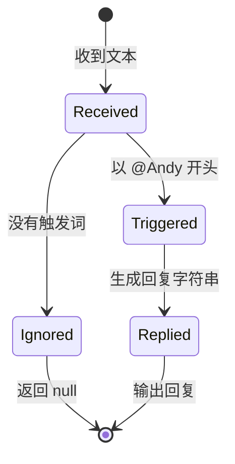
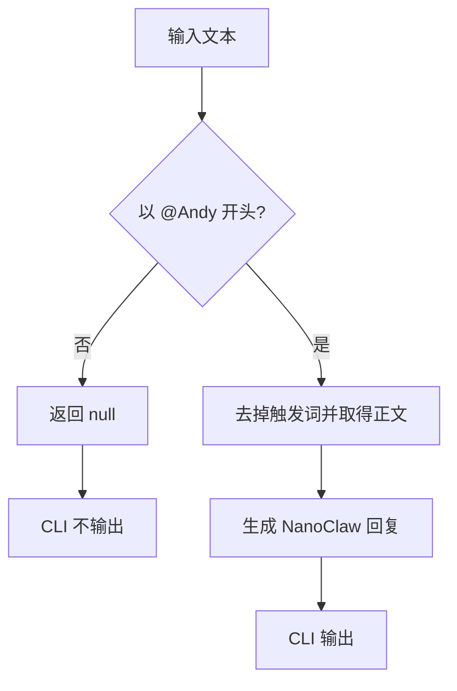

# 第 2 课：只响应真正发给助手的消息

## 1. 前言

上一课已经跑通了一条最小链条：用户输入一句话，`replyToText()` 生成回复，
CLI 把回复显示在终端。作为核心闭环的验证，这个实现完全够用，但它背后藏着
一个过于乐观的假设：**收到的每句话都是在对助手说。**

把这个实现放进真实群聊，问题马上就会暴露出来：

```text
小王：大家下午三点开会。
NanoClaw：大家下午三点开会。
```

小王只是在通知同事开会，并没有呼叫助手。一个对所有消息都要插话的机器人，
一方面会打扰用户，另一方面也在浪费未来真实模型的调用成本。

于是本课出现了新需求：用户以 `@Andy` 开头时，助手才处理后面的正文；没有
这个触发词时，本次输入应该被忽略。就是这个需求，让上一课的单线流程第一次
产生了分支。

现在系统里仍然只有一个助手名字和一种触发方式，所以我们直接判断固定字符串
就够了，不必增加配置文件、正则表达式、Trigger 接口或 Router。原项目里那个
复杂的 `engage_mode`，是多平台、多 wiring 需求逐步积累之后的结果，不应该
被提前复制到第二课来。

## 2. 主要内容

### 2.1 本课要做什么

本课要完成五件事：

1. 用测试描述"被呼叫的消息"：输入 `@Andy 你好`，回复时要先去掉触发词，
   只处理 `你好`。
2. 用测试描述"普通聊天"：输入 `大家好`，返回 `null`，表示本次不应产生
   回复。
3. 修改 `replyToText()`：判断固定前缀，未触发时尽早返回，触发时截取正文。
4. 修改 `runCli()`：只有函数返回真实字符串时，才把它写入标准输出。
5. 运行测试并阅读结果，确认上面两个需求都得到满足。

本课的测试和最小实现会一次提供给学生阅读。阅读顺序是：先看测试里描述的
需求，再看 `replyToText()` 如何选择分支，最后看 `runCli()` 如何处理
`null`。

### 2.2 代码阅读链条

先读触发消息的完整链路：

```text
输入 "@Andy 你好"
→ runCli() 读取 text
→ replyToText(text) 判断以 "@Andy" 开头
→ 截取并整理正文 "你好"
→ 返回 "NanoClaw: 你好"
→ runCli() 输出回复
```

再看普通消息走的分支：

```text
输入 "大家好"
→ runCli() 读取 text
→ replyToText(text) 发现没有 "@Andy" 前缀
→ 返回 null
→ runCli() 不写出回复
→ 程序结束
```

测试的阅读链是这样的：

```text
test/reply.test.ts 构造输入
→ 直接调用 replyToText()
→ assert.equal() 比较实际返回值与业务预期
→ 断言验证触发消息得到正文回复、普通消息得到 null
```

### 2.3 相比上一课发生了什么

上一课只有一条无条件链：任何字符串都会一路走到回复。本课新增的是一个
**分支**：

1. 触发分支继续进入原有的回复环节；
2. 忽略分支提前结束，不产生任何输出。

注意，这是业务判断的增加，还不是新模块。`reply.ts` 仍然负责当前全部的
文本规则，`main.ts` 仍然只负责终端输入输出。

### 2.4 本课刻意不做什么

- 不把 `Andy` 放进环境变量或配置文件，因为当前没有修改名字的需求；
- 不使用正则表达式，因为固定前缀判断已经足够；
- 不创建 `Message` 数据类，因为输入仍然只是一个字符串；
- 不创建 Router/Trigger/Adapter，因为目前只有一条具体规则；
- 不支持大小写、多个空格、多个助手或平台 mention，这些都要等真实需求出现
  再说。

## 3. 技术要点

### 3.0 环境配置

本课不增加任何依赖，继续使用第 1 课的 Node.js、项目工作区 TypeScript 和
Node 测试运行器。VS Code 应保持 `Use Workspace Version`，这样能确保编辑器
和 `pnpm build` 用的是同一套 TypeScript 与 `@types/node`。

运行 `pnpm test` 时，两个测试都应该通过。如果编辑器出现标红，先检查两件
事：是否选择了项目的 Workspace TypeScript，以及是否已经安装依赖。

### 3.1 坐标：判断位于系统哪里

```text
终端输入
→ [本课新增：是否呼叫助手]
   ├─ 否：结束
   └─ 是：提取正文 → 原有回复逻辑 → 终端输出
```

这个判断位于业务处理函数的内部，而不是 CLI 里。这样安排的理由是：如果让
CLI 负责识别 `@Andy`，那么以后增加第二个输入入口时，触发规则就被迫复制
一份。放在业务函数里，规则始终只有一处。

原项目里相似的问题，最终由 Router 的 wiring/engage 判断来处理；教学项目
还没有多聊天、多 Agent 和持久化 routing，所以现在不引入 Router 模块。

### 3.2 代码是中心

本课要让 `replyToText()` 的返回类型从：

```ts
string
```

演化为：

```ts
string | null
```

用大白话理解：函数现在有两种合法的结果——需要回复时给出文本，不需要回复
时给出明确的"没有回复"。调用者必须面对这两种可能，不能再假定永远拿到的
都是字符串。

预期的最小逻辑顺序是：

```text
先检查是否以 @Andy 开头
→ 不是：返回 null
→ 是：截取 @Andy 后面的正文
→ 返回回复字符串
```

`runCli()` 随后检查结果是否为 `null`：只有非 `null` 才调用
`process.stdout.write()`；否则保持安静，什么都不输出。

### 3.3 数据是着眼点

一条触发消息会让数据经历这样的变化：

```text
原始输入："@Andy 你好"
触发词：  "@Andy"
正文：    "你好"
返回值：  "NanoClaw: 你好"
```

一条普通消息则是另一种结果：

```text
原始输入："大家好"
匹配结果：未触发
返回值：  null
标准输出：没有新增文字
```

这里要特别区分 `null` 和空字符串 `""`：空字符串仍然是一个真实存在的
字符串，只是长度为零；`null` 则明确表示"这里没有回复值"。本课选择用
`null`，就是为了让业务含义比空字符串更清楚。

### 3.4 状态视角

本课仍然没有跨调用保存的状态，但单次处理内部出现了两个业务结果：



要强调的是：这些不是数据库状态，也不会保存到任何文件；它们只是用来解释
一次函数调用是如何分叉的。

### 3.5 流程图：本课新增的分支



从图上可以一眼看出：只有"是"的这一边才会一路走到终端输出；"否"的
一边在返回 `null` 之后就结束了。

### 3.6 细节技术点

#### `startsWith()`：判断固定前缀

字符串的 `startsWith(prefix)` 方法回答这样一个问题："这个字符串是否从
指定内容开始？"它返回一个 `boolean`：

```ts
'@Andy 你好'.startsWith('@Andy') // true
'大家好'.startsWith('@Andy')     // false
```

对当前的固定规则来说，它比正则表达式更合适，读代码的时候也更直白。

#### `slice()`：截取正文

`slice(start)` 从指定下标开始，取出剩余的字符串。触发词的长度是已知的，
所以从 `'@Andy'.length` 之后取，拿到的就是正文。注意它不会修改原字符串，
而是产生一个新字符串。

#### `trimStart()`：只整理正文开头

去掉 `@Andy` 之后，正文开头通常还会剩一个空格，变成 `" 你好"`。
`trimStart()` 只删除开头的空白，正文末尾保持原貌。相比更激进的 `trim()`，
它更精确地表达了当前的需求。

#### `boolean` 与 `if`

`startsWith()` 产生的 `true` 或 `false`，正式名称是布尔值。`if` 语句根据
布尔值决定接下来走哪条分支。本课的写法是优先处理"不触发"的情况，并尽早
`return null`——这样做的好处是，真正的回复逻辑不需要再套在更深的代码块
里。

#### 联合类型 `string | null`

竖线 `|` 表示"二者之一"。当 TypeScript 看到一个值是 `string | null` 时，
调用者不能直接把它当字符串使用，必须先判断它是不是 `null`。这种检查称为
类型收窄：

```ts
if (reply !== null) {
  // 进入这里后，TypeScript 知道 reply 一定是 string。
}
```

强调一点：这个类型变化不是为了展示语法，而是由"普通消息没有回复"这个
业务需求直接造成的。

#### `assert.equal()` 如何验证需求

测试的作用是把"希望得到什么"直接写在代码里。如果实现返回了别的值，断言
会显示 actual 和 expected 的差异，帮助我们定位到底是触发分支还是忽略分支
出了问题。

## 4. 测试与验收

### 4.1 被呼叫的消息

**目的**：验证触发词能够启动回复，同时不会把 `@Andy` 当成正文复述出来。

**输入**：

```text
@Andy 你好，NanoClaw
```

**预期**：

```text
NanoClaw: 你好，NanoClaw
```

**证明**：触发分支被选择了，正文被正确地交给原有回复逻辑。

### 4.2 普通聊天

**目的**：验证没有呼叫助手时，不产生任何回复。

**输入**：

```text
大家下午三点开会
```

**预期返回值**：

```text
null
```

**证明**：普通聊天进入了忽略分支；未来接入真实模型时，这类消息不会唤醒
处理。

### 4.3 本课验收

- 两个新测试通过：触发消息得到正文回复，普通消息返回 `null`；
- CLI 输入触发消息时，显示去掉触发词后的回复；
- CLI 输入普通消息时，不显示助手回复；
- 学生能解释 `string | null`、分支的数据流，以及为什么本课还不需要
  Router。

## 5. 总结

本课让系统从"每条消息都回复"演化成"先判断是不是在呼叫助手"。相比
上一课，我们新增的是一个业务分支，而不是新的架构：触发消息继续走回复
流程，普通消息返回 `null` 并安静结束。

"函数永远返回 `string`"这个旧假设被真实需求推翻了，所以返回类型要演化成
`string | null`，CLI 也必须学会处理"没有回复"这个合法结果。这是一个很
典型的例子：类型由业务含义推动变化，而不是反过来。

完成本课后，系统仍然有一个明显的限制：每次运行只处理一条消息，而且完全不
记得上一句话。只有等后续正式提出连续对话的需求时，我们才会引入内存中的
会话状态；本课不会提前实现它。
