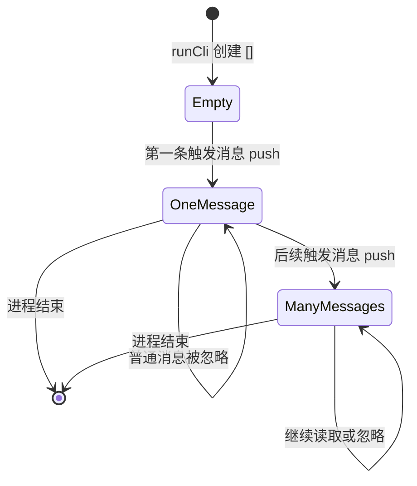
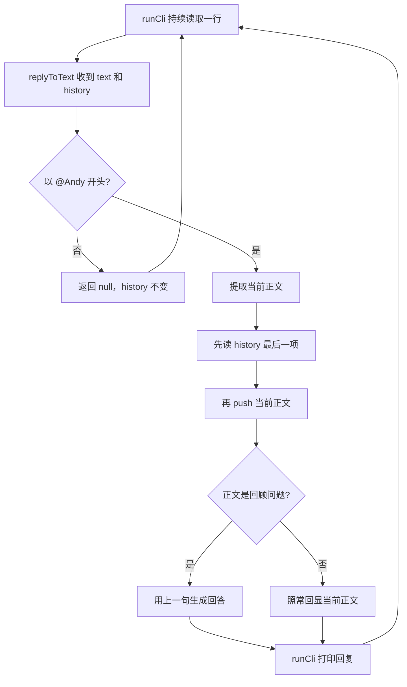

# 第 3 课：记住本次对话的上一句

## 1. 前言

上一课的助手学会了克制：只有消息以 `@Andy` 开头时才回复，普通聊天不会打扰
它。这解决了"该不该回答"的问题，但还有一个问题没有解决——"回答的时候，
能看到什么？"。目前的每次运行只读一行，处理完就退出；即使你在同一个进程
里再次调用 `replyToText()`，它也不知道前一次输入了什么。

先看一段很自然的连续对话：

```text
用户：@Andy 我叫小李
助手：NanoClaw: 我叫小李
用户：@Andy 我刚才说了什么？
助手：NanoClaw: 你刚才说：我叫小李
```

要回答第二句，就必须用上第一句留下的数据。所以本课让 CLI 持续接收多行，
并用同一个内存数组，保存本次运行中被助手处理过的用户正文。另外，在还没有
真实模型的情况下，为了验证"确实读到了历史"，我们只为一个精确的提问
`我刚才说了什么？` 给出确定性回答。

要说清楚边界：这个数组只服务于当前这个单一会话，程序结束后数据就会消失。
等下一课正式提出"重启后还要记得"的需求时，我们再讨论文件保存。

## 2. 主要内容

### 2.1 本课做什么

本课要做六件事：

1. 把 `replyToText()` 的输入从一段文字扩展为"原始文字 + 当前会话历史
   数组"。
2. 普通聊天继续返回 `null`，并且不写入历史。
3. 被呼叫的消息先读取历史中的上一句，再把当前正文追加进去。
4. 遇到 `@Andy 我刚才说了什么？` 时，用读取到的上一句生成回复。
5. CLI 从"一次读一行"变成"在同一进程中逐行读取"，每次都传入同一个
   数组。
6. 用测试覆盖三种情况：两轮对话、普通消息不污染历史、新会话没有旧历史。

实现方式上，本课直接修改已有的 `reply.ts` 和 `main.ts`：当前只有一个会话、
一种本地入口，还没有理由拆出 Session 类、存储接口或数据库。

### 2.2 按方法阅读的业务链

先看真实 CLI 里发生的完整过程：

```text
标准输入第一行 "@Andy 我叫小李"
→ runCli() 中的逐行循环取得 text
→ replyToText(text, history)
→ 读取 history：[]，没有上一句
→ 把 "我叫小李" 加入 history：['我叫小李']
→ 返回并打印 "NanoClaw: 我叫小李"

标准输入第二行 "@Andy 我刚才说了什么？"
→ 同一个 runCli() 循环再次取得 text
→ 同一个 history 数组传入 replyToText()
→ 先读出上一句 "我叫小李"
→ 再把当前问题加入 history
→ 返回并打印 "NanoClaw: 你刚才说：我叫小李"
```

再看测试是怎么验证这条链的：

```text
多轮测试回调创建一个空数组
→ 连续调用两次 replyToText(text, 同一个数组)
→ assert.equal() 检查两次回复
→ assert.deepEqual() 检查数组确实记录了两条正文
```

普通消息则走这条支线：

```text
"大家下午三点开会"
→ replyToText(text, history)
→ 触发判断失败，立即返回 null
→ history 原样保留，CLI 不输出助手回复
```

### 2.3 和上一课相比，链条怎样演化

上一课引入的触发/忽略分支原样保留。本课新增的是一个**共享状态环节**：
同一个进程里，第一次调用把正文存入数组，下一次调用再从数组读取。从这一刻
起，两次函数调用不再是完全独立的了。与此同时，CLI 也从一次性的调用改成
持续读取的循环，这样这条状态链才能真正在运行时出现。

需要说明的是：这是最基础的会话记忆，而不是最终系统里的持久化或跨平台
记忆。

## 3. 技术要点

### 3.0 环境配置

本课不增加依赖，继续使用 Node.js 22+、TypeScript 和 `node:test`。目前仍然
由 `pnpm test` 先编译测试，再执行编译后的 `.js` 文件。VS Code 里如果装有
可用的 `node:test` 测试提供者，也可以从 Testing 面板运行；测试的发现与
运行由扩展负责，实际是否显示行内按钮，取决于本机扩展及其发现状态。具体
操作会在聊天中指导。

### 3.1 坐标：数组处在系统什么位置

```text
本地终端输入层：runCli() 连续读取
        ↓
业务处理层：replyToText() 判断触发、读取/追加历史、生成回复
        ↓
本地终端输出层：runCli() 打印非 null 的回复
```

`history` 数组由 `runCli()` 创建，属于宿主进程的内存。`replyToText()` 可以
读取它、修改它，但不负责把它写入文件。还要注意它保存的是什么：是**当前
会话里已触发的用户正文**，不是原始平台消息，不是助手回复，也不是数据库行。

### 3.2 代码：谁负责什么

`runCli(): Promise<void>` 负责一个连续运行的本地会话：创建一次 `history`
数组，逐行取得终端文字，调用 `replyToText(text, history)`，只输出非
`null` 的回复。它的输入来源是标准输入；返回类型 `Promise<void>` 表示它会
等读取结束后才完成，本身不返回业务文本。

`replyToText(text: string, history: string[]): string | null` 负责单条消息
的业务处理：先判断是否呼叫助手；触发之后，从 `history` 读取上一句，再把
当前正文追加到数组；如果当前正文是那个精确的回顾问题，就用上一句来回答，
否则延续原来的回显。函数返回的是给用户看的回复字符串，或表示忽略的
`null`。

代码为什么这样写：因为一次运行内要记住上一句，所以需要一处持续存在的
数据；当前只有一个 CLI 会话，把数组放在 `runCli()` 里最直接。业务函数既要
读取又要修改它，所以把同一个数组作为参数传进去。没有第二种保存方式，也
没有多会话查找的需求，所以不创建存储接口或 Session Manager。

### 3.3 数据：两轮之间传递了什么

| 时刻 | 输入正文 | 调用前 `history` | 读取的上一句 | 调用后 `history` | 返回值 |
|---|---|---|---|---|---|
| 第 1 轮 | `我叫小李` | `[]` | `undefined` | `['我叫小李']` | `NanoClaw: 我叫小李` |
| 第 2 轮 | `我刚才说了什么？` | `['我叫小李']` | `我叫小李` | `['我叫小李', '我刚才说了什么？']` | `NanoClaw: 你刚才说：我叫小李` |

普通消息 `大家下午三点开会` 既没有回复，也不进入数组。另外，这里的
"上一句"指的是**上一次真正呼叫助手的正文**，而不是终端上出现过的任何
文字。

还有一个重要顺序：**先读上一句，后追加当前句**。为什么必须是这个顺序？
如果先追加，数组最后一个元素就变成了当前问题，助手就会错误地回答"你刚才
说：我刚才说了什么？"。

### 3.4 状态：谁创建、谁改变、何时消失



把数组的一生归纳成五句话：

- 创建者：`runCli()`，每启动一个 CLI 进程就创建一个新数组。
- 修改者：`replyToText()`，仅在消息被 `@Andy` 触发时追加正文。
- 读取者：同一个 `replyToText()`，在处理回顾问题前读取最后一条旧正文。
- 保存位置：当前 Node 进程的内存；没有文件，也没有数据库。
- 消失时机：进程退出后，随内存一起消失。

### 3.5 流程图：新增的记忆环节



### 3.6 细节技术点

#### `string[]`：最简单的会话记事本

`string[]` 表示字符串数组，可以按顺序存放多段文字。空数组 `[]` 表示本次
会话还没有任何记录；`history.push(message)` 把新正文加到数组末尾。当前
不需要更复杂的消息对象，因为我们只需要知道上一条用户正文。

#### 同一个数组为什么能记住两轮

TypeScript/JavaScript 在传递数组参数时，函数拿到的是同一个数组对象的
引用，而不是自动复制一份。下面两次调用用的就是同一个 `history`：

```ts
const history: string[] = [];
replyToText('@Andy 我叫小李', history);
replyToText('@Andy 我刚才说了什么？', history);
```

第一次 `push()` 修改了数组，第二次自然就能看到新内容。这种做法叫"共享
可变状态"：`history` 是状态，`push()` 会改变它。也正因为如此，测试里每次
都使用全新的数组，就是为了避免不同测试互相影响。

#### `history[history.length - 1]` 和 `undefined`

数组的下标从 0 开始。长度为 1 时，最后一项的下标是 `1 - 1 = 0`；长度为 0
时，读取 `history[-1]` 得到的是 `undefined`。在这里，`undefined` 表示
"还没有上一句"。它和第 2 课返回的 `null` 不是一回事：`null` 是我们主动
返回的"无需回复"结果。

#### 先保存，再回答？这里恰好相反

`replyToText()` 会先把旧的最后一项存进 `previousMessage`，然后再 `push()`
当前正文。因为变量拿到的是旧的字符串值，所以追加之后依然可以用它来回答。
反过来说，如果第一句话就是回顾问题，`previousMessage` 是 `undefined`，
代码会给出明确的"这是本次对话的第一句话"。

#### 三元表达式 `条件 ? A : B`

回顾分支要从两个固定回答里选一个：有上一句时引用它，没有时说明这是第一
句。代码里的 `previousMessage === undefined ? ... : ...` 就是 `if/else`
的简写形式：`?` 后面是条件为真时的值，`:` 后面是条件为假时的值。这里两边
都是字符串。

#### `for await (const text of terminal)`

上一课使用 `terminal.question()` 只取一行。本课需要一直等待下一行，直到
用户结束输入。可以把 `for await` 理解为："等下一行来了，就执行一次循环
体；处理完，再等下一行。"每一轮处理结束后，用的仍然是外层那同一个
`history` 数组。

它的正式术语叫**异步迭代**：输入行不是事先全部放在内存里，而是随着终端
输入陆续到来。`await` 的含义是：没有新行时暂停这个函数，Node 进程仍然
可以处理其它事件，并不是 CPU 一直在空转。`runCli()` 因此是 `async` 函数，
返回 `Promise<void>`。本课只需要理解"按顺序等待下一行"，暂不引入并发
执行。

#### `try/finally` 与关闭输入接口

`try` 块中处理输入行；`finally` 块中调用 `terminal.close()`，保证无论是
正常结束还是发生错误，都会释放读取接口。要说明的是，它不会保存会话历史；
进程结束后，数组仍然会消失。

#### `assert.deepEqual()` 检查数组内容

数组是对象，测试要比较的是它的元素和顺序。`assert.deepEqual(history,
[...])` 会逐项比较内容，所以它既能证明第一次调用确实写入了历史，也能证明
普通聊天没有写入。

## 4. 测试与验收

### 4.1 两轮对话测试

**测什么**：把同一个数组传给两次 `replyToText()`，第二轮能否读到第一轮的
正文。

**输入**：

```text
@Andy 我叫小李
@Andy 我刚才说了什么？
```

**预期**：先得到 `NanoClaw: 我叫小李`，再得到
`NanoClaw: 你刚才说：我叫小李`；数组最后含有两条正文。

**证明**：第一次调用改变了内存状态，第二次调用读到了这份状态。

### 4.2 普通消息不进入历史

**测什么**：普通聊天是否仍被忽略，并且不会污染以后回顾的内容。

**输入**：`大家下午三点开会`，传入一个空历史数组。

**预期**：返回 `null`，数组仍为 `[]`。

**证明**：第 2 课的触发分支依然有效，历史只保存助手真正处理过的正文。

### 4.3 新会话没有旧历史

**测什么**：新建数组之后，回顾问题会不会误读到上一个会话的数据。

**输入**：在新数组中，第一句就是 `@Andy 我刚才说了什么？`。

**预期**：`NanoClaw: 这是本次对话的第一句话。`

**证明**：状态只属于传入的那个数组，没有隐藏的全局会话。

### 4.4 本课验收

- `pnpm test` 的四个测试全部通过；
- 单个 CLI 进程连续输入两行，被呼叫消息的第二轮能回顾第一轮；
- 普通消息不输出回复，也不改变历史；
- 学生能解释数组由谁创建、谁修改、为什么要"先读后写"、进程结束后数据去
  了哪里；
- 学生亲自运行测试、反馈问题之后，才完成本课并手动 commit。

## 5. 总结

本课在上一节的触发/忽略分支之上，增加了一个跨轮次的**内存状态环节**：
同一个 CLI 进程可以读多行，`runCli()` 保存一个数组，`replyToText()` 在
触发时从中读取上一句，并追加当前句。有了它，我们才能用第二轮的问题验证
"助手确实看到了前文"。

当前实现的限制也很明确：数组只存在于正在运行的 Node 进程里。关闭终端或
重启程序之后，之前说过的话就全部消失了。等"重启后仍能记住"成为下一课的
正式需求时，才有理由把状态写入文件。现在，系统里依然没有数据库、Session
类、Router 或 Provider。
