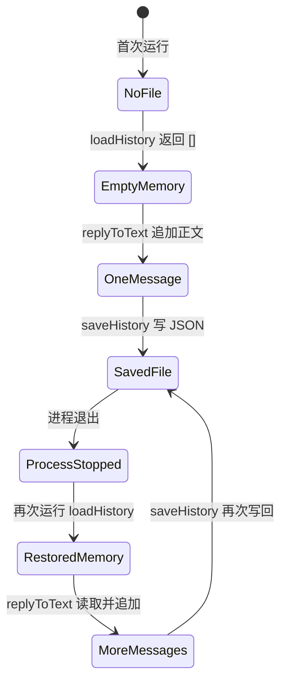
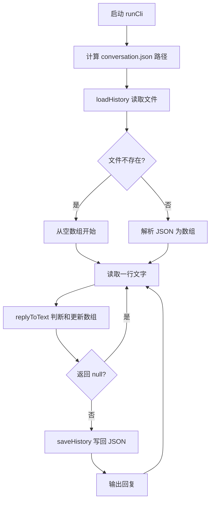

# 第 4 课：重启后仍记得对话

## 1. 前言

上一课的助手已经能在同一次运行里记住前一句：`runCli()` 持有一个数组，
`replyToText()` 读取并追加用户正文。但是关掉程序再启动，新的 Node 进程会创建
新的空数组。对个人助手来说，昨天介绍过自己的名字，今天却完全忘记，并不好用。

本课提出一个很具体的需求：第一次运行输入 `@Andy 我叫小李` 后退出；第二次
运行输入 `@Andy 我刚才说了什么？`，仍要得到 `NanoClaw: 你刚才说：我叫小李`。
两个进程不能共享内存，所以需要把当前唯一会话的数组存入磁盘。本课只用当前
工作目录下的一个 `conversation.json` 文件，不引入数据库、多会话或存储接口。

## 2. 主要内容

### 2.1 本课做什么

1. 启动 CLI 时读取 `conversation.json`；文件尚不存在就从 `[]` 开始。
2. 继续使用上一课的 `replyToText()` 判断触发并更新内存数组；普通聊天不保存。
3. 每处理一条被呼叫的消息，就把当前数组写回 JSON 文件，再输出回复。
4. 写一个真正启动两次 CLI 的测试，验证第二次进程从第一次的文件恢复历史。

`replyToText()` 的业务规则没有变化。新增的只是它前后的“加载”和“保存”环节。

### 2.2 按函数阅读的两条链

真实运行链：

```text
启动 CLI，当前工作目录为某个文件夹
→ runCli() 计算 conversation.json 的路径
→ loadHistory(filePath) 读取文件；第一次没有文件则返回 []
→ runCli() 从终端取得一行，例如 "@Andy 我叫小李"
→ replyToText(text, history) 把 "我叫小李" 追加到数组并返回回复
→ saveHistory(filePath, history) 将数组写成 JSON
→ runCli() 输出回复
→ 进程结束；内存数组消失，但 JSON 文件留下
→ 再次启动时 loadHistory(filePath) 把 JSON 恢复成新进程的数组
→ replyToText() 读到上一句，回答回顾问题
```

测试链：

```text
持久化测试回调创建独立的临时目录
→ spawnSync() 在此目录启动第一个 Node 进程，输入介绍语
→ readFileSync() 检查 conversation.json 只有被呼叫的正文
→ spawnSync() 在同一目录启动第二个 Node 进程，输入回顾问题
→ assert.equal() 检查第二次输出引用了第一次的正文
→ readFileSync() 检查第二轮也已写回；finally 清理临时目录
```

原有 `reply.test.ts` 仍直接测试业务函数，不依赖磁盘。新增的持久化测试关注整个
CLI 链条，因为只有跨两次进程运行，才能证明“重启后仍记得”。

### 2.3 和上一课相比发生了什么

上一课的数据链只在内存里循环；本课在链条入口增加“从磁盘恢复”，在每条有效
消息之后增加“写回磁盘”。这是**两个持久化环节**，不是新的消息分支，也不是
数据库架构。保存格式目前直接对应那个字符串数组，足够解决当前需求。

## 3. 技术要点

### 3.0 环境配置

本课不安装新依赖，使用 Node 内置的 `node:fs/promises` 和 `node:child_process`。
运行 `pnpm test` 会先编译 TypeScript，再执行 `dist/test/*.test.js`。在 VS Code
里，如果你的 `node:test` 扩展已发现测试，可以点击测试回调旁的绿色运行按钮；
若按钮没出现，打开 Testing 面板刷新，或先在终端用 `pnpm test`。本课的测试会
使用系统临时目录，不会修改工作区的真实会话文件。

### 3.1 坐标：文件在哪一层

```text
终端输入/输出：src/main.ts 的 runCli()
       ↓ 调用
业务规则：src/reply.ts 的 replyToText()
       ↕ 共享内存数组
本地保存：src/history.ts 的 loadHistory()、saveHistory()
       ↕
当前工作目录/conversation.json
```

`runCli()` 知道文件放在哪里，负责安排读写时机；`replyToText()` 仍只处理“这句话
是否发给助手、如何回复”，不知道 JSON 文件存在。`history.ts` 是当前唯一的
文件读写代码，不是为未来存储方案预留的抽象接口。

### 3.2 代码：职责、输入输出和调用

- `runCli(): Promise<void>`：输入来自标准输入；启动时调用 `loadHistory()` 得到
  `string[]`，逐行调用 `replyToText()`；有回复时调用 `saveHistory()` 并输出。
  没有业务返回值。它使用 `process.cwd()` 找到运行命令时所在的目录。
- `loadHistory(filePath: string): Promise<string[]>`：从给定路径读 JSON 文本并
  转成字符串数组；只在文件不存在时返回空数组。其他读错误或无效 JSON 会报错，
  以免把原来的记忆悄悄当作空白覆盖。
- `saveHistory(filePath: string, history: string[]): Promise<void>`：把当前数组
  转成易读的 JSON 文本并写到给定路径，不返回业务数据。
- `replyToText(text, history)`：仍负责第 2、3 课的触发判断、先读上一句再追加
  当前正文；它不直接接触磁盘。本课不用修改这个函数。
- 持久化测试回调：构造两个独立 Node 进程，检查第一次落盘、第二次恢复。

为什么现在才有 `history.ts`？上一课内存数组已足够；只有“跨进程仍保留”这个
需求出现，才需要文件读写。把具体的读/写动作放在一个小文件里，让 CLI 保持
清楚的“先读 → 处理 → 后写”顺序，业务函数也不用了解文件格式。

### 3.3 数据：内存数组与 JSON 文件

第一次运行收到 `@Andy 我叫小李` 后，内存中是：

```ts
['我叫小李']
```

磁盘上的 `conversation.json` 是：

```json
[
  "我叫小李"
]
```

普通聊天 `大家下午三点开会` 不会追加到数组，文件也不会因它被写回。第二次
运行时，`loadHistory()` 读取的是**文本**；`JSON.parse()` 才把它变回新的内存
数组。回答回顾问题后，文件变成：

```json
[
  "我叫小李",
  "我刚才说了什么？"
]
```

两种形态要分清：`string[]` 是正在运行的进程里可被 `push()` 修改的对象；
JSON 是磁盘上的字符，进程退出后仍在。文件并不会自动跟随数组变化，所以每条
被处理的消息之后都必须显式调用 `saveHistory()`。

### 3.4 状态：从首次启动到再次启动



- 内存状态由 `loadHistory()` 返回、由 `replyToText()` 修改，进程退出后消失。
- 磁盘状态由 `saveHistory()` 写入；下次进程由 `loadHistory()` 读取。
- 当前路径由 `runCli()` 依据工作目录计算。一个目录只有这一个会话文件；多聊天
  隔离尚未出现，将留给后面的真实需求。

### 3.5 流程图：新增读写环节



### 3.6 细节技术点

#### `process.cwd()`、路径和当前工作目录

`process.cwd()` 返回你**运行命令时所在的目录**，不是 `main.ts` 文件所在目录。
`path.join(process.cwd(), 'conversation.json')` 把目录和文件名拼成一个路径。
例如在项目根目录运行时，文件会放在项目根目录；测试用临时目录作为 `cwd`，
就能在不碰真实文件的情况下测试同一逻辑。根目录的 `/conversation.json` 已加入
`.gitignore`，避免把个人聊天历史提交到 Git。

#### `readFile`、`writeFile`、`await`

`node:fs/promises` 是 Node 自带的文件 API，不需要安装第三方包。`readFile(path,
'utf8')` 异步读取文件，得到字符串；`writeFile(path, text, 'utf8')` 异步写入。
`await` 表示等这个操作完成后再继续。读取完成前不能开始处理历史；写入完成前
不输出回复，这样写文件失败时不会假装这句话已经可靠保存。

#### `ENOENT` 与 `catch` 中的 `unknown`

首次运行还没有文件是正常情况。Node 以错误代码 `ENOENT` 表示路径不存在，
`loadHistory()` 只把这种情况转换为 `[]`。`catch (error)` 接到的值在 TypeScript
里是未知类型，不能直接读取 `error.code`；先用 `error instanceof Error` 和
`'code' in error` 检查，再比较代码。权限错误和 JSON 格式错误仍向上抛出。

#### `JSON.stringify()` 与 `JSON.parse()`

`JSON.stringify(history, null, 2)` 把数组变成带两个空格缩进的 JSON 文本，
尾部再加换行，便于人阅读。`JSON.parse(contents)` 把文本恢复成数组。
`as string[]` 只是告诉 TypeScript 我们预期文件里是字符串数组，**不是运行时
校验**；本课文件完全由自己的程序生成，暂不引入完整的格式校验或迁移逻辑。

#### 测试中的 `spawnSync()`、临时目录与 `finally`

`spawnSync(process.execPath, [program], options)` 启动一个新的 Node 进程并等待它
结束。`input` 模拟键盘输入，`cwd` 指定该进程的工作目录，`stdout` 是它输出的
文字。测试连续调用两次，才真正跨越进程边界；若只调用两次 `runCli()`，就不能
证明关闭程序后是否记得。`mkdtempSync()` 创建独立临时目录；`finally` 保证测试
结束时清理这个测试自己创建的目录，不删除项目数据。

## 4. 测试与验收

### 4.1 跨进程恢复测试

**测什么、为什么测**：第一次进程保存，第二次进程恢复；这正是本课新增能力。

**输入**：第一次运行输入 `@Andy 我叫小李` 和一条普通聊天，然后退出；第二次
运行输入 `@Andy 我刚才说了什么？`。

**预期**：第一次只输出介绍语，文件只含 `我叫小李`；第二次输出
`NanoClaw: 你刚才说：我叫小李`，文件再增加回顾问题。

**证明**：历史不是偶然留在同一个进程的内存里，而是通过 JSON 文件跨进程传递；
普通聊天仍不会污染历史。

### 4.2 回归测试

原有四个 `reply.test.ts` 测试继续通过，证明触发判断、普通消息忽略、同进程
回顾和新空数组的行为没有被文件保存机制改变。注意最后一个测试直接给业务函数
新数组，不是“CLI 重启后没有历史”；CLI 现在会从文件恢复，二者层次不同。

### 4.3 本课验收

- 在项目根目录运行 `pnpm test`，应看到 5 个测试通过；
- 自己在终端运行两次 `pnpm start`，第一次输入介绍语，第二次输入回顾问题；
- 能指出 `conversation.json` 的位置，并解释内存数组与 JSON 文本的区别；
- 能解释为什么首次没有文件返回空数组，而 JSON 损坏不直接吞掉；
- 学生亲自运行测试、反馈问题后，再完成本课并手动提交。

## 5. 总结

上节课让助手在单个进程里记住前文，本课为这条链加上“启动时读文件、处理后写
文件”两个环节。旧数组方案的问题不是逻辑错误，而是生命周期只到进程结束；
一个 JSON 文件就足够解决当前唯一会话的跨进程记忆。

新限制也清楚：所有运行共享当前目录的同一个文件。将来如果收到不同聊天的消息，
甲乙就会混用记忆。等这个需求真正出现，再改变数据组织；现在不提前添加聊天 ID、
数据库或 Repository。
