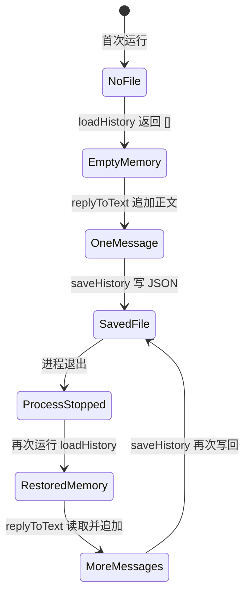
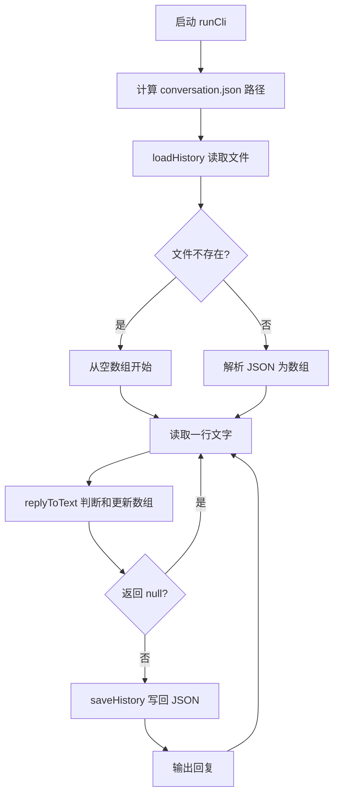

# 第 4 课：重启后仍记得对话

## 1. 前言

上一课的助手已经能在同一次运行里记住前一句了：`runCli()` 在内存里持有一个
历史数组，`replyToText()` 负责读取并追加用户正文。但这份记忆的生命周期只有
进程那么长——一旦关掉程序再启动，新的 Node 进程会创建一个全新的空数组，
上一轮说过的话就全部消失了。对个人助手来说，这并不好用：你昨天刚介绍过
自己的名字，今天它却完全不记得。

所以本课提出一个很具体的需求：第一次运行时输入 `@Andy 我叫小李`，然后退出
程序；第二次运行时输入 `@Andy 我刚才说了什么？`，程序仍然要回答
`NanoClaw: 你刚才说：我叫小李`。两个进程的内存彼此独立、无法共享，所以要让
记忆跨过进程的边界，就必须把当前唯一会话的数组存入磁盘。本课的实现非常
克制：只用当前工作目录下的一个 `conversation.json` 文件，不引入数据库、
多会话或存储接口。

## 2. 主要内容

### 2.1 本课做什么

1. **启动时读取**：CLI 启动时先读取 `conversation.json`；如果文件还不存在
   （比如第一次运行），就从空数组 `[]` 开始。
2. **复用业务规则**：继续使用上一课的 `replyToText()` 判断是否被触发，并
   更新内存数组；普通聊天（没有呼叫助手的消息）仍然不保存。
3. **处理后写回**：每处理完一条被呼叫的消息，就把当前数组写回 JSON 文件，
   然后再输出回复。
4. **跨进程测试**：写一个真正把 CLI 启动两次的测试，验证第二个进程能从
   第一个进程留下的文件里恢复历史。

要注意的是，`replyToText()` 的业务规则没有发生任何变化。本课新增的只是它
前后的"加载"和"保存"两个环节。

### 2.2 按函数阅读的两条链

我们按函数把两条链各走一遍：第一条是真实运行链，描述程序正常使用时发生的
事情；第二条是测试链，描述测试如何验证跨进程的记忆恢复。

真实运行链：

```text
启动 CLI，当前工作目录为某个文件夹
→ runCli() 计算 conversation.json 的路径
→ loadHistory(filePath) 读取文件；第一次没有文件则返回 []
→ runCli() 从终端取得一行，例如 "@Andy 我叫小李"
→ replyToText(text, history) 把 "我叫小李" 追加到数组并返回回复
→ saveHistory(filePath, history) 将数组写成 JSON
→ runCli() 输出回复
→ 进程结束；内存数组消失，但 JSON 文件留下
→ 再次启动时 loadHistory(filePath) 把 JSON 恢复成新进程的数组
→ replyToText() 读到上一句，回答回顾问题
```

测试链：

```text
持久化测试回调创建独立的临时目录
→ spawnSync() 在此目录启动第一个 Node 进程，输入介绍语
→ readFileSync() 检查 conversation.json 只有被呼叫的正文
→ spawnSync() 在同一目录启动第二个 Node 进程，输入回顾问题
→ assert.equal() 检查第二次输出引用了第一次的正文
→ readFileSync() 检查第二轮也已写回；finally 清理临时目录
```

原有 `reply.test.ts` 仍直接测试业务函数，不依赖磁盘。新增的持久化测试关注的
则是整个 CLI 链条——因为只有真正跨两次进程运行，才能证明"重启后仍记得"
这件事确实成立。

### 2.3 和上一课相比发生了什么

和上一课相比，数据链的形状变了：上一课的数据只在内存里循环，而本课在链条
的入口增加了"从磁盘恢复"这一步，又在每条有效消息处理完之后增加了"写回
磁盘"这一步。这两个动作合起来是**两个持久化环节**——不是新的消息分支，
也不是数据库架构。保存格式目前就直接对应那个字符串数组，对当前需求来说
已经足够。

## 3. 技术要点

### 3.0 环境配置

本课不需要安装任何新依赖，用到的都是 Node 内置模块：`node:fs/promises`
（文件读写）和 `node:child_process`（启动子进程）。运行 `pnpm test` 时会先
编译 TypeScript，再执行编译产物 `dist/test/*.test.js`。在 VS Code 里，如果你的
`node:test` 扩展已经发现了测试，可以点击测试回调旁边的绿色运行按钮；如果
按钮没有出现，先打开 Testing 面板刷新一下，或者直接在终端里用 `pnpm test`
运行。另外提醒一句：本课的测试会使用系统临时目录，不会修改工作区里真实的
会话文件。

### 3.1 坐标：文件在哪一层

先从纵向看清楚文件处在哪一层：

```text
终端输入/输出：src/main.ts 的 runCli()
       ↓ 调用
业务规则：src/reply.ts 的 replyToText()
       ↕ 共享内存数组
本地保存：src/history.ts 的 loadHistory()、saveHistory()
       ↕
当前工作目录/conversation.json
```

分工很明确：`runCli()` 知道文件放在哪里，负责安排读写的时机；
`replyToText()` 仍然只处理"这句话是否发给助手、该如何回复"，它根本不知道
JSON 文件的存在。`history.ts` 是当前唯一的文件读写代码——注意，它只是把
读写动作集中在一个小文件里，并不是为未来存储方案预留的抽象接口。

### 3.2 代码：职责、输入输出和调用

- `runCli(): Promise<void>`：输入来自标准输入。启动时先调用 `loadHistory()`
  得到一个 `string[]` 作为历史；随后逐行读取输入，把每一行交给
  `replyToText()` 处理；如果产生了回复，就调用 `saveHistory()` 把数组写回
  文件，再把回复输出到终端。它没有业务返回值。它使用 `process.cwd()` 找到
  你运行命令时所在的目录。
- `loadHistory(filePath: string): Promise<string[]>`：从给定路径读取 JSON
  文本，并把它转换成字符串数组；只在"文件不存在"这一种情况下返回空数组。
  其他读取错误或无效的 JSON 都会直接报错——这样做是为了避免把原来的记忆
  悄悄当成空白覆盖掉。
- `saveHistory(filePath: string, history: string[]): Promise<void>`：把当前
  数组转换成易读的 JSON 文本，写到给定路径，不返回业务数据。
- `replyToText(text, history)`：仍然负责第 2、3 课留下的职责——判断触发、
  先读上一句、再追加当前正文；它不直接接触磁盘。本课不需要修改这个函数。
- 持久化测试回调：构造两个相互独立的 Node 进程，检查第一次运行确实落盘、
  第二次运行确实恢复。

为什么直到本课才出现 `history.ts`？因为上一课的内存数组已经够用了；只有当
"跨进程仍然保留"这个需求真正出现时，才需要文件读写。把具体的读、写动作
放进一个小文件里有两个好处：CLI 能保持清楚的"先读 → 处理 → 后写"顺序，
业务函数也不必了解文件格式。

### 3.3 数据：内存数组与 JSON 文件

第一次运行收到 `@Andy 我叫小李` 之后，内存中的数组是：

```ts
['我叫小李']
```

与此同时，磁盘上的 `conversation.json` 是：

```json
[
  "我叫小李"
]
```

注意，普通聊天 `大家下午三点开会` 不会追加到数组，文件也不会因为它而被
写回。第二次运行时，`loadHistory()` 从磁盘上读到的是**文本**；要经过
`JSON.parse()`，文本才会变回新的内存数组。回答回顾问题之后，文件变成了
这样：

```json
[
  "我叫小李",
  "我刚才说了什么？"
]
```

这两种形态要分清：`string[]` 是正在运行的进程里、可以被 `push()` 修改的
对象；JSON 则是磁盘上的字符，进程退出之后它依然存在。还要注意，文件并不会
自动跟随数组的变化而变化——所以每处理完一条消息之后，都必须显式调用
`saveHistory()`。

### 3.4 状态：从首次启动到再次启动



- 内存状态由 `loadHistory()` 返回、由 `replyToText()` 修改，进程一退出就
  消失。
- 磁盘状态由 `saveHistory()` 写入；下一次启动的进程再由 `loadHistory()`
  读取回来。
- 当前路径由 `runCli()` 依据工作目录计算。一个目录只有这一个会话文件；
  多聊天的隔离在本课还没有出现，将留给后面的真实需求去驱动。

### 3.5 流程图：新增读写环节



这张图在上一课流程的基础上，增加了开头的读取分支：文件不存在就从空数组
开始，存在就解析 JSON 为数组；每条有效消息处理完都会先写回 JSON、再输出
回复，然后回到读取下一行。

### 3.6 细节技术点

#### `process.cwd()`、路径和当前工作目录

`process.cwd()` 返回的是你**运行命令时所在的目录**，而不是 `main.ts` 文件
所在的目录。`path.join(process.cwd(), 'conversation.json')` 的作用是把目录和
文件名拼成一个完整路径。举例来说，如果你在项目根目录下运行命令，会话文件
就会放在项目根目录；而测试把临时目录作为 `cwd` 传进去，就能在不碰到真实
文件的前提下测试同一套逻辑。另外，根目录下的 `/conversation.json` 已经加入
了 `.gitignore`，这是为了避免把你的个人聊天历史提交到 Git。

#### `readFile`、`writeFile`、`await`

`node:fs/promises` 是 Node 自带的文件 API，不需要安装任何第三方包。
`readFile(path, 'utf8')` 异步地读取文件，得到字符串；`writeFile(path, text,
'utf8')` 异步地写入文件。`await` 表示等这个操作完成之后再继续往下执行。
顺序上是有讲究的：读取完成之前，不能开始处理历史；写入完成之前，不输出
回复。这样，如果写文件失败了，程序就不会假装这句话已经可靠地保存过了。

#### `ENOENT` 与 `catch` 中的 `unknown`

第一次运行时还没有文件，这是正常情况，不算出错。Node 用错误代码 `ENOENT`
表示"路径不存在"，`loadHistory()` 只把这种情况转换为空数组 `[]`。至于
`catch (error)` 接到的值，在 TypeScript 里是未知类型，不能直接读取
`error.code`；所以要先用 `error instanceof Error` 和 `'code' in error` 做
检查，再去比较错误代码。权限错误和 JSON 格式错误仍然会向上抛出，不会被
吞掉。

#### `JSON.stringify()` 与 `JSON.parse()`

`JSON.stringify(history, null, 2)` 把数组变成带两个空格缩进的 JSON 文本，
末尾再加一个换行，方便人阅读。`JSON.parse(contents)` 则相反，把文本恢复成
数组。`as string[]` 只是告诉 TypeScript"我们预期文件里是字符串数组"，它
**不是运行时校验**。本课的文件完全由我们自己的程序生成，所以暂时不引入
完整的格式校验或迁移逻辑。

#### 测试中的 `spawnSync()`、临时目录与 `finally`

`spawnSync(process.execPath, [program], options)` 会启动一个新的 Node 进程，
并等待它结束。其中 `input` 用来模拟键盘输入，`cwd` 指定该进程的工作目录，
`stdout` 是它输出的文字。测试连续调用了两次 `spawnSync()`，才真正跨越了
进程边界；如果只是在同一个进程里调用两次 `runCli()`，就无法证明"关闭程序
之后是否还记得"。`mkdtempSync()` 负责创建一个独立的临时目录；`finally` 则
保证测试结束时清理掉这个由测试自己创建的目录，而不会删除项目数据。

## 4. 测试与验收

### 4.1 跨进程恢复测试

**测什么、为什么测**：第一个进程负责保存，第二个进程负责恢复——这正是
本课新增的能力，所以要专门验证它。

**输入**：第一次运行时输入 `@Andy 我叫小李` 和一条普通聊天，然后退出；
第二次运行时输入 `@Andy 我刚才说了什么？`。

**预期**：

1. 第一次运行只输出介绍语，文件里只包含 `我叫小李`；
2. 第二次运行输出 `NanoClaw: 你刚才说：我叫小李`，文件里再增加这条回顾
   问题。

**证明**：历史不是偶然留在同一个进程的内存里，而是真的通过 JSON 文件在
进程之间传递；同时普通聊天仍然不会污染历史。

### 4.2 回归测试

原有 `reply.test.ts` 的四个测试继续通过，这说明触发判断、忽略普通消息、
同进程回顾、新空数组这些既有行为，都没有被文件保存机制改变。要注意
最后一个测试的含义：它直接给业务函数一个新数组，模拟的是"业务函数拿到
空历史"，并不是"CLI 重启后没有历史"——CLI 现在会从文件恢复历史，两者
处在不同的层次。

### 4.3 本课验收

- 在项目根目录运行 `pnpm test`，应该看到 5 个测试全部通过；
- 自己在终端里运行两次 `pnpm start`：第一次输入介绍语，第二次输入回顾
  问题；
- 能指出 `conversation.json` 的位置，并能解释内存数组与 JSON 文本的区别；
- 能解释为什么首次运行没有文件时返回空数组，而 JSON 损坏时不能直接当成
  空白吞掉；
- 由学生亲自运行测试、反馈问题之后，再完成本课并手动提交。

## 5. 总结

上一课让助手在单个进程里记住前文，本课为这条链加上了"启动时读文件、
处理后写文件"两个环节。回头看，旧数组方案的问题不是逻辑错误，而是生命周期
只到进程结束为止；对于当前唯一会话的跨进程记忆来说，一个 JSON 文件就足够
解决了。

新的限制也很清楚：所有运行共享当前目录下的同一个文件。将来如果收到来自
不同聊天的消息，甲和乙就会混用同一份记忆。等到这个需求真正出现，我们再
改变数据的组织方式；现在不提前添加聊天 ID、数据库或 Repository。
