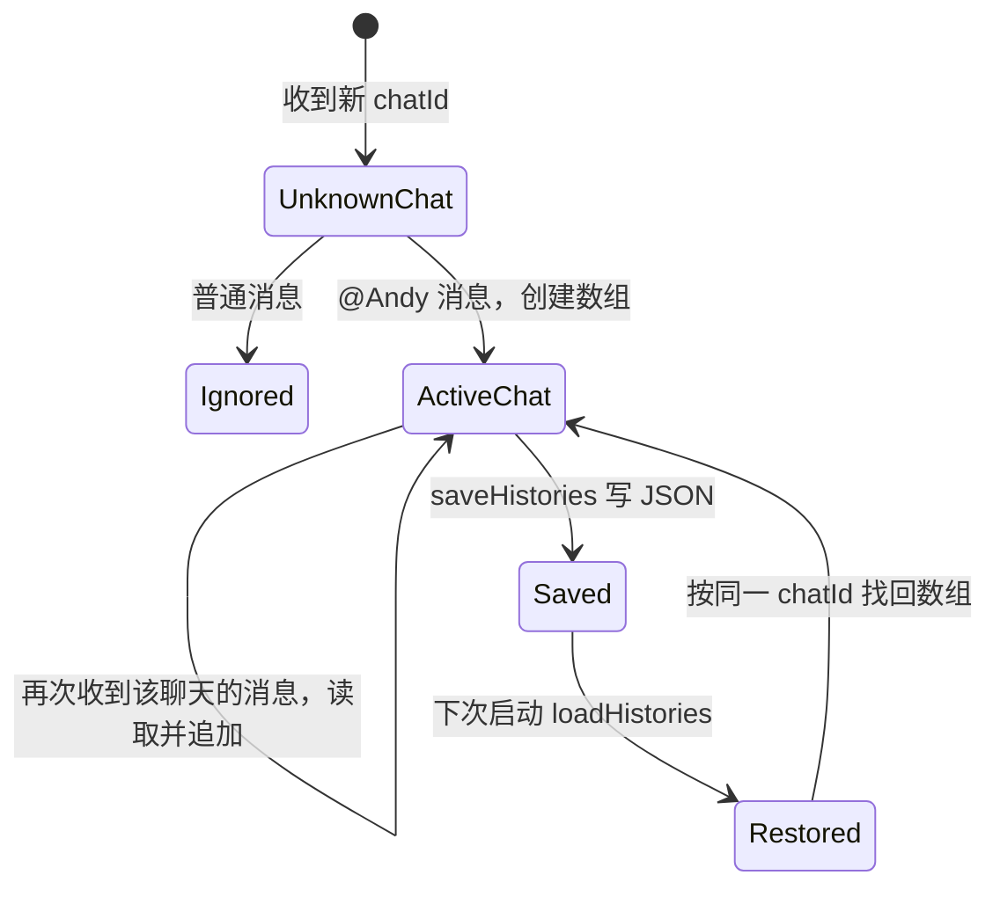
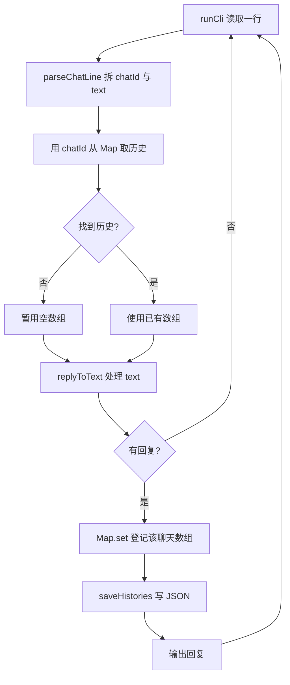

# 第 5 课：不同聊天各有记忆

## 1. 前言

第 4 课把一段对话保存到了 `conversation.json`，程序重启后仍能记住。但是文件
里只有一个数组，助手把所有输入都当成同一个聊天。如果家人聊天中说“我叫小李”，
工作聊天里追问“我刚才说了什么？”，助手会把家人的话答到工作聊天里。这不是
记忆丢失，而是**不同聊天的记忆混在一起**。

本课新增聊天标识，让每个聊天拥有自己的历史。例如输入 `[家人] @Andy 我叫小李`
和 `[工作] @Andy 项目进度正常`；之后在两个聊天分别提问，应该得到各自的上一句。
这个标识只是本地终端模拟“消息来自哪个聊天”，还不是接入真实平台。当前仍是
一个进程、一个 JSON 文件，不引入数据库、路由器或渠道接口。

## 2. 主要内容

### 2.1 本课做什么

1. 给终端输入增加可选的 `[聊天 ID] ` 前缀；没有前缀的旧输入归入 `default`。
2. 把一个历史数组改成“聊天 ID → 历史数组”的映射，每个聊天只读写自己的数组。
3. JSON 从单个数组变成按聊天 ID 分组的对象；读取第 4 课的旧数组时，把它归入
   `default`，使已有记忆不丢失。
4. 用两个聊天交错输入和跨进程重启测试，确认记忆没有串线。

这里的 `chatId` 是**聊天身份**，例如“家人”或“工作”；`text` 是**真正发给
助手判断的消息文字**。前缀必须先拆掉，否则 `replyToText()` 看见的开头是
`[家人]`，而不是 `@Andy`，就会误以为没有呼叫助手。

### 2.2 按函数阅读的链条

真实运行链：

```text
进程启动
→ runCli() 调用 loadHistories(filePath)
→ loadHistories() 把 JSON 中每个聊天的数组装入 Map
→ 终端取得一行 "[家人] @Andy 我叫小李"
→ parseChatLine(line) 拆出 chatId="家人"、text="@Andy 我叫小李"
→ runCli() 用 histories.get("家人") 取得该聊天数组；没有则临时用 []
→ replyToText(text, history) 判断 @Andy，追加正文并返回回复
→ runCli() 用 histories.set("家人", history) 记住这组对应关系
→ saveHistories(filePath, histories) 写回所有聊天的 JSON
→ runCli() 输出回复
```

测试链：

```text
多聊天测试回调创建临时工作目录
→ 第一个 CLI 进程收到家人、路人普通聊天、工作消息，只写入两组历史
→ 第二个 CLI 进程分别在家人、工作聊天中问“我刚才说了什么？”
→ 检查两句回复各自引用了自己的上一句
→ 检查 JSON 里两个聊天的数组也没有互相混入
```

旧文件链：

```text
conversation.json 仍是第 4 课的 ["我叫小李"]
→ loadHistories() 发现 JSON 顶层是数组
→ 转为 Map 中的 default → ["我叫小李"]
→ 无前缀旧输入照常读 default
→ 下一条有效消息触发 saveHistories()，文件改成新格式
```

### 2.3 和上一课相比怎样演化

第 4 课的读文件、处理消息、写文件三个环节还在。现在输入端先增加一个**地址拆分
环节**，处理前增加一个**按 ID 选历史的分支**，磁盘数据由一个数组扩展为多组
数组。业务回复规则并没有变化，所以 `replyToText()` 不需要修改。

这可以理解为最小的“按聊天隔离记忆”，不是完整的用户、平台和会话模型。

## 3. 技术要点

### 3.0 环境配置

本课没有新的第三方依赖；Node、TypeScript 和 `node:test` 继续使用上一课的配置。
`pnpm test` 先编译再运行测试。VS Code 若显示 `node:test` 绿色按钮，可以点击
`persistence.test.ts` 中的“不同聊天的历史互不混用”测试；若按钮没有发现，先在
Testing 面板刷新，仍无效就从终端运行 `pnpm test`。测试使用临时目录，不触碰
项目根目录真实的 `conversation.json`。

### 3.1 坐标：聊天标识在系统中的位置

```text
终端输入（模拟多个聊天来源）
  → main.ts：parseChatLine 拆出 chatId 和 text
  → main.ts：runCli 按 chatId 选择一份历史
  → reply.ts：replyToText 只看正文和该聊天的历史
  → history.ts：loadHistories/saveHistories 读写所有聊天
  → conversation.json：一个文件中的多组历史
```

`chatId` 在这里相当于一个地址：决定消息属于哪个聊天，但不会改变消息的正文。
真实项目以后会从平台事件取得身份；本课只在终端文字里模拟它。`@Andy` 是
**触发词**，决定助手是否回复；`chatId` 是**隔离键**，决定使用哪份记忆。两者
不能混为一谈。

### 3.2 代码：谁负责什么

- `parseChatLine(line): { chatId, text }`：收到一整行终端文字，找到可选的
  `[聊天 ID] ` 前缀，返回聊天标识与剩余消息。它不判断 `@Andy`，只负责拆地址。
- `runCli(): Promise<void>`：启动时调用 `loadHistories()`；每行调用
  `parseChatLine()`，再用 `histories.get(chatId)` 找数组，交给 `replyToText()`；
  有回复时用 `set()` 保存映射，调用 `saveHistories()` 写文件，最后输出。
- `replyToText(text, history)`：输入仍是纯消息正文与一个数组，返回回复或
  `null`。它不知道别的聊天存在，也不需要知道终端前缀格式。
- `loadHistories(filePath): Promise<Map<string, string[]>>`：读取 JSON 对象并
  转成内存 `Map`；文件不存在返回空 `Map`；旧数组文件归入 `default`。
- `saveHistories(filePath, histories)`：把内存 `Map` 转成 JSON 对象并写回。
- `persistence.test.ts` 中的测试回调：从外部运行 CLI，验证完整链条以及磁盘
  结果；`reply.test.ts` 仍只验证单条消息的业务规则。

需要引入 `Map` 是因为现在有多个聊天，每次都要按 ID 快速找到对应历史。这里
只有一个本地文件和一种保存方式，仍不需要 Repository、数据库或配置系统。

### 3.3 数据：一行输入如何变成多组记忆

| 输入行 | `chatId` | `text` | 选中的历史数组 |
|---|---|---|---|
| `[家人] @Andy 我叫小李` | `家人` | `@Andy 我叫小李` | 家人的数组 |
| `[工作] @Andy 项目进度正常` | `工作` | `@Andy 项目进度正常` | 工作的数组 |
| `@Andy 你好` | `default` | `@Andy 你好` | 默认数组 |

前两行处理后，内存中的 `Map` 可以想象为：

```text
家人 → ["我叫小李"]
工作 → ["项目进度正常"]
```

磁盘上的 `conversation.json` 则是 JSON **对象**，键是聊天 ID，值是历史数组：

```json
{
  "家人": ["我叫小李"],
  "工作": ["项目进度正常"]
}
```

`chatId` 不等于消息正文；`Map` 不等于 JSON 文本。`replyToText()` 只收到选中的
一个数组，因此家人的回顾问题根本看不到工作的那一组。普通消息返回 `null`，
不会为一个新聊天创建空数组，也不会写回文件。

### 3.4 状态：每个聊天拥有自己的历史



- `runCli()` 创建/恢复整个 `Map`，选择聊天，并在第一条有效消息后登记该聊天。
- `replyToText()` 修改被选中的那个数组；不会修改其他聊天的数组。
- `saveHistories()` 保存整个映射；下次启动 `loadHistories()` 恢复它。
- `Map` 随进程退出消失；JSON 文件留在当前工作目录。没有前缀的旧输入使用
  `default`，旧数组文件也归入同一个 `default`。

### 3.5 流程图：新增的选聊天分支



### 3.6 细节技术点

#### `[聊天 ID] `：为什么先拆前缀

终端行 `[家人] @Andy 你好` 是为了模拟平台附带的聊天来源。`parseChatLine()`
用 `startsWith('[')` 和 `indexOf('] ')` 确认前缀，再用 `slice()` 分出 ID 和正文。
这里 `markerEnd > 1` 保证方括号中至少有一个字符。没有符合格式的前缀就使用
`default`。这是一条课堂用的明确输入约定，尚不处理所有可能的聊天名字。

#### 返回 `{ chatId, text }` 与解构赋值

一个函数需要同时交回两个相关结果，可以返回对象：

```ts
return { chatId: 'default', text: line };
```

调用处的 `const { chatId, text } = parseChatLine(line)` 是**解构赋值**：把对象中
同名的两个属性取出来，得到两个变量。`chatId` 用于找历史，`text` 才传给
`replyToText()`。

#### `Map`、`get()`、`set()` 与 `??`

过去只有一个 `history: string[]`；现在需要根据聊天名字找到不同数组。`Map`
像一本以聊天 ID 为索引的记事本：`get('家人')` 取家人的数组，找不到返回
`undefined`；`set('家人', history)` 登记或更新该聊天的数组。
`histories.get(chatId) ?? []` 中的 `??` 表示“左边是 `null` 或 `undefined` 才用
右边”，因此新聊天暂时使用空数组。只有 `replyToText()` 返回了回复，才把该
数组放进 `Map`；普通聊天不会产生空白记录。

#### JSON 对象不是 `Map`：`Object.entries()` 与 `Object.fromEntries()`

JSON 对象适合磁盘存储，`Map` 适合运行时按 ID 查找。`Object.entries(saved)` 把
JSON 对象变成一组 `[键, 值]`，传给 `new Map(...)`；反过来，
`Object.fromEntries(histories)` 把 `Map` 变成普通对象，再交给 `JSON.stringify()`。
不能直接把 `Map` 交给 `JSON.stringify()`，否则不会得到预期的各聊天记录。

#### `Array.isArray()`：旧数据如何过渡

第 4 课的文件顶层是 `string[]`，本课顶层是对象。`Array.isArray(saved)` 在运行时
判断旧形状；如果是数组，就把它放进 `default`，让旧的无前缀输入继续找得到。
下一条有效消息保存后，文件自然写成新格式。这里不是设计通用迁移框架，只是
保护学生已经创建的真实数据；无效 JSON 和其他读取错误仍然报错。

## 4. 测试与验收

### 4.1 两个聊天隔离并重启

**测什么、为什么测**：两个聊天交错输入后，重启还能分别回顾自己的上一句；
这是本课的核心需求，也能发现最危险的“甲的内容答给乙”的错误。

**输入**：第一个进程输入家人的“我叫小李”、路人普通聊天和工作的“项目进度正常”；第二个
进程分别在家人、工作聊天输入回顾问题。

**预期**：家人收到“我叫小李”，工作收到“项目进度正常”；JSON 有两个独立键，
各自数组内只包含自己的消息，也没有为路人普通聊天建立空记录。

**证明**：`chatId` 的选择既作用于运行时记忆，也作用于重启后的文件恢复。

### 4.2 旧文件与旧输入

**测什么、为什么测**：第 4 课留下的单数组文件不应因为格式变化丢失。

**输入**：先放置 `["我叫小李"]` 文件，再用无前缀的 `@Andy 我刚才说了什么？`
启动程序。

**预期**：能回答“我叫小李”；保存后文件变为 `{ "default": [...] }`。

**证明**：旧数据进入默认聊天，原来的输入方式仍然能用。

### 4.3 回归与本课验收

原有回复函数测试继续通过，表明 `@Andy` 触发和“先读后写”没有变化。运行
`pnpm test` 应有 7 个测试通过；学生还应能解释一条消息中的 `chatId` 与 `text`
各做什么、两个数组由谁创建和修改、`Map` 与 JSON 对象如何转换。学生亲自运行
测试并反馈后，才完成本课并手动提交。

## 5. 总结

本课没有改变助手如何回答，而是给原来的处理链增加了地址拆分与历史选择：
以前所有消息共用一个数组，现在每个聊天 ID 对应一个数组，并在 JSON 中分组
保存。旧文件被归入默认聊天，避免升级时丢掉第 4 课留下的记忆。

当前仍是一个 CLI 进程顺序处理输入、每条有效消息写一次整个文件。将来处理
耗时增加、消息同时到来时，这种直接处理方式会暴露等待和并发问题；只有到那时
才讨论队列或数据库。
