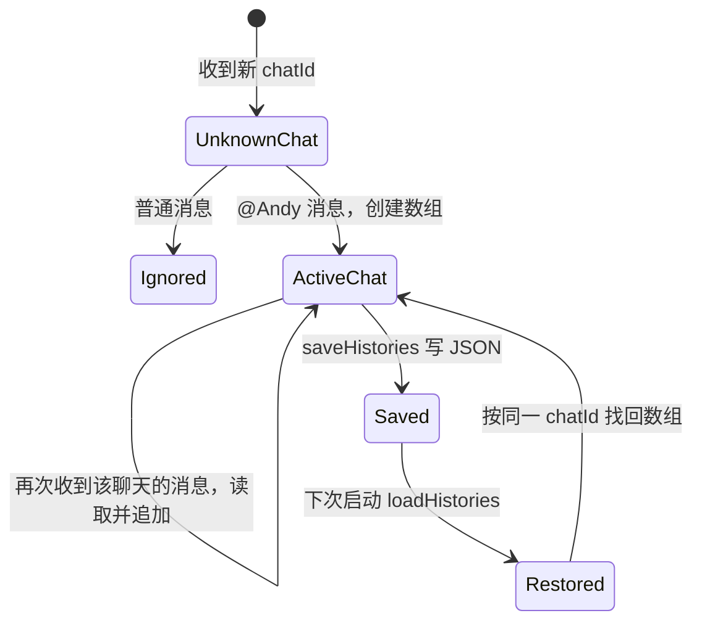
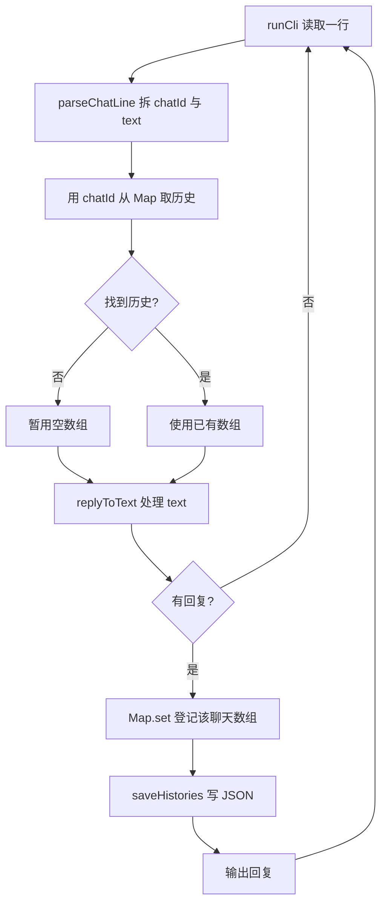

# 第 5 课：不同聊天各有记忆

## 1. 前言

第 4 课已经能把一段对话保存到 `conversation.json`，程序重启之后也还记得。
但这个文件里只有一个数组，助手只能把所有输入都当成同一个聊天来对待。
问题可以这样想象：你在家人的聊天里说过"我叫小李"，转眼又在工作的聊天里
追问"我刚才说了什么？"，助手就会把家人的那句话当作答案，回给工作聊天。
这并不是记忆丢失，而是**不同聊天的记忆混在了一起**。

所以本课引入聊天标识，让每个聊天拥有自己的一份历史。举例来说，先输入
`[家人] @Andy 我叫小李` 和 `[工作] @Andy 项目进度正常`，之后在两个聊天里
分别提问，就应该得到各自的上一句。需要说明的是，这个标识只是用本地终端
来模拟"消息来自哪个聊天"，还不是接入真实平台。当前仍然是一个进程、
一个 JSON 文件，不引入数据库、路由器或渠道接口。

## 2. 主要内容

### 2.1 本课做什么

1. **输入加前缀**：给终端输入增加一个可选的 `[聊天 ID] ` 前缀；没有前缀的
   旧输入一律归入 `default` 这个聊天。
2. **按聊天分历史**：把原来的一个历史数组改成"聊天 ID → 历史数组"的
   映射，每个聊天只读写自己的那份。
3. **文件分组保存**：JSON 从单个数组变成按聊天 ID 分组的对象；读到第 4 课
   的旧数组文件时，把它归入 `default`，保证已有记忆不丢失。
4. **交错与重启测试**：用两个聊天交错输入、再跨进程重启来测试，确认记忆
   没有串线。

这里要先分清两个量：`chatId` 是**聊天身份**，比如"家人"或"工作"；`text`
是**真正交给助手判断的消息文字**。前缀必须在进入业务逻辑之前拆掉——否则
`replyToText()` 看到的开头是 `[家人]` 而不是 `@Andy`，就会误以为没有人
呼叫助手。

### 2.2 按函数阅读的链条

我们按函数走三条链：真实运行链、测试链和旧文件链。

真实运行链：

```text
进程启动
→ runCli() 调用 loadHistories(filePath)
→ loadHistories() 把 JSON 中每个聊天的数组装入 Map
→ 终端取得一行 "[家人] @Andy 我叫小李"
→ parseChatLine(line) 拆出 chatId="家人"、text="@Andy 我叫小李"
→ runCli() 用 histories.get("家人") 取得该聊天数组；没有则临时用 []
→ replyToText(text, history) 判断 @Andy，追加正文并返回回复
→ runCli() 用 histories.set("家人", history) 记住这组对应关系
→ saveHistories(filePath, histories) 写回所有聊天的 JSON
→ runCli() 输出回复
```

测试链：

```text
多聊天测试回调创建临时工作目录
→ 第一个 CLI 进程收到家人、路人普通聊天、工作消息，只写入两组历史
→ 第二个 CLI 进程分别在家人、工作聊天中问“我刚才说了什么？”
→ 检查两句回复各自引用了自己的上一句
→ 检查 JSON 里两个聊天的数组也没有互相混入
```

旧文件链：

```text
conversation.json 仍是第 4 课的 ["我叫小李"]
→ loadHistories() 发现 JSON 顶层是数组
→ 转为 Map 中的 default → ["我叫小李"]
→ 无前缀旧输入照常读 default
→ 下一条有效消息触发 saveHistories()，文件改成新格式
```

### 2.3 和上一课相比怎样演化

对照第 4 课，读文件、处理消息、写文件这三个环节都还在。变化发生在它们
之间：输入端先增加了一个**地址拆分环节**，处理之前增加了一个**按 ID 选
历史的分支**，磁盘数据也从一个数组扩展成了多组数组。业务回复规则没有任何
变化，所以 `replyToText()` 不需要修改。

这可以理解为最小程度的"按聊天隔离记忆"，而不是完整的用户、平台和会话
模型。

## 3. 技术要点

### 3.0 环境配置

本课没有新增任何第三方依赖，Node、TypeScript 和 `node:test` 都继续沿用
上一课的配置。`pnpm test` 会先编译、再运行测试。在 VS Code 里，如果
`node:test` 的绿色按钮已经显示出来，可以直接点击 `persistence.test.ts` 里的
"不同聊天的历史互不混用"测试；如果按钮没有出现，先到 Testing 面板刷新，
仍然无效的话就从终端运行 `pnpm test`。测试使用的是临时目录，不会触碰项目
根目录里真实的 `conversation.json`。

### 3.1 坐标：聊天标识在系统中的位置

从纵向看，聊天标识处在这样的位置：

```text
终端输入（模拟多个聊天来源）
  → main.ts：parseChatLine 拆出 chatId 和 text
  → main.ts：runCli 按 chatId 选择一份历史
  → reply.ts：replyToText 只看正文和该聊天的历史
  → history.ts：loadHistories/saveHistories 读写所有聊天
  → conversation.json：一个文件中的多组历史
```

`chatId` 在这里相当于一个地址：它决定一条消息属于哪个聊天，但不会改变
消息的正文。真实项目以后会从平台事件里取得身份；本课只在终端文字里模拟它。
还有一组容易混淆的概念要分清：`@Andy` 是**触发词**，决定助手是否回复；
`chatId` 是**隔离键**，决定使用哪份记忆。两者不能混为一谈。

### 3.2 代码：谁负责什么

- `parseChatLine(line): { chatId, text }`：接收一整行终端文字，找出可选的
  `[聊天 ID] ` 前缀，返回聊天标识和剩下的消息。它不判断 `@Andy`——只
  负责拆地址，不负责判断是否呼叫助手。
- `runCli(): Promise<void>`：启动时调用 `loadHistories()` 载入所有聊天；每
  收到一行就调用 `parseChatLine()` 拆出聊天和正文，再用
  `histories.get(chatId)` 找到对应数组，交给 `replyToText()` 处理；有回复时
  先用 `set()` 把映射登记回内存，再调用 `saveHistories()` 写文件，最后输出
  回复。
- `replyToText(text, history)`：输入仍然是纯消息正文和一个数组，返回回复或
  `null`。它不知道其他聊天的存在，也不需要知道终端前缀的格式。
- `loadHistories(filePath): Promise<Map<string, string[]>>`：读取 JSON 对象并
  转换成内存中的 `Map`；文件不存在时返回空的 `Map`；遇到旧数组文件则归入
  `default`。
- `saveHistories(filePath, histories)`：把内存中的 `Map` 转换成 JSON 对象并
  写回文件。
- `persistence.test.ts` 中的测试回调：从外部运行 CLI，验证完整链条以及磁盘
  上的结果；`reply.test.ts` 仍然只验证单条消息的业务规则。

为什么需要引入 `Map`？因为现在有多个聊天了，每次都要按 ID 快速找到对应的
那份历史。即便如此，这里仍然只有一个本地文件、一种保存方式，还不需要
Repository、数据库或配置系统。

### 3.3 数据：一行输入如何变成多组记忆

先看几行典型输入是如何被拆分的：

| 输入行 | `chatId` | `text` | 选中的历史数组 |
|---|---|---|---|
| `[家人] @Andy 我叫小李` | `家人` | `@Andy 我叫小李` | 家人的数组 |
| `[工作] @Andy 项目进度正常` | `工作` | `@Andy 项目进度正常` | 工作的数组 |
| `@Andy 你好` | `default` | `@Andy 你好` | 默认数组 |

前两行处理之后，内存中的 `Map` 可以想象成这样：

```text
家人 → ["我叫小李"]
工作 → ["项目进度正常"]
```

磁盘上的 `conversation.json` 则是一个 JSON **对象**：键是聊天 ID，值是
对应的历史数组：

```json
{
  "家人": ["我叫小李"],
  "工作": ["项目进度正常"]
}
```

两组区别要分清：`chatId` 不等于消息正文，`Map` 也不等于 JSON 文本。由于
`replyToText()` 只会收到选中的那一个数组，所以家人的回顾问题根本看不到
工作的那一组记忆。普通消息返回 `null`，既不会为一个新聊天创建空数组，
也不会写回文件。

### 3.4 状态：每个聊天拥有自己的历史



- `runCli()` 负责创建或恢复整个 `Map`，为每行输入选择聊天，并在某个聊天的
  第一条有效消息之后把它登记进 `Map`。
- `replyToText()` 只修改被选中的那个数组，不会修改其他聊天的数组。
- `saveHistories()` 保存整个映射；下次启动时由 `loadHistories()` 把它恢复
  回来。
- `Map` 随进程退出而消失；JSON 文件则留在当前工作目录。没有前缀的旧输入
  使用 `default`，旧数组文件也被归入同一个 `default`。

### 3.5 流程图：新增的选聊天分支



这张图在上一课的"读—处理—写"循环里插入了选聊天的分支：先用 `chatId`
从 `Map` 里取历史，找不到就暂时用空数组；只有产生了回复，才把该聊天的
数组登记进 `Map` 并写回 JSON，然后回到读取下一行。

### 3.6 细节技术点

#### `[聊天 ID] `：为什么先拆前缀

终端行 `[家人] @Andy 你好` 里的方括号前缀，是为了模拟平台附带的聊天来源。
`parseChatLine()` 先用 `startsWith('[')` 和 `indexOf('] ')` 确认前缀的形状，
再用 `slice()` 把 ID 和正文分开。其中 `markerEnd > 1` 这个条件保证了方括号
里至少有一个字符。如果开头没有符合格式的前缀，就使用 `default`。要说明的
是，这是一条课堂上明确约定的输入格式，并不是要处理所有可能的聊天名字。

#### 返回 `{ chatId, text }` 与解构赋值

当一个函数需要同时交回两个相关结果时，可以返回一个对象：

```ts
return { chatId: 'default', text: line };
```

调用处的 `const { chatId, text } = parseChatLine(line)` 是**解构赋值**：把
对象里同名的两个属性取出来，变成两个变量。之后 `chatId` 用来找历史，
`text` 才是传给 `replyToText()` 的那份。

#### `Map`、`get()`、`set()` 与 `??`

过去只有一个 `history: string[]`；现在需要根据聊天名字找到不同的数组。
`Map` 可以想象成一本以聊天 ID 为索引的记事本：`get('家人')` 取出家人的
数组，找不到就返回 `undefined`；`set('家人', history)` 登记或更新该聊天的
数组。`histories.get(chatId) ?? []` 里的 `??` 表示"左边是 `null` 或
`undefined` 时才使用右边"，所以新聊天的第一次处理会暂时使用空数组。
另外要注意顺序：只有当 `replyToText()` 返回了回复，才把这个数组放进
`Map`；普通聊天不会产生空白记录。

#### JSON 对象不是 `Map`：`Object.entries()` 与 `Object.fromEntries()`

JSON 对象适合放在磁盘上存储，`Map` 适合在运行时按 ID 查找，两者之间的
转换需要专门的函数。读取方向：`Object.entries(saved)` 把 JSON 对象变成
一组 `[键, 值]` 对，传给 `new Map(...)` 就建好了映射。写入方向：
`Object.fromEntries(histories)` 把 `Map` 变回普通对象，再交给
`JSON.stringify()` 写盘。特别提醒：不能直接把 `Map` 交给
`JSON.stringify()`，否则得不到预期的各聊天记录。

#### `Array.isArray()`：旧数据如何过渡

第 4 课的文件顶层是一个 `string[]`，本课的顶层变成了对象——两种形状都会
在真实磁盘上遇到。`Array.isArray(saved)` 在运行时判断读到的到底是哪一种
形状；如果是数组，就把它放进 `default`，让旧的无前缀输入继续找得到这段
记忆。等下一条有效消息保存之后，文件自然就写成了新格式。这里并不是要设计
一个通用的迁移框架，只是为了保护学生已经创建的真实数据；无效 JSON 和其他
读取错误仍然照常报错。

## 4. 测试与验收

### 4.1 两个聊天隔离并重启

**测什么、为什么测**：两个聊天交错输入之后，重启程序还能分别回顾各自的
上一句。这是本课的核心需求，也是最容易暴露"甲的内容答给乙"这类危险
错误的地方。

**输入**：第一个进程依次输入家人的"我叫小李"、路人的普通聊天和工作的
"项目进度正常"；第二个进程分别在家人、工作两个聊天里输入回顾问题。

**预期**：

1. 家人聊天里收到"我叫小李"，工作聊天里收到"项目进度正常"；
2. JSON 里有两个独立的键，各自数组内只包含自己的消息；
3. 路人的普通聊天没有建立空记录。

**证明**：`chatId` 的选择既作用于运行时记忆，也作用于重启之后的文件恢复。

### 4.2 旧文件与旧输入

**测什么、为什么测**：第 4 课留下的单数组文件，不应该因为本课的格式变化
而丢失。

**输入**：先在磁盘上放置 `["我叫小李"]` 这个旧文件，再用不带前缀的
`@Andy 我刚才说了什么？` 启动程序。

**预期**：程序能回答"我叫小李"；保存之后文件变成 `{ "default": [...] }`
的形式。

**证明**：旧数据顺利进入了默认聊天，原来的输入方式也仍然可用。

### 4.3 回归与本课验收

原有的回复函数测试继续通过，说明 `@Andy` 触发和"先读后写"的行为没有
变化。运行 `pnpm test`，应该看到 7 个测试通过。除了跑通测试，学生还应能
回答这些问题：一条消息中的 `chatId` 与 `text` 各自做什么、两个数组分别由
谁创建和修改、`Map` 与 JSON 对象之间如何转换。学生亲自运行测试并反馈
之后，才完成本课并手动提交。

## 5. 总结

本课没有改变助手回答问题的方式，而是给原来的处理链增加了地址拆分与历史
选择两个环节：以前所有消息共用一个数组，现在每个聊天 ID 对应一个数组，
并且在 JSON 中分组保存。旧文件被归入默认聊天，避免了升级时丢掉第 4 课
留下的记忆。

当前的限制仍然存在：一个 CLI 进程顺序处理输入，每条有效消息都要写一次
整个文件。将来当处理耗时增加、消息同时到来时，这种直接处理的方式就会
暴露出等待和并发问题；只有到那时，我们才讨论队列或数据库。
