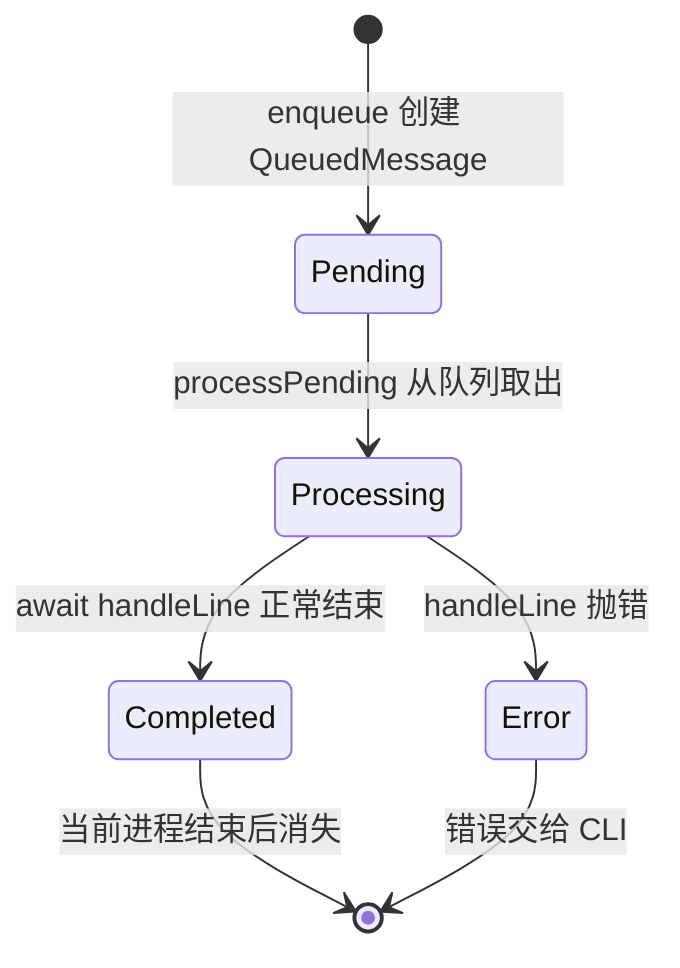
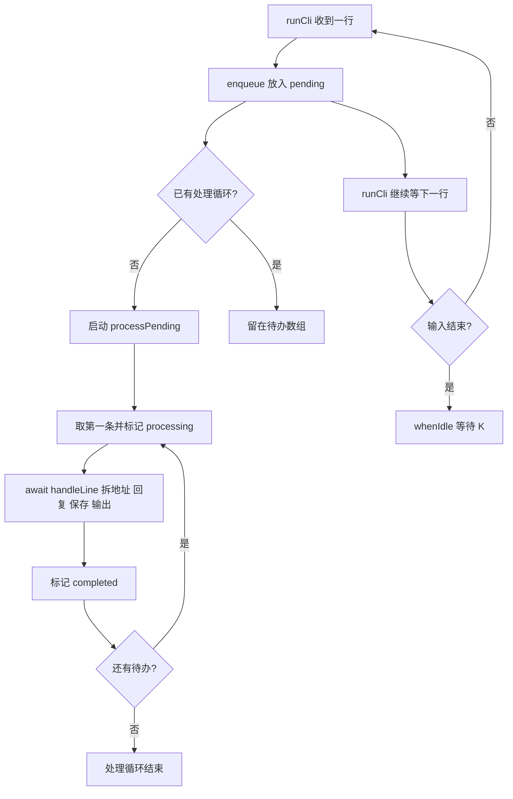

# 第 6 课：新消息先排队

## 1. 前言

第 5 课已经能按聊天 ID 找到各自的历史，也能在每次回复后把 JSON 写回磁盘。
但 `runCli()` 的逐行循环仍是“读一行 → 处理并等待写盘 → 再读下一行”。
如果处理步骤需要等待较慢的文件 I/O，以后再接入真正耗时的模型调用，下一条
消息只能排在读取循环外面等。我们现在希望先把新消息收下来，再由一个处理
循环按顺序完成它们。

本课引入当前进程里的最小待办队列。读入一行就入队；处理器一次只取一条，
继续沿用原来的“拆聊天 → 选历史 → 回复 → 保存 → 输出”业务链。这样既能
观察 `pending → processing → completed`，也避免两个处理任务同时改写同一份
JSON。没有真实模型、线程池或外部消息系统；测试用一个受控的慢任务模拟等待。

## 2. 主要内容

### 2.1 本课做什么

1. 为每条待处理的原始输入行建立最小对象：`line` 和 `status`。
2. `createMessageQueue()` 提供 `enqueue()`：立即收下新行，状态先为 `pending`。
3. 一个 `processPending()` 循环依次取出消息，状态改为 `processing`，等待原有
   业务处理完成，再改为 `completed`。
4. CLI 的读取循环只负责入队；管道输入结束时调用 `whenIdle()`，等剩余消息
   全部完成后再退出。
5. 测试让第一条故意停在一个 Promise 上，证明第二条已进入队列，随后放行并
   检查处理顺序与状态。

`replyToText()`、聊天隔离和 JSON 格式都不改。本课只改变消息进入原有业务链
的**时间安排**。

### 2.2 按函数阅读的两条链

真实 CLI 链：

```text
runCli() 启动并恢复各聊天历史
→ createMessageQueue(handleLine) 建立一个待办队列与顺序处理循环
→ 终端来一行，runCli() 调用 enqueue(line)，马上返回继续接收下一行
→ enqueue() 把 { line, status: 'pending' } 放入待办数组，并启动 processPending()
→ processPending() 取第一条，状态变 processing，等待 handleLine(line)
→ handleLine() 沿用 parseChatLine() → replyToText() → saveHistories() → 输出
→ handleLine() 完成，状态变 completed；再处理下一条
→ 输入结束后 runCli() 调用 whenIdle()，等待剩余队列清空才退出
```

测试链：

```text
测试回调创建一个尚未完成的 firstCanFinish Promise
→ createMessageQueue() 的处理函数遇到“第一条”就等待它
→ enqueue('第一条')：第一条已开始 processing，但尚未完成
→ enqueue('第二条')：第二条已经 pending，读取/入队没有等第一条结束
→ 测试放行第一条，再 await whenIdle()
→ 检查处理顺序为第一条、第二条，两个状态最终都是 completed
```

原有持久化测试仍从外部启动 CLI，验证回复顺序、聊天隔离和重启恢复未被队列
破坏。新的测试专门验证“慢处理期间仍可入队”和状态变化。

### 2.3 和上一课相比增加了什么

以前终端读取和业务处理在同一条同步等待链上；现在两者之间增加一个**待办
环节**，形成“接收链”和“处理链”。处理链仍然只有一个工作循环，按入队顺序
做事。接收先完成不代表回复立即完成，更不代表并行处理。

## 3. 技术要点

### 3.0 环境配置

本课不增加第三方依赖。`Promise`、`async/await`、Node 的测试运行器都已由
当前 TypeScript/Node 工程提供。`pnpm test` 会先编译再运行测试。VS Code 中
如果测试提供者已发现测试，可在 `message-queue.test.ts` 的测试回调旁点绿色
按钮；行内按钮不见时，到 Testing 面板刷新，或直接用终端运行 `pnpm test`。

### 3.1 坐标：队列处在什么位置

```text
终端输入：runCli() 连续接收原始行
       ↓ enqueue
进程内待办：message-queue.ts 保存 pending 消息并顺序取出
       ↓ handleLine
已有业务：parseChatLine → replyToText → saveHistories → 终端输出
```

队列只保存**尚未开始处理的原始输入行**，不是聊天历史，也不是 JSON 文件。
`histories` 仍按聊天 ID 保存用户正文；`conversation.json` 仍负责跨进程记忆。
队列只存在于当前 Node 进程，重启后不会恢复待办消息。本课不解决可靠投递。

### 3.2 代码：函数与调用关系

- `createMessageQueue(handleLine)`：输入是一个处理单行消息的异步函数；返回
  `enqueue()` 与 `whenIdle()`。队列模块只负责接收、状态和处理顺序，不解释
  `@Andy` 或 JSON。这里的函数参数是当前 CLI 已有的具体处理步骤，并不是
  预留 Provider 或可插拔框架。
- `enqueue(line)`：输入原始行，返回带 `line`、`status` 的 `QueuedMessage`；
  先放进 `pending` 数组。若没有工作循环，就启动 `processPending()`；它不
  等待上一条处理完，所以读取循环能继续收下一行。
- `processPending()`：从 `pending` 数组头部逐条取消息，先改 `processing`，
  `await handleLine(message.line)`，完成后改 `completed`。遇到错误会记在
  `failure` 中并停止，之后由 `whenIdle()` 交给 CLI，不假装处理成功。
- `whenIdle()`：输入结束后等待正在运行的处理循环；若处理失败，则抛出错误。
  它保证管道输入结束不等于程序立即退出，待办消息仍会处理完。
- `runCli()`：创建队列，把上一课的拆地址、回复和写盘代码作为 `handleLine`
  传入；终端循环只调用 `enqueue()`，最后调用 `whenIdle()`。它仍负责输入输出。
- `parseChatLine()`、`replyToText()`、`loadHistories()`、`saveHistories()`：
  职责及数据格式与第 5 课相同，本课不修改其业务规则。

为什么此时单独有 `message-queue.ts`？接收和处理现在需要不同的速度与状态，
而原本的一个逐行循环无法展示或管理待办列表。最简单的实现就是一个内存数组
和一个顺序处理循环，不需要外部消息中间件或多个 worker。

### 3.3 数据：队列消息与聊天历史不是一回事

收到以下两行，假设第一条正在等待慢处理：

```text
[家人] @Andy 我叫小李
[工作] @Andy 项目进度正常
```

此刻队列中的对象可以想成：

| 原始 `line` | `status` | 当前位置 |
|---|---|---|
| `[家人] @Andy 我叫小李` | `processing` | 已从待办数组取出，正在处理 |
| `[工作] @Andy 项目进度正常` | `pending` | 仍在待办数组里 |

处理第一条时，`parseChatLine()` 才拆出 `chatId="家人"` 和
`text="@Andy 我叫小李"`；`replyToText()` 才把 `"我叫小李"` 追加到家人的
历史。队列对象的 `line` 是原始输入，聊天历史中的字符串是去掉触发词后的
**用户正文**，两者不要混淆。助手回复仍只输出，不进入历史。

### 3.4 状态：谁创建、改变、保存



- `enqueue()` 创建对象，初始 `pending`；`processPending()` 改为 `processing`
  和 `completed`。
- 正在处理的对象已不在 `pending` 数组里，但测试仍保留它的引用，因此能检查
  最终状态。`processPending()` 不会同时启动第二个循环。
- 队列状态只在内存，不保存到 `conversation.json`；JSON 保存的是各聊天的用户
  正文。处理失败不会标为 `completed`，错误会传播给 CLI。

### 3.5 流程图：接收与处理分开



### 3.6 细节技术点

#### `QueuedMessage`、`status` 与联合类型

`QueuedMessage` 是当前队列中一条工单的形状：原始 `line` 加处理 `status`。
`'pending' | 'processing' | 'completed'` 表示状态只能取这三个字符串之一，
在 TypeScript 中叫**字符串字面量联合类型**。这不是完整聊天消息对象：它没有
聊天 ID、去掉触发词的正文或助手回复；这些要等处理阶段才得到。

#### `Promise`：一件还没完成的事

可以把 `Promise<void>` 想成一张“事情办完再通知我”的凭条。测试中
`firstCanFinish` 一开始没有完成，所以第一条处理函数执行到
`await firstCanFinish` 就暂停；测试随后仍能调用 `enqueue('第二条')`。
直到测试调用 `finishFirst()`，第一条才继续完成。这不是在生产代码里故意
拖慢回复，而是用可控的等待证明队列真的能在慢工作期间继续收消息。

正式地说，`Promise` 表示异步操作的未来结果；`await` 会暂停**当前异步函数**，
不会让整个 Node 进程的 JavaScript 执行都停住。当前生产处理步骤中的实际
异步工作是 `saveHistories()` 的文件写入。若某段工作是长时间纯同步计算，
它仍会堵住事件循环；这个队列不会神奇地把 CPU 工作变成并行。

测试中的 `let finishFirst!: () => void` 用 `!` 告诉 TypeScript：虽然变量在
声明时尚未赋值，但紧接着的 `new Promise(...)` 会把 `resolve` 赋给它，之后
才会调用。这个 `!` 只影响类型检查，不会在运行时替你赋值；若真没赋值就
调用，仍会报错。`finishFirst()` 相当于通知那张“凭条”已完成。

#### 回调函数 `async (line) => { ... }`

`runCli()` 把一段“真正处理一行”的函数传给 `createMessageQueue()`。它像把
工单交给一位专门按顺序做事的同事：队列只管什么时候轮到这张工单，具体的
聊天解析、回复和保存仍由这段函数完成。这个函数没有另一个实现；传入函数
只是为了让接收与处理分开，并让测试能用一个受控慢任务验证顺序。

#### `pending.shift()` 与只有一个处理循环

`push()` 从尾部加入，`shift()` 从头部取出，因此这是“先进先出”（FIFO）。
`running` 保存当前处理循环的 Promise。它不为 `null` 时，后续 `enqueue()`
只加待办，不再启动另一个循环。这保证同一个聊天的历史追加和 JSON 写入仍按
输入顺序进行；我们此时追求“可以先收下”，不是“多个回复同时生成”。

#### 后台处理出错为什么要记在 `failure`

处理循环在后台启动，读取循环没有立即 `await` 它。`processPending()` 用
`catch` 把错误记在 `failure`，让后台 Promise 正常结束，避免出现未处理的
Promise 拒绝。错误并没有被当成成功：下一次 `enqueue()` 或输入结束后的
`whenIdle()` 会把 `failure` 抛给 CLI；处理失败的消息不会标记为 `completed`。

#### `whenIdle()` 与输入结束

管道输入结束只说明没有新的行，不说明队列处理完。`runCli()` 在 `finally`
中关闭终端接口，再 `await queue.whenIdle()`。这样 `printf ... | pnpm start`
不会因为输入一下子结束就丢掉最后几条消息；用户仍能看到原来顺序的回复。

## 4. 测试与验收

### 4.1 慢任务期间继续接收

**测什么、为什么测**：第一条处理尚未完成时，第二条是否已成功进入队列；
这是本课真正新增的能力，而非只是把函数移到新文件。

**输入**：连续 `enqueue('第一条')`、`enqueue('第二条')`；第一条处理函数等待
测试控制的 Promise。

**预期**：等待中第一条 `processing`，第二条 `pending`，已开始处理的只有
第一条。放行并 `await whenIdle()` 后，处理顺序是第一条、第二条，两个对象
均为 `completed`。

**证明**：接收新消息不需要等前一条处理结束，且只有一个顺序处理循环。

### 4.2 原有业务回归

原有跨进程、聊天隔离、旧文件过渡和回复函数测试继续通过。它们证明队列接入
后，输入顺序、输出顺序、聊天历史和磁盘保存没有改变。

### 4.3 本课验收

- `pnpm test` 应有 8 个测试通过；
- 学生能指出 `line`、`QueuedMessage.status`、聊天历史、JSON 文件分别是谁
  创建和保存的；
- 学生能解释为什么第二条可以 `pending`，但必须等第一条完成才开始处理；
- 学生自己运行测试并反馈后，再完成本课并手动提交。

## 5. 总结

这一课为原有业务链增加了一个内存待办环节：输入循环负责尽快收下新消息，
一个处理循环负责按顺序执行旧业务逻辑。旧设计暴露的问题是读取和处理捆在
一起，异步工作慢时，下一条不能进入我们自己的待办列表。队列让这两件事
分开，并使 `pending → processing → completed` 可观察。

这仍不是并行处理，也不是可靠消息系统。队列只在当前进程内，进程意外退出
会丢失待办消息；处理失败也会中断。等后续真实需求出现，再讨论如何持久化
待办、处理多个 worker 或连接外部渠道。
