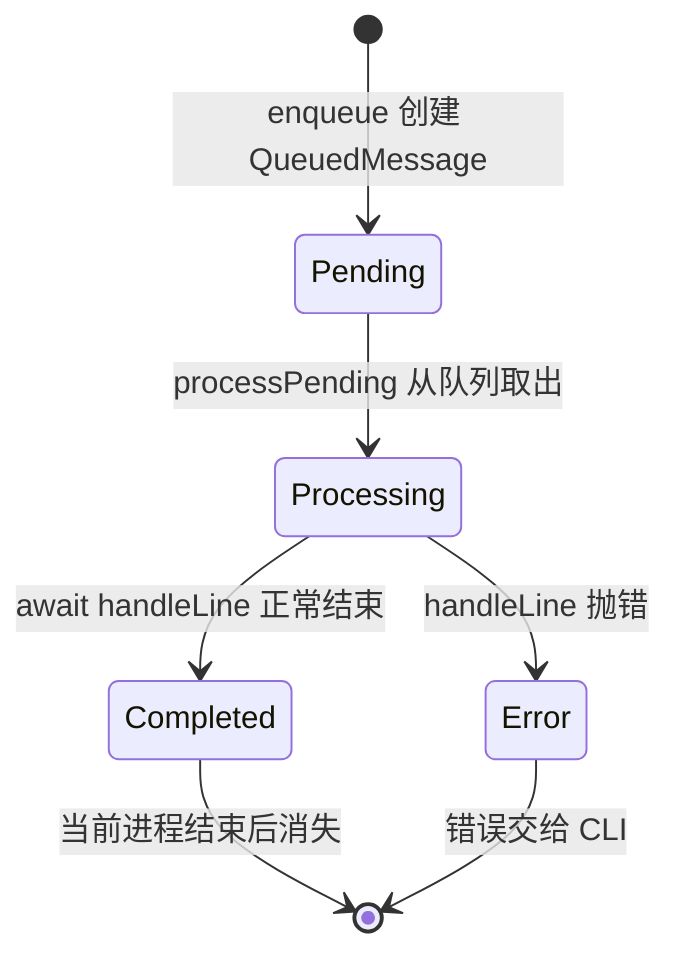
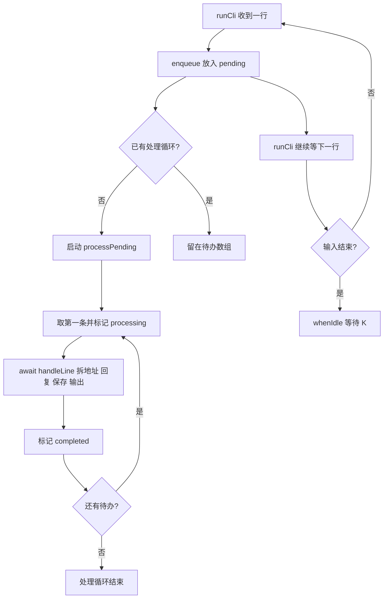

# 第 6 课：新消息先排队

## 1. 前言

第 5 课已经能按聊天 ID 找到各自的历史，也能在每次回复之后把 JSON 写回
磁盘。但 `runCli()` 的逐行循环仍然是"读一行 → 处理并等待写盘 → 再读
下一行"的串行模式。问题在于：如果处理步骤需要等待较慢的文件 I/O，将来
再接入真正耗时的模型调用，那么下一条消息就只能排在读取循环外面干等。
我们现在希望换一种安排：先把新消息收下来，再交给一个处理循环按顺序完成
它们。

所以本课在当前进程里引入一个最小的待办队列。每读入一行就先入队；处理器
一次只取一条，继续沿用原来的"拆聊天 → 选历史 → 回复 → 保存 → 输出"
业务链。这样做有两个直接的好处：既能观察一条消息从 `pending` 到
`processing` 再到 `completed` 的状态变化，也能避免两个处理任务同时改写
同一份 JSON。本课仍然没有真实模型、线程池或外部消息系统；测试用一个受控
的慢任务来模拟等待。

## 2. 主要内容

### 2.1 本课做什么

1. **建最小对象**：为每条待处理的原始输入行建立一个最小对象，只有 `line`
   和 `status` 两个字段。
2. **提供入队**：`createMessageQueue()` 提供 `enqueue()`，立即收下新的一行，
   状态先记为 `pending`。
3. **顺序处理**：一个 `processPending()` 循环依次取出消息，把状态改为
   `processing`，等待原有业务处理完成，再改为 `completed`。
4. **收尾等待**：CLI 的读取循环只负责入队；管道输入结束时调用
   `whenIdle()`，等剩余消息全部处理完之后再退出。
5. **慢任务测试**：测试让第一条消息故意停在一个 Promise 上，以此证明第二
   条已经进入队列，随后放行，并检查处理顺序与最终状态。

注意，`replyToText()`、聊天隔离和 JSON 格式都不改动。本课只改变消息进入
原有业务链的**时间安排**。

### 2.2 按函数阅读的两条链

我们先看真实 CLI 链，也就是程序实际运行时一条消息的旅程：

```text
runCli() 启动并恢复各聊天历史
→ createMessageQueue(handleLine) 建立一个待办队列与顺序处理循环
→ 终端来一行，runCli() 调用 enqueue(line)，马上返回继续接收下一行
→ enqueue() 把 { line, status: 'pending' } 放入待办数组，并启动 processPending()
→ processPending() 取第一条，状态变 processing，等待 handleLine(line)
→ handleLine() 沿用 parseChatLine() → replyToText() → saveHistories() → 输出
→ handleLine() 完成，状态变 completed；再处理下一条
→ 输入结束后 runCli() 调用 whenIdle()，等待剩余队列清空才退出
```

再看测试链，它用一个受控的慢任务验证队列行为：

```text
测试回调创建一个尚未完成的 firstCanFinish Promise
→ createMessageQueue() 的处理函数遇到“第一条”就等待它
→ enqueue('第一条')：第一条已开始 processing，但尚未完成
→ enqueue('第二条')：第二条已经 pending，读取/入队没有等第一条结束
→ 测试放行第一条，再 await whenIdle()
→ 检查处理顺序为第一条、第二条，两个状态最终都是 completed
```

原有的持久化测试仍从外部启动 CLI，验证回复顺序、聊天隔离和重启恢复都
没有被队列破坏。新增的测试则专门验证两件事："慢处理期间仍然可以入队"，
以及状态变化是否符合预期。

### 2.3 和上一课相比增加了什么

以前，终端读取和业务处理在同一条同步等待链上；现在两者之间增加了一个
**待办环节**，把整条流程分成了"接收链"和"处理链"两条。要注意的是，
处理链仍然只有一个工作循环，严格按入队顺序做事。所以"接收先完成"不代表
"回复立即完成"，更不代表并行处理。

## 3. 技术要点

### 3.0 环境配置

本课不增加任何第三方依赖：`Promise`、`async/await` 和 Node 的测试运行器，
都已经由当前的 TypeScript/Node 工程提供。`pnpm test` 会先编译再运行测试。
在 VS Code 里，如果测试提供者已经发现了测试，可以在 `message-queue.test.ts`
的测试回调旁点绿色按钮；如果行内按钮没有出现，就到 Testing 面板刷新，
或者直接在终端里运行 `pnpm test`。

### 3.1 坐标：队列处在什么位置

从纵向看，队列正好处在接收和业务之间：

```text
终端输入：runCli() 连续接收原始行
       ↓ enqueue
进程内待办：message-queue.ts 保存 pending 消息并顺序取出
       ↓ handleLine
已有业务：parseChatLine → replyToText → saveHistories → 终端输出
```

要认清队列保存的是什么：它只保存**尚未开始处理的原始输入行**，不是聊天
历史，也不是 JSON 文件。`histories` 仍然按聊天 ID 保存用户正文；
`conversation.json` 仍然负责跨进程记忆。另外，队列只存在于当前这个 Node
进程里，程序重启之后不会恢复待办消息——本课不解决可靠投递问题。

### 3.2 代码：函数与调用关系

- `createMessageQueue(handleLine)`：输入是一个"处理单行消息"的异步函数；
  返回 `enqueue()` 和 `whenIdle()` 两个函数。队列模块只负责接收、状态和
  处理顺序，不解释 `@Andy`，也不碰 JSON。这里的函数参数就是当前 CLI 已有
  的具体处理步骤，并不是预留什么 Provider 或可插拔框架。
- `enqueue(line)`：接收原始行，返回一个带 `line`、`status` 的
  `QueuedMessage`，先把它放进 `pending` 数组。如果此时还没有工作循环在跑，
  就启动 `processPending()`；注意 `enqueue()` 不等上一条处理完就返回，所以
  读取循环能继续接收下一行。
- `processPending()`：从 `pending` 数组头部逐条取消息，先把状态改成
  `processing`，然后 `await handleLine(message.line)` 等业务完成，完成后改成
  `completed`。遇到错误会把错误记在 `failure` 中并停止处理，之后由
  `whenIdle()` 交给 CLI——不假装处理成功。
- `whenIdle()`：在输入结束后等待正在运行的处理循环；如果处理失败了，就把
  错误抛出。它保证了"管道输入结束"不等于"程序立即退出"，待办消息仍然
  会被处理完。
- `runCli()`：创建队列，把上一课写好的拆地址、回复和写盘代码作为
  `handleLine` 传进去；终端循环只调用 `enqueue()`，最后调用 `whenIdle()`。
  它仍然负责输入输出。
- `parseChatLine()`、`replyToText()`、`loadHistories()`、`saveHistories()`：
  职责和数据格式都与第 5 课相同，本课不修改它们的业务规则。

为什么这个时候要单独有一个 `message-queue.ts`？因为接收和处理现在需要
不同的速度与状态，而原本那一个逐行循环既展示不了也管理不了待办列表。
最简单的实现就是一个内存数组加一个顺序处理循环，不需要外部消息中间件，
也不需要多个 worker。

### 3.3 数据：队列消息与聊天历史不是一回事

假设收到以下两行，而且第一条正在等待一个较慢的处理：

```text
[家人] @Andy 我叫小李
[工作] @Andy 项目进度正常
```

此刻队列中的对象可以想象成：

| 原始 `line` | `status` | 当前位置 |
|---|---|---|
| `[家人] @Andy 我叫小李` | `processing` | 已从待办数组取出，正在处理 |
| `[工作] @Andy 项目进度正常` | `pending` | 仍在待办数组里 |

这里有一个容易混淆的地方要特别说明。只有当处理轮到第一条时，
`parseChatLine()` 才会拆出 `chatId="家人"` 和 `text="@Andy 我叫小李"`；
`replyToText()` 才会把 `"我叫小李"` 追加到家人的历史里。队列对象里的
`line` 是原始输入，而聊天历史里保存的字符串是去掉触发词之后的**用户
正文**——两者不要混淆。助手的回复仍然只输出到终端，不进入历史。

### 3.4 状态：谁创建、改变、保存



- `enqueue()` 创建队列对象，初始状态是 `pending`；`processPending()` 负责
  把它改成 `processing` 和 `completed`。
- 正在处理的对象已经不在 `pending` 数组里了，但测试仍然保留着它的引用，
  所以能检查它的最终状态。`processPending()` 不会同时启动第二个循环。
- 队列状态只存在于内存中，不保存到 `conversation.json`；JSON 保存的是各
  聊天的用户正文。处理失败的消息不会标成 `completed`，错误会传播给 CLI。

### 3.5 流程图：接收与处理分开



这张图把两条链画在了一起：接收链是 `runCli` 收到一行就入队，然后继续等
下一行，直到输入结束才调用 `whenIdle`；处理链是一个循环，从待办数组逐条
取出、处理、再判断是否还有待办，全部做完后循环结束，`whenIdle` 等到的
正是这个结束点。

### 3.6 细节技术点

#### `QueuedMessage`、`status` 与联合类型

`QueuedMessage` 是当前队列中一张工单的形状：一条原始 `line`，加一个处理
`status`。`'pending' | 'processing' | 'completed'` 表示状态只能取这三个
字符串中的一个，这在 TypeScript 里叫**字符串字面量联合类型**。要注意它
不是完整的聊天消息对象：它没有聊天 ID、没有去掉触发词的正文、也没有助手
回复——这些都要等到处理阶段才产生。

#### `Promise`：一件还没完成的事

可以把 `Promise<void>` 想象成一张"事情办完再通知我"的凭条。测试中的
`firstCanFinish` 一开始没有完成，所以第一条的处理函数执行到
`await firstCanFinish` 就暂停了；而测试随后仍然能调用 `enqueue('第二条')`
——这正是队列能在慢工作期间继续收消息的证据。直到测试调用
`finishFirst()`，第一条才继续往下完成。需要说明的是，这不是在生产代码里
故意拖慢回复，而是用可控的等待，证明队列真的能在慢工作期间继续接收消息。

更正式地说，`Promise` 表示一个异步操作的未来结果；`await` 暂停的只是
**当前这个异步函数**，并不会让整个 Node 进程的 JavaScript 执行都停住。
当前生产处理步骤中真正的异步工作是 `saveHistories()` 的文件写入。如果某段
工作是长时间的纯同步计算，它仍然会堵住事件循环——这个队列不会神奇地把
CPU 工作变成并行。

测试中还有一处语法值得说明：`let finishFirst!: () => void` 里的 `!` 告诉
TypeScript——这个变量在声明时虽然还没有赋值，但紧接着的 `new Promise(...)`
会把 `resolve` 赋给它，之后才会被调用。这个 `!` 只影响类型检查，不会在
运行时替你赋值；如果真的没有赋值就调用，仍然会报错。`finishFirst()` 的
作用相当于通知"凭条"上那件事已经完成。

#### 回调函数 `async (line) => { ... }`

`runCli()` 把一段"真正处理一行"的函数传给 `createMessageQueue()`。这就像
把工单交给一位专门按顺序做事的同事：队列只负责决定什么时候轮到这张工单，
具体的聊天解析、回复和保存仍然由这段函数自己完成。这个函数没有另一个
实现；之所以要把它作为参数传入，只是为了让接收与处理分开，并让测试能用
一个受控的慢任务来验证顺序。

#### `pending.shift()` 与只有一个处理循环

`push()` 从数组尾部加入，`shift()` 从数组头部取出，因此这是"先进先出"
（FIFO）的顺序。`running` 保存着当前处理循环的 Promise：只要它不为
`null`，后续的 `enqueue()` 就只往待办里加消息，不再启动另一个循环。这
保证了同一个聊天的历史追加和 JSON 写入仍然按输入顺序进行。我们此时追求
的是"可以先收下来"，不是"多个回复同时生成"。

#### 后台处理出错为什么要记在 `failure`

处理循环是在后台启动的，读取循环并没有立即 `await` 它。那么如果它出错了
怎么办？`processPending()` 用 `catch` 把错误记在 `failure` 里，让后台的
Promise 正常结束，从而避免出现"未处理的 Promise 拒绝"。但记下来不等于
当成成功：下一次 `enqueue()` 或者输入结束后的 `whenIdle()` 会把 `failure`
抛给 CLI；处理失败的消息也不会被标记为 `completed`。

#### `whenIdle()` 与输入结束

管道输入结束只说明"没有新的行了"，不说明"队列处理完了"。所以
`runCli()` 在 `finally` 中关闭终端接口之后，还要 `await queue.whenIdle()`。
这样一来，`printf ... | pnpm start` 这种管道用法就不会因为输入一下子结束
而丢掉最后几条消息，用户仍然能看到按原来顺序输出的回复。

## 4. 测试与验收

### 4.1 慢任务期间继续接收

**测什么、为什么测**：第一条处理尚未完成时，第二条是否已经成功进入队列。
这是本课真正新增的能力，而不是仅仅把函数挪到新文件里。

**输入**：连续调用 `enqueue('第一条')` 和 `enqueue('第二条')`；第一条的
处理函数会等待一个由测试控制的 Promise。

**预期**：

1. 等待期间，第一条是 `processing`，第二条是 `pending`，已开始处理的只有
   第一条；
2. 放行并 `await whenIdle()` 之后，处理顺序是第一条、第二条，两个对象的
   最终状态都是 `completed`。

**证明**：接收新消息不需要等前一条处理结束；同时也只有一个顺序处理循环。

### 4.2 原有业务回归

原有的跨进程、聊天隔离、旧文件过渡和回复函数测试继续通过。它们共同证明
了一件事：队列接入之后，输入顺序、输出顺序、聊天历史和磁盘保存都没有被
改变。

### 4.3 本课验收

- 运行 `pnpm test`，应该看到 8 个测试通过；
- 学生能指出 `line`、`QueuedMessage.status`、聊天历史、JSON 文件分别是由
  谁创建和保存的；
- 学生能解释为什么第二条可以处于 `pending`，却必须等第一条完成之后才开始
  处理；
- 学生自己运行测试并反馈之后，再完成本课并手动提交。

## 5. 总结

本课为原有业务链增加了一个内存中的待办环节：输入循环负责尽快收下新消息，
一个处理循环负责按顺序执行旧的业务逻辑。回头看，旧设计暴露的问题是读取
和处理捆在一起——异步工作慢的时候，下一条消息进不了我们自己的待办列表。
队列把这两件事分开了，并且让 `pending → processing → completed` 的状态
变化变得可观察。

仍然要说清楚的是：这既不是并行处理，也不是可靠的消息系统。队列只存在于
当前进程内，进程意外退出会丢失待办消息；处理失败也会中断流程。等后续的
真实需求出现，我们再讨论如何持久化待办、处理多个 worker，或连接外部渠道。
