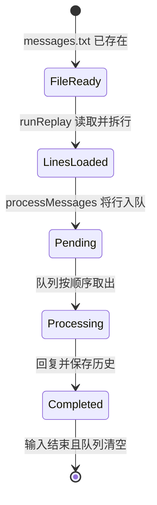
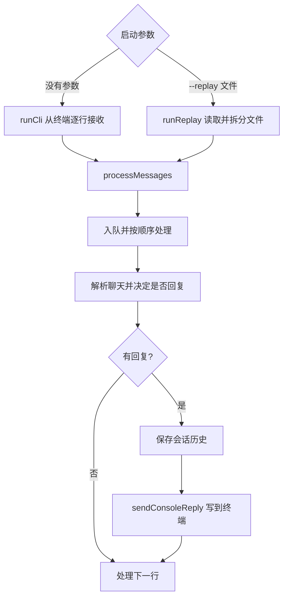

# 第 7 课：从文本文件重放消息

## 1. 前言

第 6 课已有队列，终端每收到一行就能先收下，随后按顺序处理。不过消息只能
来自标准输入。如果手上已经有一段逐行保存的聊天记录，想用当前助手重放它，
每次都要复制粘贴或自己写管道命令。现在出现第二种明确的输入来源：本地文本
文件。

本课支持 `--replay messages.txt`：程序读取文件中的每一行，仍按现有的
`[聊天 ID] @Andy 正文` 规则处理，并把回复打印到终端。实时终端入口继续可用。
**只有当第二种输入实际出现时**，我们才把“从哪里接收消息”与“如何处理消息、
如何送出回复”分开。现在依旧只有一种输出——本地终端；还不需要通用
ChannelAdapter 接口或平台 SDK。

## 2. 主要内容

### 2.1 本课做什么

1. 增加 `runReplay(filePath)`，把文本文件读成一行一条消息。
2. 保留 `runCli()` 作为实时输入入口；两者都调用共同的 `processMessages()`。
3. `processMessages()` 继续使用第 6 课的队列，以及第 5 课的聊天隔离、回复
   和持久化；没有第二份业务规则。
4. 用具体的 `sendConsoleReply()` 表明回复离开业务链、到达终端的位置。
5. 写一个真实启动 `--replay` 进程的测试，验证文件输入与旧处理链相通。

我们没有创建可插拔的输入/输出接口。两种入口都在一个小程序里，用两个普通
函数就能说清楚；需要真实平台或第二种输出时，再看是否值得抽象。

### 2.2 按函数阅读的三条链

实时输入链（上一课能力仍在）：

```text
用户在终端输入一行
→ runCli() 创建逐行读取接口
→ processMessages(终端逐行输入, historyFile, histories)
→ queue.enqueue(line) → processPending() 顺序处理
→ parseChatLine() → replyToText() → saveHistories()
→ sendConsoleReply(reply) 打印到终端
```

文件重放链（本课新增）：

```text
执行 node dist/src/main.js --replay messages.txt
→ runReplay(filePath) 读取文本文件
→ 把文本按换行切成字符串数组
→ processMessages(这些行, historyFile, histories)
→ 与实时链相同的 queue.enqueue()、处理、保存
→ sendConsoleReply(reply) 打印到终端
```

测试链：

```text
重放测试回调在临时目录写入 messages.txt
→ 启动一个带 --replay 参数的 CLI 子进程
→ 检查 stdout 只有 @Andy 消息对应的回复，且顺序正确
→ 检查 conversation.json 中保存了家人聊天的两条用户正文
```

### 2.3 比上一课增加了什么

上一课只有“终端输入 → 队列 → 业务 → 终端输出”一条链。本课新增一条
“文件输入”分支，两条分支在 `processMessages()` 合并，后半段完全共用。
`sendConsoleReply()` 则把末端投递动作明确标出来。这里的“来源”和“目的地”
已经不同于业务规则，但还没复杂到需要 Adapter 体系。

## 3. 技术要点

### 3.0 环境配置

本课不安装第三方库；读取文件使用已有的 Node `node:fs/promises`。先运行
`pnpm test`，它会编译并执行全部测试。VS Code 中若有测试绿色按钮，可以点
`replay.test.ts` 的“可以重放文本文件中的消息并输出回复”；按钮未显示时可
在 Testing 面板刷新，或直接用终端运行 `pnpm test`。手动体验文件重放需先
`pnpm build`，再执行 `node dist/src/main.js --replay 消息文件路径`。
仓库内的 `tutorial/示例/第07课消息.txt` 可直接用于手动体验；它使用独立的
`演示聊天` ID，但每次重放仍会追加到该聊天的历史。

### 3.1 坐标：输入来源与输出目的地

```text
实时终端 ── runCli() ──┐
                      ├─ processMessages() ─ 队列 ─ 回复/保存 ─ sendConsoleReply() ─ 终端
文本文件 ── runReplay() ┘
```

`runCli()` 和 `runReplay()` 只负责把各自的输入变成“逐行文字”；
`processMessages()` 负责共同的处理链，仍持有聊天历史与队列；
`sendConsoleReply()` 只把最终回复送到 `stdout`。`replyToText()` 不关心一行
来自键盘、管道还是文件，也不负责打印。文件重放与实时输入使用运行目录下同一个
`conversation.json`，所以重放会**真实改变当前会话历史**，不是只读预览。

### 3.2 代码：函数职责、输入输出和调用

- `runCli(): Promise<void>`：输入来自 `process.stdin`；先恢复历史，再创建
  `readline` 接口，调用 `processMessages()`；结束时关闭接口。它不返回回复。
- `runReplay(filePath: string): Promise<void>`：输入是现成文本文件的路径；
  用 `readFile()` 得到文字，按换行拆为字符串数组，恢复历史后调用
  `processMessages()`。它也不返回回复。
- `processMessages(lines, historyFile, histories): Promise<void>`：输入是逐行
  消息、历史文件路径、各聊天的内存 `Map`；创建队列，逐行入队；队列处理时
  解析聊天、调用 `replyToText()`、保存历史，再调用 `sendConsoleReply()`。
  输入结束后等待队列清空。
- `sendConsoleReply(reply: string): void`：输入最终回复文本，写到标准输出；
  不决定是否应该回复，也不保存对话。
- `parseChatLine()`、`replyToText()`、`loadHistories()`、`saveHistories()`、
  `createMessageQueue()`：保持前几课的职责；本课只是让第二种来源使用它们。
- `replay.test.ts` 的测试回调：建立实际文本文件与 CLI 子进程，检查从文件
  输入到回复、历史文件的完整链条。

为什么要抽出 `processMessages()`？如果给文件入口复制一份队列、触发和保存
代码，两边以后容易产生不同规则。现在确实有两种来源，所以把相同的后半段
聚在一个函数里，是当前需求驱动的最小重组，而不是预先设计插件框架。

### 3.3 数据：两种输入如何变成同一行消息

文件 `messages.txt` 的内容：

```text
[家人] @Andy 我叫小李
[工作] 大家好
[家人] @Andy 我刚才说了什么？
```

`runReplay()` 读到的是一个长字符串；按换行切开后得到三段字符串。它们与
`runCli()` 从终端逐行取得的字符串形状相同，因而能进入相同队列。第二行
虽来自工作聊天，但没有 `@Andy`，仍被 `replyToText()` 忽略。

最终终端输出：

```text
NanoClaw: 我叫小李
NanoClaw: 你刚才说：我叫小李
```

`conversation.json` 中家人的历史则是 `"我叫小李"` 和
`"我刚才说了什么？"` 两条**用户正文**，不是终端输出的两条助手回复。
输入文本文件与会话 JSON 是两种文件：前者是本次要处理的原始消息，后者是
处理后持续保存的聊天记忆。

### 3.4 状态：重放时哪些数据会改变



- 输入文件由用户准备，本课程序只读取它，不修改它。
- `runReplay()` 创建本次运行的行数组；`processMessages()` 创建队列。
- `replyToText()` 修改被选中聊天的历史数组；`saveHistories()` 更新
  `conversation.json`。同一文件下次再重放，消息会再进入历史；本课没有去重。
- 队列状态仍只在内存，进程结束即消失；会话 JSON 继续留在磁盘。

### 3.5 流程图：第二种入口与共同出口



### 3.6 细节技术点

#### `process.argv`：命令行参数是什么

Node 启动命令 `node dist/src/main.js --replay messages.txt` 时，`process.argv`
是字符串数组：前两项通常是 Node 可执行文件路径、脚本路径；第三项是
`--replay`，第四项是 `messages.txt`。代码检查长度和第三项，只接受“无参数
实时输入”或“`--replay` 加一个文件路径”。路径被交给 `runReplay()`，不是
交给 `replyToText()`；业务函数不需要知道命令行参数。

#### `readFile()` 与相对路径

`readFile(filePath, 'utf8')` 异步读取整个小文本文件，返回一个字符串。这里的
相对路径以**运行命令时的工作目录**为起点，不以 `src/main.ts` 为起点。若文件
不存在，读取会报错；本课不把不存在的重放文件当成空输入，因为用户明确指定
了这个文件。为了让课程平缓，本课一次读完整个文件；超大文件的流式读取留到
确实出现大文件需求时再讨论。

#### `split(/\r?\n/)`：按不同系统的换行拆行

`split()` 把长字符串切成数组。`/\r?\n/` 是一个小正则表达式：`\n` 表示换行，
`\r?` 表示它前面可以有一个回车。因此普通 Unix 换行和 Windows 的回车换行
都能被识别。文件末尾如果有换行，会多出一个空字符串；它进入队列后不会以
`@Andy` 开头，因此被现有规则忽略。本课不新增过滤器。

#### `Iterable`、`AsyncIterable` 与同一个 `for await`

文件拆出的数组是**同步可迭代**的：三行已经全部在内存里。终端接口是**异步
可迭代**的：新行可能稍后才到。`processMessages()` 的参数允许这两种来源，
`for await (const line of lines)` 对两者都能逐行取值。它只是统一读取方式，
不代表文件读取突然变成了实时流，也不代表消息并行处理。

#### 为什么先加载历史，再创建终端接口

本课重组时曾在 `await loadHistories()` **之前**创建 `readline` 接口。快速
结束的管道输入可能在程序开始遍历终端接口前就关闭，旧的跨进程测试因此出现
未完成的顶层 `await`。现在 `runCli()` 先等历史恢复完成，再创建接口并立即
交给 `processMessages()` 读取。这个问题说明异步程序中“何时开始监听输入”
也是行为的一部分，不能只看代码里有哪些函数。

#### 为什么还没有 Adapter 接口

现在只是两种本地**输入**、同一种终端**输出**。两个普通入口函数加一条
共同处理链已经足够。真实平台会带来认证、平台消息 ID、发送 API 等新的
要求；在它出现前，写 `ChannelAdapter` 接口只会让当前流程多绕一层。

## 4. 测试与验收

### 4.1 文件重放 Happy Path

**测什么、为什么测**：文件输入能否进入原有处理链，而非另写一套假回复。

**输入**：临时 `messages.txt` 包含家人的两条 `@Andy` 消息，中间夹一条工作
聊天普通消息；启动时传 `--replay messages.txt`。

**预期**：终端只得到家人的两条回复，顺序正确；`conversation.json` 只增加
家人的两条用户正文，普通消息不会创建工作聊天历史。

**证明**：新来源复用了触发判断、队列、按聊天记忆及文件保存，而输出仍走
唯一的终端出口。

### 4.2 实时入口回归

原有的持久化测试仍通过 `node dist/src/main.js`（无参数）启动实时入口。
它们证明文件入口出现后，旧的管道输入、聊天隔离和重启恢复未被破坏。

### 4.3 本课验收

- `pnpm test` 应有 9 个测试通过；
- 学生能说清输入文件、内存中的行数组、队列对象、聊天历史、会话 JSON 和
  终端回复分别是什么，哪些被修改；
- 学生能解释两条输入分支在 `processMessages()` 合并、为什么还不需要
  Adapter 接口；
- 学生亲自运行测试并反馈问题后，再完成本课并手动提交。

## 5. 总结

本课为系统增加了第二种实际输入：已有聊天文本文件。终端输入与文件输入
分成两条短链，在 `processMessages()` 汇合，继续使用完全相同的队列、回复
和持久化逻辑；`sendConsoleReply()` 标出了唯一输出目的地。

旧代码的问题不是回复规则错了，而是输入来源与后半段处理写在同一个函数里，
再加来源就容易复制业务链。现在有了最小分离，但只有本地终端输出。真实平台
接入后，输出地址和协议也会变化；那时再判断是否需要更明确的渠道抽象。
