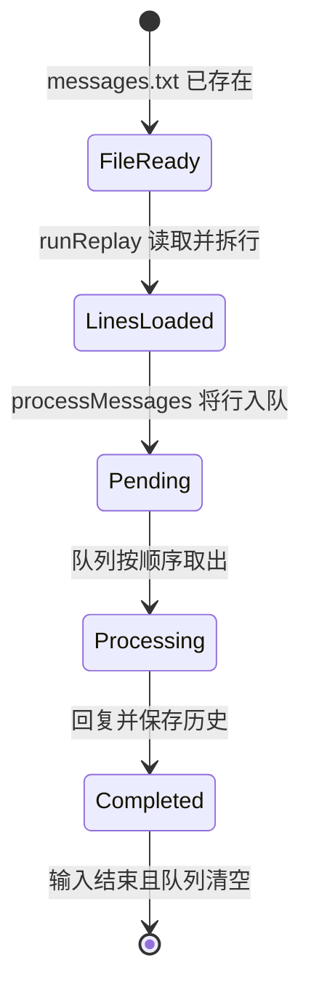
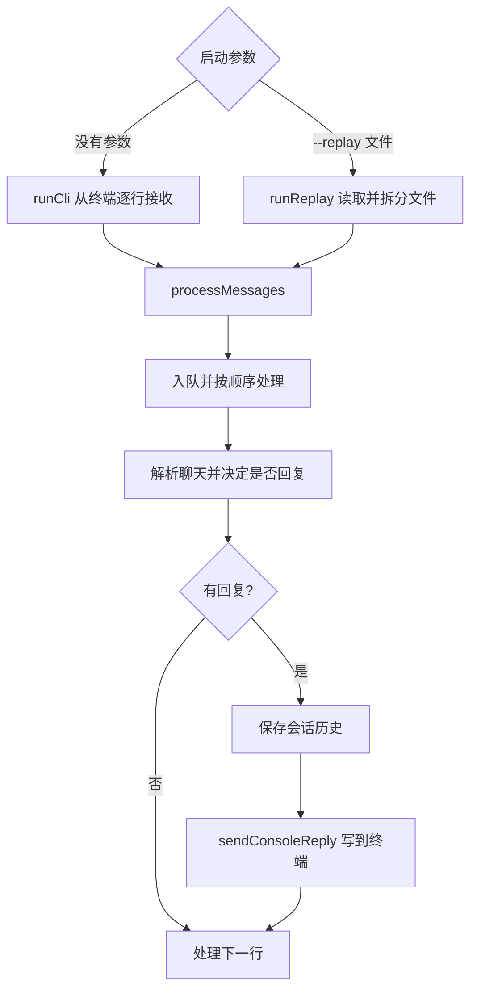

# 第 7 课：从文本文件重放消息

## 1. 前言

第 6 课引入队列之后，系统已经能做到：终端每收到一行消息，先把它收下，随后
按顺序处理。不过，消息的来源仍然只有标准输入这一种。如果手上已经有一段逐
行保存的聊天记录，想让当前助手把它重放一遍，你就只能每次都复制粘贴，或者
自己拼一条管道命令——两种办法都很麻烦。于是，现在出现了第二种明确的输入
来源：本地文本文件。

本课为程序增加 `--replay messages.txt` 命令：程序读取文件中的每一行，仍然
按现有的 `[聊天 ID] @Andy 正文` 规则处理，并把回复打印到终端。原来的实时
终端入口继续可用。这里有一个值得注意的设计原则：**只有当第二种输入实际出
现时**，我们才把"从哪里接收消息"与"如何处理消息、如何送出回复"分开。至
于输出，现在依旧只有一种——本地终端，所以还不需要通用的 ChannelAdapter
接口或平台 SDK。

## 2. 主要内容

### 2.1 本课做什么

1. 新增 `runReplay(filePath)` 函数，把文本文件读成一行一条消息。
2. 保留 `runCli()` 作为实时输入入口；两条入口最终都调用共同的
   `processMessages()`。
3. `processMessages()` 继续使用第 6 课的队列，以及第 5 课的聊天隔离、回复
   和持久化——也就是说，业务规则仍然只有一份，不会出现第二份。
4. 用具体的 `sendConsoleReply()` 函数，标明回复离开业务链、到达终端的
   位置。
5. 写一个真实启动 `--replay` 进程的测试，验证文件输入确实能与旧的处理链接
   通。

需要说明的是，我们没有创建可插拔的输入/输出接口。两种入口都写在同一个
小程序里，用两个普通函数就能说清楚；等将来真的要接入平台，或者出现第二种
输出时，再回头判断是否值得做抽象。

### 2.2 按函数阅读的三条链

实时输入链（上一课的能力原样保留）：

```text
用户在终端输入一行
→ runCli() 创建逐行读取接口
→ processMessages(终端逐行输入, historyFile, histories)
→ queue.enqueue(line) → processPending() 顺序处理
→ parseChatLine() → replyToText() → saveHistories()
→ sendConsoleReply(reply) 打印到终端
```

文件重放链（本课新增）：

```text
执行 node dist/src/main.js --replay messages.txt
→ runReplay(filePath) 读取文本文件
→ 把文本按换行切成字符串数组
→ processMessages(这些行, historyFile, histories)
→ 与实时链相同的 queue.enqueue()、处理、保存
→ sendConsoleReply(reply) 打印到终端
```

测试链：

```text
重放测试回调在临时目录写入 messages.txt
→ 启动一个带 --replay 参数的 CLI 子进程
→ 检查 stdout 只有 @Andy 消息对应的回复，且顺序正确
→ 检查 conversation.json 中保存了家人聊天的两条用户正文
```

### 2.3 比上一课增加了什么

上一课的流程只有一条链："终端输入 → 队列 → 业务 → 终端输出"。本课在这
条链之外新增一条"文件输入"分支，两条分支在 `processMessages()` 处汇合，
汇合之后的后半段完全共用。另外，`sendConsoleReply()` 把末端投递这个动作
明确地标了出来。到这里，"来源"和"目的地"已经与业务规则区分开了，但复杂
度还没有高到需要一套 Adapter 体系。

## 3. 技术要点

### 3.0 环境配置

本课不安装任何第三方库，读取文件使用 Node 已有的 `node:fs/promises` 模
块。先运行 `pnpm test`，它会先编译再执行全部测试。如果你在 VS Code 里看
到测试的绿色运行按钮，可以直接点击 `replay.test.ts` 中"可以重放文本文件
中的消息并输出回复"这一项；按钮没有显示时，可以在 Testing 面板刷新，或
者直接在终端运行 `pnpm test`。想手动体验文件重放，需要先 `pnpm build` 编
译，再执行 `node dist/src/main.js --replay 消息文件路径`。仓库里的
`tutorial/示例/第07课消息.txt` 可以直接拿来手动体验；它使用独立的
`演示聊天` ID，但要注意，每次重放仍会把消息追加到该聊天的历史里。

### 3.1 坐标：输入来源与输出目的地

```text
实时终端 ── runCli() ──┐
                      ├─ processMessages() ─ 队列 ─ 回复/保存 ─ sendConsoleReply() ─ 终端
文本文件 ── runReplay() ┘
```

这张图的意思是：`runCli()` 和 `runReplay()` 只负责把各自的输入变成"逐行
文字"；`processMessages()` 负责共同的处理链，仍然持有聊天历史与队列；
`sendConsoleReply()` 只把最终回复送到 `stdout`。与此同时，`replyToText()`
并不关心一行文字来自键盘、管道还是文件，它也不负责打印。还有一点要特别留
意：文件重放与实时输入使用的是运行目录下同一个 `conversation.json`，所以
重放会**真实改变当前会话历史**，不是一次只读的预览。

### 3.2 代码：函数职责、输入输出和调用

- `runCli(): Promise<void>`：输入来自 `process.stdin`；它先恢复历史，再创
  建 `readline` 接口，然后调用 `processMessages()`；结束时关闭接口。它不
  返回回复。
- `runReplay(filePath: string): Promise<void>`：输入是现成文本文件的路径；
  它用 `readFile()` 读出文字，按换行拆成字符串数组，恢复历史后调用
  `processMessages()`。它同样不返回回复。
- `processMessages(lines, historyFile, histories): Promise<void>`：输入是
  逐行消息、历史文件路径和各聊天的内存 `Map`；它创建队列，把行逐条入队；
  队列处理时解析聊天、调用 `replyToText()`、保存历史，再调用
  `sendConsoleReply()`。输入结束后，它会等队列清空。
- `sendConsoleReply(reply: string): void`：输入最终回复文本，写到标准输
  出；它不决定是否应该回复，也不保存对话。
- `parseChatLine()`、`replyToText()`、`loadHistories()`、`saveHistories()`、
  `createMessageQueue()`：职责与前几课完全相同；本课只是让第二种来源也开
  始使用它们。
- `replay.test.ts` 的测试回调：建立实际文本文件与 CLI 子进程，检查从文件
  输入到回复、历史文件的完整链条。

为什么要抽出 `processMessages()`？因为如果给文件入口复制一份队列、触发和
保存的代码，两边今后很容易各自演化出不同的规则。现在确实出现了两种来源，
所以把相同的后半段聚到一个函数里，是当前需求驱动的最小重组，而不是预先设
计一套插件框架。

### 3.3 数据：两种输入如何变成同一行消息

文件 `messages.txt` 的内容：

```text
[家人] @Andy 我叫小李
[工作] 大家好
[家人] @Andy 我刚才说了什么？
```

`runReplay()` 一开始读到的是一个长字符串；按换行切开后，得到三段字符串。
它们与 `runCli()` 从终端逐行取得的字符串形状完全相同，因此能进入同一个队
列。其中第二行虽然来自工作聊天，但没有 `@Andy`，所以仍会被 `replyToText()`
忽略。

最终终端输出：

```text
NanoClaw: 我叫小李
NanoClaw: 你刚才说：我叫小李
```

`conversation.json` 中家人的历史保存的则是 `"我叫小李"` 和
`"我刚才说了什么？"` 两条**用户正文**，而不是终端输出的那两条助手回复。
请把这两种文件区分开：输入文本文件是本次要处理的原始消息；会话 JSON 是
处理后持续保存的聊天记忆。

### 3.4 状态：重放时哪些数据会改变



对照这张状态图，重放过程中各项数据的变化是这样的：

- 输入文件由用户准备，本课程序只读取它，不修改它。
- `runReplay()` 创建本次运行的行数组；`processMessages()` 创建队列。
- `replyToText()` 修改被选中聊天的历史数组；`saveHistories()` 把它更新到
  `conversation.json`。同一个文件下次再重放，消息会再次进入历史；本课没
  有做去重。
- 队列状态仍只存在于内存，进程结束即消失；会话 JSON 则继续留在磁盘上。

### 3.5 流程图：第二种入口与共同出口



### 3.6 细节技术点

#### `process.argv`：命令行参数是什么

当 Node 启动命令 `node dist/src/main.js --replay messages.txt` 时，
`process.argv` 是一个字符串数组：前两项通常是 Node 可执行文件路径和脚本
路径；第三项是 `--replay`，第四项是 `messages.txt`。代码检查数组的长度和
第三项，只接受两种形式："无参数实时输入"，或者"`--replay` 加一个文件路
径"。文件路径会被交给 `runReplay()`，而不是交给 `replyToText()`——业务
函数不需要知道命令行参数的存在。

#### `readFile()` 与相对路径

`readFile(filePath, 'utf8')` 异步读取整个小文本文件，返回一个字符串。要
注意，这里的相对路径以**运行命令时的工作目录**为起点，而不是以
`src/main.ts` 为起点。如果文件不存在，读取会直接报错；本课不会把不存在的
重放文件当成空输入来处理，因为用户是明确指定了这个文件的。为了让课程节奏
平缓，本课一次性读完整个文件；超大文件的流式读取，留到确实出现大文件需求
时再讨论。

#### `split(/\r?\n/)`：按不同系统的换行拆行

`split()` 的作用是把长字符串切成数组。`/\r?\n/` 是一个小正则表达式：
`\n` 表示换行，`\r?` 表示它前面可以有一个回车，也可以没有。因此，普通
Unix 的换行和 Windows 的回车换行都能被正确识别。如果文件末尾有换行，拆完
会多出一个空字符串；这个空字符串进入队列后不会以 `@Andy` 开头，所以会被
现有规则忽略。本课不为此新增过滤器。

#### `Iterable`、`AsyncIterable` 与同一个 `for await`

文件拆出来的数组是**同步可迭代**的：三行已经全部在内存里，随时可以取。终
端接口则是**异步可迭代**的：新的行可能要稍后才会到达。
`processMessages()` 的参数允许这两种来源，`for await (const line of lines)`
对两者都能逐行取值。它统一只是读取方式，并不意味着文件读取突然变成了实时
流，也不意味着消息被并行处理。

#### 为什么先加载历史，再创建终端接口

本课重组代码时，曾经把 `readline` 接口创建在 `await loadHistories()` **之
前**。这样一来，结束得很快的管道输入，可能在程序开始遍历终端接口之前就已
经关闭，旧的跨进程测试因此出现未完成的顶层 `await`。现在的顺序是：
`runCli()` 先等历史恢复完成，再创建接口并立即交给 `processMessages()` 读
取。这个小问题说明，异步程序中"何时开始监听输入"也是行为的一部分，不能
只看代码里有哪些函数。

#### 为什么还没有 Adapter 接口

现在只有两种本地**输入**和同一种终端**输出**，两个普通入口函数加一条共同
处理链已经足够。真实平台会带来认证、平台消息 ID、发送 API 等新的要求；在
它出现之前，写一个 `ChannelAdapter` 接口只会让当前流程多绕一层。

## 4. 测试与验收

### 4.1 文件重放 Happy Path

**测什么、为什么测**：验证文件输入能否进入原有的处理链，而不是另写一套假
回复。

**输入**：临时 `messages.txt` 包含家人的两条 `@Andy` 消息，中间夹一条工
作聊天的普通消息；启动时传 `--replay messages.txt`。

**预期**：终端只得到家人的两条回复，顺序正确；`conversation.json` 只增加
家人的两条用户正文；那条普通消息不会创建工作聊天的历史。

**证明**：新的输入来源复用了触发判断、队列、按聊天记忆和文件保存，而输出
仍走唯一的终端出口。

### 4.2 实时入口回归

原有的持久化测试仍然通过 `node dist/src/main.js`（无参数）启动实时入口。
它们证明的是：文件入口出现之后，旧的管道输入、聊天隔离和重启恢复都没有被
破坏。

### 4.3 本课验收

- `pnpm test` 应有 9 个测试通过；
- 学生能说清输入文件、内存中的行数组、队列对象、聊天历史、会话 JSON 和终
  端回复分别是什么，其中哪些会被修改；
- 学生能解释两条输入分支在 `processMessages()` 合并，以及为什么还不需要
  Adapter 接口；
- 学生亲自运行测试并反馈问题之后，再完成本课并手动提交。

## 5. 总结

本课为系统增加了第二种实际输入来源：已有的聊天文本文件。终端输入与文件输
入分成两条短链，在 `processMessages()` 处汇合，之后继续使用完全相同的队
列、回复和持久化逻辑；`sendConsoleReply()` 则标出了唯一的输出目的地。

回过头看，旧代码的问题不是回复规则错了，而是输入来源与后半段处理写在同一
个函数里——再多加一种来源，就要复制一遍业务链。现在有了这个最小分离，但
输出仍然只有本地终端。等真实平台接入后，输出地址和协议也会跟着变化；那时
再判断是否需要更明确的渠道抽象。
