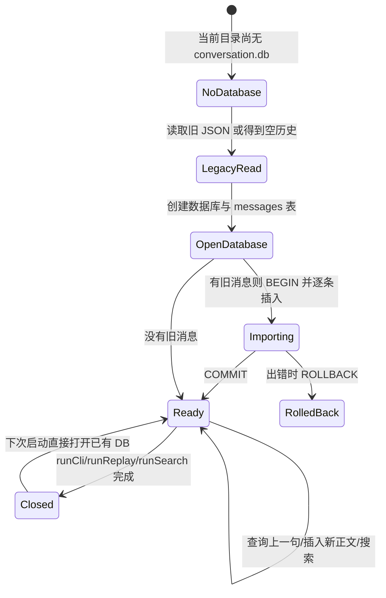
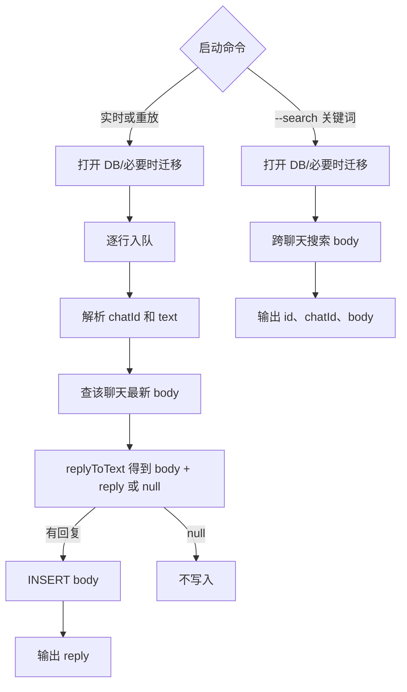

# 第 8 课：用 SQLite 查询聊天消息

## 1. 前言

第 7 课已经能从终端或文件收到消息，并把不同聊天的用户正文保存到
`conversation.json`。如果只问“某个聊天的上一句是什么”，JSON 数组还能胜任。
现在出现两个更具体的需求：想从**所有聊天**中找出含“项目”的用户消息；找到
以后，还想用一个稳定编号指出“就是这条消息”。现有 JSON 只有聊天名和数组
位置，跨聊天查询要加载整份文件、遍历每组数组，数组位置也不是稳定消息 ID。

本课用 SQLite 保存当前真正拥有的数据：聊天 ID 与被 `@Andy` 触发的用户正文，
每条正文获得一个数字 ID。新命令 `--search 关键词` 跨聊天查找并显示 ID。
为了不丢掉前几课的实际聊天记录，首次创建数据库时会把旧 JSON 导入，旧文件
保持原样。现在没有独立的用户身份、会话生命周期或助手消息，因此**只建一张
消息表**，不照搬原项目的全套表。

## 2. 主要内容

### 2.1 本课做什么

1. 新增本地 `conversation.db`，建立最小的 `messages` 表：`id`、`chat_id`、
   `body`。
2. 回复前从表里只查询该聊天最新的一条正文；有回复时插入一行用户正文。
3. `replyToText()` 不再修改数组，而是接收“上一句”，返回“要保存的正文 + 要
   输出的回复”；数据库读写留在处理链之外。
4. 新增 `--search 关键词`，跨聊天查询并打印 `ID [聊天 ID] 用户正文`。
5. 第一次建库时导入旧 JSON（单数组或按聊天分组的对象）；再次启动不重复导入。
6. 保留实时输入、文件重放、队列、聊天隔离和已有回复规则。

这里先用 Node 自带的同步 SQLite API，不安装第三方数据库包。它让第一堂 SQL
课聚焦数据表、查询和迁移；同步调用会阻塞事件循环，这个取舍在技术要点中
明确说明。

### 2.2 按函数阅读的三条链

消息处理链：

```text
runCli() 或 runReplay() 收到一行
→ openCurrentDatabase() 找到当前目录的 conversation.db 和旧 JSON
→ openConversationDatabase() 打开数据库，必要时导入旧历史
→ processMessages() 把原始行交给队列
→ parseChatLine() 得到 chatId 和原始消息 text
→ lastUserMessage(database, chatId) 查同一聊天上一条用户正文
→ replyToText(text, previousMessage) 得到 { body, reply } 或 null
→ 若有回复，appendUserMessage(database, chatId, body) 插入一行
→ sendConsoleReply(reply) 输出助手回复
```

搜索链：

```text
执行 node dist/src/main.js --search 项目
→ runSearch(keyword) 打开当前数据库
→ searchMessages(database, keyword) 查询正文含“项目”的行
→ runSearch() 逐行打印 ID、聊天 ID、正文
```

旧数据迁移链：

```text
首次打开且 conversation.db 不存在
→ openConversationDatabase() 调用 loadHistories(conversation.json)
→ JSON 单数组归入 default；分组对象保留各聊天 ID
→ 创建 messages 表，BEGIN 开始事务
→ 按旧数组顺序逐条 INSERT，COMMIT 提交
→ 以后数据库已存在，不重复导入；旧 JSON 留在磁盘不修改
```

测试链：

```text
测试回调在独立临时目录启动 CLI 写两条不同聊天的消息
→ 再启动 --search 项目
→ 检查返回的两行分别有稳定 ID、正确聊天 ID 与正文
→ 旧持久化测试检查跨进程回顾、普通消息忽略、两种 JSON 迁移
```

### 2.3 比上一课改变了什么

终端/文件两种输入和队列仍然存在。本课把原来的“读完整 JSON 数组 → 在内存
里追加 → 写回整个 JSON”环节替换为“SQL 查上一行 → 插入新行”；另增加一条
**搜索分支**。由于数据库更适合保存单条消息，业务函数从“修改数组”调整为
“返回要保存的正文”，它不需要了解 SQL。

## 3. 技术要点

### 3.0 环境配置与引入理由

当前环境是 Node 22.23.2；本课使用 Node 内置的 `node:sqlite`，要求 Node
22.13.0 或更新版本，因此 `package.json` 的引擎要求已同步更新。不需要
`pnpm add`。Node 官方仍把这个模块标为**实验性/持续开发**，运行时可能出现
`ExperimentalWarning`；这不是测试失败。API 选择与版本要求可见
[Node 22 官方 SQLite 文档](https://nodejs.org/download/release/v22.23.0/docs/api/sqlite.html)。

引入前：JSON 对象按聊天保存数组，查单个聊天的上一句简单，但跨聊天搜索和
稳定消息编号要靠自己遍历与设计。引入后：SQLite 文件处在**本地持久化层**，
每条用户正文成为可查询的一行，自动获得主键 ID；当前只学建表、插入、取上一
条、关键词查询和一次性迁移，不学习完整关系模型。`pnpm test` 会先编译，再
在临时目录运行数据库测试。VS Code 若显示测试绿色按钮，可点 `search.test.ts`
的搜索测试；否则在 Testing 面板刷新或运行 `pnpm test`。

### 3.1 坐标：数据库替换了哪一层

```text
输入层：runCli / runReplay
      ↓
处理层：队列 → parseChatLine → replyToText → sendConsoleReply
                         ↕
持久化层：store.ts → conversation.db 的 messages 表
              ↑ 首次建库时从 history.ts 读取旧 conversation.json
```

`conversation.json` 从“正在写的主存储”变为“首次迁移时读取的旧资料”。
`conversation.db` 是新的主存储，也被 Git 忽略。数据库保存用户正文，不保存
助手回复；队列仍只在当前进程的内存里。`history.ts` 暂时只负责认识旧 JSON，
不是新的数据库 Repository 接口。

### 3.2 代码：函数职责和调用关系

- `openConversationDatabase(databasePath, legacyJsonPath)`：输入两个真实文件路径，
  返回打开的 `DatabaseSync`。它建表；只有数据库文件尚不存在时才读取旧 JSON、
  在事务里逐条导入。异常时关闭数据库，不把错误当成空历史。
- `lastUserMessage(database, chatId)`：输入数据库连接与聊天 ID，返回该聊天 ID
  最大的一行 `body`，没有则返回 `undefined`。它只查一条，不加载整个历史。
- `appendUserMessage(database, chatId, body)`：插入一条真正发给助手的用户正文。
  表中的 `id` 由 SQLite 分配，函数不输出助手回复。
- `searchMessages(database, keyword)`：跨所有聊天查包含关键词的正文，返回
  `{ id, chatId, body }[]`；`runSearch()` 决定如何显示它们。
- `replyToText(text, previousMessage)`：只实现原有 `@Andy` 与回顾问题规则；
  返回 `{ body, reply }` 或 `null`，不读写数据库。
- `processMessages(lines, database)`：两种输入的共用链；每条消息先查上一句，
  调用 `replyToText()`，有结果就插入 `body`，再输出 `reply`。
- `runCli()`、`runReplay()`、`runSearch()`：分别处理实时输入、文件重放和查询
  命令，使用完毕后关闭数据库连接。
- `loadHistories()`：只在迁移时读取以前的 JSON 格式；不再写 JSON。

为什么不是用户表、聊天表和会话表？目前 `chatId` 是终端输入的字符串，项目
没有用户身份、聊天名称管理或会话重建需求。一张消息表就能满足现有读写与搜索；
以后出现真实关系，再由需求驱动加表。

### 3.3 数据：一条消息经历了四种形态

| 环节 | 示例 | 用途 |
|---|---|---|
| 原始输入行 | `[家人] @Andy 我叫小李` | 含聊天地址与触发词，进入队列 |
| 业务返回 `body` | `我叫小李` | 准备保存的用户正文 |
| SQLite 行 | `id=1, chat_id=家人, body=我叫小李` | 持久化与查询 |
| 业务返回 `reply` | `NanoClaw: 我叫小李` | 给用户看，不存进表 |

这四者相似却不是同一份数据。两条聊天消息入库后，例如：

| id | chat_id | body |
|---:|---|---|
| 1 | 家人 | 今天项目顺利 |
| 2 | 工作 | 项目进度正常 |

`--search 项目` 返回这两行。`id` 是消息身份，不是聊天 ID；`chat_id` 指出它
属于哪个聊天。旧 JSON 按各聊天数组顺序导入；导入后的 ID 是新分配的编号，
不能把旧数组下标误认为同一编号。

### 3.4 状态：数据库与迁移生命周期



- `openConversationDatabase()` 创建/打开数据库，控制首次迁移。
- `appendUserMessage()` 新增消息行；`lastUserMessage()`、`searchMessages()` 只读。
- SQLite 文件在进程结束后留在磁盘；Node 连接由入口函数在 `finally` 中关闭。
- 旧 JSON 在导入后仍保留，不会被删除或覆盖。数据库已存在时不再自动导入，
  以免一次旧消息变成两条新消息。

### 3.5 流程图：查询与回复共用数据库



### 3.6 细节技术点

#### `DatabaseSync`：本地文件里的小表

`new DatabaseSync(databasePath)` 打开或创建一个 SQLite 文件；`database.exec()`
执行建表或事务命令；`database.prepare()` 准备带参数的 SQL；用完调用
`database.close()`。这些都是同步操作，执行期间 Node 的事件循环不能接收下一
条输入。第 6 课队列只让**异步等待**与接收分开，不能把同步数据库调用自动
变成并行；当前 SQL 很小，教学阶段接受这个取舍。以后若测到实际阻塞，再改
运行方式，而不是现在预设线程池。

#### 表、行、列与 `INTEGER PRIMARY KEY`

`messages` 像一张表格；每条被触发的用户正文是一**行**，`id`、`chat_id`、
`body` 是三**列**。`id INTEGER PRIMARY KEY` 让 SQLite 给新增行分配数字
主键，这个编号不会因我们按聊天搜索或重启进程而改变。当前既没有用户行，
也没有助手回复行。

#### `?` 参数、`run()`、`get()`、`all()`

SQL 里的 `?` 是值的位置：`WHERE chat_id = ?` 的实际聊天 ID 通过
`.get(chatId)` 绑定；插入时 `.run(chatId, body)` 绑定两项。不要用字符串
拼接用户输入来造 SQL。`run()` 执行写操作；`get()` 取第一行或
`undefined`；`all()` 取所有匹配行。SQLite 内置的 `instr(body, ?)` 判断
正文是否包含传入关键词；当前仍会扫描相关行，没有神奇的全文搜索索引。

#### `ORDER BY id DESC LIMIT 1` 与 `ORDER BY id`

上一句只需要当前聊天中 ID 最大的那条，所以按 `id` 倒序、只取一行。
搜索结果按 `id` 从小到大展示，方便看到消息先后顺序。ID 是稳定行标识，
不是“第几个元素”的数组下标。

#### `BEGIN`、`COMMIT`、`ROLLBACK`：一次性导入

旧 JSON 可能有多个聊天、很多句。迁移开始执行 `BEGIN`，全部插入成功后
`COMMIT`；中途失败则 `ROLLBACK`，避免只导入一半消息。这叫**事务**：把一组
数据库操作视为一个整体。本课事务只用于旧历史的一次性导入，不提前设计
通用迁移框架。是否首次导入由数据库文件是否已存在决定；不要手动修改或删除
旧数据文件来“重试”。

#### 为什么 `replyToText()` 改成返回 `{ body, reply }`

前几课只有内存数组，函数直接 `history.push()` 很自然。现在数据库需要“插入
一行”，让业务函数直接执行 SQL 会混淆职责。所以它把两种结果交给调用者：
`body` 是应保存的**用户正文**，`reply` 是应输出的**助手回复**。普通聊天返回
`null`，两者都没有。`previousMessage?: string` 中的 `?` 表示参数可缺省；
新聊天没有上一句，传入 `undefined` 即可。这是由数据保存方式变化推动的小幅
函数签名调整，不是为了追求抽象形式。

#### 旧 JSON 与新 DB 的区别

旧 `conversation.json` 仍在原处，第一次建库时只读它，既不删除也不覆盖。
之后新消息只进入 `conversation.db`，所以旧 JSON 看起来不会再变化，这是
预期行为。两个文件都被 Git 忽略，因为它们可能包含私人聊天内容。若你已有
真实数据，请不要为了重测课程随手删除它们；自动迁移只做首次导入。

## 4. 测试与验收

### 4.1 跨聊天搜索与稳定 ID

**测什么、为什么测**：两条不同聊天的正文都含“项目”，查询应同时找到，并
显示各自 ID 和聊天归属；这正是 JSON 方案开始别扭的新需求。

**输入**：家人说“今天项目顺利”，工作说“项目进度正常”，随后执行
`--search 项目`。

**预期**：输出 `1 [家人] 今天项目顺利` 和 `2 [工作] 项目进度正常`。

**证明**：用户正文作为独立消息行保存，可跨聊天按条件查找并用 ID 指认。

### 4.2 回复、隔离与迁移回归

**测什么、为什么测**：换存储后不能破坏旧业务或丢旧资料。

**输入**：重启后回顾、两个聊天交错提问、普通消息，以及第 4 课单数组和
第 5～7 课分组对象两种 JSON 文件。

**预期**：回顾只读本聊天上一句；普通消息不入库；两种旧 JSON 都能导入；
再次打开数据库不重复导入，旧文件仍保留。

**证明**：新的存储边界与旧输入、回复链兼容，不只是在空数据库上测试成功。

### 4.3 本课验收

- `pnpm test` 应有 11 个测试通过；
- 学生能用表中一行解释 `id`、`chat_id`、`body` 各是什么，并区分 `body` 与
  `reply`；
- 学生能解释“查上一句 → 返回回复和正文 → 插入正文 → 输出回复”的顺序；
- 学生能说明旧 JSON 何时导入、为什么不会重复导入，以及同步 API 的限制；
- 学生亲自运行测试并反馈后，再完成本课并手动提交。

## 5. 总结

这一课没有增加模型能力，而是把用户正文从 JSON 数组搬到可查询、带稳定 ID
的 SQLite 行。数据量与查询需求让旧方案的手动遍历、无编号问题暴露出来；
一张最小消息表解决当前问题，同时保持终端/文件两种入口和多聊天回顾。

当前数据库仍只有一张表、一个同步连接，搜索也只是普通子串扫描。未来若需要
独立用户、会话生命周期、多个进程同时写入或更快搜索，再让具体问题推动新表、
索引、事务边界或更合适的运行机制；现在不提前复制原项目的中心库架构。
