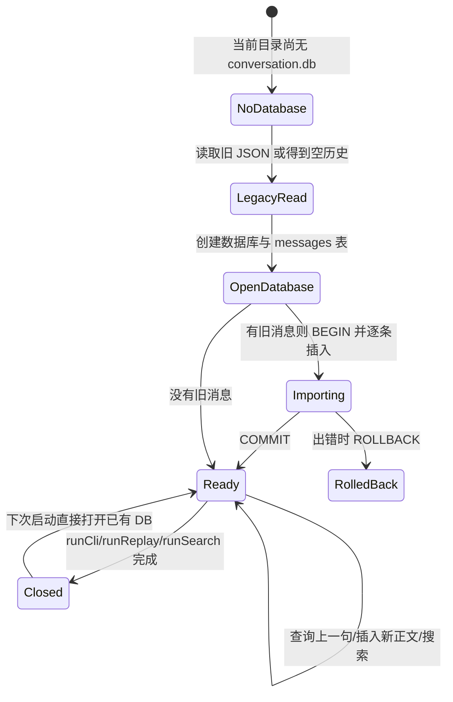
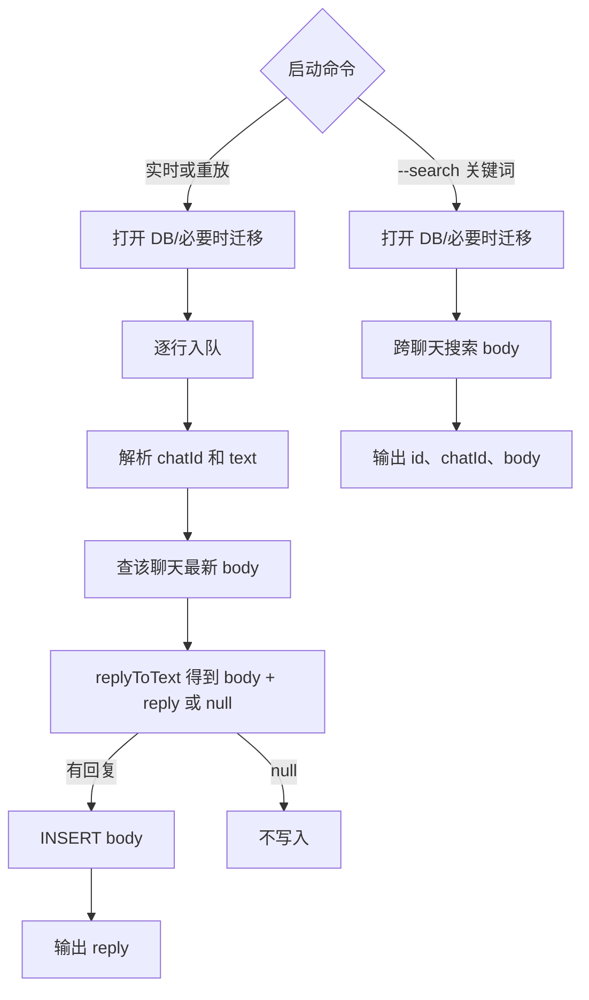

# 第 8 课：用 SQLite 查询聊天消息

## 1. 前言

第 7 课的系统能够从终端或文件接收消息，并把不同聊天的用户正文保存到
`conversation.json` 里。如果只是问"某个聊天的上一句是什么"，JSON 数组还
能胜任。但现在出现了两个更具体的需求：一是想从**所有聊天**中找出包含
"项目"二字的用户消息；二是找到之后，还想用一个稳定编号明确指出"就是这
一条消息"。现有的 JSON 只保存聊天名和数组位置：要做跨聊天查询，就得加载
整份文件、逐组遍历数组；而数组位置也并不是稳定的消息 ID。

本课改用 SQLite 来保存系统当前真正拥有的数据：聊天 ID，以及被 `@Andy`
触发的用户正文；每条正文都会获得一个数字 ID。同时新增命令
`--search 关键词`，用于跨聊天查找并显示 ID。为了不丢掉前几课积累的实际聊
天记录，第一次创建数据库时会把旧 JSON 导入，旧文件本身保持原样。要注意的
边界是：现在还没有独立的用户身份、会话生命周期或助手消息，因此**只建一张
消息表**，不照搬原项目的全套表结构。

## 2. 主要内容

### 2.1 本课做什么

1. 新增本地 `conversation.db`，建立最小的 `messages` 表，包含三列：`id`、
   `chat_id`、`body`。
2. 回复之前，从表里只查询该聊天最新的一条正文；有回复时，插入一行用户
   正文。
3. `replyToText()` 不再直接修改数组，而是改为接收"上一句"，返回"要保存
   的正文 + 要输出的回复"；数据库读写留在处理链之外。
4. 新增 `--search 关键词` 命令，跨聊天查询并按 `ID [聊天 ID] 用户正文`
   的格式打印结果。
5. 第一次建库时导入旧 JSON（无论是单数组还是按聊天分组的对象都可以）；
   之后的启动不会重复导入。
6. 保留实时输入、文件重放、队列、聊天隔离和已有的回复规则。

这里先用 Node 自带的同步 SQLite API，不安装第三方数据库包。这样做的目的
是让第一堂 SQL 课聚焦在数据表、查询和迁移上；至于同步调用会阻塞事件循环
这个代价，会在技术要点里明确说明。

### 2.2 按函数阅读的三条链

消息处理链：

```text
runCli() 或 runReplay() 收到一行
→ openCurrentDatabase() 找到当前目录的 conversation.db 和旧 JSON
→ openConversationDatabase() 打开数据库，必要时导入旧历史
→ processMessages() 把原始行交给队列
→ parseChatLine() 得到 chatId 和原始消息 text
→ lastUserMessage(database, chatId) 查同一聊天上一条用户正文
→ replyToText(text, previousMessage) 得到 { body, reply } 或 null
→ 若有回复，appendUserMessage(database, chatId, body) 插入一行
→ sendConsoleReply(reply) 输出助手回复
```

搜索链：

```text
执行 node dist/src/main.js --search 项目
→ runSearch(keyword) 打开当前数据库
→ searchMessages(database, keyword) 查询正文含“项目”的行
→ runSearch() 逐行打印 ID、聊天 ID、正文
```

旧数据迁移链：

```text
首次打开且 conversation.db 不存在
→ openConversationDatabase() 调用 loadHistories(conversation.json)
→ JSON 单数组归入 default；分组对象保留各聊天 ID
→ 创建 messages 表，BEGIN 开始事务
→ 按旧数组顺序逐条 INSERT，COMMIT 提交
→ 以后数据库已存在，不重复导入；旧 JSON 留在磁盘不修改
```

测试链：

```text
测试回调在独立临时目录启动 CLI 写两条不同聊天的消息
→ 再启动 --search 项目
→ 检查返回的两行分别有稳定 ID、正确聊天 ID 与正文
→ 旧持久化测试检查跨进程回顾、普通消息忽略、两种 JSON 迁移
```

### 2.3 比上一课改变了什么

终端、文件两种输入和队列都仍然存在。本课改变的是保存的环节：把原来的
"读完整 JSON 数组 → 在内存里追加 → 写回整个 JSON"，替换为"用 SQL 查上
一行 → 插入新行"；此外还增加了一条**搜索分支**。因为数据库天然适合保存
单条消息，业务函数也从"修改数组"调整为"返回要保存的正文"——它只管提
供数据，不需要了解 SQL。

## 3. 技术要点

### 3.0 环境配置与引入理由

当前环境是 Node 22.23.2；本课使用 Node 内置的 `node:sqlite` 模块，它要求
Node 22.13.0 或更新版本，因此 `package.json` 的引擎要求已同步更新。不
需要执行 `pnpm add`。要注意，Node 官方目前仍把这个模块标为**实验性/持续
开发**，运行时可能出现 `ExperimentalWarning` 警告；这不是测试失败。API
的选择与版本要求可以查阅
[Node 22 官方 SQLite 文档](https://nodejs.org/download/release/v22.23.0/docs/api/sqlite.html)。

对比一下引入前后的差别。引入前：JSON 对象按聊天保存数组，查单个聊天的上
一句很简单，但跨聊天搜索和稳定消息编号都要自己动手遍历和设计。引入后：
SQLite 文件处在**本地持久化层**，每条用户正文成为可查询的一行，并自动获
得主键 ID。当前这一课只学习建表、插入、取上一条、关键词查询和一次性迁
移，不学习完整的关系模型。运行 `pnpm test` 会先编译，再在临时目录运行数
据库测试。VS Code 若显示测试绿色按钮，可点击 `search.test.ts` 的搜索测
试；否则在 Testing 面板刷新，或直接运行 `pnpm test`。

### 3.1 坐标：数据库替换了哪一层

```text
输入层：runCli / runReplay
      ↓
处理层：队列 → parseChatLine → replyToText → sendConsoleReply
                         ↕
持久化层：store.ts → conversation.db 的 messages 表
              ↑ 首次建库时从 history.ts 读取旧 conversation.json
```

对照这张图理解各层的变化：`conversation.json` 从"正在写的主存储"退居为
"首次迁移时读取的旧资料"；`conversation.db` 成为新的主存储，它同样被
Git 忽略。数据库保存的是用户正文，不保存助手回复；队列仍然只在当前进程
的内存里。`history.ts` 暂时只负责认识旧 JSON 格式，它还不是新的数据库
Repository 接口。

### 3.2 代码：函数职责和调用关系

- `openConversationDatabase(databasePath, legacyJsonPath)`：输入两个真实
  文件路径，返回打开的 `DatabaseSync`。它负责建表；只有数据库文件尚不存
  在时，才读取旧 JSON 并在事务里逐条导入。发生异常时会关闭数据库，不会
  把错误当成空历史。
- `lastUserMessage(database, chatId)`：输入数据库连接与聊天 ID，返回该聊
  天 ID 最大的一行 `body`，没有就返回 `undefined`。它只查一条，不加载整
  个历史。
- `appendUserMessage(database, chatId, body)`：插入一条真正发给助手的用户
  正文。表中的 `id` 由 SQLite 分配；这个函数不输出助手回复。
- `searchMessages(database, keyword)`：跨所有聊天查询包含关键词的正文，
  返回 `{ id, chatId, body }[]`；如何显示这些结果由 `runSearch()` 决定。
- `replyToText(text, previousMessage)`：只实现原有的 `@Andy` 与回顾问题规
  则；返回 `{ body, reply }` 或 `null`，不读写数据库。
- `processMessages(lines, database)`：两种输入的共用链；每条消息先查上一
  句，调用 `replyToText()`，有结果就插入 `body`，再输出 `reply`。
- `runCli()`、`runReplay()`、`runSearch()`：分别处理实时输入、文件重放和
  查询命令，使用完毕后都会关闭数据库连接。
- `loadHistories()`：只在迁移时读取以前的 JSON 格式；不再写 JSON。

为什么不是用户表、聊天表和会话表？因为目前的 `chatId` 只是终端输入的字
符串，项目还没有用户身份、聊天名称管理或会话重建这类需求。一张消息表就
能满足现有的读写与搜索；等以后出现真实的关系，再由需求驱动加表。

### 3.3 数据：一条消息经历了四种形态

| 环节 | 示例 | 用途 |
|---|---|---|
| 原始输入行 | `[家人] @Andy 我叫小李` | 含聊天地址与触发词，进入队列 |
| 业务返回 `body` | `我叫小李` | 准备保存的用户正文 |
| SQLite 行 | `id=1, chat_id=家人, body=我叫小李` | 持久化与查询 |
| 业务返回 `reply` | `NanoClaw: 我叫小李` | 给用户看，不存进表 |

这四者看起来相似，却不是同一份数据。两条聊天消息入库之后，表里的内容
例如：

| id | chat_id | body |
|---:|---|---|
| 1 | 家人 | 今天项目顺利 |
| 2 | 工作 | 项目进度正常 |

这时执行 `--search 项目`，返回的就是这两行。`id` 是消息的身份标识，不是
聊天 ID；`chat_id` 指出这条消息属于哪个聊天。还要注意：旧 JSON 是按各聊
天的数组顺序导入的；导入后的 ID 是新分配的编号，不能把旧数组的下标误认
为同一个编号。

### 3.4 状态：数据库与迁移生命周期



对照这张生命周期图，各函数的分工是：

- `openConversationDatabase()` 创建或打开数据库，并控制首次迁移。
- `appendUserMessage()` 负责新增消息行；`lastUserMessage()` 和
  `searchMessages()` 只读不写。
- SQLite 文件在进程结束后留在磁盘上；Node 连接由入口函数在 `finally` 中
  关闭。
- 旧 JSON 在导入之后仍然保留，不会被删除或覆盖。数据库已存在时不再自动
  导入，以免同一批旧消息变成两条新消息。

### 3.5 流程图：查询与回复共用数据库



### 3.6 细节技术点

#### `DatabaseSync`：本地文件里的小表

`new DatabaseSync(databasePath)` 打开或创建一个 SQLite 文件；
`database.exec()` 执行建表或事务命令；`database.prepare()` 准备带参数的
SQL；用完之后调用 `database.close()` 关闭连接。这些都是同步操作，执行的
期间，Node 的事件循环无法接收下一条输入。第 6 课的队列只是把**异步等待**
与接收分开，它不能把同步的数据库调用自动变成并行。当前的 SQL 都很小，教
学阶段接受这个取舍；以后如果真的测到阻塞，再改运行方式，而不是现在就预
设一个线程池。

#### 表、行、列与 `INTEGER PRIMARY KEY`

`messages` 就像一张表格；每条被触发的用户正文是一**行**，`id`、`chat_id`、
`body` 是三**列**。`id INTEGER PRIMARY KEY` 让 SQLite 为新增的行分配数字
主键，这个编号不会因为我们按聊天搜索或重启进程而改变。当前表里既没有用
户行，也没有助手回复行。

#### `?` 参数、`run()`、`get()`、`all()`

SQL 里的 `?` 是值的占位符：`WHERE chat_id = ?` 中实际的聊天 ID 通过
`.get(chatId)` 绑定进去；插入时用 `.run(chatId, body)` 绑定两项。千万不要
用字符串拼接用户输入的方式来构造 SQL。三个方法的分工是：`run()` 执行写
操作；`get()` 取第一行，没有就返回 `undefined`；`all()` 取所有匹配行。
SQLite 内置的 `instr(body, ?)` 用来判断正文是否包含传入的关键词；它当前
仍会逐行扫描，并没有神奇的全文搜索索引。

#### `ORDER BY id DESC LIMIT 1` 与 `ORDER BY id`

查上一句时，只需要当前聊天中 ID 最大的那条，所以按 `id` 倒序排列、只取一
行。搜索结果则按 `id` 从小到大展示，方便看到消息的先后顺序。要记住：ID
是稳定的行标识，不是"第几个元素"的数组下标。

#### `BEGIN`、`COMMIT`、`ROLLBACK`：一次性导入

旧 JSON 里可能有多个聊天、很多句话。迁移开始时执行 `BEGIN`，全部插入成功
之后 `COMMIT` 提交；中途失败就 `ROLLBACK` 回滚，避免只导入一半消息。这就
叫**事务**：把一组数据库操作视为一个整体。本课的事务只用于旧历史的一次
性导入，不提前设计通用的迁移框架。另外，是否执行首次导入由数据库文件是
否已存在来决定；请不要通过手动修改或删除旧数据文件来"重试"。

#### 为什么 `replyToText()` 改成返回 `{ body, reply }`

前几课只有内存数组，函数里直接 `history.push()` 很自然。现在数据库需要
的是"插入一行"，如果让业务函数直接执行 SQL，就会混淆职责。所以它把两种
结果交给调用者：`body` 是应保存的**用户正文**，`reply` 是应输出的**助手
回复**；普通聊天返回 `null`，表示两者都没有。
`previousMessage?: string` 中的 `?` 表示这个参数可以缺省——新聊天没有上
一句，传入 `undefined` 即可。这是由数据保存方式变化推动的小幅函数签名调
整，不是为了追求抽象形式。

#### 旧 JSON 与新 DB 的区别

旧的 `conversation.json` 仍在原处，第一次建库时只读它，既不删除也不覆
盖。之后新消息只进入 `conversation.db`，所以旧 JSON 看起来不会再变化
——这是预期行为。两个文件都被 Git 忽略，因为它们可能包含私人聊天内容。
如果你已经积累了真实数据，请不要为了重测课程随手删除它们；自动迁移只做
首次导入。

## 4. 测试与验收

### 4.1 跨聊天搜索与稳定 ID

**测什么、为什么测**：两条不同聊天的正文都包含"项目"，查询应该把它们同
时找到，并显示各自的 ID 和聊天归属——这正是 JSON 方案开始显得别扭的新
需求。

**输入**：家人说"今天项目顺利"，工作说"项目进度正常"，随后执行
`--search 项目`。

**预期**：输出 `1 [家人] 今天项目顺利` 和 `2 [工作] 项目进度正常`。

**证明**：用户正文作为独立的消息行保存，可以跨聊天按条件查找，并用 ID
指认某一条消息。

### 4.2 回复、隔离与迁移回归

**测什么、为什么测**：换了存储之后，不能破坏旧业务，也不能丢掉旧资料。

**输入**：重启后回顾、两个聊天交错提问、普通消息，以及第 4 课单数组和第
5～7 课分组对象两种 JSON 文件。

**预期**：回顾只读本聊天上一句；普通消息不入库；两种旧 JSON 都能导入；
再次打开数据库不会重复导入，旧文件仍然保留。

**证明**：新的存储边界与旧的输入、回复链兼容，而不是只在空数据库上测试
成功。

### 4.3 本课验收

- `pnpm test` 应有 11 个测试通过；
- 学生能用表中一行解释 `id`、`chat_id`、`body` 各是什么，并区分 `body`
  与 `reply`；
- 学生能解释"查上一句 → 返回回复和正文 → 插入正文 → 输出回复"的顺序；
- 学生能说明旧 JSON 何时导入、为什么不会重复导入，以及同步 API 的限制；
- 学生亲自运行测试并反馈之后，再完成本课并手动提交。

## 5. 总结

这一课没有增加模型能力，而是把用户正文从 JSON 数组搬进了可查询、带稳定
ID 的 SQLite 行。是数据量和查询需求让旧方案"手动遍历、没有编号"的问题
暴露了出来；一张最小的消息表解决了当前的问题，同时保住了终端、文件两种
入口和多聊天回顾。

当前的数据库仍然只有一张表、一个同步连接，搜索也只是普通的子串扫描。今
后如果需要独立的用户、会话生命周期、多个进程同时写入，或者更快的搜索，
再让具体问题推动新表、索引、事务边界或更合适的运行机制；现在不提前复制
原项目的中心库架构。
