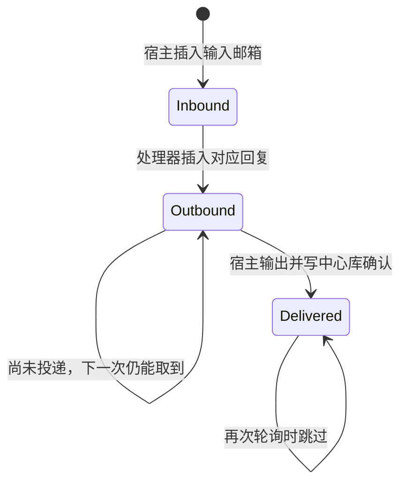
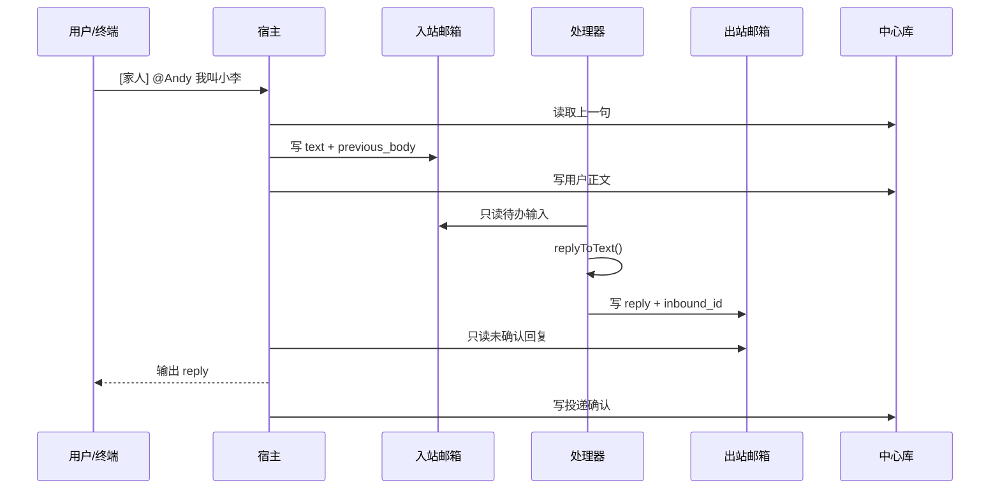

# 第 9 课：让宿主与处理器通过邮箱交接

## 1. 前言

第 8 课已有一张中心消息表：终端收到一行，马上查上一句、生成回复、保存正文并输出。
这个过程在一个进程里很顺。现在设想助手的处理器是**另一个进程**：宿主收到消息时，
处理器可能尚未启动；处理器做完后，宿主也可能稍后才来取回复。函数参数和进程内队列
不能跨进程保存这次交接。若双方都直接修改同一个邮箱文件，谁该确认、谁该写入也会
变得模糊。

本课先用本地模拟两个角色，不引入 Docker 或真实模型：宿主把消息投入该聊天的输入
邮箱，处理器从输入邮箱读取、把回复放进输出邮箱，宿主再取走并输出。三个动作可以由
三个 Node 进程先后完成；原来的终端和文件入口仍会自动串起它们。这里暂把一个
`chatId` 当作一个会话的地址，真正的会话实体和生命周期还没有出现。

## 2. 主要内容

### 2.1 本课做什么

1. 每个聊天在 `mailboxes/` 下获得自己的目录，里面是 `inbound.db` 和
   `outbound.db` 两个 SQLite 文件。
2. 宿主只写 `inbound.db`：记录原始 `@Andy` 文本以及**接收当时**的上一句。
   宿主继续把用户正文写进第 8 课的中心库，供搜索和后续回顾使用。
3. 处理器只读输入邮箱、只写输出邮箱。它查询尚无回复的输入行，调用
   `replyToText()`，用 `inbound_id` 把回复与输入对应起来。
4. 宿主只读输出邮箱并打印尚未投递的回复。投递确认写在宿主拥有的中心库
   `delivered_replies` 表中，不反过来修改处理器的输出邮箱。
5. 增加 `--receive`、`--process 聊天ID`、`--deliver 聊天ID` 三个单次命令，
   测试它们跨进程交接；保留原有自动运行模式。

### 2.2 按函数读代码

收信链：

```text
runReceive() 或 runCli()/runReplay() 收到一行
→ processMessages() 把行交给旧的内存队列
→ parseChatLine() 得到 chatId 与 text
→ triggeredBody() 判断是否真的呼叫助手，得到不带 @Andy 的正文
→ lastUserMessage() 从中心库读该聊天上一句
→ enqueueInbound() 把 text + previousMessage 写进该聊天 inbound.db
→ appendUserMessage() 把正文写进中心库 messages 表
```

处理链：

```text
--process 家人 → runProcess('家人')
→ processInbox() 只读家人的 inbound.db
→ 对每行按 inbound_id 查 outbound.db：已存在则跳过
→ replyToText(text, previousMessage) 产生 { body, reply }
→ 只把 reply + inbound_id 插入 outbound.db
```

投递链：

```text
--deliver 家人 → runDeliver('家人') 打开中心库
→ deliverReplies() 只读家人的 outbound.db
→ wasDelivered() 查中心库中有没有该 outbound_id 的确认
→ 没有则输出 reply，再调用 markDelivered() 写确认
```

正常直接运行或 `--replay` 时，`processMessages()` 在每条有效消息入站后
**立刻**调用 `processInbox()` 和 `deliverReplies()`，所以旧用法仍立即看到回复。
这只是本地演示把三步串起来；跨进程测试使用三个独立命令证明邮箱确实保存了交接数据。

相对上一课，消息处理链中插入了**输入邮箱 → 处理器 → 输出邮箱**三个环节；
`--receive/--process/--deliver` 是这条链分开运行的三个入口，并没有新增模型能力。

## 3. 技术要点

### 3.0 环境与引入理由

沿用 Node 22.13+、TypeScript 和第 8 课的内置 `node:sqlite`，不安装新依赖。
第 8 课的中心库适合搜索、记住各聊天的用户正文；但进程内函数调用不能充当两个
进程之间的持久交接。输入/输出邮箱解决的是**谁写、谁读、断开运行后数据还在不在**。
现在只用建表、只读打开、插入、查询和唯一约束，不引入容器、常驻守护进程或通用消息
总线。运行 `pnpm test` 会编译并执行含跨进程场景的测试。

### 3.1 坐标：三个数据位置与角色

```text
宿主接收层：CLI / 文件 → 队列 → parseChatLine
      │                       │
      │ 写                    │ 写用户正文 / 投递确认
      ▼                       ▼
该聊天 inbound.db          conversation.db（中心库）
      │ 处理器只读             ▲ 宿主只写；处理器不访问
      ▼                       │
处理器：processInbox → replyToText
      │ 只写                  │ 宿主只读出站，输出后记确认
      ▼                       │
该聊天 outbound.db ───────────┘
```

`mailboxes/` 是运行命令时工作目录下的新数据目录，与 `conversation.db` 一样被
Git 忽略。这里的“单写者”说的是**角色职责**：宿主写中心库和入站，处理器写
出站。直接模式虽然把两个角色放在同一个进程调用，读写边界也保持一致。

### 3.2 代码：每个函数在交接中做什么

- `triggeredBody(text)`：输入不带聊天前缀的文本；普通聊天返回 `null`，有效
  呼叫返回去掉 `@Andy` 的用户正文。宿主只用它决定是否入站；处理器仍调用
  `replyToText()` 得到真实回复。
- `mailboxPaths(baseDirectory, chatId)`：将聊天 ID 哈希成固定目录名，返回入站
  和出站文件路径。不能把用户给的聊天 ID 直接拼进路径，否则含 `/` 或 `..`
  的名字可能改变目录位置。
- `enqueueInbound(...)`：宿主创建聊天目录和输入表，插入 `text` 与
  `previous_body`；不写输出邮箱。
- `processInbox(baseDirectory, chatId)`：一次**单次轮询**，读取当前已有的全部
  输入行；对没有对应出站行的输入调用 `replyToText()`，再插入输出行。它不改
  输入行的状态。
- `deliverReplies(baseDirectory, chatId, database)`：读取输出行，查中心库投递
  确认，只输出未确认的回复，之后调用 `markDelivered()`。它不改输出行。
- `runReceive()`、`runProcess()`、`runDeliver()`：CLI 的三种独立入口。前者读
  标准输入，后两者各需要聊天 ID；`--process` 只查一轮，不是常驻后台服务。
- `processMessages()`：旧实时/文件链与仅收信链的共同入口。`autoProcess=true`
  时把后两步接上，保持前八课行为。

### 3.3 数据：同一句话的不同形态

假设第一次收到 `[家人] @Andy 我叫小李`，第二次收到
`[家人] @Andy 我刚才说了什么？`，在处理器开始前：

| 位置 | 第一行 | 第二行 | 谁写 |
|---|---|---|---|
| 中心库 `messages` | `id=1, chat_id=家人, body=我叫小李` | `id=2, ..., body=我刚才说了什么？` | 宿主 |
| 家人 `inbound.db` | `id=1, text=@Andy 我叫小李, previous_body=NULL` | `id=2, text=@Andy 我刚才说了什么？, previous_body=我叫小李` | 宿主 |

处理后，家人 `outbound.db` 有
`{id:1, inbound_id:1, reply:'NanoClaw: 我叫小李'}` 和
`{id:2, inbound_id:2, reply:'NanoClaw: 你刚才说：我叫小李'}`。投递后，中心库
`delivered_replies` 出现 `(家人,1)`、`(家人,2)`。另一聊天也可能有
`outbound_id=1`，所以确认键必须是 **`chat_id + outbound_id`**。

注意 `body` 是去掉触发词、用于搜索和回顾的用户正文；`text` 是保留触发词、
供处理器重新判断的原始消息；`reply` 才是助手输出。`previous_body` 是**收信
时的快照**，这样处理器晚一些启动，也能按消息抵达顺序回答两轮问题。

### 3.4 状态：确认保存在哪里



输入/输出行本身不来回修改状态：`inbound_id` 在输出表中出现，表示“处理过”；
`chat_id + outbound_id` 在中心库确认表中出现，表示“投递过”。处理器拥有前一种
确认，宿主拥有后一种确认。这使每个邮箱数据库只有一个写入角色。

### 3.5 流程图：两侧通过磁盘交接



### 3.6 细节技术点

**进程边界与轮询**：进程 A 的普通变量，进程 B 不能直接读取；两者先后启动时，
进程 A 甚至已经退出。SQLite 文件把交接内容留在磁盘。`processInbox()` 是“来
看一次有没有新信”的单次轮询，不是每隔一秒自动醒来的无限循环；要继续处理新信，
需要再执行一次 `--process`。常驻运行、唤醒和容器留待真正需要时再做。

**`readOnly: true` 与单写者**：`new DatabaseSync(file, { readOnly: true })` 让这
一侧只能读。处理器以只读方式开入站；宿主以只读方式开出站。另一个角色负责建表、
写行。这样“谁确认处理、谁确认投递”不再靠双方抢着修改同一张表。

**哈希目录名**：`createHash('sha256').update(chatId).digest('hex')` 把任意聊天
名字变成固定长度的十六进制字符串。这里用它是为了安全、确定地生成目录名，不是
加密聊天内容，也不表示聊天 ID 可以被忽略：CLI 仍须提供原始聊天 ID 才能找到
对应目录。不同聊天的邮箱由此分开。

**唯一约束和跳过重复**：输出表的 `inbound_id INTEGER NOT NULL UNIQUE` 说明
一封入站信只能有一封对应出站回复。处理器先查是否已有回复，重复 `--process`
会跳过。宿主用中心库的复合主键记录投递，重复 `--deliver` 也跳过。当前测试
证明的是**正常重复运行时不重发**，并不等于任何故障下都“恰好一次”。

**跨文件的失败窗口**：入站与中心库是两个不同数据库，当前没有横跨它们的原子
事务；若程序恰在两次写入中间崩溃，可能出现两边数据不一致。输出到终端后、写入
投递确认前若崩溃，下次也可能再次输出。真实渠道还会有网络失败。这些限制先诚实
记录，等后续课程有实际失败恢复需求时再处理，不假装本课已解决。

## 4. 测试与验收

### 4.1 分离进程的来回交接

**测什么、为什么测**：`--receive`、`--process`、`--deliver` 在独立 Node 进程
运行；这证明交接不是靠内存变量。输入两轮“家人”和一轮“工作”，验证不同聊天
邮箱不会串线。

**输入**：家人说“我叫小李”后问“我刚才说了什么？”，工作说“项目顺利”。

**预期**：只收信时没有回复；未处理先投递也没有回复；处理家人后仅投递家人的
两句正确回复，处理工作后仅投递工作的回复。重复处理和投递不重复输出；中心库
仍可搜索到工作正文。

**证明**：三段可以跨进程完成，处理与投递的确认分别有效，旧搜索数据未丢。

### 4.2 旧链回归

**测什么、为什么测**：改造内部环节后，直接终端输入、文件重放、旧 JSON
迁移、聊天隔离和普通消息忽略仍应成立。

**输入**：现有 `reply`、`persistence`、`replay`、`search` 等测试的输入。

**预期**：`pnpm test` 的 12 个测试全部通过；项目仍不需要网络或 Docker。

**证明**：本课改变的是进程交接方式，不是用户已经学会的触发、记忆和搜索规则。

学生验收时，请画出“宿主写哪两个库、处理器写哪个库”，并解释为什么入站表不需要
再被处理器改成 `completed`，以及为什么两次 `--deliver` 只输出一次。运行测试并
反馈问题后，再由学生手动提交本课。

## 5. 总结

上一课的一条直接函数链，现在多了两个持久邮箱。宿主负责接收与投递，处理器
负责生成回复；一侧写入的行由另一侧只读，确认保存在负责写入的那一侧。由此，
宿主和处理器可以在不同进程、不同时间先后运行，而原有自动模式仍能即时回复。

本课只做单次轮询与本地确定性回复，没有 Docker、真实模型、常驻唤醒，也没有
跨数据库事务或故障下严格恰好一次。后续需要让处理器执行工具和模型时，才会由
权限隔离的现实需求推动容器出现。
