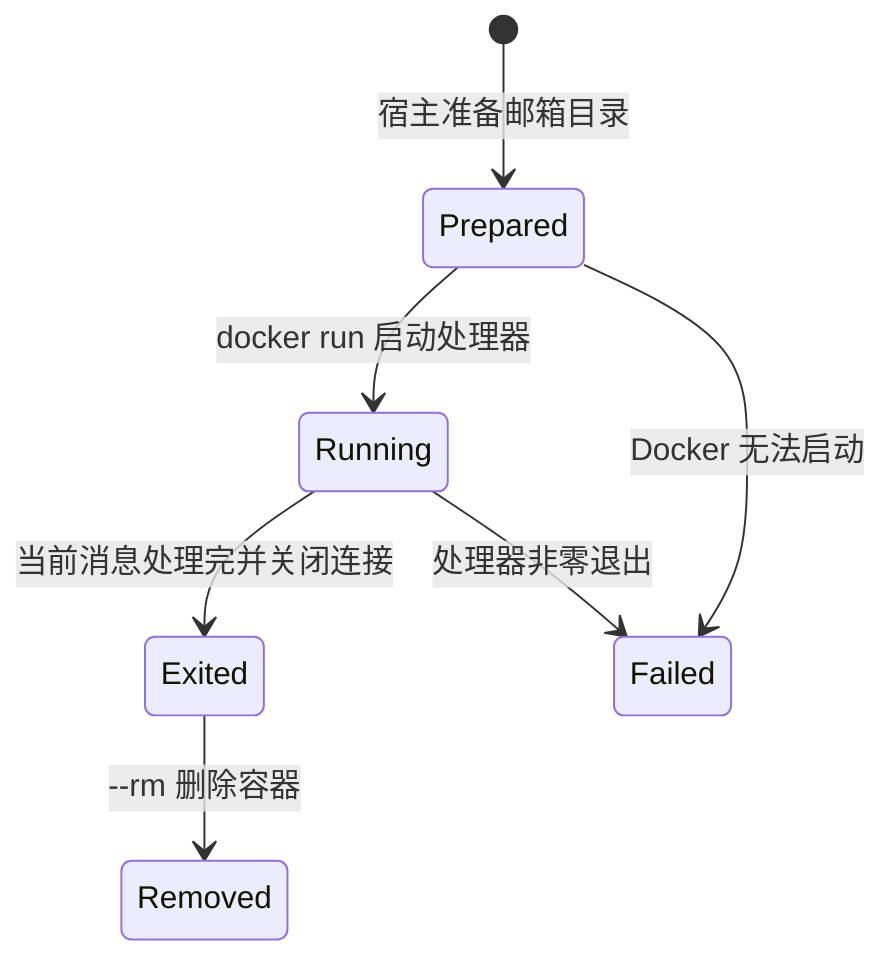
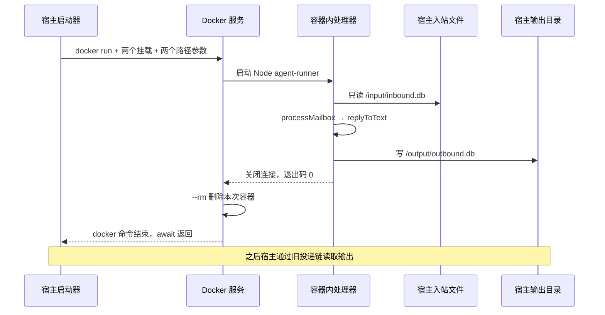

# 第 10 课：让处理器在容器里运行

## 1. 前言

第 9 课已经把宿主与处理器分开：宿主写输入邮箱，处理器写输出邮箱，再由宿主投
递。跨进程的交接问题解决了，但“拆成两个进程”并不等于“隔离”——另起一个普通
Node 进程，它仍然能以当前用户的权限访问宿主文件。以后助手要调用模型、运行工
具、读写资料，我们希望明确规定：处理器只能看到交给它的资料，只能往指定的位置
写结果。要满足这个要求，单纯拆成两个进程还不够，还需要一道由外部机制保证的边
界。

本课就把已有的确定性处理器放进 Docker 容器：宿主只给它当前聊天的一份只读输入
邮箱和一个可写输出目录，宿主中心库与其他聊天的邮箱不挂进去。处理器完成当前一
轮后关闭数据库并退出，宿主可以接着执行投递。本课先建立隔离边界，再由下一课的
真实模型需求改变处理器内部；这一课的回复内容仍沿用前面的规则。

## 2. 主要内容

### 2.1 本课做什么

概括起来，本课要做六件事：

1. **拆出处理器代码**：将生成回复的代码从 `mailbox.ts` 提取到 `processor.ts`。
   提取之后，处理器只需要输入与输出两个文件路径，不需要知道宿主工作目录、聊
   天哈希或中心库。
2. **新增独立入口**：建立 `agent-runner.ts`，作为容器和本地测试共用的独立执行入
   口。
3. **移出输出邮箱**：把输出邮箱放进独立的 `output/` 子目录，方便把输入文件只读
   挂载、输出目录可写挂载；第 9 课已有的输出文件会移动过去，行 ID 与投递确认
   保持一致。
4. **编写最小 Dockerfile**：从 Node 镜像开始，只复制编译后的处理器文件。
5. **新增容器处理命令**：新增 `--process-container 聊天ID`，宿主调用 Docker 启
   动处理器，并等待这一轮处理结束；之后 `--deliver` 仍负责显示回复。
6. **配套测试**：普通测试验证启动参数和邮箱兼容；单独的真实 Docker 测试验证挂载
   权限与往返。

### 2.2 源码阅读链

先看构建链，它回答“镜像是怎么来的”：

```text
pnpm container:build
→ pnpm build 用 tsc 生成 dist/src/*.js
→ docker build 读取 container/Dockerfile
→ 把 agent-runner.js、processor.js、reply.js 与 package.json 放入镜像
→ 得到 nanoclaw-st-agent:lesson10 镜像
```

再看宿主启动链，它回答“宿主怎么把处理器送进容器”：

```text
第 9 课 runReceive() 已把消息存入当前聊天的 inbound.db
→ --process-container 家人 调用 runContainerProcess('家人')
→ runContainer(工作目录, '家人') 检查入站文件并调用 prepareMailbox()
→ containerArguments() 生成 docker run 的参数数组
→ executeDocker() 用 execFile 启动 docker 并等待其退出
```

最后是容器处理链，它回答“容器里面发生了什么”：

```text
Docker 启动镜像的 ENTRYPOINT，传入两个容器内路径
→ agent-runner.ts 调用 runAgent('/input/inbound.db', '/output/outbound.db')
→ processMailbox() 只读入站，用 inbound_id 跳过已处理消息
→ replyToText() 生成 reply
→ processMailbox() 写输出邮箱、关闭连接
→ Node 自然退出，docker run 结束，宿主 await 返回
```

容器处理结束之后，走的是旧投递链
`runDeliver() → deliverReplies() → wasDelivered() → 输出 → markDelivered()`。
本地 `--process` 则走 `runProcess() → processInbox() → processMailbox()`——也
就是说，容器内外两种运行地点共用同一份处理逻辑。

测试链分两种：普通测试把 Docker 启动函数替换为真正的本地 Node 入口，检查参数
与输出；集成测试实际启动 Docker，先探测挂载权限，再完整走一遍收信、容器处理、
投递。

相对上一课，本课增加的是**处理环节的隔离运行分支**。输入内容、回复规则与投递
确认都没有新格式；处理代码迁移到只依赖两个邮箱路径的位置，这个拆分是隔离需求
推动的。

## 3. 技术要点

### 3.0 环境配置与组件引入

依赖方面沿用 Node 22.13+ 与 pnpm，不增加 npm 依赖。新增的外部工具是 Docker：
不仅需要命令行客户端，还需要一个正在运行的 Docker 服务。本次开发环境的
`docker version` 同时返回了 Client 与 Server 信息，镜像已实际构建，真实容器
测试已通过。

如果你在另一台电脑上学习，请按
[Docker 官方安装说明](https://docs.docker.com/engine/install/) 安装适合系统
的版本；注意本课启动器是按 Linux/WSL 的 UID/GID 编写的。装好之后，先在同一个
终端执行 `docker version`，确认有 Server 输出，再依次执行：

```bash
pnpm test
pnpm container:build
pnpm test:container
```

第一条命令不依赖 Docker，预计 14 项通过；镜像构建首次运行时需要下载 Node 基
础镜像；最后一条命令需要运行中的 Docker 和已构建的镜像，预计 1 项通过。还有
一点要记住：修改处理器代码后，需要重新 `pnpm container:build`，因为镜像里保
存的是构建时复制进去的 JS，不会随源码自动更新。

用一句话概括引入前后的差别：引入前，另一个 Node 进程仍能访问当前用户可访问的
宿主路径；引入后，Docker 负责建立进程与文件系统边界，宿主明确挂载输入文件与
输出目录。本课只学习构建镜像、启动一次、挂载与退出，不增加常驻服务、容器池或
编排系统。

### 3.1 坐标：宿主和容器各在哪一层

```text
宿主输入层：CLI → 队列 → 当前聊天的 inbound.db
宿主启动层：runContainerProcess → runContainer → Docker
                                             ↓
容器执行层：agent-runner → processMailbox → replyToText
                  读 /input/inbound.db，写 /output/outbound.db
                                             ↓
宿主投递层：deliverReplies → 终端；中心库记录投递确认
```

图里有两个名字相近的文件需要区分。`container-runner.ts` 在宿主一侧，负责启动
容器；`agent-runner.ts` 在处理器一侧，负责接受路径并开始工作。名字相似，职责
不同：前者像把工人送进工作间的人，后者是工作间里的工人。而真正查邮箱、生成并
保存回复的代码，是 `processor.ts`。

### 3.2 代码与函数职责

按调用顺序梳理本课涉及的函数：

- `mailboxPaths(baseDirectory, chatId)`：宿主用它把聊天 ID 变成哈希目录，返回
  `inbound`、`outputDirectory`、`outbound` 等真实路径。
- `prepareMailbox()`：建立输出目录，并把第 9 课已关闭的旧 `outbound.db` 移动到
  新路径。它不更改数据库行；迁移前不要同时运行旧处理器。
- `containerArguments()`：输入宿主目录和聊天 ID，输出 Docker 参数数组。它把宿
  主绝对路径映射到固定的容器内路径，并设置只读挂载与当前用户身份。
- `runContainer()`：检查入站文件、准备目录，然后调用 `executeDocker()` 并等待。
  该聊天尚无输入文件时直接结束；启动失败则向上抛出，不假装处理成功。
- `executeDocker()`：执行 `docker` 程序，参数直接用数组传递，不拼 shell 命令。
- `runAgent(inboundPath, outboundPath)`：处理器入口，把两个路径交给
  `processMailbox()`；它不读取宿主中心库。
- `processMailbox()`：第 9 课的处理算法迁移到这里，输入只读、输出可写；已有
  `inbound_id` 的回复不重复生成。数据库连接在 `finally` 中关闭。
- `processInbox()`：保留的本地入口，在宿主找到邮箱路径后调用同一个
  `processMailbox()`。原来的自动终端与文件流程继续可用。

### 3.3 数据：两边路径不同，看到的是同一份文件

宿主当前聊天的数据目录现在是：

```text
mailboxes/<聊天ID的哈希>/
├── inbound.db
└── output/
    └── outbound.db
```

宿主和容器看到的路径不同，对应关系与权限如下表：

| 宿主位置 | 容器看到的位置 | 容器权限 |
|---|---|---|
| 当前聊天 `inbound.db` | `/input/inbound.db` | 只读 |
| 当前聊天 `output/` | `/output/` | 可读写 |
| 宿主 `conversation.db` | 没有挂载 | 不提供访问路径 |
| 其他聊天邮箱 | 没有挂载 | 不提供访问路径 |

要强调的是，这里不是复制数据库：容器在 `/output/outbound.db` 插入
`{id:1, inbound_id:1, reply:'NanoClaw: 我叫小李'}`，宿主随后读取对应的
`output/outbound.db`，看到的是同一行——因为这两个路径背后是同一个文件。容器退
出并被删除后，宿主目录里的结果仍然在。中心库、入站与出站 ID 的含义继续沿用第
9 课。

为什么可写的是一个目录，而不是单独一个文件？因为 SQLite 除了主数据库文件，还
可能在旁边创建临时事务日志，所以输出目录要整个可写；而输入只挂一份文件就够了，
处理器无需创建输入日志。第 9 课两个 DB 挤在同一目录，如果把整个目录可写挂进
去，输入也会暴露给写操作——这正是本课把输出文件移动到独立目录的原因。

### 3.4 状态：短生命周期容器



这张状态图由 Docker 管理容器的运行状态；Node 处理器完成同步代码后自然退出；
宿主则通过 `await executeDocker()` 感知成功或失败。本课没有另建容器状态表，
邮箱及投递确认仍在宿主磁盘上保存。另外，因为处理器只工作一轮、宿主在原地等待
退出，本课不需要用心跳判断一个常驻处理器是否还活着——那是另一种运行需求。

### 3.5 流程图：从宿主启动到写回



整张图覆盖到容器退出为止；图末的注释说明了后续：宿主通过旧投递链读取输出并投
递。

### 3.6 细节技术点

**镜像与容器**：镜像可以理解成“装好了 Node 与程序的模板”；`docker build` 负
责制作模板，`docker run` 从模板启动一次运行环境。同一个镜像可以启动很多次容
器。`nanoclaw-st-agent:lesson10` 中冒号后的 `lesson10` 是镜像标签，用来区分
镜像版本，不是聊天 ID。

**Dockerfile 每一行**：`FROM node:22-bookworm-slim` 提供 Node 与基础系统；
`WORKDIR /app` 设置镜像中的工作目录；`COPY` 复制已编译的 JS 与 ESM 声明；
`USER node` 给镜像设置默认用户；
`ENTRYPOINT ["node", "/app/agent-runner.js"]` 固定容器启动时要运行的程序。本
课没有在镜像内安装 TypeScript，因为宿主已经先编译了代码，镜像里只需要 JS。

**`ENTRYPOINT` 与参数**：
`docker run ... 镜像 /input/inbound.db /output/outbound.db` 的最后两项会追加
到入口之后，最终相当于在容器内执行
`node /app/agent-runner.js /input/inbound.db /output/outbound.db`。处理器从
`process.argv[2]`、`process.argv[3]` 取这两个路径，因此它不需要知道宿主原始
目录名。

**构建上下文与 `.dockerignore`**：`docker build ... .` 的最后一个 `.` 指定了
允许 Docker 读取的构建目录。`.dockerignore` 先排除全部内容，再用 `!` 放行本
课需要的文件和父目录；这样一来，私人 JSON、数据库、其他源码与 `node_modules`
都不会进入构建上下文，镜像中只放运行处理器需要的文件。

**挂载参数**：`--mount type=bind,src=宿主路径,dst=容器路径,readonly` 把指定
的宿主文件挂进容器并设为只读；输出目录的挂载没有 `readonly`，所以允许写。
`--read-only` 把容器自身的根文件系统设为只读，但明确挂载的输出目录仍然可写。
`--rm` 在容器退出后删除容器，不删除宿主绑定目录；`--network none` 在当前无需
联网的处理器中关闭网络。相关语义见
[Docker 运行文档](https://docs.docker.com/engine/containers/run/) 和
[绑定挂载文档](https://docs.docker.com/engine/storage/bind-mounts/)。

**UID/GID**：Linux 用数字 UID 表示用户、GID 表示用户组。`process.getuid()`
和 `process.getgid()` 获取启动宿主的身份；`--user UID:GID` 让处理器以这个身
份写输出，宿主之后才能正常读写和清理。这个参数会覆盖镜像的默认用户。注意本课
实现针对 Linux/WSL，而不是假定所有平台都有这两个 Node 函数。

**`execFile`、`promisify` 与 `await`**：`execFile('docker', args)` 启动外部
可执行文件，数组中的每一项都是一个参数；它默认不通过 shell 解析，所以聊天名
等数据不会变成 shell 命令。`promisify(execFile)` 把回调形式转成 Promise，因
此可以 `await` 等待外部命令退出；外部命令不存在或返回非零码时 Promise 拒绝，
错误传回宿主 CLI。但要注意，异步等待只是等命令结束，并不会把 Docker 命令变成
Node 内部函数。

**测试替身的位置**：`runContainer()` 的 `execute` 参数默认是真实 Docker 调用；
普通测试传入另一个函数，检查挂载参数后执行真实的本地 `agent-runner`。被替换
的只是“怎样启动程序”这一步，生成回复与写邮箱仍执行真实代码。这个测试证明命令
构造和业务链正确；真实挂载权限必须由单独的 Docker 集成测试证明。

**隔离的实际边界**：本课证明的边界是：给处理器的输入文件只读、输出目录可写，
宿主中心库和其他聊天没有挂载。同时也要认清边界之外的东西：Docker 仍共享宿主
内核，不等同于拥有独立内核的虚拟机；本课也没有增加失败重试、资源配额或长期运
行监控。第 9 课记录的跨库写入与投递确认的故障窗口仍然存在。

## 4. 测试与验收

### 4.1 普通启动测试

**测什么、为什么测**：构造出的 Docker 参数必须只含当前聊天的两个挂载；处理器
入口必须真实生成结果；Docker 启动失败时，错误也应传回调用者。

**输入**：家人和工作各有一条输入，只启动家人的处理器。测试使用替身启动函数执
行真正的本地入口，并额外模拟一次启动失败。

**预期**：家人的输出邮箱只有“我叫小李”的回复；参数包含只读输入、独立输出目录
和 `--rm`；模拟的启动失败被抛出。

**证明**：宿主启动边界正确，且测试没有把回复生成逻辑替换成假结果。

### 4.2 已有数据迁移

**输入**：模拟第 9 课旧路径中的输出库，里面已有回复 ID 1 和入站 ID 1。

**预期**：处理时迁移到 `output/outbound.db`，依旧只保留一行，两个 ID 和回复
内容均不变。

**证明**：目录调整不会使已有入站重新生成回复，宿主原来的投递确认仍能对应。

### 4.3 真实容器集成测试

**测什么、为什么测**：参数看起来正确不代表真实权限生效，所以要在 Docker 里实
际尝试覆盖输入和写输出，并验证完整的收信、处理、投递。

**输入**：家人两轮对话与工作一条私密消息；使用本课镜像运行家人处理器。

**预期**：容器内覆盖输入文件失败，输出目录可写；输入目录里只看得到当前聊天的
文件，镜像工作目录里没有中心库。宿主收到家人两句正确回复，工作聊天没有被处理；
再次容器处理与投递不会重发。

**证明**：真实挂载与本地业务链配合工作。所有测试数据用临时目录隔离，不会修改
学生工作目录中的私人聊天数据。

本课验收为普通测试 14 项与集成测试 1 项通过。学生要能解释宿主路径与容器路径
如何对应、为什么输出要独立目录，以及容器退出后为什么回复仍在。学生运行并反馈
后，再手动提交。

## 5. 总结

第 9 课解决了跨进程交接，这一课又给处理器加上了明确的文件系统边界：宿主生成
启动参数，Docker 挂载当前聊天的输入和输出，容器内入口调用原有的回复处理逻辑。
一轮完成后容器退出，而邮箱结果保留在宿主磁盘上，宿主依旧按原来的方式投递。

隔离需求促使处理代码只依赖两个邮箱路径，输出文件也因此移到独立目录。系统现在
有了可实际运行的容器处理分支。下一步，当用户需要真实 AI 回复时，才会在这个已
经跑通的处理器内部接入模型 API，并根据联网需求调整容器设置。
