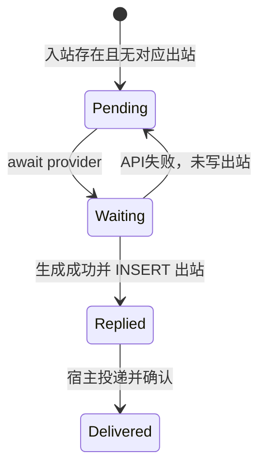
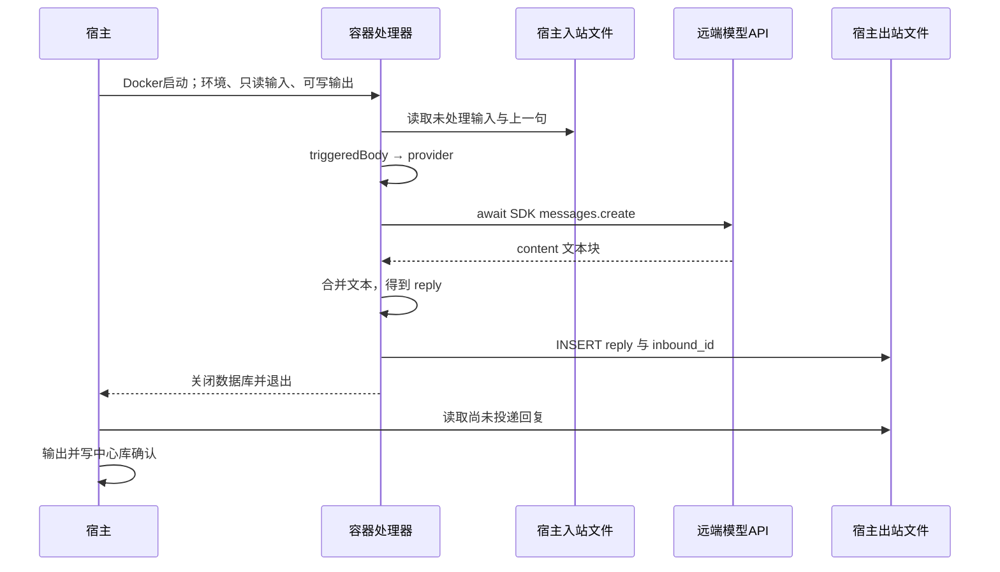

# 第 11 课：让处理器调用真实模型

## 1. 前言

第 10 课已经能把处理器放进容器，读输入邮箱、写输出邮箱、退出后由宿主投递。
但用户问“为什么容器能限制文件访问”，程序只会把原文复述一遍。这套确定性
规则足以验证工程链路，现在用户需要的是理解问题并生成回答的 AI。

本课沿原项目的路线接入官方 Anthropic TypeScript SDK；当前实际体验使用
DeepSeek 的 Anthropic 兼容接口。协议相同不代表模型品牌相同。当前需求只涉及
文本生成，先使用 Messages API，不引入运行工具的 Agent SDK。为了课程测试可
重复、不依赖账号与网络，旧的本地规则仍保留。现在真的出现了两种回复方式，
才让处理器通过一个共同的函数约定调用它们。

## 2. 主要内容

### 2.1 本课做什么

1. 保留必要的 `local` 离线回归，新增 `anthropic` 协议回复方式，用环境变量
   选择服务地址、模型和凭据；主要使用真实模型体验功能。
2. 把输入正文与接收时保存的上一句交给真实模型；合并返回的文本，仍写入原
   出站表的 `reply` 列。
3. 将处理函数改成异步：等回复成功后才插入输出。模型失败时向上报错，该
   入站消息仍没有对应输出，之后可以再次处理。
4. 容器在本地模式中继续关闭网络，在真实模型模式中允许联网，并从宿主环境
   接收 API 密钥、模型 ID 与服务地址。镜像安装实际运行需要的 SDK。
5. 通过本地模拟 HTTP 服务验证真实 SDK 请求和邮箱往返；默认测试不请求云端。

### 2.2 按实际执行位置读链条

宿主收信与启动链：

```text
runReceive() 收到 [模型演示] @Andy 用两句话解释容器隔离
→ processMessages() 解析聊天，查询上一句，保存正文与输入邮箱
→ --process-container 模型演示 调用 runContainerProcess()
→ runContainer() 准备邮箱
→ containerArguments() 用 providerSettings() 检查运行模式
→ executeDocker() 启动容器；真实模式传入环境变量名并开放网络
```

容器内真实模型链：

```text
runAgent(输入路径, 输出路径)
→ processMailbox() 默认参数调用 createProvider()
→ createProvider() 读取容器环境，用 SDK 客户端创建 callAnthropic 回复函数
→ processMailbox() 查到尚未处理的输入，triggeredBody() 得到用户正文
→ await callAnthropic(body, previousMessage)
→ client.messages.create() 把正文与上一句发给远端 API
→ 取响应中的文本块，得到 NanoClaw: 开头的完整字符串
→ processMailbox() 插入输出邮箱，结束后关闭连接并退出
```

宿主投递链不变：`runDeliver() → deliverReplies() → 读取出站 → 输出 →
markDelivered()`。回复通过磁盘文件返回宿主，而不是 Docker 的 stdout。

本地分支：`createProvider() → localProvider() → replyToBody()`。执行
`--process` 或默认实时/重放模式时，这套处理函数在宿主 Node 进程执行；执行
`--process-container` 时，则在容器内执行。文件相同不代表执行位置固定。

测试链：测试进程建立临时邮箱和本地 HTTP 服务 → SDK 客户端指向该服务 →
`processMailbox(..., provider)` → 断言请求正文与保存的回复 → 重复运行和模拟失败。
测试注入的是一个真实 SDK 回复函数，模拟的是远端服务。

相对上一课，改变的是**生成回复环节**：原来直接调用同步规则，现在按配置
选择回复方式，并等待异步结果。邮箱、消息 ID、宿主投递链继续沿用。

## 3. 技术要点

### 3.0 环境配置：SDK 在哪里安装

新增运行依赖 `@anthropic-ai/sdk`，本次锁定版本为 `0.131.0`。已经执行过：

```bash
pnpm add --save-exact @anthropic-ai/sdk
```

后续拉取项目用 `pnpm install` 恢复依赖。它放在 `dependencies` 中，因为
程序运行时需要；TypeScript 与类型声明仍是 `devDependencies`。
Dockerfile 复制 `package.json`、`pnpm-lock.yaml` 后执行
`pnpm install --prod --frozen-lockfile`，只安装锁定的运行依赖，再复制处理器 JS。
第 11 课镜像名是 `nanoclaw-st-agent:lesson11`。

默认无需密钥：未设置 `AI_PROVIDER` 就使用 `local`。DeepSeek 真实模式配置如下：

| 环境变量 | 含义 |
|---|---|
| `AI_PROVIDER=anthropic` | 使用 Anthropic 协议，不限定模型品牌 |
| `ANTHROPIC_BASE_URL=https://api.deepseek.com/anthropic` | DeepSeek 兼容接口地址；不设置时指向 Anthropic 官方服务 |
| `ANTHROPIC_API_KEY` | 你的 DeepSeek API 密钥；变量名沿用 SDK 协议命名 |
| `ANTHROPIC_MODEL=deepseek-flash` | 当前示例模型；需与你的服务支持列表匹配 |

复制 `.env.example` 为 `.env`，填写你账号的值。程序不会自动加载这个文件；
使用 Node 的 `--env-file=.env` 明确加载。`.env` 已被 Git 忽略，也不进入镜像。
配置方法与 SDK API 的正式说明见 [Anthropic 官方 TypeScript SDK 文档](https://platform.claude.com/docs/en/cli-sdks-libraries/sdks/typescript)。
DeepSeek 地址见 [官方兼容接口说明](https://api-docs.deepseek.com/guides/anthropic_api/)，
模型名以 [官方模型列表](https://api-docs.deepseek.com/quick_start/pricing/) 为准。
地址止于 `/anthropic`；SDK 自动追加 `/v1/messages`，不手动重复追加。

主要体验入口是 `pnpm start:model`：先编译，再加载 `.env` 运行宿主实时对话。
`pnpm start` 不自动加载 `.env`。真实模型体验为主要验收，下面的自动测试仅
用于快速确认工程链路，不以重复的 local 措辞测试代替真实使用。

本地验收：

```bash
pnpm test
pnpm container:build
pnpm test:container
```

真实模型体验，在配置 `.env` 后：

```bash
printf '[模型演示] @Andy 用两句话解释为什么容器能限制文件访问。\n' | node dist/src/main.js --receive
node --env-file=.env dist/src/main.js --process-container 模型演示
node dist/src/main.js --deliver 模型演示
```

真实请求会把该条正文与至多上一条用户正文发给模型服务，可能产生 API 费用。
模型输出不固定，不用旧的精确字符串断言验收真实回答。若换成本地
`--process 模型演示`，同样可以加载 `.env` 调用模型，但执行位置就是宿主。

### 3.1 坐标：宿主、容器与远端

```text
宿主：收消息 → 写入站；选择启动参数 → Docker；读取出站 → 投递
                            ↓
容器：读取站 → createProvider → await provider → 写出站
                                     ↕ HTTPS
远端：DeepSeek Anthropic 兼容 Messages API → 模型生成 → 返回内容块
```

SDK 处在处理器的生成回复环节，负责 API 请求、认证与响应类型；SQLite 仍负责
邮箱与确认。这里的 Provider 就是一种“给正文、得回复”的函数，不是插件注册
中心，也没有提前定义多供应商基类。

### 3.2 代码：明确执行侧与输入输出

| 函数 | 执行侧 | 输入 → 输出 / 调用关系 |
|---|---|---|
| `runContainerProcess/runContainer` | 宿主 | 聊天 ID → 准备邮箱并等待容器结束 |
| `containerArguments` | 宿主 | 宿主路径、配置 → Docker 参数数组；调用 `providerSettings` |
| `providerSettings` | 两侧共用 | 所在进程的环境 → 本地配置或真实模型配置；检查必填项 |
| `runAgent` | 容器；本地入口测试也可在宿主执行 | 两个邮箱路径 → 等待 `processMailbox` 完成 |
| `createProvider` | 处理器所在侧 | 环境 → 可调用的 `ReplyProvider` 函数 |
| `processMailbox` | 容器；`--process` 时在宿主 | 两个路径与回复函数 → 等待回复、写输出；返回 `Promise<void>` |
| `createAnthropicProvider` | 处理器所在侧；SDK测试在宿主 | SDK客户端、模型 ID → `callAnthropic` 函数 |
| `callAnthropic` | 处理器所在侧 | 正文、上一句 → 远端请求 → `Promise<string>` 完整回复 |
| `localProvider/replyToBody` | 处理器所在侧 | 同样的正文、上一句 → 旧确定性回复 |
| `runDeliver/deliverReplies` | 宿主 | 输出邮箱 → 终端输出与中心库投递确认 |

`replyToText()` 继续作为前几课的纯业务入口保留；它调用新提取的
`replyToBody()`，原有测试不变。处理器先用 `triggeredBody()` 取正文，再调用
统一的回复函数，因此真实 SDK 不用判断 `@Andy`。

### 3.3 数据：执行在哪，与文件存在哪，是两回事

例子是第二轮输入 `[家人] @Andy 我刚才说了什么？`，上一句为“我叫小李”：

| 环节 | 执行位置 | 数据例子 | 保存位置/用途 |
|---|---|---|---|
| 收到原始行 | 宿主 | `[家人] @Andy 我刚才说了什么？` | 宿主内存队列 |
| 保存输入 | 宿主 | `id=2, text=@Andy 我刚才说了什么？, previous_body=我叫小李` | 宿主磁盘 `inbound.db` |
| 读取并取正文 | 容器 | `body=我刚才说了什么？`，`previousMessage=我叫小李` | 容器内存；通过 `/input/inbound.db` 只读 |
| 构造模型输入 | 容器 | `上一条用户消息：我叫小李\n当前用户消息：我刚才说了什么？` | SDK请求的一个 `role:user` 消息 |
| 模型响应 | 远端返回、容器接收 | `content:[{type:text,text:你刚才说你叫小李。}]` | 容器内存；尚未入库 |
| 保存完整回复 | 容器 | `inbound_id=2, reply=NanoClaw: 你刚才说你叫小李。` | 宿主磁盘 `output/outbound.db`，容器用 `/output/outbound.db` 写 |
| 输出并确认 | 宿主 | 同一个 `reply` 字符串 | 终端；中心库 `delivered_replies` |

这几个对象不能混用：入站行有处理编号与上一句；SDK 输入是远端协议所需的
`model/messages/max_tokens`；SDK响应是多个内容块；出站行保存已经转换好的
字符串与 `inbound_id`。API 密钥用于请求认证，不写进以上业务表或提示词。

当前只有上一条用户正文，没有助手历史，所以将上一句作为当前请求中的明确
上下文，而不伪造一段助手说过的话。也没有宣称模型能看到全部会话历史。

### 3.4 状态：等待成功，再确认处理



`Waiting` 只是处理器当前调用阶段，没有新增数据库状态列。处理确认仍由对应
出站行存在表示，投递确认仍由中心库记录表示。API失败后先前成功的行保留，
当前行不写，后面的输入也暂不继续；本轮抛错退出。重复运行跳过已有回复，因此
不会为了重复轮询而再次请求模型。

### 3.5 流程图：一条输入到真实回复



### 3.6 细节技术点

**为什么现在才出现 Provider**：前十课只有一种规则，直接调用即可。现在本地
规则与真实模型都能生成回复，处理器只需要共同的输入输出，因此定义函数类型
`ReplyProvider = (body, previousMessage?) => Promise<string>`。类型约束在编译时
检查，运行时拿到的是普通函数，没有凭空创建一个框架对象。

**异步为什么沿调用链传播**：模型请求要等网络。`callAnthropic()` 返回
Promise，`processMailbox()` 必须 `await` 完整字符串，再写数据库；调用它的
`processInbox/runAgent/runProcess` 也要等待。否则入口可能过早返回、关闭连接，
甚至把尚未完成的 Promise 当成回复。SDK等待是异步的，SQLite操作仍是同步的。

**闭包**：`createAnthropicProvider(client, model)` 返回内部的
`callAnthropic()`。内部函数记住了创建时的客户端与模型 ID，后面每条消息只
需要传正文和上一句。这种函数记住外层变量的行为叫闭包。

**联合类型**：配置返回值要么是 `{name:'local'}`，要么是带密钥和模型的
`{name:'anthropic',apiKey,model,baseURL}`。检查 `settings.name` 后，TypeScript 就知道
当前是哪一种对象。这样本地模式不用假造密钥字段，真实模式的缺项也能及时报错。

**SDK的最小用法**：`new Anthropic(...)` 创建客户端，`messages.create()`
发送模型 ID、用户输入和 `max_tokens` 输出上限。API返回的 `content` 是数组，
不保证所有块都是文字，代码只收集 `type==='text'` 的块。`system` 用于助手
行为说明，业务正文放在 `messages` 中；本文只使用非流式完整回复。

**协议与品牌**：`AI_PROVIDER=anthropic` 选择请求格式，`baseURL` 决定请求发给谁，
`model` 决定该服务使用哪个模型。当前 SDK 不变，只把地址改为 DeepSeek。
密钥也必须属于 DeepSeek，不能混用另一家账号的凭据。`authToken:null` 明确使用
API key 认证，避免环境中的其他认证令牌影响本次配置。

**思考模式与输出预算**：请求设置 `thinking:{type:'disabled'}`，当前只需直接
回答。DeepSeek 默认思考模式可能先消耗输出预算；本课输出上限1024，明确关闭
思考以免收到没有可投递文本的响应。见 [官方思考模式说明](https://api-docs.deepseek.com/guides/thinking_mode/)。

**环境变量穿过容器边界**：宿主 Node 用 `--env-file=.env` 将值读入
`process.env`。Docker 进程继承宿主环境，`--env ANTHROPIC_API_KEY` 按名称取值
传入容器，命令参数数组不含密钥值。密钥仍存在容器环境中，Docker管理者可以
查看，当前方案不是凭据隔离服务；原项目更复杂的网关机制以后按需要讨论。
服务地址 `ANTHROPIC_BASE_URL` 与模型 ID 也按变量名传入；否则容器可能访问
SDK 默认的官方地址，而不是宿主配置的 DeepSeek 地址。

**网络按需求改变**：本地模式用 `--network none`；真实模式用 `bridge`，让
处理器能访问远端 API。只读输入与可写输出的挂载边界不变。API配置为空时
启动前报错，不会悄悄退回本地模式。

**失败与重试**：客户端设 `maxRetries:0`、超时30秒，避免SDK隐含重试掩盖
本课行为。当前只向上报错、保留待办，不实现退避或自动恢复。正常输出为空也
会报错，避免把空回复确认成已处理。后续失败恢复课再由需求驱动重试策略。
若在API成功之后、写出站之前崩溃，再次运行仍可能重复请求；正常重复轮询
不请求API，不代表故障下严格恰好一次。

**模型调用边界与测试**：普通回归测试强制 `local`，在 VS Code 单独运行也
如此。SDK测试使用明确的假密钥、局域回环地址与模拟响应，确实走SDK HTTP请求，
但不请求云端。真实 Docker 测试用本地 Provider，证明新镜像的依赖和运行边界；
它不证明你账号的密钥、模型权限或云端网络可用。

## 4. 测试与验收

### 4.1 模式选择与凭据传递

输入为空配置、错误模式名、真实模式缺密钥/模型，以及完整的假配置。
预期为空配置时本地回顾正常，错误配置明确报错；Docker真实模式参数包含环境
变量名与联网设置，却不包含密钥值。证明两种实现的选择与启动边界正确。

### 4.2 真实SDK与邮箱链

测试为两条消息建立临时输入邮箱，用本地HTTP服务模拟模型响应。预期请求携带
正确模型与用户正文，第二条携带上一句；多个文本块合成出站字符串。重复处理
不增加HTTP请求。第三次模拟503错误，预期抛错，出站仍只有前两条成功回复。
证明成功才确认、失败仍待办，且处理器保存的是Provider返回值。

### 4.3 回归、容器与云端体验

普通16项测试与真实Docker1项测试均应通过。学生配置自己的 `.env` 后，用新
输入走 `--receive → --process-container → --deliver`，预期得到与问题相关的
自然语言回答，内容不要求固定。该步骤会发起真实云端请求，与本地自动测试
分别验收；Agent尚未使用学生凭据或发起云端推理。

学生能说明每个函数在哪侧执行，入站/出站文件保存在哪，哪些数据交给模型，
以及 `await` 为什么必须传播到入口，再完成本课反馈与手动提交。

### 4.4 用 DeepSeek 体验主要功能（主要验收）

1. 填好 `.env` 后运行 `pnpm start:model`，输入 `[学习] @Andy 我叫小李`，
   等待自然语言回答；普通消息 `大家下午三点开会` 不产生回复，也不请求模型。
2. 再输入 `[工作] @Andy 项目代号是星河`，等待回答后退出。重启程序，分别
   输入 `[学习] @Andy 我刚才说了什么？` 与 `[工作] @Andy 我刚才说了什么？`。
   预期两边分别回顾小李与星河，证明聊天隔离和重启恢复。当前上下文只包含
   上一句用户正文，不包含全部历史或助手回答。
3. 文件入口：`node --env-file=.env dist/src/main.js --replay tutorial/示例/第11课模型消息.txt`。
   四条带触发词的消息请求模型，普通消息不请求；再次重放会新增消息，不是去重。
4. 查询：`node dist/src/main.js --search 小李`。预期找到用户正文和对应聊天、
   消息编号；这一步不请求模型，也不搜索助手回答。
5. 容器入口：按3.0的三个命令收信、容器生成、宿主投递。再执行同一聊天的
   `--process-container` 和 `--deliver`，正常情况下无新请求、无重复输出。

实时/重放入口的 SDK 在宿主执行；`--process-container` 的 SDK 在容器执行。
以上步骤会使用真实额度，并把当前正文与上一句发送给 DeepSeek，请勿输入秘密。
工程测试通过不等于账号可用；真实回答与网络需要学生自行验收。

## 5. 总结

系统现在可以把同一份入站数据交给本地规则或真实模型（当前使用 DeepSeek），生成环节成为
可替换的异步函数。新增SDK负责远端协议，处理器仍负责处理确认，宿主仍负责
投递。真实生成需求推动了Provider约定、异步传播、运行依赖与容器联网配置。

当前上下文只有上一句，模型不能执行工具，回复只在全部完成后投递。下一课
出现同一聊天连接多个助手的需求时，再让消息路由决定交给哪个助手，不在本课
提前扩展多Agent关系或Provider注册体系。
