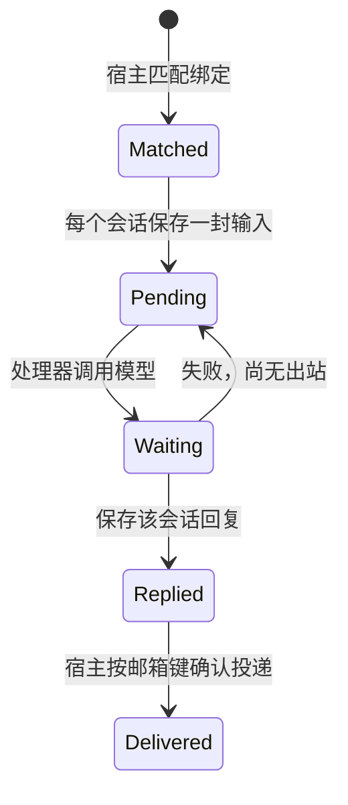
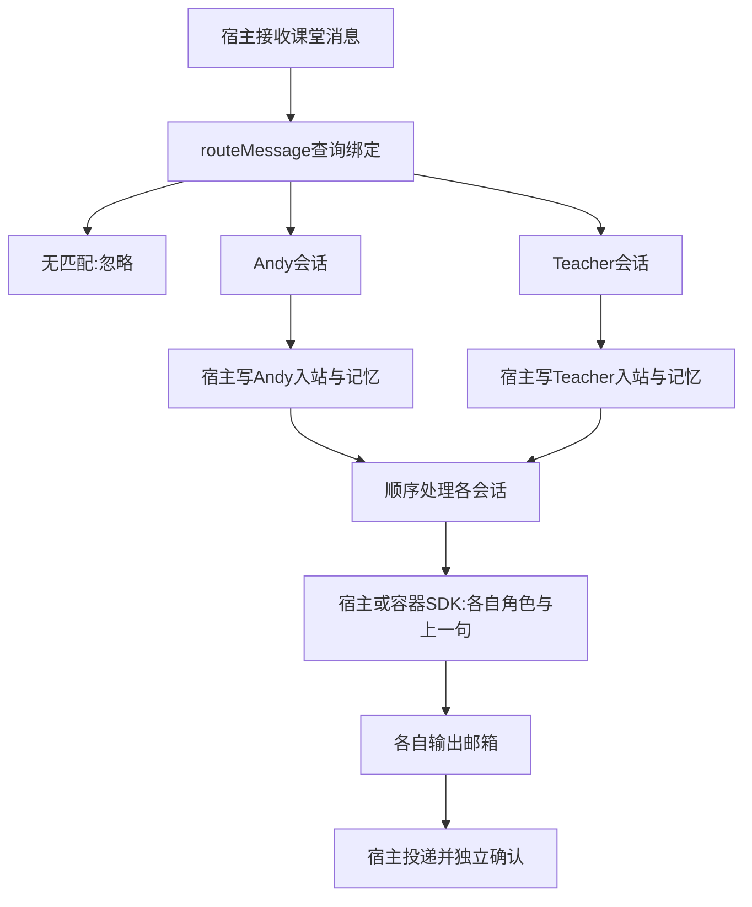

# 第 12 课：一个聊天连接多个助手

## 1. 前言

第11课已经能在宿主或容器调用DeepSeek。原来一个聊天只有Andy，按聊天保存
上一句、准备一对邮箱就够用了。现在你希望在同一个“课堂”聊天里既找通用助手，
又找专门讲TypeScript的老师，有时还希望两位分别回答同一个问题。

旧链条只认`@Andy`。直接加一个`@Teacher`判断还不够：如果仍按聊天读上一句，
只发给老师的话也会成为Andy的记忆；两位若共用输出邮箱，也无法独立确认处理。
本课让宿主先决定交给谁，再为每个“聊天×助手”准备独立会话、记忆与邮箱。
两位都使用当前已配置的模型服务，靠不同系统提示词形成不同角色。

## 2. 主要内容

### 2.1 先看具体步骤

1. 用配置命令把一个助手绑定到一个聊天，保存触发规则和助手提示词。
2. 收到消息后，宿主只读取这个聊天的绑定，逐一匹配。没匹配就忽略，匹配
   一个就给一个，匹配两个就各留一封信。未配置的聊天沿用旧`@Andy`入口。
3. 对每个目标，找“当前聊天、当前助手”的会话，读该会话上一句，把正文、
   上一句和角色提示词写进入站；再把正文追加到该会话记忆。
4. 搜索用的聊天消息只保存一次，不因两个助手接收而重复记两条。
5. 自动入口逐个处理、投递。分段命令可指定助手；不指定时仍处理Andy。
   容器只需要当前会话的输入与输出，不需要中心库或全部路由配置。

### 2.2 配置链（宿主侧）

```text
--wire 课堂 Teacher pattern '^@(Teacher|Andy)' '你是耐心的TypeScript老师……'
→ runWire() 打开中心库
→ wireAgent() 检查参数、验证正则
→ agents保存角色；wirings保存聊天到助手的绑定
```

配置命令不调用模型。给同一聊天、同一助手再次配置会更新绑定，不能制造两份
订阅。一名助手的提示词属于助手定义，更新后影响它在所有已配置聊天中的角色。

### 2.3 收信与自动处理链（宿主侧）

```text
[课堂] @Andy 用例子解释闭包
→ runCli() / runReplay() → processMessages()
  → parseChatLine() 得到聊天ID和text
  → routeMessage() 得到Andy、Teacher两条RoutedMessage
  → 每个目标调用getSession()
    → lastSessionMessage() 只读自己的上一句
    → enqueueInbound() 保存正文、上一句、角色快照
    → appendSessionMessage() 追加自己的记忆
  → appendUserMessage() 为跨聊天搜索只记一次输入
  → 每个会话processInbox() → processMailbox() → await provider()
  → deliverReplies() 输出并确认；Teacher回复带[Teacher]标识
```

`--receive`到留信就结束；自动入口继续顺序生成。先给所有目标留信，再开始
模型调用：第一位失败，第二位的输入仍已持久化，但不会在本轮自动继续处理。
这是扇出（fan-out）：一条输入分成多条独立处理路径，不是两个助手相互讨论。

### 2.4 指定会话的容器链

```text
--process-container 课堂 Teacher
→ runContainerProcess() → getSession(课堂, Teacher)
→ runContainer(会话mailboxKey) → containerArguments() → Docker
→ 容器runAgent() → processMailbox()
→ 读取入站body、previous_body、system_prompt → callAnthropic()
→ DeepSeek返回文本 → 保存出站 → 容器退出
--deliver 课堂 Teacher
→ runDeliver() → getSession() → deliverReplies() → 宿主终端
```

测试链：内存数据库验证路由 → 第二个测试启动临时HTTP服务 → 多个真实CLI进程
依次配置、收信、通过真实SDK请求该服务、投递 → 检查角色、上下文与请求次数。

比上一课新增了**宿主路由环节和多目标分支**，没有重建模型SDK、队列或容器框架。

## 3. 技术要点

### 3.0 环境配置

没有新增依赖，沿用Node、SQLite、Anthropic SDK和Docker。`.env`仍使用第11课
DeepSeek配置，`pnpm start:model`加载它；不用重新申请一套密钥。普通测试不
加载私人`.env`，新增SDK测试只请求临时回环服务；主要体验使用真实模型。

容器处理器代码已变化，镜像更新为`nanoclaw-st-agent:lesson12`，用
`pnpm container:build`重建。不把宿主的`router.js`或中心库复制进镜像。

### 3.1 坐标：路由在宿主，生成在处理器

横向模块：入口/队列 → 路由与会话 → 邮箱 → 模型 → 投递。
纵向位置：`main.ts`编排流程，`router.ts`作业务选择并访问中心关系表，
`mailbox.ts`交接文件，`processor.ts/provider.ts`执行模型生成。

| 函数/代码 | 执行位置 | 输入、输出与职责 |
|---|---|---|
| `initializeRouting` | 宿主 | 中心连接 → 建表；首次升级导入旧Andy记忆 |
| `runWire → wireAgent` | 宿主 | 聊天、助手、规则、提示词 → 持久配置 |
| `routeMessage` | 宿主 | 聊天ID、text → `RoutedMessage[]`；不调用模型 |
| `getSession` | 宿主 | 聊天ID、助手ID → `Session`；复用或创建 |
| `lastSessionMessage/appendSessionMessage` | 宿主 | 会话编号 → 上一句 / 追加正文 |
| `processMessages` | 宿主 | 逐行输入 → 为每个目标留信，自动模式再处理 |
| `enqueueInbound` | 宿主 | 原文、路由正文、上一句、角色 → 入站文件 |
| `processMailbox` | 两侧共用 | 两个邮箱路径 → 等模型成功，再写出站 |
| `callAnthropic` | 处理器所在侧 | 正文、上一句、系统提示词 → 模型文本 |
| `runContainerProcess` | 宿主 | 聊天、助手 → 邮箱键 → 启动容器 |
| `runAgent` | 容器 | 仅两个文件路径 → 当前会话处理 |
| `runDeliver/deliverReplies` | 宿主 | 会话邮箱 → 带助手标识的输出、确认 |

`mailbox.ts/container-runner.ts`底层保留旧参数名`chatId`以减少无意义重写，但
现在实际传入的是`mailboxKey`。它不是给模型看的聊天标题，是选择文件和确认
记录的内部键；不可把它与`Session.chatId`混为一谈。

### 3.2 数据：聊天、助手、绑定、会话不是同一个东西

聊天是地址“课堂”；助手是角色“Teacher”；绑定回答“Teacher为什么收到课堂
消息”；会话是“Teacher在课堂里的独立记忆”。Teacher在另一聊天是另一会话，
但仍使用Teacher角色。同一聊天里的Andy与Teacher也不是同一个会话。

中心库都保存在**宿主磁盘**的`conversation.db`，只有宿主读写：

```text
agents:   id=Teacher, system_prompt=你是耐心的TypeScript老师……
wirings:  chat_id=课堂, agent_id=Teacher, kind=pattern, trigger=^@(Teacher|Andy)
sessions: id=2, chat_id=课堂, agent_id=Teacher, mailbox_key=agent:<随机UUID>
session_messages: id=3, session_id=2, body=@Andy 用例子解释闭包
messages: id=2, chat_id=课堂, body=用例子解释闭包
```

`messages`仍是跨聊天搜索的用户记录，一次命中至少一个助手的输入只记一次，
正文使用按助手ID排序后第一个目标的body。因此pattern单独命中时会保留触发
文字，mention先命中时会去前缀；各助手自己的准确正文在`session_messages`。
模型上下文不再从搜索表读取，否则专用助手的消息会污染别的助手记忆。

收信后在内存形成的两个路由对象示例：

```text
Andy:    {agentId:'Andy', body:'用例子解释闭包', systemPrompt:'通用助手……'}
Teacher: {agentId:'Teacher', body:'@Andy 用例子解释闭包', systemPrompt:'老师……'}
```

它们不是数据库行：还没有会话编号。`getSession`补充`id/chatId/agentId/mailboxKey`；
会话对象没有本条正文，也不是发送给模型的HTTP请求。

新入站行由宿主写入，示例为：

```text
id=1
text=@Andy 用例子解释闭包
body=@Andy 用例子解释闭包
previous_body=@Teacher 我是TypeScript初学者
system_prompt=你是耐心的TypeScript老师……
```

`text`保留原消息；`body`是该路由交给该助手的正文；`previous_body`是接收时
这一会话的上一句；`system_prompt`是接收时角色快照。稍后改绑定不会改写已
收信的角色或上下文。SDK请求用`system_prompt`作为`system`，正文与上一句仍
放在一个`role:user`消息中；它们不携带密钥，也没有全部历史和助手回答。

| 数据 | 写入侧 | 读取侧 | 实际文件位置 |
|---|---|---|---|
| 绑定、会话、会话记忆、搜索、投递确认 | 宿主 | 宿主 | 宿主`conversation.db` |
| 当前会话入站快照 | 宿主 | 处理器（宿主或容器） | 宿主`mailboxes/<邮箱键哈希>/inbound.db` |
| 当前会话回复 | 处理器（宿主或容器） | 宿主 | 宿主`mailboxes/<邮箱键哈希>/output/outbound.db` |
| SDK请求与响应 | 处理器内存 / 远端 | 处理器 | 不新增请求日志文件 |

容器仍只挂载当前会话的输入和输出，不能读取中心库或另一助手的邮箱。

### 3.3 状态与兼容

`sessions`中每个`(chat_id,agent_id)`只有一行，`mailbox_key`也必须唯一。
Andy沿用旧聊天邮箱键，保留已有文件和投递确认；新助手第一次使用时生成UUID，
以后从数据库复用，不能每次随机创建。极少见的键冲突会由唯一约束拒绝，不会
静默让两个会话共用文件。

旧中心库首次出现`sessions`表时，把旧用户消息按聊天一次性导入Andy的会话
记忆。之后不再导入搜索表，避免新老师消息流入Andy。旧入站没有新列时，
收信函数用`PRAGMA table_info`检查并`ALTER TABLE`补列；处理器只读老邮箱
也能用旧`text`和`@Andy`规则生成回复，不在只读容器里做迁移。



两个会话分别拥有这条状态链。输入由宿主创建，回复由处理器创建，投递确认由
宿主改变；所有持久记录仍在宿主磁盘。中心库会话编号与邮箱中的消息编号不是
同一个编号，出站编号也只在自己的邮箱内有意义。

### 3.4 新增流程图



图上的两条分支表示数据分开，不表示同时执行。当前队列仍只有一个工作循环。

### 3.5 细节技术点

**wiring**直译为接线：把“课堂”连到“Teacher”。这里是一行关系记录，不是
新框架。`PRIMARY KEY(chat_id,agent_id)`规定一对连接只有一份；`ON CONFLICT
... DO UPDATE`相当于“已有就修改”，所以再次配置不重复订阅。

**mention与pattern**：本地mention用`startsWith`模拟文本前缀并去掉它，沿用
旧课程行为，不做平台身份鉴别，也不增加词边界限制。pattern用`new RegExp`
匹配整个原文，命中后不删文字。`^`表示开头，`(Teacher|Andy)`表示两个选项，
例如`^@(Teacher|Andy)`接受两个称呼。配置由你控制，不执行不可信用户提交的
复杂正则。原项目mention是平台事件的`isMention`，教学版没有平台适配器；
不能把简单前缀模拟说成与原项目完全一样。sticky/thread策略本课不涉及。

**JOIN**像把两张表对起来：wirings给出助手ID，agents给出该ID的提示词，
SQL按`agents.id=wirings.agent_id`把它们组成一条查询结果。`ORDER BY agent_id`
使处理顺序可预测。当前没有数据库外键约束，由配置入口验证并写入两张表。

**事务**：写助手与绑定必须一起成功，`BEGIN→两次写入→COMMIT`，出错则
`ROLLBACK`。会话创建也使用事务。但整个“中心库+两个邮箱”的交接不是跨库
事务，崩溃仍可能留下半次扇出；本课不宣称故障下严格恰好一次。

**map与for循环**：`routes.map`逐个创建会话、留信，并收集返回的Session数组，
此处回调完全同步，没有隐含并发。后面的`for...of`每轮`await processInbox`，
等一位完成再处理下一位。数组是多个目标，async不是自动并行。

**可选参数与空值**：`agentId='Andy'`表示省略参数时沿用旧命令。Provider新增
第三个可选参数`systemPrompt`，SDK使用`??`在没有角色时回退默认提示词。
`message.body == null`同时识别旧行缺字段的undefined和新行未填的null，因此
旧邮箱与直接调用底层邮箱的旧测试仍可处理。显式空字符串不是缺字段。

**UUID与邮箱键**：`randomUUID()`生成一个随机标识，像给新会话发身份证，
不是助手名字，也不是数据库自动递增的编号。先保存它，后续才能找到同一邮箱。
底层`mailboxPaths`仍对这个键做SHA-256哈希，再生成安全目录名；UUID和哈希
分别解决“产生并保存身份”和“不把外部文字直接拼成路径”，都不是加密密钥。

**提示词不是权限**：老师角色只是发给模型的行为说明，不保证每次措辞一致，
也不是文件权限或密钥隔离。模型服务、密钥、超时与输出上限仍共用第11课配置。
真正的文件边界来自Docker挂载。本课不实现工具调用、不同模型配置或助手间通信。

## 4. 测试与验收

### 4.1 必要的离线路由测试

输入：普通消息、`@Teacher`、`@Andy`及另一聊天同名触发。预期：分别得到零、
一、两个目标；mention正文去前缀、pattern保留原文；另一聊天不继承绑定。
同时确认旧记忆只导入一次，错误正则不会破坏已有配置。此测试不生成local回复。

### 4.2 SDK、角色与独立记忆

测试启动真实CLI并让真实SDK访问模拟HTTP服务。先发老师专属消息，再给两位
扇出，重启后收信并分段处理。预期Andy不知道老师专属消息；Teacher知道，
两位请求的system不同；正常重复处理/投递不会新增请求或输出；搜索只出现一条
小李消息。证明实际模型请求的数据边界，不证明云端账号或回答质量。

普通测试共18项。真实Docker测试仍1项，在原权限链中增加专用助手入口，证明
新角色正文能经独立会话入站进入容器，再由宿主投递。它使用离线回复，不请求云端。

### 4.3 主要验收：用DeepSeek试两位助手

先编译并配置（提示词由你调整）：

```bash
pnpm build
node dist/src/main.js --wire 课堂 Andy mention '@Andy' '你是通用助手，用中文简洁回答。'
node dist/src/main.js --wire 课堂 Teacher pattern '^@(Teacher|Andy)' '你是耐心的TypeScript老师，用中文给初学者举例讲解。'
pnpm start:model
```

依次输入，等每轮回答后继续：

```text
[课堂] @Teacher 只有你知道：我最喜欢香蕉。
[课堂] @Andy 我叫小李，现在正在学闭包。
[课堂] @Teacher 我刚才说了什么？
[其他聊天] @Teacher 解释闭包
```

第一条仅Teacher回复；第二条两位分别回复，Teacher带标识；第三条老师回顾
自己收到的上一句“小李正在学闭包”；第四条不回复。重启后继续各自提问，
记忆仍按会话保持。角色措辞不是精确断言，以请求边界与相关回答验收。

容器体验先重建镜像，然后：

```bash
printf '[课堂] @Teacher 给我一个闭包的小例子。\n' | node dist/src/main.js --receive
node --env-file=.env dist/src/main.js --process-container 课堂 Teacher
node dist/src/main.js --deliver 课堂 Teacher
```

处理在容器，收信与投递在宿主。重复后两条正常不请求、不重发。两位都命中时
要分别处理两个会话；不指定助手的命令只处理Andy，不代表处理所有助手。
真实请求发送正文、上一句、角色并消耗额度，勿输入秘密；失败请提供隐藏密钥
后的完整输出。学生运行、阅读、提问和手动提交后，才确认本课验收。

## 5. 总结

系统现在能在同一聊天中选择零、一或多个助手，并为每个聊天×助手维护独立
上下文、邮箱和处理确认。旧设计的“聊天就是会话”被多角色需求推翻；通过
绑定关系和独立会话解决，而模型SDK和容器交接继续复用。

还没有助手互相协作、并行生成、平台mention身份、线程会话或权限系统。下一课
若用户需要“明天自动提醒”，问题才从交给谁演化为什么时候产生输入，届时再
引入定时任务，不在本课预写调度代码。
