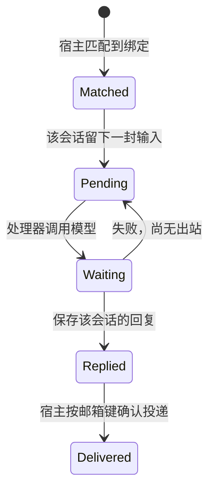
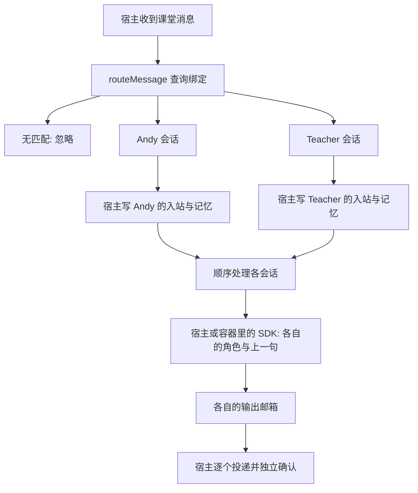

# 第 12 课：一个聊天连接多个助手

## 1. 前言

第 11 课结束时，系统已经能在宿主或容器里调用真实模型（当前体验用的是
DeepSeek 的兼容接口）。但整个系统仍然只认一个助手 Andy，而且建立在三个
隐含假设上：一个聊天就是一个会话；"上一句"按聊天保存；一个聊天只准备
一对邮箱。

现在需求变了：你希望在同一个"课堂"聊天里，有时找通用助手 Andy，有时找
一位专门讲 TypeScript 的老师，有时甚至让两位分别回答同一句话。这个需求
把上面三个假设全部推翻：

- 如果还按聊天保存"上一句"，那么只发给老师的话也会进入 Andy 的记忆，
  Andy 会"记得"从来没有人对它说过的话；
- 如果两位助手共用一个邮箱，就无法各自独立地处理消息、确认投递；
- 如果还是"聊天就是会话"，就没有地方安放"老师在这个聊天里的独立记忆"。

所以本课在宿主侧新增一个**路由**环节：宿主收到消息后先查配置，决定这句话
要交给哪些助手；再为每个"聊天 × 助手"组合维护独立的会话、记忆和邮箱。
两位助手用的是同一个已经配置好的模型服务，区别只在系统提示词：Andy 用
通用助手的提示词，Teacher 用 TypeScript 老师的提示词。

本课不新增依赖，不重建模型调用、消息队列或容器框架，改动集中在"交给谁"
这一层。

## 2. 主要内容

### 2.1 本课的五个步骤

1. **配置**：用新的 `--wire` 命令把一个助手绑定到一个聊天，同时保存触发
   规则和该助手的系统提示词。
2. **路由**：宿主收到消息后，只读取这个聊天的绑定，逐条尝试匹配。一条
   消息可能匹配零个、一个或多个助手：零个就忽略，匹配到几个就交给几个。
   还没有配置过绑定的聊天，沿用以前的 `@Andy` 前缀规则。
3. **留信**：对每个匹配到的助手，找到"当前聊天 × 当前助手"的会话，读取
   **这个会话自己**的上一句，把原文、路由后的正文、上一句和角色提示词写进
   它的入站邮箱，并把正文追加进该会话的记忆。
4. **搜索记录只存一次**：用于跨聊天搜索的用户消息表，每个输入只记一条，
   不会因为命中两位助手就存两条。
5. **处理与投递**：自动入口按顺序处理每个会话并投递回复；分段命令
   （`--process`、`--process-container`、`--deliver`）现在可以指定助手，
   不指定时仍然处理 Andy。容器只拿到当前会话的输入与输出，拿不到中心库，
   也拿不到其他助手的邮箱。

注意一个行为变化：一旦某个聊天配置了绑定，路由就只认这些绑定。比如
"课堂"里绑定了 Andy 和 Teacher 之后，一句不带任何触发词的"大家好"会被
忽略，不再有隐含的兜底。

### 2.2 配置链（宿主侧）

```text
--wire 课堂 Teacher pattern '^@(Teacher|Andy)' '你是耐心的TypeScript老师……'
→ runWire() 打开中心库
→ wireAgent() 检查参数、验证正则
→ agents 表保存角色；wirings 表保存"聊天 → 助手"的绑定
```

配置命令只写数据库，不调用模型。对同一聊天、同一助手再次配置时，更新
已有的那一行，而不是再订阅一次。助手的提示词属于助手定义本身：修改
Teacher 的提示词，会同时影响它在所有已绑定聊天中的表现。

### 2.3 收信与自动处理链（宿主侧）

```text
[课堂] @Andy 用例子解释闭包
→ runCli() / runReplay() → processMessages()
  → parseChatLine() 得到聊天 ID 和原文
  → routeMessage() 匹配绑定，得到 Andy、Teacher 两条路由结果
  → 对每个目标调用 getSession()，找到或创建"聊天 × 助手"会话
    → lastSessionMessage() 只读这个会话自己的上一句
    → enqueueInbound() 把原文、路由正文、上一句、角色快照写进入站邮箱
    → appendSessionMessage() 把路由正文追加进该会话的记忆
  → appendUserMessage() 为跨聊天搜索只记一次输入
  → 自动模式：按顺序对每个会话 processInbox() → processMailbox() → await provider()
  → deliverReplies() 输出并确认；Teacher 的回复带 [Teacher] 标识
```

两个阶段的先后顺序值得注意：宿主先给**所有**目标留信，然后才开始逐个
调用模型。这样即使第一位助手的模型调用失败，第二位助手的输入也已经安全地
落在磁盘上——本轮处理会停下并报错，但已留好的信不会丢，之后用
`--process` 或 `--process-container` 重新处理该会话即可补上。

`--receive` 只执行到留信为止；实时和重放入口在留完信之后继续自动生成。

这种"一条输入分成多条独立处理路径"的结构叫**扇出（fan-out）**。两条路径
各走各的会话和邮箱，互相不知道对方的存在——是分别作答，不是两位助手
相互讨论。

### 2.4 指定会话的容器链与测试链

容器入口现在多了助手参数：

```text
--process-container 课堂 Teacher
→ runContainerProcess() → getSession(课堂, Teacher)
→ runContainer(该会话的邮箱键) → containerArguments() → 启动 Docker
→ 容器内 runAgent() → processMailbox()
→ 读入站 body、previous_body、system_prompt → callAnthropic() 请求模型
→ 模型返回文本 → 写出站 → 容器退出
--deliver 课堂 Teacher
→ runDeliver() → getSession() → deliverReplies() → 宿主终端输出
```

测试链分三层：普通测试用内存数据库验证路由规则；新增的 SDK 测试先启动一个
临时 HTTP 服务模拟模型接口，再运行多个真实 CLI 进程依次完成配置、收信、
真实 SDK 请求、投递，最后检查角色、记忆隔离和请求次数；真实 Docker 测试
仍然只有一项。

相对上一课，新增的是**宿主路由环节和多目标分支**；模型 SDK、邮箱交接和
容器框架全部复用，没有重建。

## 3. 技术要点

### 3.0 环境配置

没有新增任何依赖，继续沿用 Node、SQLite、Anthropic SDK 和 Docker。`.env`
还是第 11 课配置的那份 DeepSeek 环境变量，`pnpm start:model` 负责加载，
不需要重新申请密钥。普通测试不加载私人 `.env`；新增的 SDK 测试只请求本机
临时回环服务，不访问云端；真实模型体验留给主要验收环节。

容器里的处理器代码变了——入站行现在多了正文和角色两个字段，处理器要读
它们——所以镜像标签更新为 `nanoclaw-st-agent:lesson12`，需要重建：

```bash
pnpm container:build
```

镜像里仍然只有 `agent-runner.js`、`processor.js`、`reply.js`、
`provider.js` 和运行依赖，不包含宿主的路由代码（`router.js`、`main.js`），
也不包含中心库。

### 3.1 坐标：路由在宿主，生成在处理器

横向看，一条消息仍然沿着老路走：入口/队列 → 路由与会话 → 邮箱 → 模型 →
投递。本课只是把"路由与会话"这一站从"一个聊天一个会话"改成了"按绑定
分派"。纵向看：`main.ts` 负责编排整个流程；`router.ts` 是本课新增的业务
核心，负责选择目标并访问中心库里的关系表；`mailbox.ts` 仍然只管文件交接；
`processor.ts` 和 `provider.ts` 负责生成回复。

| 函数 | 执行位置 | 输入、输出与职责 |
|---|---|---|
| `initializeRouting` | 宿主 | 打开中心连接并建表；首次升级时把旧用户消息导入 Andy 的会话记忆 |
| `runWire` → `wireAgent` | 宿主 | 聊天、助手、触发规则、提示词 → 持久化配置 |
| `routeMessage` | 宿主 | 聊天 ID、原文 → `RoutedMessage` 数组；只查库，不调用模型 |
| `getSession` | 宿主 | 聊天 ID、助手 ID → 会话对象；已存在就复用，不存在就创建 |
| `lastSessionMessage` / `appendSessionMessage` | 宿主 | 会话编号 → 读该会话上一句 / 追加该会话记忆 |
| `processMessages` | 宿主 | 逐行输入 → 给每个目标留信；自动模式下再顺序处理并投递 |
| `enqueueInbound` | 宿主 | 原文、路由正文、上一句、角色 → 入站邮箱文件 |
| `processMailbox` | 宿主与容器共用 | 两个邮箱路径 → 等模型成功后写出站 |
| `callAnthropic` | 处理器所在的一侧 | 正文、上一句、系统提示词 → 模型回复文本 |
| `runContainerProcess` | 宿主 | 聊天、助手 → 该会话邮箱键 → 启动容器 |
| `runAgent` | 容器 | 只拿两个文件路径 → 处理当前会话 |
| `runDeliver` → `deliverReplies` | 宿主 | 会话邮箱 → 带助手标识的输出和投递确认 |

一个容易混淆的命名问题：`mailbox.ts` 和 `container-runner.ts` 的底层函数
保留着旧参数名 `chatId`，但从本课起实际传进去的是**邮箱键**（
`mailboxKey`）。邮箱键只是用来定位文件目录、记录投递确认的内部键，不是给
模型看的聊天名，也不要和 `Session.chatId` 混为一谈。

### 3.2 数据：聊天、助手、绑定、会话是四个概念

先分清四个词：

- **聊天**是地址，比如"课堂"；
- **助手**是角色，比如 Teacher；
- **绑定**回答"Teacher 为什么会收到课堂里的消息"，是 `wirings` 表里的
  一行关系记录；
- **会话**是"Teacher 在课堂里的独立记忆"。Teacher 在另一个聊天里是另一
  个会话，但仍然是 Teacher 这个角色；同一个聊天里的 Andy 和 Teacher 也是
  两个互不相通的会话。

这些数据都保存在宿主磁盘的中心库 `conversation.db`，只有宿主读写：

```text
agents:           id=Teacher, system_prompt=你是耐心的TypeScript老师……
wirings:          chat_id=课堂, agent_id=Teacher, kind=pattern, trigger=^@(Teacher|Andy)
sessions:         id=2, chat_id=课堂, agent_id=Teacher, mailbox_key=agent:<随机UUID>
session_messages: id=2, session_id=2, body=@Andy 用例子解释闭包
messages:         id=2, chat_id=课堂, body=用例子解释闭包
```

`messages` 表仍然只服务跨聊天搜索。它的规则是：一个输入命中几个助手都只记
一条，正文取按助手 ID 排序后的第一个目标。所以如果只有 pattern 命中（比如
只有 Teacher），搜索记录里保留触发词原文；如果 mention 命中在先（比如
Andy），记录的是去掉前缀的正文。每个助手各自真正收到的正文，存在它们自己
的 `session_messages` 里。模型的上下文从本课起不再读搜索表——否则老师
收到的消息会污染 Andy 的记忆。

`routeMessage()` 返回的路由结果只存在于内存中。以第二条输入为例：

```text
Andy:    { agentId: 'Andy',    body: '用例子解释闭包',        systemPrompt: '通用助手……' }
Teacher: { agentId: 'Teacher', body: '@Andy 用例子解释闭包', systemPrompt: '老师……' }
```

它们还不是数据库里的行，没有会话编号。`getSession()` 补上
`id/chatId/agentId/mailboxKey` 之后才是会话对象；会话对象里没有本条消息的
正文，也不是发给模型的 HTTP 请求。

宿主写入站邮箱的一行示例（Teacher 会话收到上面那条消息时）：

```text
id=1
text=@Andy 用例子解释闭包
body=@Andy 用例子解释闭包
previous_body=@Teacher 我是TypeScript初学者
system_prompt=你是耐心的TypeScript老师……
```

四个字段的含义各不相同：`text` 是聊天里的原始消息；`body` 是路由决定交给
**这位**助手的正文（Teacher 是 pattern 命中，所以保留了原文里的 @ 前缀）；
`previous_body` 是收信那一刻这个会话的上一句；`system_prompt` 是收信那一刻
的角色快照。快照的意义在于：之后就算你改了绑定或提示词，也不会改写已经
收下的信。

处理器把 `system_prompt` 作为 SDK 请求的 `system` 参数，正文和上一句合成
一条 `role: user` 消息。请求里没有密钥（密钥只用于请求头认证），没有全部
历史，也没有助手自己的回答。

| 数据 | 写入方 | 读取方 | 实际位置 |
|---|---|---|---|
| 绑定、会话、会话记忆、搜索记录、投递确认 | 宿主 | 宿主 | 宿主 `conversation.db` |
| 当前会话的入站快照 | 宿主 | 处理器（宿主或容器） | 宿主 `mailboxes/<邮箱键哈希>/inbound.db` |
| 当前会话的回复 | 处理器（宿主或容器） | 宿主 | 宿主 `mailboxes/<邮箱键哈希>/output/outbound.db` |
| SDK 请求与响应 | 处理器内存与远端服务 | 处理器 | 不落盘，没有新增请求日志 |

容器仍然只挂载当前会话的输入文件和输出目录，读不到中心库，也读不到另一位
助手的邮箱。

### 3.3 状态与兼容

`sessions` 表对每个 `(chat_id, agent_id)` 组合只允许一行，`mailbox_key`
也必须全局唯一。Andy 沿用旧的聊天 ID 作为邮箱键，所以第 11 课及之前的
邮箱文件和投递确认原样有效；新助手第一次被用到时才生成一个 UUID 邮箱键，
之后从数据库里复用，不会每次随机换一个。万一 UUID 撞车（概率极低），唯一
约束会直接报错，而不是让两个会话悄悄共用一个邮箱。

旧中心库第一次升级出现 `sessions` 表时，把每个聊天的旧用户消息一次性导入
该聊天 Andy 会话的记忆，保证老用户重启后 Andy 还记得以前聊过什么。这次
导入之后就不会再从搜索表导入了——否则之后发给老师的消息又会流进 Andy 的
记忆。

旧邮箱文件缺少 `body`、`system_prompt` 两列时，由宿主在写入侧用
`PRAGMA table_info` 检查并用 `ALTER TABLE` 补列；处理器读取老邮箱时，发现
`body` 为空就退回旧的 `@Andy` 前缀规则生成回复。容器只读输入文件，不做
任何表结构迁移。



Andy 和 Teacher 各自拥有独立的一条状态链：输入由宿主创建，回复由处理器
创建，投递确认由宿主写中心库。还要注意编号空间：中心库的会话编号、会话
记忆编号、搜索消息编号，以及入站、出站邮箱里的消息编号，是几套互不相干的
编号；出站编号只在它自己的邮箱文件里有意义。

### 3.4 流程图



图上画成两条分支，表示的是**数据分开**（两份记忆、两个邮箱），不是同时
执行——队列仍然只有一个工作循环，处理是严格顺序的。

### 3.5 细节技术点

**wiring（接线）**：这个词直译是"接线"，把"课堂"这根线接到"Teacher"这
盏灯上。它不是新框架，就是 `wirings` 表里的一行。`PRIMARY KEY (chat_id,
agent_id)` 保证一对连接只有一份；`INSERT ... ON CONFLICT DO UPDATE` 的
含义是"已存在就修改"，所以对同一对聊天和助手重复执行 `--wire` 是更新
配置，不是叠加订阅。

**mention 与 pattern**：两种触发规则。mention 用 `startsWith` 判断文本
是否以触发词开头，命中后把前缀去掉，只把剩下的正文交给助手——这是教学版
对原项目平台级 mention 的简化模拟，没有平台身份鉴别，也不做词边界判断。
pattern 用 `new RegExp(trigger)` 对整条原文做匹配，命中后**不删任何
文字**。`^` 表示从头匹配，`(Teacher|Andy)` 表示二选一，所以
`^@(Teacher|Andy)` 能同时接受两个称呼。触发规则由你自己配置，程序不负责
防御不可信用户提交的复杂正则。原项目里 mention 来自平台事件的
`isMention` 字段，教学版没有平台适配器，两者不能说完全等价。sticky 和
thread 等其他分发策略本课不涉及。

**JOIN**：SQL 的 JOIN 可以理解为把两张表按条件拼起来。路由查询里，
`wirings` 表提供"哪些助手绑定在这个聊天"，`agents` 表提供这些助手的
提示词，`ON agents.id = wirings.agent_id` 把两者拼成一行。`ORDER BY
agent_id` 让处理顺序固定可预测。两张表之间没有外键约束，一致性由配置入口
保证——`wireAgent` 在同一个事务里写两张表。

**事务的边界**：`wireAgent` 用 `BEGIN → 两次写入 → COMMIT` 保证助手定义
和绑定要么都写入、要么都不写，出错就 `ROLLBACK`；会话创建也是一个小事务。
但要注意，从"写中心库"到"写两个邮箱文件"这整段交接不是跨库事务——中心
库和邮箱文件是不同的 SQLite 文件，进程崩溃仍可能留下只完成一半的扇出。
本课不做"故障下严格恰好一次"的承诺。

**map 与 for...of**：`routes.map(...)` 逐个创建会话、留信，把会话对象
收集成数组；这里的回调全是同步操作，没有任何隐含并发。随后 `for...of`
循环里每一轮都 `await processInbox(...)`，等一位助手的回复落盘再处理下
一位。数组里有多个目标不等于并行执行，async 也不是自动并行。

**可选参数与空值**：`runProcess(chatId, agentId = 'Andy')` 这类默认参数
让旧命令不加助手名也照常工作。`provider` 新增第三个可选参数
`systemPrompt`，请求时用 `??` 在没有角色时回退到默认提示词。判断旧邮箱行
是否带正文用的是 `message.body == null`——宽松相等同时命中 `undefined`
（旧行根本没有这个字段）和 `null`（新行显式写了空值），所以旧邮箱和直接
调用底层邮箱的旧测试都还能跑。注意显式的空字符串不算"缺字段"。

**UUID 与邮箱键**：`randomUUID()` 生成一个随机字符串，作用是给新会话发
一张"身份证"：先把这张身份证存进数据库，之后才能一直找到同一个邮箱。它
不是助手名，也不是数据库自增编号。底层 `mailboxPaths()` 还会把这个键再做
一次 SHA-256 哈希，用哈希值当目录名，避免把外部输入的任意文字直接拼进
文件路径。UUID 和哈希各解决一个问题，它们都不是加密密钥。

**提示词不是权限**：给 Teacher 的"你是 TypeScript 老师"只是发给模型的
行为说明，能影响语气和内容倾向，但不保证每次措辞一致，更不是文件权限或
密钥隔离。模型服务、API 密钥、超时时间和输出上限仍然和第 11 课一样是全局
共享的。真正的文件隔离来自 Docker 挂载。助手互相调用工具、每个助手用不同
模型、助手之间通信，这些本课都没有实现。

## 4. 测试与验收

### 4.1 离线路由测试

用内存数据库直接测试 `routeMessage` 及相关函数。输入覆盖：不带触发词的
普通消息、`@Teacher`、`@Andy`，以及另一个聊天里同样的触发词。预期分别
得到零个、一个、两个目标；mention 命中时正文去前缀，pattern 命中时保留
原文；别的聊天不继承"课堂"的绑定。同时确认旧记忆只在首次升级时导入一次，
写错的正则会让配置报错但不会破坏已有数据。这一层测试不产生任何回复。

### 4.2 SDK 测试：角色与记忆隔离

测试先启动一个临时 HTTP 服务模拟模型接口，然后运行真实的 CLI 进程，依次
执行配置、收信、处理（真实 SDK 发请求到该服务）、投递，中途重启程序再
收信处理。预期：Andy 完全不知道只发给老师的消息，Teacher 知道；两位助手
发出的请求里 `system` 字段各不相同；重复执行处理和投递不会产生新的模型
请求或新的输出；搜索结果里小李的消息只出现一条。这个测试证明的是实际模型
请求的数据边界，不证明云端账号可用，也不评判回答质量。

普通测试共 18 项（`pnpm test`），真实 Docker 测试仍为 1 项
（`pnpm test:container`）：在原有权限链上增加一个专用助手入口，验证新角色
的正文能经独立会话进入容器、再由宿主投递。它使用离线回复，不请求云端。

### 4.3 用 DeepSeek 体验两位助手（主要验收）

先编译并写入两条配置（提示词可以按你的喜好修改）：

```bash
pnpm build
node dist/src/main.js --wire 课堂 Andy mention '@Andy' '你是通用助手，用中文简洁回答。'
node dist/src/main.js --wire 课堂 Teacher pattern '^@(Teacher|Andy)' '你是耐心的TypeScript老师，用中文给初学者举例讲解。'
pnpm start:model
```

在交互界面依次输入，每轮等回答结束后再输入下一行：

```text
[课堂] @Teacher 只有你知道：我最喜欢香蕉。
[课堂] @Andy 我叫小李，现在正在学闭包。
[课堂] @Teacher 我刚才说了什么？
[其他聊天] @Teacher 解释闭包
```

逐条核对预期：

1. 第一条只有 Teacher 回复：Andy 的触发词要求消息以 `@Andy` 开头，这条
   不满足。这一步是故意给老师留一个"秘密"——它只写进 Teacher 的会话
   记忆。
2. 第二条两位都回复，Teacher 的回复带 `[Teacher]` 标识。注意这时老师处理
   消息时带着自己的上一句（香蕉那条），所以它的回答可能顺带提到知道这个
   秘密；而 Andy 的会话里从来没有这条记录，对香蕉一无所知。两位请求的
   `system` 也分别是各自的提示词。
3. 第三条只有 Teacher 回复，它能回顾自己上一轮收到的话——小李在学闭包。
   另外提醒一句：Teacher 是 pattern 命中，会话记忆里保留着 `@` 前缀原文，
   这是"pattern 不删文字"的正常表现，不是错误。
4. 第四条没有任何回复：另一个聊天没有配置绑定，回退规则又要求以 `@Andy`
   开头。
5. 退出程序重启，继续分别向两位提问，记忆仍然按会话各自保留。

容器体验：先 `pnpm container:build` 重建镜像，然后按第 11 课的三步走，
助手名换成 Teacher：

```bash
printf '[课堂] @Teacher 给我一个闭包的小例子。\n' | node dist/src/main.js --receive
node --env-file=.env dist/src/main.js --process-container 课堂 Teacher
node dist/src/main.js --deliver 课堂 Teacher
```

收信和投递在宿主，生成在容器。把后两条命令重复执行一遍，正常情况下不产生
新的模型请求，也不重复输出——已有的回复不会重发。两位助手同时命中时，
自动入口会分别处理两个会话；而不带助手名的 `--process-container 课堂` 只
处理 Andy，并不代表"处理所有助手"。

真实请求会把正文、上一句和角色提示词发给模型服务并消耗额度，请不要输入
任何秘密；如果失败，把隐藏密钥后的完整输出贴出来。请你亲自运行、阅读、
提问并手动提交之后，再确认本课验收。

## 5. 总结

本课之后，系统可以在同一个聊天里选择零个、一个或多个助手回复，并且为每个
"聊天 × 助手"组合维护独立的上下文、邮箱和投递确认。旧设计里"聊天就是
会话"的假设被多角色需求推翻，现在用绑定关系加独立会话来解决；而模型调用
和容器交接这两层完全没有动。

仍然没有的：助手之间互相协作、并行生成、平台级的 mention 身份鉴别、
线程化会话、助手级权限。下一课如果引入"明天自动提醒我"这样的需求，问题
才会从"交给谁"变成"什么时候产生输入"，到那时再引入定时任务，本课不提前
写任何调度代码。
