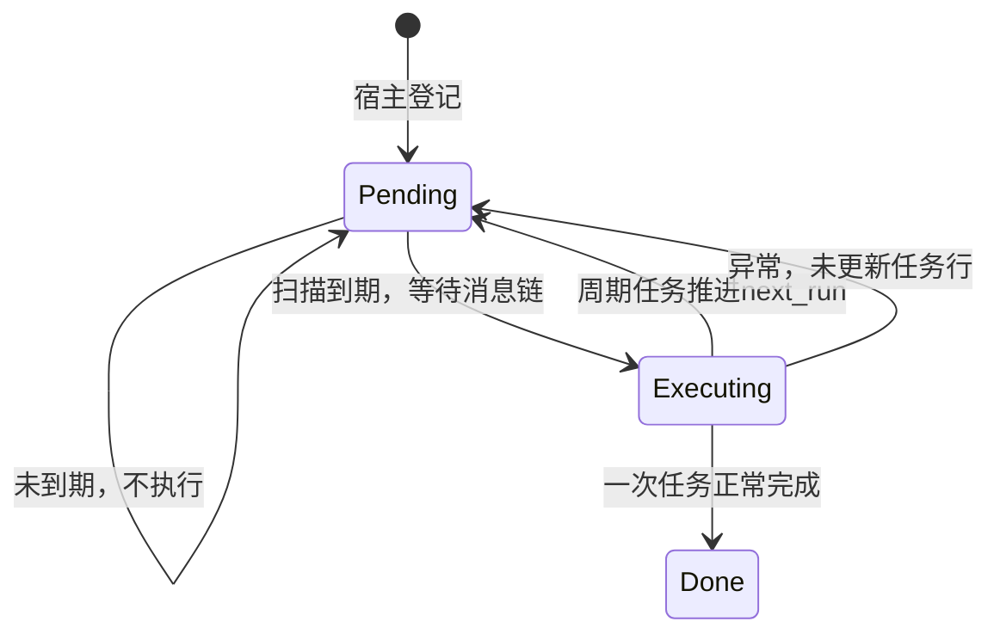
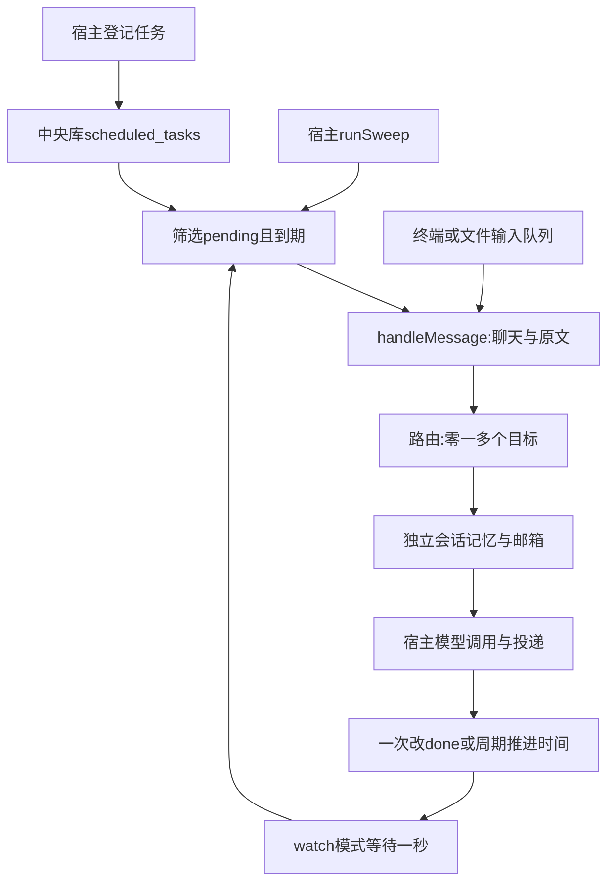
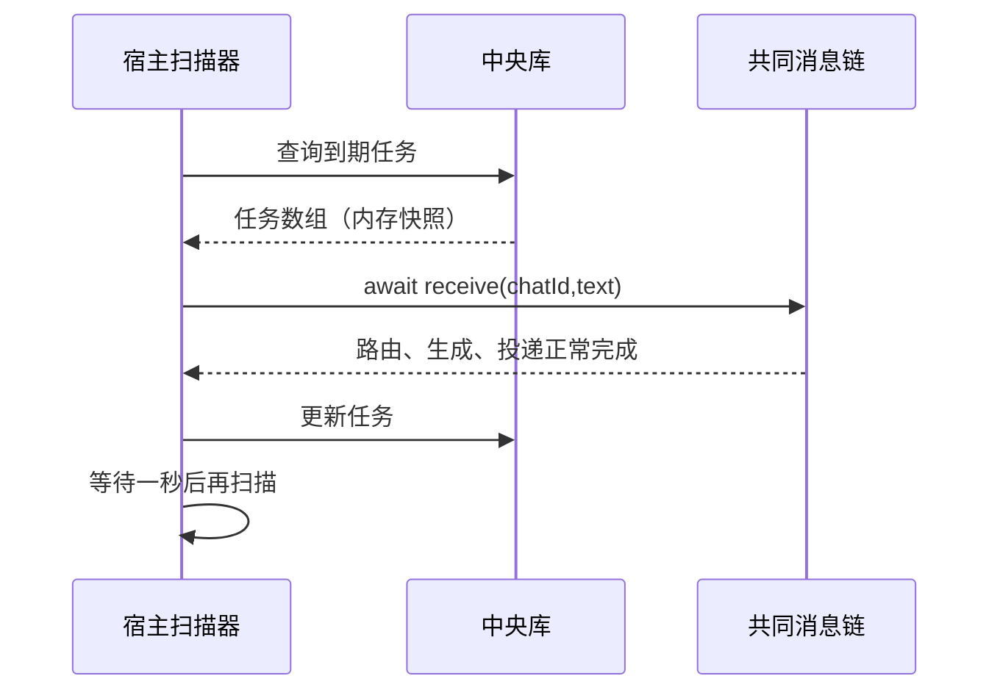

# 第 13 课：让消息按时间自动触发

## 1. 前言

第12课能让课堂消息交给Andy或Teacher，并保持各自的上一句记忆。但必须你
在终端输入，助手才开始工作。现在你希望“半分钟后让老师出一道闭包练习”，
或“每隔一段时间给我一个复习问题”。不能要求你一直守着终端准点发消息。

之前的队列只能处理已经到来的输入，不能持久保存未来计划；邮箱也只负责消息
交接，不知道何时应该产生一封新信。本课在宿主中央库保存任务，宿主扫描到期
任务，把任务文字送进第12课的共同消息链。模型、角色、会话记忆和邮箱继续复用。
先做一次性时间和固定毫秒间隔，不引入cron、脚本、分布式调度或自动恢复。

## 2. 主要内容

### 2.1 用日常步骤理解本课

1. 你指定聊天、第一轮时间、一次或周期、消息文字。文字仍要带能命中助手的
   触发词，例如`@Teacher 给我一道闭包练习`。
2. 登记命令只保存任务，不调用模型，不更新会话上一句，也不写入邮箱。
3. 宿主扫描当前时间之前到期的pending任务，按时间和编号逐个执行。
4. 到期文字进入共同消息链：选择助手、读取各自上一句、留信、更新记忆、
   调用模型、投递回复。一个任务也能命中多位助手。
5. 这条链正常返回后，一次任务改成done；周期任务仍pending，但推进下一次时间。
6. 你可以只扫描一轮，也可以启动持续轮询。持续模式等这一轮结束，再等待一秒
   进入下一轮，慢模型不会让同一进程的两轮扫描重叠。

### 2.2 登记链与查看链：都在宿主

```text
--schedule 课堂 带时区的ISO时间 once '@Teacher 给我一道闭包练习'
→ runSchedule(chatId, when, recurrence, text)
  → routeMessage() 检查当前绑定能否命中
  → Date.parse() 把文字时间转换为毫秒时间戳
  → scheduleTask() 检查参数并INSERT scheduled_tasks
  → 输出“任务1已保存”

--tasks → runTasks()
→ SELECT scheduled_tasks → 展示状态、下一轮时间、周期和原文
```

任务定义中不保存助手角色快照。实际到期时重新读取绑定和角色，使用当时的配置。
登记后修改绑定可能改变接收者；到期没有匹配目标时会报错，不假装完成。

### 2.3 扫描链与旧输入链汇合

```text
--sweep → runSweep(false) → sweepDueTasks(database, receive, now)
  → SELECT pending且next_run<=now的任务
  → await receive(chatId, text)
    → handleMessage(database, chatId, text, true)
      → routeMessage → getSession → lastSessionMessage
      → enqueueInbound → appendSessionMessage
      → appendUserMessage（搜索只保存一次）
      → processInbox → processMailbox → callAnthropic
      → deliverReplies
  → UPDATE任务状态或下一次时间
```

`--watch → runSweep(true)`重复同样的扫描。终端/文件入口仍用输入队列：
`processMessages → parseChatLine → handleMessage`。原来写在队列回调中的
第12课业务搬到handleMessage，是因为现在真的有第二条到达业务链的路径。
没有为未来创建通用渠道或任务框架。

测试链分别为：内存中央库+固定now验证时间状态；临时磁盘中央库+多个CLI进程+
真实SDK访问模拟HTTP服务，验证重启后的路由、角色、记忆和重复扫描。

相对上一课，新增的是**按时间产生输入的链条**，它汇入原来的路由环节；没有
增加另一套生成算法。定时输入不经过终端内存队列，但扫描本身顺序await执行。

## 3. 技术要点

### 3.0 环境配置

没有新增第三方依赖。沿用Node、TypeScript、内置SQLite和Anthropic SDK。
`pnpm build`编译；自动测试不读取私人.env。主要体验用
`node --env-file=.env dist/src/main.js --watch`，仍使用你已经配置的DeepSeek。
VS Code测试按钮的操作在聊天中说明，按钮不可见时用终端命令。

新增代码全部在宿主，处理器没有变化，本课继续使用lesson12容器镜像。
不把scheduler、中央库或任务配置复制进镜像。扫描的自动模型调用在宿主执行，
不是自动启动Docker；原`--process-container`分段入口仍保留。

### 3.1 坐标与函数职责

横向位置：任务登记/扫描 → 共同消息编排 → 路由与会话 → 邮箱 → 模型 → 投递。
纵向位置：main负责CLI编排，scheduler负责时间筛选与任务状态，store负责打开
中央库并初始化表；原来的router、processor、provider继续承担原职责。

| 函数 | 执行侧 | 输入 → 输出及职责 |
|---|---|---|
| initializeSchedule | 宿主 | 中央连接 → 创建scheduled_tasks表 |
| runSchedule | 宿主 | CLI文字参数 → 检查绑定、解析时间、输出任务编号 |
| scheduleTask | 宿主 | 聊天、原文、时间戳、可选间隔 → 保存任务，返回number编号 |
| runTasks | 宿主 | 当前中央库 → 展示任务，不调用模型 |
| runSweep | 宿主 | watch布尔值 → 扫一轮或循环；退出时关闭连接 |
| sweepDueTasks | 宿主 | 连接、异步receive函数、now → 执行到期任务，返回完成数量 |
| handleMessage | 宿主 | 聊天、原文、自动处理开关 → 原路由链；返回是否匹配 |
| processMailbox/provider | 处理器所在侧 | 邮箱快照 → 回复；本课扫描自动分支在宿主 |

handleMessage无匹配时返回false。普通终端闲聊仍忽略；定时任务的receive回调
检查false并报错。这样不把“没有交给任何助手”记成任务完成。

### 3.2 数据：任务定义、会话记忆和邮箱不同

例如安排Teacher在18:00出练习，中央库新增一行：

```text
scheduled_tasks:
  id=1
  chat_id=课堂
  text=@Teacher 给我一道闭包练习
  next_run=带时区的18:00转换后的毫秒时间戳
  interval_ms=null
  status=pending
```

下一轮时间是整数，不保存“半分钟以后”这种相对描述，也不是SQLite自动
计时器。间隔null代表一次；60000代表固定间隔一分钟。任务编号不等于
会话编号，也不等于入站或出站编号。

| 数据 | 谁写/读 | 文件实际位置 | 何时产生 |
|---|---|---|---|
| scheduled_tasks任务定义 | 宿主写、宿主读 | 宿主conversation.db | 登记时 |
| sessions/session_messages | 宿主写、宿主读 | 宿主conversation.db | 到期进入业务链时 |
| messages搜索记录 | 宿主写、宿主读 | 宿主conversation.db | 到期且命中目标时，一次输入只记一次 |
| 入站text/body/previous_body/system_prompt | 宿主写，处理器读 | 宿主每会话inbound.db | 到期路由之后 |
| 回复 | 处理器写，宿主读 | 宿主每会话output/outbound.db | 模型成功后 |
| 投递确认 | 宿主写、宿主读 | 宿主conversation.db | 输出回复后 |

任务text保留触发词，到期由路由得到各助手body。mention删除前缀，
pattern保留原文；新入站已有body，处理器直接用它，不重新判断触发词。
只有旧入站缺body时才走旧@Andy兼容判断。中央库和邮箱是独立数据库文件，
这里没有“把任务表放到容器邮箱里”的变化。

会话上一句在**到期收信时**读取，不在任务登记时读取。例如登记任务后，你又
向Teacher说“我刚开始学习闭包”，到期练习的previous_body就是这句。任务
文字自身随后成为Teacher的新上一句。它不是模拟助手回答，也不是系统角色词。

### 3.3 状态与正常重复扫描



Executing只是程序内的执行阶段，不是新状态列。status只有pending/done，
由宿主改变并保存中央库。一次任务done后不再选中，周期任务下轮在未来，
所以相同时间正常扫描不重复执行。

周期例子：第一轮1000ms，间隔1000ms，当前4500ms。只执行一次，下一轮5000ms：

```text
nextRun = previousRun
        + (floor((now - previousRun) / interval) + 1) * interval
        = 1000 + (floor(3500 / 1000) + 1) * 1000
        = 5000
```

错过的2000/3000/4000不逐条补发，避免重启后集中请求模型。下一轮仍对齐原
时间网格，不简单使用now+interval。now是这一轮开始时的快照；如果模型处理
很慢，算出的下一轮可能在处理结束时已经到期，下一轮扫描会继续处理。

### 3.4 新链条与轮询图





### 3.5 细节技术：时间、回调、循环

**时间戳与时区**：Date.now返回从1970年UTC起的毫秒数；Date.parse把文字
转换成这个整数；toISOString把整数显示为UTC时间（末尾Z），不是本地时间。
例如`18:00:00+08:00`和`10:00:00Z`指同一时刻。CLI要求完整日期、T和
时区尾缀，避免把无时区文字按另一台机器的本地时区解释。无效解析结果NaN
会被参数检查拒绝；JavaScript日期解析不是完整的日历输入验证器。

**Number.isSafeInteger**检查是否为可精确表示的整数，拒绝NaN、小数等；
interval必须大于零，否则周期公式会除以零。SQL用参数绑定，不拼接消息文字。

**receive回调**：scheduler知道“什么时候该执行”，但不需要导入main。
main把“怎样执行现有消息链”的async函数交给它。sweepDueTasks调用
`await receive(chatId,text)`等于调用这个函数并等它完成。这是当前复用需求
带来的普通函数参数，不是后台线程，不是事件总线。

**固定测试时间**：now默认Date.now，测试直接传999、1000、4500。
我们改变的是函数收到的时间值，不是修改电脑时钟；因此边界测试快速且稳定。

**delay与顺序await**：从node:timers/promises导入setTimeout并命名delay。
`await delay(1000)`让当前async函数一秒后继续，不是阻塞整个Node进程。
`do...while`先执行一轮再判断，确保--sweep也执行一次。不使用setInterval，
因为慢模型未完成时反复触发回调会让多轮执行重叠；这里上一轮结束才等待。
实际间隔为本轮工作耗时加一秒，并不保证精确到毫秒。

**SIGINT/SIGTERM**：Ctrl+C通常发送SIGINT。runSweep注册stop函数设置
stopping=true，不会立刻中断SDK请求；当前选中批次会处理完，再退出。
finally移除监听并关闭数据库。关闭终端后没有后台调度服务继续运行，任务
记录仍存在，下次启动继续扫描。模型失败则抛错退出，当前课没有自动退避。

### 3.6 明确的边界与原项目取舍

仅运行一个扫描进程，不同时开启两个--watch或另一个--sweep操作同一目录。
当前没有跨进程抢占锁；SQLite保存数据不等于它自动阻止两个扫描器选择同一任务。
正常重复扫描不重发，不代表故障下恰好一次：模型成功、投递完成之后、任务更新
之前崩溃，或部分助手失败，再扫描可能重新留信与请求，重复记忆和输出也可能发生。
未自动重试，没有任务取消、暂停或删除命令，不用本课周期任务作生产提醒服务。

原项目任务属于Agent群组，使用独立系统会话，可用cron与目的地投递。本课刻意
把定时文字发给已有聊天与绑定，复用当前会话；保留未来/周期执行思想，但不
照搬独立任务会话、脚本门控、审批、cron库或原项目的频率限制。
因此周期可能持续请求模型并收费，只有你手动登记才会启用；测试不创建私人任务。

## 4. 测试与验收

### 4.1 时间与状态测试

输入：两个1000ms到期任务，一个once，一个1000ms周期。now=999不执行；
now=1000执行两条；重复1000不执行；now=4500周期执行一次并推进到5000。
模拟接收函数失败时不确认下一轮。证明边界、顺序和状态，不生成local回复。

### 4.2 跨进程SDK测试

临时目录登记老师专属消息、两位共收消息和未来消息，然后另一个CLI进程扫描。
真实SDK请求回环HTTP模拟服务。预期角色不同、Andy不知道老师专属香蕉，
Teacher请求带香蕉上下文；未来消息仍pending；搜索只有一条闭包；重复扫描
没有新HTTP请求。另启动watch处理一条一次任务，再发送SIGINT，验证正常退出
且任务已确认。证明持久化与同链复用，不证明云端账号和模型质量。
普通回归共20项，真实Docker回归1项；处理器未改，不新增重复local回复测试。

### 4.3 主要验收：半分钟后让DeepSeek出练习

先编译并在新聊天配置老师，然后计算当前时间后30秒，登记一次任务：

```bash
pnpm build
node dist/src/main.js --wire 定时课堂 Teacher mention '@Teacher' '你是耐心的TypeScript老师，用中文给初学者出题。'
lesson13_at=$(node -e 'console.log(new Date(Date.now()+30000).toISOString())')
node dist/src/main.js --schedule 定时课堂 "$lesson13_at" once '@Teacher 给我一道关于闭包的小练习，先不要公布答案。'
node dist/src/main.js --tasks
node --env-file=.env dist/src/main.js --watch
```

等到期，应出现一条带[Teacher]标记的相关回答；时间未到不产生该任务的请求。
回答后Ctrl+C退出，再执行--tasks，应看到该任务done。再次用加载.env的--sweep，
该任务不会再次请求（其他已到期pending任务仍会执行）。创建命令不加载.env。

要观察重启恢复，可登记未来任务后不启动watch，稍后再启动；任务仍在中央库，
停机错过的一次任务下次扫描执行。登记命令每次都创建新任务，不是更新或去重。

周期参数用正整数毫秒替代once，例如60000为每分钟；这会持续请求模型、消耗
额度。本课优先用一次任务验收，周期由离线测试证明，勿无意登记频繁收费任务。
关闭watch只停止执行进程，不取消周期定义；以后重新启动仍会继续。

关键理解检查：能分清任务定义、到期消息、会话上一句和出站回复；能解释
为什么调度在宿主而不在容器，为什么await下一轮不会并行。学生亲自运行测试、
提问并手动提交后才确认验收；报错请提供隐藏密钥后的完整输出。

## 5. 总结

系统现在能保存未来或周期输入，并在到期后复用已有多助手链条。以前只有
“已经收到的消息”，所以内存队列和邮箱足够；现在出现“未来才产生的消息”，
才新增中央任务表与宿主扫描环节。第三种来源推动提取handleMessage，而不是
提前安排一个通用框架。

下一步真正暴露的问题是长期运行时失败、部分完成与重复执行的窗口；本课只
如实记录，没有提前实现自动恢复、退避或安全文件消息。
