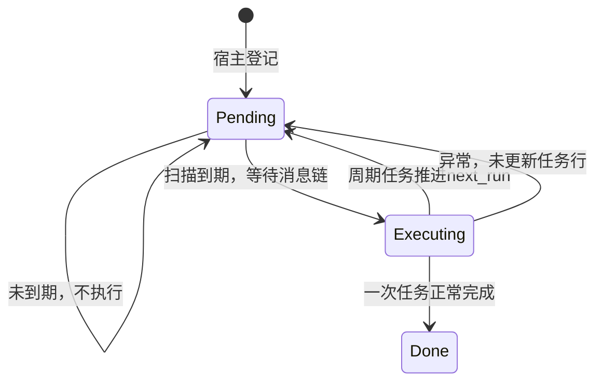
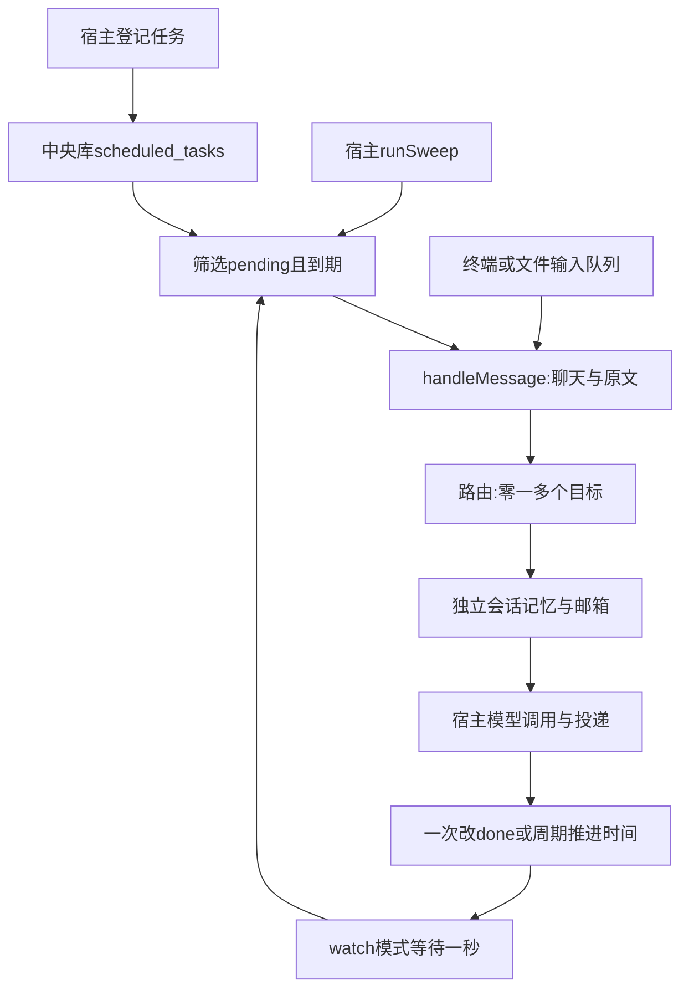
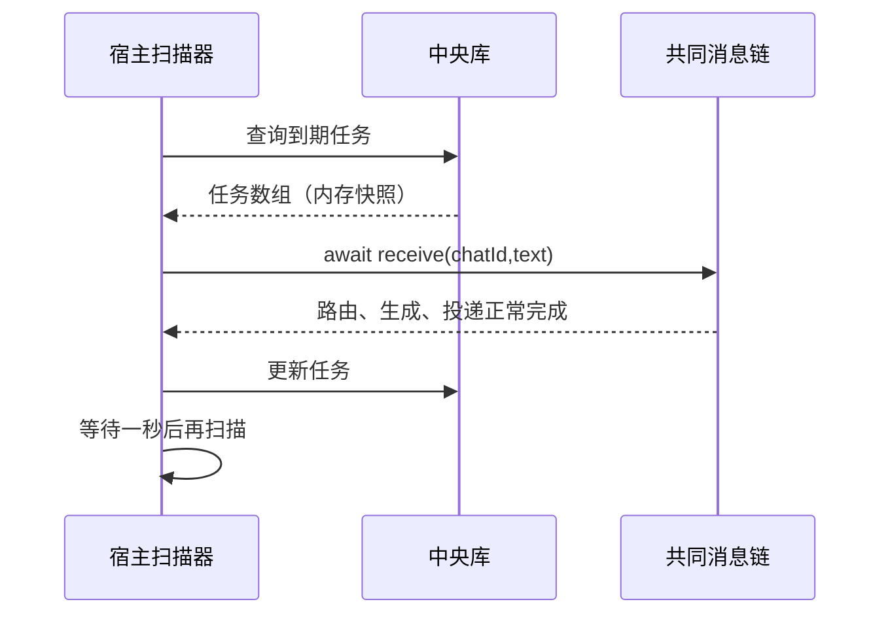

# 第 13 课：让消息按时间自动触发

## 1. 前言

第 12 课之后，"课堂"里的消息已经能交给 Andy 或 Teacher，两位也各自记着
自己的上一句。但整个系统仍有一个前提：必须由你在终端里输入一句话，助手
才会开始工作。现在需求变了——你希望"半分钟后让老师出一道闭包练习"，或者
"每隔一段时间给我一个复习问题"。总不能要求你一直守在终端前，准点手动发
消息。

现有的两个部件都解决不了这个问题。队列只能处理**已经到来**的输入，它没有
地方持久保存"未来的计划"；邮箱只负责在宿主与处理器之间交接消息，它不知道
什么时候应该凭空产生一封新信。

所以本课在宿主的中央库里新增一张任务表：登记时把"什么时候、发什么"存
下来；宿主周期性地扫描到期任务，把任务文字当作一条普通输入，送进第 12 课
已经建好的共同消息链。模型调用、助手角色、会话记忆和邮箱交接全部复用，
一行都没改。

范围上，本课只做两种触发：指定时刻的一次性任务，和固定毫秒间隔的周期
任务。cron 表达式、外部脚本、分布式调度、失败后的自动恢复，都不在本课。

## 2. 主要内容

### 2.1 本课的六个步骤

1. **登记**：你指定聊天、第一轮执行时间、一次还是周期、以及消息文字。
   文字仍然要带上能命中助手的触发词，例如 `@Teacher 给我一道闭包练习`。
2. 登记命令只保存任务本身：不调用模型，不更新会话上一句，也不写入任何
   邮箱。
3. **扫描**：宿主查找状态为 pending、且下一轮时间已经到期（不晚于当前
   时间）的任务，按到期时间和任务编号的顺序逐个执行。
4. 到期的文字进入共同消息链：选择助手、读取各自上一句、留信、更新记忆、
   调用模型、投递回复。和终端输入一样，一个任务也能命中多位助手。
5. 这条链正常返回之后：一次性任务改成 done，从此不再执行；周期任务保持
   pending，但把下一轮时间向前推算。
6. 扫描可以只执行一轮（`--sweep`），也可以持续轮询（`--watch`）。持续
   模式要等这一轮全部结束，再等待一秒进入下一轮，所以慢模型不会让同一个
   进程的两轮扫描叠在一起。

### 2.2 登记链与查看链（宿主侧）

```text
--schedule 课堂 带时区的ISO时间 once '@Teacher 给我一道闭包练习'
→ runSchedule(chatId, when, recurrence, text)
  → routeMessage() 检查当前绑定能否命中
  → Date.parse() 把文字时间转换为毫秒时间戳
  → scheduleTask() 检查参数并INSERT scheduled_tasks
  → 输出“任务1已保存”

--tasks → runTasks()
→ SELECT scheduled_tasks → 展示状态、下一轮时间、周期和原文
```

有一个设计决定值得注意：任务定义里**不保存**助手的角色快照。登记时用
`routeMessage()` 检查一遍"按当前绑定，这句话能不能命中"，只是为了及早
发现配置或拼写错误；真正到期时会重新读取绑定和角色，使用**当时**的配置。
因此登记之后再修改绑定，可能改变任务最终的接收者；如果到期时一个助手都
匹配不上，程序会报错，而不是假装任务完成了。

### 2.3 扫描链与旧输入链汇合

```text
--sweep → runSweep(false) → sweepDueTasks(database, receive, now)
  → SELECT pending且next_run<=now的任务
  → await receive(chatId, text)
    → handleMessage(database, chatId, text, true)
      → routeMessage → getSession → lastSessionMessage
      → enqueueInbound → appendSessionMessage
      → appendUserMessage（搜索只保存一次）
      → processInbox → processMailbox → callAnthropic
      → deliverReplies
  → UPDATE任务状态或下一次时间
```

`--watch → runSweep(true)` 重复执行同样的扫描，每轮之间等待一秒。另一边，
终端和文件入口仍然走原来的输入队列：`processMessages → parseChatLine →
handleMessage`。

为什么要把第 12 课写在队列回调里的业务搬进 `handleMessage`？因为现在真的
出现了**第二条到达业务链的路径**：一条来自终端输入，一条来自定时扫描，
两条路必须走同一套"路由、留信、生成、投递"逻辑。本课没有为此创建通用
渠道接口或任务框架，只是把共用部分提取成了一个函数。

测试链分两层：离线测试用内存中央库加固定的 now 值验证时间状态；SDK 测试
用临时磁盘中央库和多个真实 CLI 进程，让真实 SDK 访问模拟 HTTP 服务，验证
重启后的路由、角色、记忆和重复扫描行为。

相对上一课，新增的是**按时间产生输入的链条**，它汇入原有的路由环节；没有
增加另一套生成算法。定时输入不经过终端那套内存队列，但扫描本身是顺序
await 执行的。

## 3. 技术要点

### 3.0 环境配置

没有新增第三方依赖，继续沿用 Node、TypeScript、内置 SQLite 和 Anthropic
SDK。`pnpm build` 负责编译；自动测试不读取私人 `.env`。主要体验命令是
`node --env-file=.env dist/src/main.js --watch`，仍然使用你已经配置好的
DeepSeek。VS Code 测试按钮的操作在聊天中说明，按钮不可见时直接用终端
命令。

本课新增的代码全部在宿主侧，处理器一行未改，所以继续使用第 12 课的
`lesson12` 容器镜像，不需要重建；也不要把 scheduler、中央库或任务配置
复制进镜像。扫描触发的自动模型调用就在宿主进程里执行，**不会**自动启动
Docker；原来的 `--process-container` 分段入口原样保留。

### 3.1 坐标与函数职责

横向看，消息的旅程多了一个起点：任务登记/扫描 → 共同消息编排 → 路由与
会话 → 邮箱 → 模型 → 投递。纵向看：`main` 负责 CLI 编排；`scheduler`
负责时间筛选与任务状态；`store` 负责打开中央库并初始化表；原来的
`router`、`processor`、`provider` 继续承担原职责。

| 函数 | 执行侧 | 输入 → 输出及职责 |
|---|---|---|
| initializeSchedule | 宿主 | 中央连接 → 创建scheduled_tasks表 |
| runSchedule | 宿主 | CLI文字参数 → 检查绑定、解析时间、输出任务编号 |
| scheduleTask | 宿主 | 聊天、原文、时间戳、可选间隔 → 保存任务，返回number编号 |
| runTasks | 宿主 | 当前中央库 → 展示任务，不调用模型 |
| runSweep | 宿主 | watch布尔值 → 扫一轮或循环；退出时关闭连接 |
| sweepDueTasks | 宿主 | 连接、异步receive函数、now → 执行到期任务，返回完成数量 |
| handleMessage | 宿主 | 聊天、原文、自动处理开关 → 原路由链；返回是否匹配 |
| processMailbox/provider | 处理器所在侧 | 邮箱快照 → 回复；本课扫描自动分支在宿主 |

`handleMessage` 在没有任何助手命中时返回 false。普通终端闲聊因此照旧被
忽略；而定时任务的 receive 回调会检查这个 false 并报错——这样"没有交给
任何助手"就不会被记成任务完成。

### 3.2 数据：任务定义、会话记忆和邮箱是三回事

例如安排 Teacher 在 18:00 出练习，中央库会新增一行：

```text
scheduled_tasks:
  id=1
  chat_id=课堂
  text=@Teacher 给我一道闭包练习
  next_run=带时区的18:00转换后的毫秒时间戳
  interval_ms=null
  status=pending
```

下一轮时间是一个整数毫秒时间戳。它不保存"半分钟以后"这种相对描述——
相对描述在下次读取时会变成另一个时刻；它也不是 SQLite 的自动计时器：
数据库只负责存数字，"到点了没有"由宿主扫描来判断。`interval_ms` 为 null
代表一次性任务，60000 代表固定间隔一分钟。还要注意编号空间：任务编号
不等于会话编号，也不等于入站或出站邮箱里的消息编号。

| 数据 | 谁写/读 | 文件实际位置 | 何时产生 |
|---|---|---|---|
| scheduled_tasks任务定义 | 宿主写、宿主读 | 宿主conversation.db | 登记时 |
| sessions/session_messages | 宿主写、宿主读 | 宿主conversation.db | 到期进入业务链时 |
| messages搜索记录 | 宿主写、宿主读 | 宿主conversation.db | 到期且命中目标时，一次输入只记一次 |
| 入站text/body/previous_body/system_prompt | 宿主写，处理器读 | 宿主每会话inbound.db | 到期路由之后 |
| 回复 | 处理器写，宿主读 | 宿主每会话output/outbound.db | 模型成功后 |
| 投递确认 | 宿主写、宿主读 | 宿主conversation.db | 输出回复后 |

任务的 `text` 字段保留触发词原文，到期后由路由环节算出各位助手的正文：
mention 命中删除前缀，pattern 命中保留原文。新写入的入站行已经带有
`body` 列，处理器直接使用它，不会重新判断触发词；只有旧版入站行缺少
`body` 时才走旧的 `@Andy` 兼容判断。中央库和邮箱是相互独立的数据库文件，
本课没有"把任务表搬进容器邮箱"之类的变化。

会话的"上一句"在**到期收信时**读取，不是在登记任务时读取。举例：你先
登记了任务，之后又对 Teacher 说了一句"我刚开始学习闭包"，那么到期时练习
消息的 `previous_body` 就是这一句；任务文字本身随后也会成为 Teacher 的
新上一句。注意任务文字不是模拟出来的助手回答，也不是系统角色词。

### 3.3 状态与正常重复扫描



`Executing` 只是程序执行过程中的一个阶段，不是数据库里新增的状态列。
`status` 只有 pending 和 done 两种取值，由宿主改变并保存在中央库。一次
任务变成 done 后不会再被选中；周期任务被推进后的下一轮时间总在未来，所以
同一时刻的正常重复扫描不会把任务执行两遍。

周期任务错过之后如何推进？看一个具体例子：第一轮在 1000ms，间隔 1000ms，
当前时间 4500ms。本轮只执行一次，下一轮被推到 5000ms：

```text
nextRun = previousRun
        + (floor((now - previousRun) / interval) + 1) * interval
        = 1000 + (floor(3500 / 1000) + 1) * 1000
        = 5000
```

读这个公式：错过的 2000、3000、4000 三个时点**不会逐条补发**——否则重启
后会突然集中请求模型；但下一轮也不是简单地在当前时间上加一个间隔，而是
仍然对齐原来的时间网格。`now` 是这一轮扫描开始时的快照：如果模型处理
很慢，算出来的下一轮时间可能在处理结束时已经到期，下一轮扫描会立刻继续
处理它，这是设计内行为。

### 3.4 新链条与轮询图





图上有两个入口指向 `handleMessage`：一个来自终端或文件的输入队列，一个
来自定时扫描。它们表示的是两条**到达路径**汇入同一条业务链，不是两个
并行执行者——扫描循环仍然是顺序执行的。

### 3.5 细节技术点：时间、回调与循环

**时间戳与时区**：`Date.now()` 返回从 1970 年 UTC 零点起的毫秒数；
`Date.parse()` 把时间文字转换成这种整数；`toISOString()` 把整数显示成
UTC 时间（末尾带 Z），不是本地时间。例如 `18:00:00+08:00` 和 `10:00:00Z`
指的是同一时刻。CLI 因此要求完整的日期、字母 T 和时区尾缀——否则一段
没有时区的时间文字，会被按另一台机器的本地时区解释。解析失败得到的 NaN
会被参数检查拒绝；另外要清楚，JavaScript 的日期解析不是一个完整的日历
输入校验器。

**Number.isSafeInteger**：它检查一个值是否是可精确表示的整数，同时拒绝
NaN、小数等。周期任务的间隔必须大于零，否则周期公式会出现除以零。SQL
全部使用参数绑定，不把消息文字拼接进语句。

**receive 回调**：scheduler 模块知道"什么时候该执行"，但它不需要导入
main 模块——是 main 把"怎样执行现有消息链"的那个 async 函数作为参数交给
它。`sweepDueTasks` 里的 `await receive(chatId, text)` 就等于调用这个函数
并等它完成。这只是复用需求带来的普通函数参数，不是后台线程，也不是事件
总线。

**固定测试时间**：`now` 参数默认取 `Date.now()`，测试里直接传入 999、
1000、4500 这样的数字。我们改变的是函数收到的时间值，而不是去修改电脑
时钟，所以边界测试既快又稳定。

**delay 与顺序 await**：从 `node:timers/promises` 导入 setTimeout 并命名
为 delay。`await delay(1000)` 让当前这个 async 函数一秒后继续，并不是
阻塞整个 Node 进程。`do...while` 先执行一轮再判断条件，保证 `--sweep`
也至少执行一轮。这里刻意不用 `setInterval`：如果上一轮的慢模型还没跑完，
定时器反复触发回调会让多轮执行重叠；本课的写法是上一轮结束后才等待。因此
实际的执行间隔是"本轮工作耗时加一秒"，不保证精确到毫秒。

**SIGINT/SIGTERM**：Ctrl+C 通常向进程发送 SIGINT 信号。`runSweep` 注册了
stop 函数，它只是把 `stopping` 标志设为 true，不会立刻打断进行中的 SDK
请求——当前选中的这一批任务会处理完，然后才退出，finally 里移除监听并
关闭数据库。退出之后没有任何后台调度服务继续运行；任务记录仍在中央库里，
下次启动会继续扫描。如果模型调用失败，程序抛错退出，本课没有自动退避。

### 3.6 明确的边界与原项目取舍

只运行一个扫描进程：不要同时开两个 `--watch`，也不要在 `--watch` 运行
期间对同一目录再执行 `--sweep`。当前没有跨进程的抢占锁——SQLite 只是
保存数据，它不会自动阻止两个扫描器选中同一个任务。

"正常重复扫描不会重发"不等于"故障下恰好一次"。如果在模型成功、投递完成
之后、任务更新之前崩溃，或者某位助手执行失败，下一次扫描就可能重新留信、
重新请求模型，重复的记忆和输出也可能发生。本课没有自动重试，也没有任务
取消、暂停或删除命令；不要把本课的周期任务当生产环境的提醒服务用。

原项目里任务属于 Agent 群组，使用独立的系统会话，可以用 cron 表达式并
投递到指定目的地。本课刻意不照搬这些：定时文字发给已有的聊天和绑定，复用
当前会话；保留"未来/周期执行"的思想，但独立任务会话、脚本门控、审批、
cron 库和原项目的频率限制都不引入。因此周期任务可能持续请求模型并产生
费用——只有你手动登记才会启用；自动测试不会创建私人任务。

## 4. 测试与验收

### 4.1 时间与状态测试

测试输入是两个 1000ms 到期的任务：一个 once，一个 1000ms 周期。预期：
now=999 时不执行；now=1000 时两条都执行；重复传入 now=1000 不再执行；
now=4500 时周期任务执行一次并推进到 5000。模拟的接收函数失败时，任务
不被确认，下一轮不被推进。这一层证明边界、顺序和状态，不生成 local
回复。

### 4.2 跨进程SDK测试

测试在临时目录里登记三类消息——老师专属消息、两位共收消息、未来消息——
然后由另一个 CLI 进程扫描，真实 SDK 把请求发往本机回环的模拟 HTTP 服务。
预期：两位请求的角色不同；Andy 不知道老师专属的"香蕉"，Teacher 的请求
带着香蕉上下文；未来消息仍是 pending；搜索结果里"闭包"只出现一条；重复
扫描不产生新的 HTTP 请求。测试还会启动 watch 处理一条一次性任务，然后
发送 SIGINT，验证进程正常退出且任务已确认。它证明的是持久化与同链复用，
不证明云端账号可用或模型回答质量。

普通回归共 20 项，真实 Docker 回归 1 项；处理器未改动，本课不新增重复的
local 回复测试。

### 4.3 主要验收：半分钟后让DeepSeek出练习

先编译，在一个新聊天里配置老师，然后计算"当前时间 + 30 秒"，登记一次性
任务并启动持续扫描：

```bash
pnpm build
node dist/src/main.js --wire 定时课堂 Teacher mention '@Teacher' '你是耐心的TypeScript老师，用中文给初学者出题。'
lesson13_at=$(node -e 'console.log(new Date(Date.now()+30000).toISOString())')
node dist/src/main.js --schedule 定时课堂 "$lesson13_at" once '@Teacher 给我一道关于闭包的小练习，先不要公布答案。'
node dist/src/main.js --tasks
node --env-file=.env dist/src/main.js --watch
```

逐项核对预期：

1. 时间未到时，watch 不会为这个任务产生任何模型请求。
2. 到期后出现一条带 `[Teacher]` 标记、内容与闭包练习相关的回答。
3. 看到回答后 Ctrl+C 退出，再执行 `--tasks`，该任务的状态应为 done。
4. 再次执行加载了 .env 的 `--sweep`，这个任务不会再次请求模型（其他已经
   到期的 pending 任务仍会正常执行）。注意：登记命令本身不加载 `.env`，
   因为它不调用模型。

想观察重启恢复，可以登记一个未来任务后先不启动 watch，稍后再启动：任务
一直保存在中央库里，停机期间错过的那一次会在下次扫描时执行。另外，登记
命令每次都会创建一条新任务，不是更新，也不会去重。

周期任务把 `once` 换成正整数毫秒即可，例如 60000 表示每分钟一次。它会在
每个周期持续请求模型、消耗额度；本课建议只用一次性任务做验收，周期行为
由离线测试证明，不要无意中登记频繁收费的任务。关闭 watch 只是停止了执行
进程，并不取消周期定义——下次重新启动，任务还会继续执行。

关键理解检查：你能分清任务定义、到期消息、会话上一句和出站回复这四样东西
吗？能解释为什么调度放在宿主而不是容器、为什么"等一秒再进入下一轮"不会
带来并行吗？学生亲自运行测试、提问并手动提交之后，才确认本课验收；如果
报错，请提供隐藏密钥后的完整输出。

## 5. 总结

系统现在能保存"未来或周期"的输入，到期后复用已经建好的多助手链条。以前
系统里只有"已经收到的消息"，内存队列和邮箱就够用了；现在出现了"未来才会
产生的消息"，才需要中央任务表和宿主扫描环节。第三种输入来源推动我们把
`handleMessage` 提取成独立函数，而不是提前安排一个通用框架。

下一步真正暴露的问题，是长期运行中的失败、部分完成与重复执行的窗口；本课
只是如实记录了这些边界，没有提前实现自动恢复、退避或安全文件消息。
