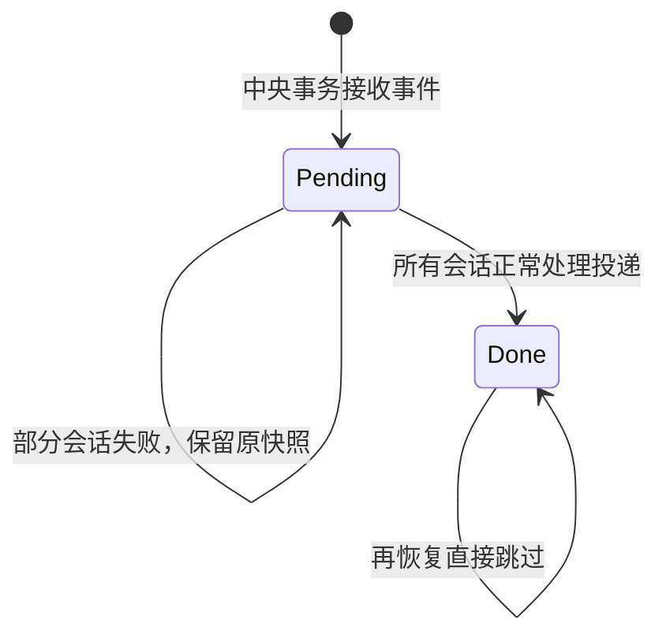
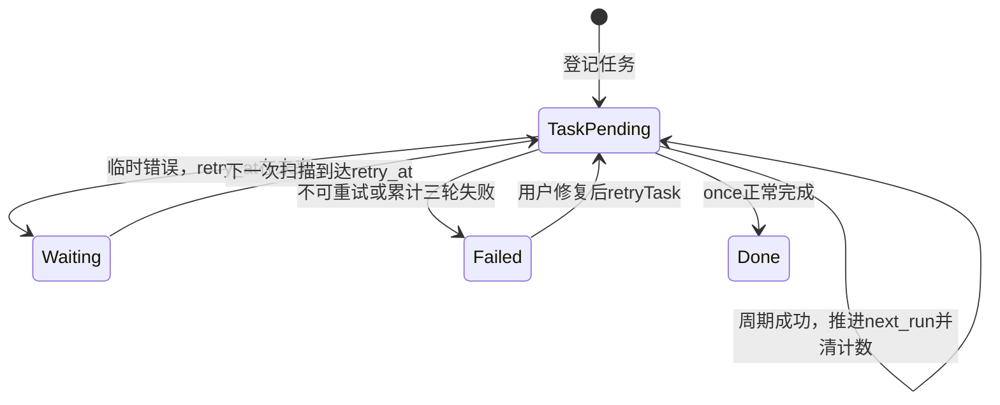
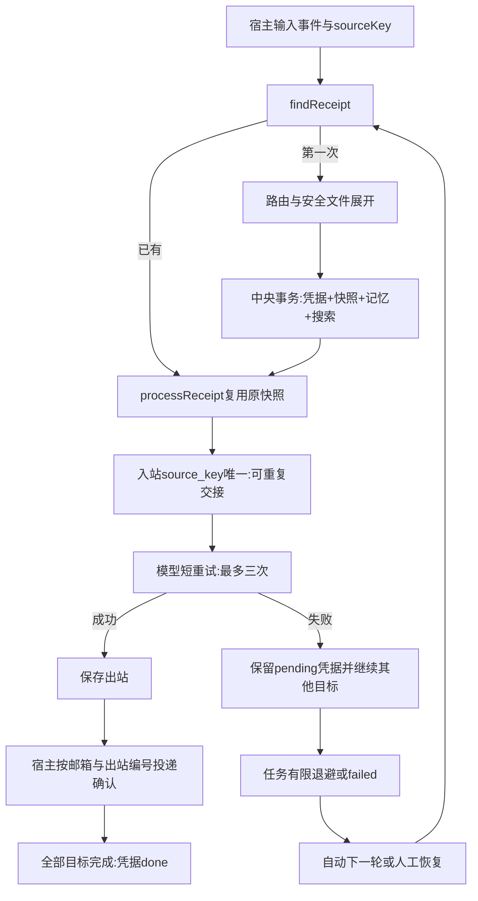

# 第 14 课：失败恢复与安全文件消息

## 1. 前言

第13课已经能让到期任务进入多助手消息链，但长期运行暴露了几个具体问题：
模型临时返回503，整个扫描就退出；Andy已经回答而Teacher失败，重新扫描却
给两位重新留信、重复更新记忆；你想让模型读一份笔记，程序却还不能安全读取文件。

本课先给真实模型请求加有上限的重试，再让宿主记住“这条事件已经接收过”，
恢复时使用原消息与原快照；最后增加只读附件目录里的小型文本输入。新增结构
都是为这些已经出现的问题服务，不引入完整工作流引擎、文件上传平台或权限系统。
特别注意：正常重复执行不重发，不等于所有崩溃情况下绝对恰好一次。

## 2. 主要内容

### 2.1 先理解新增步骤

1. 同一次真实模型调用，只有连接错误、429、5xx才自动重试，最多三次请求；
   401等认证错误应让你修复配置，不反复消耗额度。
2. 宿主首次接收事件时，保存一个凭据，以及该事件给每位助手的正文、上一句、
   角色快照。凭据、目标快照、会话记忆、搜索记录在同一个中央事务提交。
3. 提交后给每个目标交接到邮箱；邮箱按事件标识去重，恢复可重复交接。
4. 逐个处理目标：一位失败仍尝试另一位；已有出站不重新请求模型，已投递回复
   不正常重发。全部成功才把凭据改done。
5. 定时任务失败不改变本轮时间。临时错误有限退避，达到上限或遇到不可重试
   错误改failed。这个失败任务不阻止扫描后面的其他任务。
6. 输入文件命令时，宿主先验证附件路径、类型、大小、编码，读取成正文快照，
   再保存凭据。容器只接收文字，不获得原文件目录挂载。

### 2.2 首次接收与交接链

```text
终端/重放/到期任务 → handleMessage(database, chatId, text, autoProcess, sourceKey)
  → findReceipt(sourceKey)：以前是否收到过？
  → 没有：routeMessage决定目标
    → expandFileMessage：普通正文不变；文件命令展开为安全文本
    → recordReceipt
      → getSession准备会话
      → BEGIN中央事务
      → 保存receipts及receipt_targets
      → 读取上一句、追加session_messages
      → 写一条搜索messages → COMMIT
  → processReceipt
    → receiptTargets读取原快照
    → enqueueInbound按source_key留信或跳过已有信
    → processInbox → processMailbox → provider
    → deliverReplies正常去重投递
    → 所有目标成功才确认凭据done
```

终端每输入一行是新事件，默认用randomUUID编号。定时任务给出稳定编号
`task:<任务ID>:<本轮next_run>`，失败后仍使用它。因此“重新发送相同文字”
不是恢复，它是新事件；恢复必须找原凭据。

### 2.3 模型重试与调度恢复链

```text
callAnthropic → retryTransient(() => client.messages.create(...))
  → 失败 → isTransientError
  → 可重试且未到三次：等待100ms/200ms，再请求
  → 成功：沿原出站链写回复
  → 不可重试或耗尽：向上抛出，不写成功回复

sweepDueTasks → 同一task轮次的handleMessage
  → 失败：failures+1
    → 临时错误且失败轮数<3：pending，设置retry_at
    → 否则：failed，等待你检查
  → continue：继续扫描其他任务
  → 成功：确认done或推进下一轮时间，清空失败计数
```

任务层的等待是中央库里的retry_at，扫描器不在catch里长时间sleep。
模型层短等待在处理器内。两层预算相乘：一个目标持续暂时失败时，每轮最多
三次HTTP请求、最多三轮自动任务执行，即最多九次；多目标可能更多。
这是有限自动重试，不是免费或无限可靠的保证。

### 2.4 手动恢复链与分段容器链

```text
--recover → runRecover()
→ 查中央库pending凭据 → processReceipt(原凭据)
→ 原目标/原快照 → 同一邮箱 → 仅未处理/未投递结果 → done

--retry-task 1 → runRetryTask() → retryTask()
→ failed任务改pending，清失败计数，但保留next_run
之后--sweep/--watch → 同一事件编号 → 复用原凭据
```

`--recover`在宿主执行模型，也会处理--receive留下的未完成凭据。它不更新
调度任务状态；如果任务已failed，随后还需--retry-task和--sweep确认任务状态。
凭据已done时再次扫描只完成任务账目，不请求模型。

容器分段仍是宿主--receive → 宿主--process-container启动容器 →
容器processMailbox/provider/retryTransient → 宿主--deliver。
分段处理/投递不直接更新凭据done；以后--recover会根据现有出站/投递确认
完成凭据确认，不正常重发。

测试链：注入短等待验证预算 → 固定时间验证任务退避 → 真实SDK模拟服务与
多个CLI进程验证部分成功和恢复 → 临时附件验证路径边界；Docker单测沿旧链
增加文件正文快照，容器依然没有附件目录。

相比上一课，新增的是**原链内部的短重试分支、宿主恢复链、文件正文转换环节**；
不是再写一套模型流程。凭据是解决跨中央库和邮箱交接问题的宿主账本。

## 3. 技术要点

### 3.0 环境与构建

没有新增第三方依赖，继续使用已有Anthropic SDK和Node内置组件。新增retry.ts
是处理器依赖，镜像需要复制retry.js；重建镜像为`nanoclaw-st-agent:lesson14`：

```bash
pnpm test
pnpm container:build
pnpm test:container
```

不把receipt、scheduler、file-message、中央库、私人.env或attachments复制进
镜像。SDK内建maxRetries仍为0，只有明确的retryTransient控制短重试，避免
两个HTTP重试层叠加。主要功能验收继续用你已有的DeepSeek配置。

### 3.1 坐标：宿主记账，处理器重试，文件驻留宿主

| 函数/模块 | 执行侧 | 输入→输出及职责 |
|---|---|---|
| handleMessage | 宿主 | 原文与事件ID→首次登记或复用凭据 |
| expandFileMessage | 宿主 | route.body→普通正文或文件文本快照 |
| recordReceipt | 宿主 | 事件、路由数组→持久凭据；事务更新记忆和搜索 |
| receiptTargets | 宿主 | 凭据ID→原会话、正文、角色、上一句 |
| processReceipt | 宿主 | 凭据→逐会话交接/处理/投递，汇总失败 |
| enqueueInbound | 宿主 | source_key与快照→一封入站或已有信 |
| retryTransient | 处理器所在侧 | 请求函数→成功响应或最终异常；最多三次 |
| isTransientError | 两侧共用 | unknown错误→是否暂时性 |
| sweepDueTasks/retryTask | 宿主 | 到期任务/failed编号→有限退避/人工重启 |
| runRecover | 宿主 | 中央pending凭据→原链恢复 |
| processMailbox | 宿主或容器 | 只读入站→成功才写出站，算法保持不变 |

横向模块仍是来源→路由→会话→邮箱→模型→投递。纵向main编排业务，
receipt保存中央事件账目，mailbox负责跨进程文件交接，provider负责API调用。
没有新后台服务或并发框架。

### 3.2 数据：四种“确认”不是同一件事

假设任务1本轮时间戳1000，向两位发`@Andy 解释闭包`：

```text
scheduled_tasks:
  id=1, next_run=1000, status=pending, failures=0, retry_at=0
receipts:
  id=task:1:1000, chat_id=课堂, text=@Andy 解释闭包, status=pending
receipt_targets（两行）:
  receipt_id=task:1:1000, session_id=1, body=解释闭包,
  previous_body=null, system_prompt=通用角色
  receipt_id=task:1:1000, session_id=2, body=@Andy 解释闭包,
  previous_body=@Teacher 我在学闭包, system_prompt=老师角色
```

以上全部在宿主中央conversation.db。Receipt内存对象只带id/text/status，
不是全部数据库列；ReceiptTarget把session_id连接到sessions表，补出
mailboxKey和agentId，供交接调用使用。它没有任务周期或API密钥。

两个不同入站库各有一行：

```text
id=1, source_key=task:1:1000,
text=@Andy 解释闭包,
body=<该助手正文>, previous_body=<该助手上一句>,
system_prompt=<原角色>
```

同一source_key能出现在两个会话的不同库里，表示扇出；在每个入站库内只允许
一行。`source_key`是事件标识，不是入站自动编号。旧入站新增列默认null，
SQLite唯一索引允许多行null，不改变旧消息编号。

| 确认 | 存在哪里 | 谁改变 | 具体含义 |
|---|---|---|---|
| 凭据已接收 | 中央receipts/targets存在 | 宿主 | 目标、正文、记忆快照已提交，可继续交接 |
| 模型已处理 | 会话出站replies的inbound_id存在 | 处理器 | 成功回复已保存，不正常重复调用API |
| 回复已投递 | 中央delivered_replies | 宿主 | 该邮箱的出站编号已向终端输出 |
| 本事件全部完成 | 中央receipts.status=done | 宿主 | 所有目标的自动链都正常完成 |
| 任务轮次完成 | 中央scheduled_tasks状态/时间 | 宿主 | once完成或周期已推进 |

它们关联，却不能互相替代。凭据pending可能已经有部分回复；任务failed也
不表示原输入消失。任务账目与凭据、入站编号不是同一标识。

### 3.3 为什么中央事务后还能恢复邮箱

第13课先写邮箱，再写记忆；部分失败后没有办法知道哪些记忆已经追加。
现在先把目标快照、记忆、搜索与凭据一起提交。任一步中央写失败就ROLLBACK，
没有半份记忆。getSession先在事务外准备，避免它内部BEGIN与外层嵌套；
因此失败可能留下空会话，但不会假装消息已经接收。

中央提交后，某个邮箱写入失败怎么办？原目标与快照已经保存，--recover可
继续交接；已经写过的邮箱通过source_key唯一约束拒绝重复留信。
使用`ON CONFLICT(source_key) DO NOTHING`，不是先查再猜测是否插入。
中央库与邮箱仍没有共同事务，我们用持久凭据加可重复交接补上这段窗口。

恢复读取receipt_targets而不重新查路由或读上一句。因此后来修改Teacher提示词、
发送新消息、修改原附件，都不会改变这条已接收事件的正文、角色和上下文。
会话记忆与搜索记录只在首次recordReceipt时写入，不在恢复时再写。

### 3.4 状态与两个重试预算





Waiting仍是pending状态，只由retry_at表达，模型短等待也不新增状态列。
task:1:1000失败后next_run始终1000；第一次失败设retry_at=now+1000，
第二次设now+2000，第三次停止自动执行。成功后才推进周期next_run。
这里退避起点是失败时：运行未传now会在失败后再取真实时间，慢模型不会提前
耗掉等待。测试显式传固定now，就用该值作为模拟的扫描与失败时间。
last_error只保存错误名称，不保存原始服务错误正文，避免状态字段泄露隐私。
不可重试的错误也改failed，让你修复，而非永久每秒重复。

`--sweep`不因某个任务失败而退出，失败任务由--tasks查看；退出码0不等于
所有任务成功。--recover汇总无法完成的凭据并报错，仍会尝试其他凭据。
同一邮箱内处理仍按入站顺序，旧的永久错误消息可能挡住该邮箱后面的处理；
本课没有自动丢弃或隔离“毒消息”，应先修复或人工处理，不宣称全面容错。

### 3.5 文件数据从哪里来，交给谁

在使用mention绑定的聊天中输入：

```text
[文件课堂] @Teacher /file 示例笔记.md 用两句话总结
→ text = @Teacher /file 示例笔记.md 用两句话总结
→ route.body = /file 示例笔记.md 用两句话总结
→ expanded.body = 用两句话总结\n\n文件：示例笔记.md\n<文件文本>
→ 中央目标快照、会话记忆、入站body
→ SDK用户正文 → DeepSeek
```

text仍保留原命令；body才是实际模型正文。现在搜索也会包含文件快照正文，
不是仅保存原命令。若用pattern规则保留@Teacher前缀，body不以/file开头，
不会触发文件展开；本课文件示例明确使用mention。

附件实际在宿主attachments目录，允许.md/.txt、最多16KiB、严格UTF-8、
普通文件；不支持PDF、图片、带空格的文件名或任意宿主路径。
宿主读取一次后把文字复制进中央/邮箱快照，容器仅通过只读入站获得这份文字。
删除或修改原文件不影响已经接收的快照；但不能据此说模型获得文件访问权限。
私人附件默认Git忽略，只保留公开示例。不要把秘密或不希望送给服务商的内容放入请求。

### 3.6 路径与读取的细节技术

**目录跳转与符号链接**：../表示向上走，绝对路径跳过允许目录，先拒绝；
符号链接像一个指向另处的快捷方式，lstat检查链接本身，逐级拒绝链接。
realpath取得实际路径，再用relative确认没有逃出真实附件根目录。
不能只用startsWith检查，因为attachments-secret也可能有同样文字前缀。

**文件描述符**：openSync得到当前打开文件的数字句柄，之后fstatSync检查
这个打开对象，而不是反复按名字查询。O_NOFOLLOW拒绝打开时最后一段变成
符号链接，O_RDONLY只读。try/finally确保失败也closeSync关闭。
这些同步操作会短暂阻塞Node，当前只允许小文件，暂不引入流式读取框架。

**字节上限与编码**：16KiB等于16384字节，不是16384个中文字符。
Buffer.alloc创建上限+1字节空间；readSync有限循环读取，超过上限就拒绝，
不因检查后文件增长而无限读内存。TextDecoder的fatal:true遇到非法UTF-8报错，
不静默替换乱码。扩展名只是允许名单，不证明内容可信。

**安全边界不是万能**：这些检查针对本地可控目录中的路径输入。拥有宿主权限的
恶意进程可并发替换中间目录，逐级检查和open之间仍有竞态；本课不宣称完全
抵御恶意宿主进程，也不支持不可信用户任意更改附件根目录。
文件内容可能含提示词注入，路径安全不等于内容安全；本课模型不执行工具。

### 3.7 异常、类型与流程图

**unknown与instanceof**：捕获值不保证是Error；先判断APIError或
APIConnectionError再检查状态。AggregateError汇集多个助手异常，只有所有
子错误都是暂时性时，才认为这轮可自动重试。API超时属于连接错误。

**回调与泛型T**：retryTransient不懂模型响应字段，它调用传入operation并
返回相同结果类型T。当前只有这一个短重试函数，不建立重试策略注册中心。
sleep可传测试替身，记录100/200而不真实等待。

**UUID默认参数推断**：randomUUID的Node类型声明是带连字符的模板字符串
类型；参数明确写sourceKey:string，才能接收task:1:1000等非UUID事件编号。
“默认值是UUID”不等于“所有事件编号必须是UUID”；类型注解表示当前业务约定。

**continue与错误汇总**：调度catch更新失败记录后continue，不执行该任务的
成功确认；接着处理下一个任务。processReceipt则收集各会话错误，全部试过后
再抛AggregateError，所以一位失败不会直接跳过另一位。



### 3.8 保留下来的准确边界

只运行一个宿主扫描/恢复进程。唯一索引不能代替跨进程任务抢占或模型执行锁。
HTTP服务已成功而响应丢失，或API成功、出站尚未保存就崩溃，仍可能重复请求；
stdout输出后、投递确认提交前崩溃，仍可能重复显示。本课没有外部平台幂等键、
分布式事务、断电演练、取消任务或新权限框架，不把有限模拟测试当成绝对保证。

第14课升级前的消息没有凭据，只能继续使用旧分段处理/投递命令；
--recover不会凭空重建过去缺失的接收账目。旧消息编号和投递确认保留。
手动重放相同文本文件仍是新输入，不能与“恢复同一事件”混为一谈。

## 4. 测试与验收

### 4.1 模型短重试与调度退避

输入503两次后成功，预期三次调用、等待100/200ms；输入401只调用一次；
持续503最多三次后抛错。证明错误分类和预算，不调用云端。

固定时间测试：两个任务同时到期，一个临时失败、一个成功；成功任务完成，
失败任务在retry_at前不执行，三轮后failed；人工retryTask后事件编号保持
task:1:1000。证明任务状态持久化与继续扫描，不依赖真实等待。

### 4.2 部分成功、跨进程恢复与文件快照

真实SDK请求本地模拟服务：Andy第一次503、重试成功；Teacher401失败。
修复服务并修改绑定角色后，手动重启任务；预期只新增Teacher一条请求，
仍使用原角色和原上下文。搜索只有一条，会话记忆只有首次的两行。
重复recover/sweep不新增请求或输出。另收取文件后修改原文件，recover的
SDK请求仍包含旧快照。证明正常恢复路径，不证明收费服务可用。
同一测试还故意阻止中央目标写入，验证事务回滚；再模拟中央已提交但尚无入站
文件，recover仅凭中央快照完成交接。这里模拟明确交接窗口，不声称演练了所有断电故障。

### 4.3 路径与Docker边界

临时文件测试：有效笔记可展开；../、绝对路径、符号链接、非允许后缀、
超过16KiB、非法编码都拒绝。被拒绝的文件不交给模型。
真实Docker回归只挂载入站与输出，容器内没有attachments或中央库；
新增文件正文通过入站快照完成容器往返。这里沿用local作权限回归，
不增加大量重复local措辞测试。普通测试24项，真实Docker测试1项。

### 4.4 主要验收：用DeepSeek读公开笔记

```bash
pnpm build
node dist/src/main.js --wire 文件课堂 Teacher mention '@Teacher' '你是耐心的TypeScript老师，用中文讲解提供的笔记。'
pnpm start:model
```

输入：

```text
[文件课堂] @Teacher /file 示例笔记.md 用两句话总结，并出一道小练习
```

应得到与闭包笔记相关的自然语言回答。云端措辞不做精确断言；一次正常调用
可能因暂时错误自动请求多次并收费。退出后--recover应无本事件新输出，
但其他pending凭据也会被处理，请先了解自己未完成的消息。

想体验“接收后稍后恢复”，使用另一条新请求：

```bash
printf '[文件课堂] @Teacher /file 示例笔记.md 给我一个闭包的小例子\n' | node dist/src/main.js --receive
node --env-file=.env dist/src/main.js --recover
node --env-file=.env dist/src/main.js --recover
```

第一次recover生成、投递，第二次正常不重新请求。它们是两条不同事件，
不是靠消息文字相等去重。容器验收用--process-container 文件课堂 Teacher
与--deliver 文件课堂 Teacher替代第一次recover；先重建lesson14镜像。

若定时任务因密钥错误failed，先修复.env，用--tasks检查编号，然后手动
--retry-task 编号，再加载.env执行--sweep。不要反复重发原文字制造新输入。
临时503、401和部分失败由离线服务模拟验证，不需要你主动制造收费失败。
失败时提供隐藏凭据后的完整输出，学生亲自测试、提问、提交后才确认本课验收。

## 5. 总结

系统从“失败后重新走整条输入链”演化为“记住同一事件，恢复原快照与原邮箱”。
中央凭据与事务避免恢复时重复记忆，入站唯一事件标识避免重复留信，出站和
投递确认继续阻止正常重复请求/输出；短重试与任务退避都有明确上限。
文件输入只在宿主小范围读取，再变成已有消息链的正文，不扩大容器文件权限。

这些机制解决了具体恢复问题，但不是绝对恰好一次。实际部署还需要让用户
看清状态、配置、日志、取消/管理需求和安全边界；那属于后续需求，不在本课
提前生成第15课实现。
