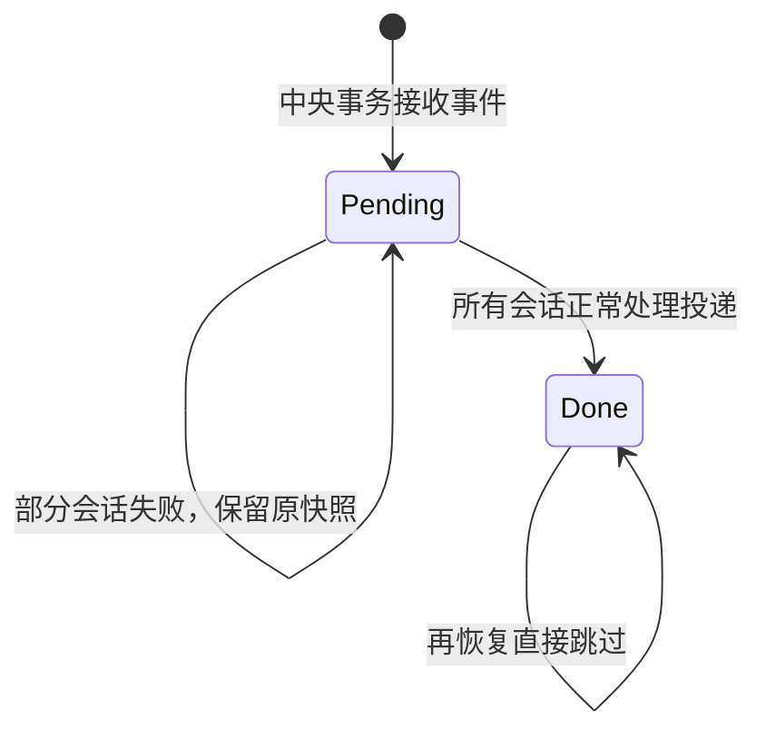
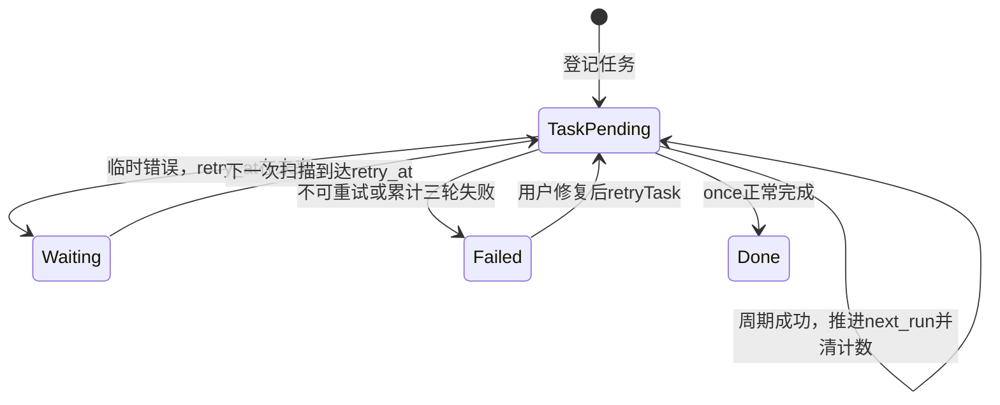
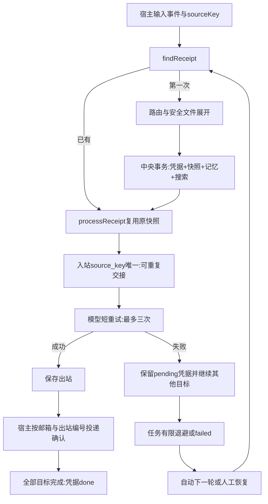

# 第 14 课：失败恢复与安全文件消息

> 本篇是第 14 课的重讲版：不再逐节对应原教案的格式，而是按照"先有问题、
> 再有概念、再看数据、后读代码"的顺序重新组织，帮助你理解这一课的内容和
> 代码。所有技术事实与原教案一致。

## 一、从三个事故说起：这一课在解决什么

第 13 课结束时，系统已经能让到期任务进入多助手消息链。但把它放到长期运行
的环境里，你会先后遇到三个场景：

**事故一：一次 503，一整轮扫描全没了。**
watch 正在扫描，模型服务临时返回一个 503。第 13 课的代码没有任何重试，
这个错误一路向上抛，整个扫描进程直接退出。你只能手动重启——而手动重启
马上引出第二个事故。

**事故二：重启之后，Andy 被重复"告知"了一遍。**
上一轮里 Andy 其实已经成功回答了，失败的只有 Teacher。但第 13 课的代码
不知道"这条消息已经接收过"，重启后重新扫描，把这条输入当成一条全新的
消息：重新路由、重新读上一句、给两位都重新留信。结果 Andy 的会话记忆里
出现了重复的消息，还会多请求一次模型、多花一次钱。

**事故三：想让模型读一份笔记，程序却不敢读文件。**
你说"读一下示例笔记.md 再帮我总结"。可读文件这件事牵扯路径、符号链接、
编码、大小限制——不加约束地读取用户给的任意路径是不安全的，所以在之前的
课程里干脆不支持。

本课做三件事，一一对应这三个事故：

1. 给真实模型请求加上**有上限的短重试**（治事故一）；
2. 让宿主记住"这条事件已经接收过"——建立**凭据**机制，恢复时使用原消息
   和原快照（治事故二）；
3. 增加从**只读附件目录**读取小型文本文件的输入方式（治事故三）。

同时先划清范围：本课不引入完整的工作流引擎、文件上传平台或权限系统，所有
新增结构都只为上面三个已经出现的问题服务。

最后，请提前记住一句贯穿全课的限定语：**"正常重复执行不重发"不等于"任何
崩溃情况下都绝对恰好一次"**。第五、九节会准确说明还差在哪里。

## 二、核心思想：给每条输入发一张"身份证"

事故二的根因，是系统对"这条输入"没有任何记忆。处理一条消息要经过路由、
读上一句、写记忆、写邮箱、调模型、投递——这些步骤分散在中央库和多个邮箱
文件里，任何一步都可能失败。想要失败之后能恢复，就必须在任何一步开始之前，
先用一份**集中的、一次写入的记录**把三件事钉下来：这条输入是什么、要交给
谁、当时的上下文长什么样。

这份记录由四个概念组成，先逐个认识：

**事件**：一次到达系统的输入。终端里敲的一行、重放文件里的一行、定时任务
到期产生的文字，各是一次事件。每次事件有一个唯一标识 sourceKey：终端输入
默认用 `randomUUID()` 生成；定时任务用稳定编号
`task:<任务ID>:<本轮next_run>`，例如 `task:1:1000`。注意：事件靠**编号**
区分，不靠内容区分——重新发送一段一模一样的文字，是一个新事件（新编号），
不是原来那次事件。

**凭据**：宿主首次接收事件时，在中央库 `receipts` 表里写下的一行账目，
含义是"这个编号的事件我收过了，目前处理到什么状态"。它的日常用途就是回答
`findReceipt(sourceKey)` 的提问："以前收到过吗？"——收到过就走恢复，没
收到过才走首次登记。凭据的 status 只有 pending 和 done 两档。

**目标**：路由环节决定这次事件交给哪几位助手，每一位就是一个目标，在
`receipt_targets` 表里各占一行。一个事件可以命中零、一或多个目标。

**快照**：登记那一刻为每个目标定格的数据副本——交给这位助手的正文 body、
收信那一刻该会话的上一句 previous_body、当时的角色提示词 system_prompt。
文件消息展开出来的文本也属于快照。快照一旦写入就不再改变。

用点菜打个比方：事件是这次点单本身；凭据是前台开的小票，单号证明"这单
接过了"，状态栏写着制作中还是已完成；目标是这单分给几位厨师各做的菜；
快照是下单那一刻锁定的菜单和备注——之后厨房改了菜单，也不影响这单已经
下锅的内容。

把第 13 课那个例子放到这四个概念里。任务 1 在时间戳 1000 到期，文字是
发给两位的 `@Andy 解释闭包`：

| 概念 | 在这个例子中 |
|---|---|
| 事件 | `task:1:1000` 这一轮执行，原文 `@Andy 解释闭包` |
| 凭据 | `receipts` 一行：`id=task:1:1000, status=pending` |
| 目标 | `receipt_targets` 两行：会话 1（Andy）和会话 2（Teacher） |
| 快照 | Andy 行：`body=解释闭包`（mention 去前缀）、`previous_body=null`；Teacher 行：`body=@Andy 解释闭包`（pattern 保留原文）、`previous_body=@Teacher 我在学闭包`，各自的角色提示词 |

最后回答"为什么缺一不可"——每个概念恰好堵住一个漏洞：

- **凭据**堵住"重复接收"：`findReceipt` 一查便知这个事件收过没有；
- **稳定的事件编号**堵住"同文不同命"：恢复靠编号找到同一件事，而不是靠
  "文字长得一样"去猜；
- **目标与快照**堵住"恢复时重新决策"：不重新路由、不重新读上一句，所以
  不会重复更新记忆，上下文也不会漂移；
- **凭据 + 目标快照放在同一个中央事务**堵住"半份记忆"：要么全部写入，
  要么什么都没写。

## 三、先看数据：三张表、两个邮箱、几个内存对象

理解代码之前，先看清磁盘上多了什么。

**中央库（宿主的 `conversation.db`）**。假设任务 1 本轮时间戳是 1000，
向两位发送 `@Andy 解释闭包`，库里会出现：

```text
scheduled_tasks:
  id=1, next_run=1000, status=pending, failures=0, retry_at=0
receipts:
  id=task:1:1000, chat_id=课堂, text=@Andy 解释闭包, status=pending
receipt_targets（两行）:
  receipt_id=task:1:1000, session_id=1, body=解释闭包,
  previous_body=null, system_prompt=通用角色
  receipt_id=task:1:1000, session_id=2, body=@Andy 解释闭包,
  previous_body=@Teacher 我在学闭包, system_prompt=老师角色
```

`scheduled_tasks` 这一行能看到本课给任务表加的记账字段：`failures` 失败
计数和 `retry_at` 下次允许执行的时间（第五节会用到）。`receipts` 和
`receipt_targets` 是本课新增的两张表。

**两个邮箱文件**。两个目标各有自己的入站库，每个库里各有一行：

```text
id=1, source_key=task:1:1000,
text=@Andy 解释闭包,
body=<该助手正文>, previous_body=<该助手上一句>,
system_prompt=<原角色>
```

同一个 `source_key` 出现在两个会话的不同入站库里，表示的就是扇出；但在
**每个**入站库内部，它只允许出现一行——这正是"可重复交接、不会重复留信"
的机制所在。还要分清：`source_key` 是事件标识，不是入站的自动编号。旧
入站文件升级后新增的列默认为 null，SQLite 的唯一索引允许多行 null，旧
消息的编号不受影响。

**内存对象与数据库行的区别**。程序运行时的 Receipt 对象只带 id、text、
status 三个字段，并不是数据库的全部列；ReceiptTarget 会拿 session_id 去
连接 sessions 表，补出 mailboxKey 和 agentId，供交接调用使用。这些对象
身上没有任务周期信息，也没有 API 密钥。

**最容易混淆的一处：系统里有好几种"确认"，它们互不相同也不能互相替代**：

| 确认 | 存在哪里 | 谁改变 | 具体含义 |
|---|---|---|---|
| 凭据已接收 | 中央receipts/targets存在 | 宿主 | 目标、正文、记忆快照已提交，可继续交接 |
| 模型已处理 | 会话出站replies的inbound_id存在 | 处理器 | 成功回复已保存，不正常重复调用API |
| 回复已投递 | 中央delivered_replies | 宿主 | 该邮箱的出站编号已向终端输出 |
| 本事件全部完成 | 中央receipts.status=done | 宿主 | 所有目标的自动链都正常完成 |
| 任务轮次完成 | 中央scheduled_tasks状态/时间 | 宿主 | once完成或周期已推进 |

它们互相关联：凭据还是 pending 时，可能已经有部分会话拿到了回复；任务被
标成 failed，也不表示原来的输入消失了。另外记住三套编号互不相同：任务
账目编号、凭据编号、入站消息编号，谁也不等于谁。

## 四、正常路径：跟着 handleMessage 走一遍

概念和数据都认识了，现在从代码入口开始，看一条消息正常情况下怎么走：

```text
终端/重放/到期任务 → handleMessage(database, chatId, text, autoProcess, sourceKey)
  → findReceipt(sourceKey)：以前是否收到过？
  → 没有：routeMessage决定目标
    → expandFileMessage：普通正文不变；文件命令展开为安全文本
    → recordReceipt
      → getSession准备会话
      → BEGIN中央事务
      → 保存receipts及receipt_targets
      → 读取上一句、追加session_messages
      → 写一条搜索messages → COMMIT
  → processReceipt
    → receiptTargets读取原快照
    → enqueueInbound按source_key留信或跳过已有信
    → processInbox → processMailbox → provider
    → deliverReplies正常去重投递
    → 所有目标成功才确认凭据done
```

对照这条链，注意 `handleMessage` 比第 13 课多了一个参数：`sourceKey`。
这就是事件身份证的入口——终端每行默认给一个 `randomUUID()`，定时任务给
`task:<任务ID>:<本轮next_run>`。后面所有去重、恢复都靠它。

逐步解说：

1. **findReceipt(sourceKey)**：先问"以前收到过吗？"。如果凭据已存在，
   直接跳到 processReceipt 复用原快照——这就是"恢复"的代码形态，和新
   接收共用同一个入口。
2. **routeMessage 决定目标**：只在首次接收时执行，得到零、一或多个目标。
   零个目标时 handleMessage 返回 false，普通终端闲聊照旧被忽略。
3. **expandFileMessage**：普通正文原样通过；如果正文是文件命令，展开成
   安全的文本快照（第六节细讲）。
4. **recordReceipt**：本课最关键的一步。先在事务外调用 `getSession` 准备
   好会话——放在事务外是为了避免它内部的 BEGIN 和外层事务嵌套；代价是
   失败时可能留下一个空会话行，但绝不会假装消息已经接收过。然后
   `BEGIN`：写 receipts 和 receipt_targets、读取上一句并追加
   session_messages、写一条搜索 messages，最后 `COMMIT`。任何一步失败
   就整体 ROLLBACK，磁盘上不会留下半份记忆。

   对比一下第 13 课为什么做不到：那一课先写邮箱、再写记忆，中途失败后
   已经没有办法知道哪些会话的记忆追加了、哪些没有——因为"该写什么"只
   存在于当时的内存里。本课把顺序倒过来，先把中央该写的一次写齐。
5. **processReceipt**：中央提交之后，对每个目标依次执行——enqueueInbound
   按 `source_key` 留信（这封信已经写过就跳过），然后 processInbox →
   processMailbox → provider 调模型，最后 deliverReplies 正常去重投递。
   处理是逐个目标进行的：一位失败仍会尝试另一位，各目标的错误先收集起来，
   全部试过之后才抛出 AggregateError。所有目标都成功，凭据才改成 done。

那么问题来了：**中央提交之后，某个邮箱写入失败怎么办？**此时原目标和
原快照已经安全地存在中央库里，`--recover` 可以继续交接；而已经写过的
邮箱，靠 `source_key` 的唯一约束拒绝重复留信——写入用的是
`ON CONFLICT(source_key) DO NOTHING`，不是"先查一遍再猜要不要插"。
中央库和邮箱仍然是两个没有共同事务的文件，本课用"持久凭据 + 可重复
交接"补上这两次写入之间的窗口。

还有一条重要推论：**恢复时读取的是 `receipt_targets` 里保存的原快照**，
不会重新查路由、不会重新读上一句。所以事后修改 Teacher 的提示词、发送
新的消息、甚至修改原来的附件文件，都改变不了这条已接收事件的正文、角色
和上下文。会话记忆和搜索记录只在首次 recordReceipt 时写入一次，恢复时
不重复写。

## 五、出错之后：三层防线，从近到远

正常路径讲完了，现在看失败。本课的防线有三层，发生得越早、离模型越近的，
处理越快。

### 第一层：模型短重试（处理器内，秒级）

```text
callAnthropic → retryTransient(() => client.messages.create(...))
  → 失败 → isTransientError
  → 可重试且未到三次：等待100ms/200ms，再请求
  → 成功：沿原出站链写回复
  → 不可重试或耗尽：向上抛出，不写成功回复
```

这一层处理"模型服务临时不舒服"的情况。哪些错误算暂时性？连接错误、429、
5xx——API 超时也归入连接错误。哪些明确不重试？401 这类认证错误：那是
配置问题，自动重试只会反复消耗额度，正确做法是让你去修配置。等待时间
第一次 100ms、第二次 200ms，最多发出三次请求。

两个容易忽略的设计：

- SDK 自带的 `maxRetries` 仍然是 0。短重试只由明确的 `retryTransient`
  控制——如果不关掉 SDK 内建重试，两个重试层叠加，实际请求次数会翻倍。
- 错误分类不能想当然：catch 到的值并不保证是 Error 实例，要先
  `instanceof` 判断是 APIError 还是 APIConnectionError，再去读状态码。
  一个事件命中多个助手时，各会话的异常会被 AggregateError 汇集，只有
  所有子错误都是暂时性的，这一轮才认为可以自动重试。

### 第二层：任务退避（中央库字段，跨扫描轮）

模型重试三次都失败，错误就向上抛给了调度层：

```text
sweepDueTasks → 同一task轮次的handleMessage
  → 失败：failures+1
    → 临时错误且失败轮数<3：pending，设置retry_at
    → 否则：failed，等待你检查
  → continue：继续扫描其他任务
  → 成功：确认done或推进下一轮时间，清空失败计数
```

这一层的等待不发生在代码里，而是记在中央库的 `retry_at` 字段——扫描器
**不会**在 catch 里长时间睡觉，它把失败任务记下账就去处理其他任务了
（这就是 `continue` 的含义），下一轮扫描再看时间到没到。

用一个具体例子看退避节奏：`task:1:1000` 失败后，`next_run` 始终保持
1000 不动；第一次失败把 `retry_at` 设为失败时刻 +1000，第二次设为
+2000，第三次之后不再自动执行，任务变成 failed 等你检查。只有成功时才
推进周期任务的 `next_run`，并清空失败计数。

三个值得注意的细节：

- **退避的计时起点是失败发生时**。运行时不传 `now` 的话，会在失败之后再
  取真实时间——这样慢模型消耗的时间不会提前吃掉等待额度；测试里显式传
  固定 now，就用这个值充当模拟的扫描与失败时间。
- **`last_error` 只保存错误名称**，不保存服务返回的错误正文，避免状态
  字段泄露隐私。
- **不可重试的错误同样直接改 failed**——让你来修复，而不是每秒钟重复
  失败一次。

### 第三层：人工恢复（两条命令）

自动重试都有上限，超过之后需要人工介入：

```text
--recover → runRecover()
→ 查中央库pending凭据 → processReceipt(原凭据)
→ 原目标/原快照 → 同一邮箱 → 仅未处理/未投递结果 → done

--retry-task 1 → runRetryTask() → retryTask()
→ failed任务改pending，清失败计数，但保留next_run
之后--sweep/--watch → 同一事件编号 → 复用原凭据
```

两条命令作用在不同层级，别混用：`--recover` 作用于**事件**层，它把中央
库里所有 pending 凭据逐个按原快照重新交接、处理、投递——模型调用在宿主
执行，其中也包括 `--receive` 留下的未完成凭据；但它**不更新调度任务的
状态**，如果任务已经 failed，之后还需要 `--retry-task` 把任务改回
pending，再用 `--sweep` 确认任务状态。`--retry-task` 作用于**任务**层，
只负责把 failed 任务改回 pending 并清空失败计数，下一轮扫描会复用同一个
事件编号和原凭据。

两个补充：已经 done 的凭据再被扫描到时，只补完任务账目，不请求模型；
容器分段流程（宿主 `--receive` → 宿主 `--process-container` → 容器内
processMailbox/provider/retryTransient → 宿主 `--deliver`）保持不变，
分段的处理和投递不会直接把凭据改成 done，之后运行 `--recover` 时，它会
根据现有的出站和投递确认完成凭据确认，不会正常重发。

### 两层预算相乘：最多九次

把两层重试的预算放在一起算：一个目标持续出现暂时性失败时，每一轮任务
执行最多发出三次 HTTP 请求（第一层），任务自动重试最多三轮（第二层），
也就是最多九次请求；一个事件命中多个目标时次数还可能更多。这是**有限**
的自动重试，不是免费或无限可靠的保证。

### 两个状态图

事件（凭据）这一层：



任务这一层：



图里的 `Waiting` 仍然是 pending 状态，只靠 `retry_at` 字段表达；模型层
的短等待同样不新增任何状态列。

### 这三层之后仍然存在的实际限制

- `--sweep` 不会因为某个任务失败而退出，失败任务用 `--tasks` 查看——所以
  退出码为 0 不等于所有任务都成功。
- `--recover` 会汇总无法完成的凭据并报错，但仍然会尝试其余凭据。
- 同一个邮箱内的处理仍按入站顺序进行：一条旧的永久错误消息可能挡住它后面
  的消息。本课没有自动丢弃或隔离"毒消息"的机制，遇到时先修复或人工处理，
  不宣称全面容错。

## 六、文件输入：把一份笔记安全地变成消息正文

第三个问题：怎么让模型读到一份笔记？本课的答案是：**宿主自己安全地把
文件读成一段文字，然后把它当作消息正文走已有的消息链**。模型从头到尾
只看到文字。

在使用 mention 绑定的聊天里输入一条文件命令，数据的变形过程是：

```text
[文件课堂] @Teacher /file 示例笔记.md 用两句话总结
→ text = @Teacher /file 示例笔记.md 用两句话总结
→ route.body = /file 示例笔记.md 用两句话总结
→ expanded.body = 用两句话总结\n\n文件：示例笔记.md\n<文件文本>
→ 中央目标快照、会话记忆、入站body
→ SDK用户正文 → DeepSeek
```

`text` 始终保留原始命令；`body` 才是交给模型的正文。从这条链还能看出：
现在搜索记录里保存的也是展开后的文件快照正文，不再只是原命令。

有一个前提条件容易踩坑：如果聊天用的是 pattern 规则，正文会保留
`@Teacher` 前缀，body 不以 `/file` 开头，文件展开就不会触发——所以本课
的文件示例明确使用 mention 绑定。

### 附件的限制条件

- 文件实际存放在宿主的 `attachments` 目录；
- 只允许 `.md`/`.txt` 后缀、最大 16KiB、严格 UTF-8 编码的**普通文件**；
- 不支持 PDF、图片、带空格的文件名，也不接受任意宿主路径；
- 宿主读取一次之后，把文字复制进中央和邮箱快照，容器只通过只读入站拿到
  这份文字——删除或修改原文件不影响已经接收的快照；
- 但不能据此说模型获得了文件访问权限，它看到的只是快照里的文字；
- 私人附件默认被 Git 忽略，仓库里只保留公开示例；不要把秘密或不希望送给
  服务商的内容放进请求。

### 路径检查为什么这么做

**目录跳转与符号链接**。`../` 表示向上一层，绝对路径则完全绕开允许目录，
这两类输入第一步就拒绝。符号链接可以理解成"指向另一个位置的快捷方式"：
`lstat` 检查的是链接本身而不是目标，逐级检查、逐级拒绝链接；`realpath`
取得真实路径后，再用 `relative` 确认它没有逃出真实的附件根目录。为什么
不能只用 `startsWith` 做前缀判断？因为 `attachments-secret` 这样的目录名
同样以 `attachments` 开头，前缀判断会被它骗过。

**打开方式**。`openSync` 返回当前这次打开文件的数字句柄（文件描述符），
之后 `fstatSync` 检查的是这个已打开对象，而不是反复按文件名查询——名字
和实际文件之间可能已经被换掉。打开时用 `O_NOFOLLOW` 拒绝最后一段路径是
符号链接的情况，`O_RDONLY` 保证只读；`try/finally` 确保即使失败也执行
`closeSync` 关闭。这些同步操作会短暂阻塞 Node 进程，所以当前只允许小
文件，暂不引入流式读取框架。

**字节上限与编码**。16KiB 等于 16384 个**字节**，不是 16384 个中文字符
（一个中文字符占多个字节）。`Buffer.alloc` 创建"上限 + 1"字节的空间，
`readSync` 在有限循环里读取，一超过上限就拒绝——这样即使检查之后文件又
变大了，也不会无限制地把内存读满。`TextDecoder` 的 `fatal: true` 遇到
非法 UTF-8 字节会直接报错，而不是静默替换成乱码。最后记住：扩展名白名单
只是准入条件，不证明文件内容可信。

**安全边界不是万能**。这些检查针对的是"本地可控目录里的路径输入"这个
场景。拥有宿主权限的恶意进程可以在逐级检查和 `open` 之间并发替换中间
目录，这个竞态窗口仍然存在；本课不宣称能完全抵御恶意宿主进程，也不支持
不可信用户随意更改附件根目录。另外，文件内容本身可能包含提示词注入——
路径安全不等于内容安全；本课的模型不执行工具，这是当前没有酿成更大问题
的前提之一。

## 七、代码地图：函数职责与几个语言细节

把本课涉及的函数放到一张表里，注意每行最后两列——**执行侧**告诉你这段
代码跑在宿主还是处理器：

| 函数/模块 | 执行侧 | 输入→输出及职责 |
|---|---|---|
| handleMessage | 宿主 | 原文与事件ID→首次登记或复用凭据 |
| expandFileMessage | 宿主 | route.body→普通正文或文件文本快照 |
| recordReceipt | 宿主 | 事件、路由数组→持久凭据；事务更新记忆和搜索 |
| receiptTargets | 宿主 | 凭据ID→原会话、正文、角色、上一句 |
| processReceipt | 宿主 | 凭据→逐会话交接/处理/投递，汇总失败 |
| enqueueInbound | 宿主 | source_key与快照→一封入站或已有信 |
| retryTransient | 处理器所在侧 | 请求函数→成功响应或最终异常；最多三次 |
| isTransientError | 两侧共用 | unknown错误→是否暂时性 |
| sweepDueTasks/retryTask | 宿主 | 到期任务/failed编号→有限退避/人工重启 |
| runRecover | 宿主 | 中央pending凭据→原链恢复 |
| processMailbox | 宿主或容器 | 只读入站→成功才写出站，算法保持不变 |

横向模块仍然是：来源 → 路由 → 会话 → 邮箱 → 模型 → 投递。纵向看：
`main` 编排业务；receipt 相关函数保存中央事件账目；mailbox 负责跨进程的
文件交接；provider 负责 API 调用。没有新增后台服务，也没有并发框架。

几个 TypeScript/JavaScript 语言层面的细节，都在为本课的业务服务：

- **"默认值是 UUID"不等于"所有事件编号都必须是 UUID"**。`randomUUID`
  的 Node 类型声明是"带连字符的模板字符串"类型；而参数显式写成了
  `sourceKey: string`，才能接收 `task:1:1000` 这类非 UUID 的事件编号。
  类型注解表达的是当前的业务约定。
- **`retryTransient` 是带泛型的回调**。它不理解模型响应的字段，只调用
  传入的 operation 函数，并返回相同的结果类型 T。当前只有这一个短重试
  函数，不建立"重试策略注册中心"。注入的 sleep 可以换成测试替身，只
  记录 100/200 而不真实等待。
- **`continue` 与 AggregateError 是两种错误汇总策略**。调度循环的 catch
  更新完失败记录后执行 `continue`：跳过该任务的成功确认，接着处理下一个
  任务——保证一个坏任务不拖垮一轮扫描。`processReceipt` 则相反，它把各
  会话的错误收集起来，全部试过之后才抛出 AggregateError——保证一位助手
  失败不会跳过另一位。
- **unknown 与 instanceof**（第五层提过，这里补全位置）：isTransientError
  接收的是 unknown 类型的捕获值，先判断 APIError 或 APIConnectionError
  再检查状态。

最后是整课的流程图，最值得看的是两条回到 `findReceipt` 的路径：一条来自
新输入，一条来自"自动下一轮或人工恢复"——它们汇合到同一个入口，这正是
"恢复同一事件"的含义：



## 八、构建、测试与验收

### 8.1 构建前要知道的事

没有新增第三方依赖，继续使用已有的 Anthropic SDK 和 Node 内置组件。新增
的 `retry.ts` 是处理器一侧的依赖，所以镜像需要多复制一个 `retry.js`，
镜像标签更新为 `nanoclaw-st-agent:lesson14`，需要重建：

```bash
pnpm test
pnpm container:build
pnpm test:container
```

不要把 receipt、scheduler、file-message、中央库、私人 `.env` 或
attachments 复制进镜像。SDK 自带的 `maxRetries` 仍然设为 0（第五节解释过
原因）。主要功能验收继续用你已有的 DeepSeek 配置。

### 8.2 自动测试怎么验证这一切

**模型短重试与调度退避（离线）**：模拟服务先返回两次 503 再成功，预期共
调用三次、等待依次为 100/200ms；输入 401 只调用一次；持续 503 最多三次后
向上抛错——证明错误分类和重试预算，全程不调用云端。任务层用固定时间
测试：两个任务同时到期，一个临时失败、一个成功；预期成功任务正常完成，
失败任务在 `retry_at` 之前不执行、累计三轮后变成 failed，人工执行
retryTask 后事件编号仍是 `task:1:1000`——证明任务状态持久化和扫描的
继续，全程不依赖真实等待。

**部分成功、跨进程恢复与文件快照**：真实 SDK 请求本地模拟服务——Andy
第一次遇到 503、重试后成功；Teacher 遇到 401 失败。随后修复服务、修改
绑定角色，再手动重启这个任务。预期：只新增 Teacher 一条请求，而且用的
仍是原角色、原上下文；搜索结果只有一条，会话记忆只有首次写入的两行；
重复执行 recover/sweep 不新增请求或输出。测试还收取一次文件后修改原
文件，验证 recover 发出的 SDK 请求里带的仍是旧快照。同一测试还做两件
边界验证：故意阻止中央目标写入，验证事务回滚（磁盘上不留下半份记忆）；
再模拟"中央已提交但入站文件还没写"的状态，验证 recover 仅凭中央快照就
能完成交接。这里模拟的是明确的交接窗口，不声称演练了所有断电故障。

**路径与 Docker 边界**：临时文件测试里，有效笔记正常展开；`../`、绝对
路径、符号链接、非允许后缀、超过 16KiB、非法编码全部拒绝，被拒绝的文件
不会交给模型。真实 Docker 回归只挂载入站与输出，容器内没有 attachments
也没有中央库，新增的文件正文通过入站快照完成容器往返；沿用 local 作为
权限回归，不增加大量重复的 local 措辞测试。普通测试共 24 项，真实
Docker 测试 1 项。

### 8.3 主要验收：用 DeepSeek 读公开笔记

先编译并配置，然后输入一条文件命令：

```bash
pnpm build
node dist/src/main.js --wire 文件课堂 Teacher mention '@Teacher' '你是耐心的TypeScript老师，用中文讲解提供的笔记。'
pnpm start:model
```

```text
[文件课堂] @Teacher /file 示例笔记.md 用两句话总结，并出一道小练习
```

预期得到与闭包笔记相关的自然语言回答。云端回答的措辞不做精确断言；还要
有心理预期：一次正常调用也可能因为暂时错误自动请求多次并产生费用。退出
后执行 `--recover`，本事件应没有新输出——但注意它也会处理**其他**
pending 凭据，运行前先了解自己还有哪些未完成的消息。

想体验"先接收、稍后恢复"，用另一条新请求：

```bash
printf '[文件课堂] @Teacher /file 示例笔记.md 给我一个闭包的小例子\n' | node dist/src/main.js --receive
node --env-file=.env dist/src/main.js --recover
node --env-file=.env dist/src/main.js --recover
```

第一次 recover 完成生成和投递，第二次正常地不再重新请求。两次接收的是
两条不同事件，靠的是各自的事件编号，不是"消息文字相等"这种去重。容器
验收用 `--process-container 文件课堂 Teacher` 与 `--deliver 文件课堂
Teacher` 替代第一次 recover；执行前先重建 lesson14 镜像。

如果定时任务因为密钥错误变成 failed：先修复 `.env`，用 `--tasks` 查看任务
编号，然后手动执行 `--retry-task 编号`，再加载 `.env` 运行 `--sweep`。
不要反复重发原来的文字来"制造新输入"。临时性 503、401 和部分失败都由
离线服务模拟验证，不需要你主动制造收费的失败。失败时请提供隐藏凭据后的
完整输出；学生亲自测试、提问、提交之后，才确认本课验收。

## 九、总结：改变了什么，什么没有变

一句话概括本课的演化：系统从"失败后重新走整条输入链"，变成"记住同一
事件，恢复原快照与原邮箱"。落到机制上：

- 中央凭据与事务——恢复时不会重复追加记忆；
- 入站邮箱的唯一事件标识——不会重复留信；
- 出站和投递确认——继续阻止正常重复的请求和输出；
- 模型短重试与任务退避——都有明确的次数上限；
- 文件输入——只在宿主侧小范围读取，然后变成已有消息链的正文，没有扩大
  容器的文件权限。

同时，准确的边界没有变，也不应该被忘记：

- 只运行一个宿主扫描/恢复进程；唯一索引不能代替跨进程的任务抢占或模型
  执行锁。
- 这些崩溃窗口仍然存在：HTTP 服务已经成功但响应在路上丢失，或 API 成功、
  出站尚未保存进程就崩溃——都可能重复请求；stdout 已经输出、投递确认
  还没提交就崩溃——可能重复显示。本课没有外部平台幂等键、分布式事务、
  断电演练、取消任务的命令或新的权限框架，不要把有限的模拟测试当成绝对
  保证。
- 第 14 课升级**之前**收下的消息没有凭据，只能继续使用旧的分段处理/投递
  命令；`--recover` 不会凭空重建过去缺失的接收账目。旧消息编号和投递
  确认都原样保留。
- 手动重放一份内容相同的文本文件，产生的是**新输入**，不能和"恢复同一
  事件"混为一谈。

这些机制解决的是本课已经出现的具体恢复问题，但不是绝对恰好一次。实际
部署还需要让用户看清状态、配置、日志，以及取消/管理需求和安全边界——
那些属于后续需求，本课不提前替第 15 课实现。
