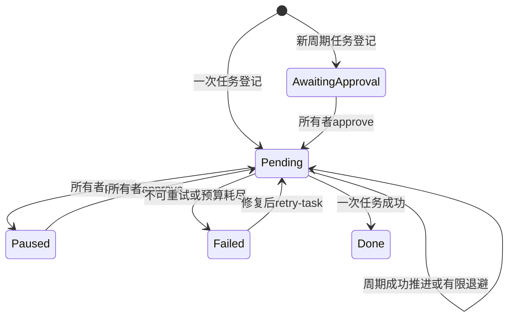
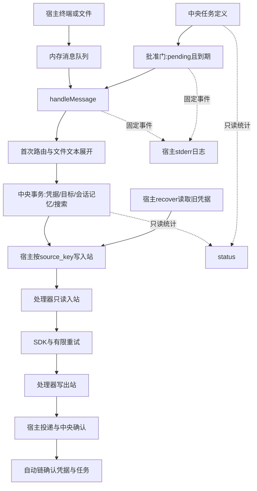

# 第 15 课：整理成可配置、可部署、可理解的系统

## 1. 前言

这一课先不考虑新的技术名词。我们从一个你可能真的会遇到的使用场景开始。

### 1.1 上一课的程序已经能做什么？

你已经可以给Andy发一句话，让它调用DeepSeek回答；也可以登记一个任务，让
程序到时间后自动把消息交给Andy。比如：“每小时给我出一道TypeScript练习题。”

任务会保存到数据库里。你启动 `--watch` 后，程序会不断查看有没有到期任务；
任务到期，就调用模型、得到回答、把回答显示在终端。

这些功能已经能跑通了。本课不是要让模型更聪明，也不是再写一遍收信和回复。
我们现在要解决的是：**当你开始长期使用它时，怎样管住它，又怎样看清它在做什么？**

### 1.2 第一个问题：我只是登记任务，还不想让它一直执行

假设你正在尝试“每小时出一道题”，先把任务保存下来，准备再检查消息内容和
执行频率。但在旧程序里，只要任务已保存、时间到了、扫描程序正在运行，
它就可以执行，没有“先保存，等我确认后再开始”这一步。

每执行一轮都可能调用收费模型。如果你把周期写得太短，例如本来想每小时一次，
却填成了每分钟一次，它就会比你预想的频繁得多。

而且，今天你不想继续出题了，旧程序也没有暂停单个任务的命令。你只能先关掉
整个扫描程序，这样其他正常任务也不能执行了。

要特别分清两件事：关闭watch后，扫描确实停止，不会靠这个已退出的进程继续
执行；**但数据库里的任务还在**。以后重新启动watch，它又可能执行。

所以，本课增加两种操作：

- **批准**：新周期任务先保存，但暂时不执行；你确认内容和频率之后，再允许它执行。
- **暂停**：暂时不再扫描某一个任务，但保留它的定义；以后想继续，再批准恢复。

这里的“批准”就是你在自己的终端明确说“可以开始了”，不是让模型审核消息，
也不是做一套多用户登录系统。一次性任务维持原来的行为，只有新周期任务默认
需要这一步确认；升级前已经存在的任务不会被悄悄改成暂停。

### 1.3 第二个问题：我想看一眼现状，而不是再执行一次

隔了几天，你重新打开项目，可能会问：

- 这次启动选的是本地假回复，还是真实模型？模型所需配置有没有填齐？
- 保存了多少条可搜索的消息，建立了多少个会话？
- 有多少任务待批准、已暂停或失败？还有多少消息没有全部处理完成？

旧程序已经有 `--tasks`，可以逐条查看任务，但它不汇总模型配置、会话数量和
消息接收凭据的完成情况。直接打开数据库查看又比较麻烦。

因此本课增加 `--status`，一次显示这些概况。它只查看，不会因为你“看一眼”
就创建数据库、修改数据、恢复消息或调用模型。

注意它只检查本地配置是否填齐，不会拿密钥去请求DeepSeek，所以不能证明
网络、余额或密钥一定可用；它也不能证明watch正在运行。

### 1.4 第三个问题：终端只有回答，我看不到程序经过了哪些步骤

假设某条消息处理成功了，你会看到Andy的回答。但你可能还想知道：“程序已经
收下消息了吗？这一轮任务完成了吗？”如果某个任务失败，你也希望有一条简短
记录，告诉你这一轮失败了，还是准备稍后重试。

数据库里的状态告诉你“现在是什么情况”；运行时打印的记录告诉你“刚才发生了
什么”。这种运行记录就叫**日志**。

本课增加可开关的日志，在接收、完成、失败和重试等已有环节打印简短事件。
它不是另一份聊天历史，所以这些事件不记录消息正文和API密钥，也不会把每秒
等待都打印出来。需要具体查看某个任务时，仍结合 `--tasks` 的时间和状态判断。

### 1.5 把本课的目标连起来

你今后使用周期任务的顺序会变成：先保存任务 → 检查内容和频率 → 批准 →
启动扫描 → 查看回答和运行记录 → 不想继续时停止扫描、暂停该任务。
想了解整体情况时，单独执行status，不顺便触发业务处理。

所以，本课的重点是**管理和观察已经能运行的程序**：批准/暂停用来控制任务，
status用来看当前概况，日志用来看刚才经过的步骤。它们加在原业务链旁边，
原来的路由、邮箱、模型调用和回复流程继续复用。

最后再把启动方式、配置读取、私人数据保存和备份讲清楚，这就是本课“部署说明”
的含义。我们不代你安装后台服务或部署云服务器，也不增加网站、账户或权限框架。
这是原定15课的最后一课，但仍需你测试、阅读、提问并手动提交，不能把代码生成
完当作你已经结课。

## 2. 主要内容

### 2.1 本课任务

1. **看现状**：增加 `--status`，显示配置和中央数据库的数量概况。只查看，
   不修改数据、不调用模型，也不显示正文和密钥。
2. **控制执行**：新周期任务先“等待批准”（awaiting_approval）；批准后才变成
   “可被扫描执行”（pending）。暂停后变成paused，想继续则再次批准。
   一次性任务仍直接pending，后面再具体看这些状态如何修改。
3. **看运行经过**：用 `LOG_LEVEL=info` 打开日志。日志写到stderr（运行信息输出），
   回答仍写到stdout（业务结果输出），两者不是同一份内容。默认off关闭日志。
4. **知道怎样使用和保护程序**：说明配置从哪里读取、扫描程序怎样启动和停止、
   私人数据怎样备份，以及哪些代码实际在容器里执行。
5. **回顾整个项目**：把前15课形成的业务链连起来，再说明原项目哪些能力没有复现。

### 2.2 观察链：不走业务初始化

```text
--status → runStatus()
  → readRuntimeStatus(当前目录/conversation.db)
    → providerSettings：只验证已有模型配置，不创建SDK客户端
    → logLevel：验证off/info
    → 文件不存在：返回databaseExists=false，不创建它
    → 文件存在：DatabaseSync({readOnly:true})
      → 查已有表 → COUNT与GROUP BY → 关闭连接
  → JSON.stringify → stdout打印统计
```

注意它**不调用 openCurrentDatabase**。后者会建表和迁移；让“看一眼状态”也
改变系统，是我们现在要避免的具体问题。

### 2.3 治理链：批准的是持续执行，不是批准消息内容

```text
--schedule → runSchedule → scheduleTask
  → interval未传：pending
  → interval已传：awaiting_approval

--approve-task ID → runTaskState(ID, approve)
  → changeTaskState → awaiting_approval/paused改pending

--sweep/--watch → sweepDueTasks
  → 只查pending且到期且到retry_at的任务
  → handleMessage → 既有凭据、邮箱、模型与投递链
  → 成功推进下一轮，或失败有限退避/failed

--pause-task ID → runTaskState(ID, pause)
  → changeTaskState → pending改paused
  → 下一次扫描不选择它
```

先停止 watch，等待当前批次退出，再在另一个命令中暂停或批准；随后重启。
本课依然只支持一个宿主业务执行者，不增加并发管理与请求取消机制。

### 2.4 日志链与测试阅读链

```text
handleMessage首次中央提交 → logEvent(receipt.accepted)
processReceipt全部完成/部分失败 → logEvent(receipt.completed/receipt.failed)
sweepDueTasks成功/退避/失败 → logEvent(task.completed/deferred/failed, taskId)
changeTaskState → logEvent(task.approved/paused, taskId)
logEvent → logLevel → off不写，info写一行JSON到stderr
```

测试先看 runtime.test.ts 的只读测试，再看审批测试。后者的 run 函数启动实际
CLI，SDK连接本地HTTP模拟服务，真实检验“未经批准请求数0、批准后1、暂停后
仍1、恢复批准后2”，而不是只断言一个字符串状态。

相对上一课新增的是**业务链旁边的观察入口、调度入口的批准门和事件记录**。
模型与邮箱算法不改，因此继续使用 lesson14 镜像，无需为了课程编号换镜像名。

## 3. 技术要点

### 3.1 环境配置与来源

没有新增依赖。继续 Node 22.13+、TypeScript、内置 SQLite、已有 Anthropic SDK。
`.env.example` 新增 `LOG_LEVEL=info`，**不会修改你已有的私人.env**；想开启
日志，请你自己在.env追加这一行。只接受 off/info，拼错会在业务初始化前报错。

```bash
pnpm test
pnpm test:container
pnpm build
node --env-file=.env dist/src/main.js --status
```

`process.env` 是当前进程看到的环境变量集合，不是.env文件本身。
`--env-file=.env` 才让 Node 读取文件；已有进程环境同名值优先，因此 shell 中
若已设 AI_PROVIDER=local，加载.env也不会把它变成真实模型。不自动加载.env的
命令默认 local；status 显示的是本次命令配置，不是某个运行中进程的配置。

模型地址、模型名和密钥仍由 providerSettings 验证；status 只输出协议名和
valid，不输出地址、模型名、密钥值。valid=true 仅证明本地必要配置存在，
不证明密钥可用、网络正常、余额足够。配置错误时 status 仍正常返回统计，
用 valid=false 表达问题；它不是云端健康检查。

### 3.2 坐标：新增代码全部在宿主

| 函数 | 执行侧 | 输入与输出/责任 |
|---|---|---|
| runStatus | 宿主main编排层 | 无参数→当前目录中央统计JSON |
| readRuntimeStatus | 宿主观察层 | DB路径、环境→脱敏统计对象，不写入 |
| logLevel | 宿主配置检查 | 环境→off/info，非法值抛错 |
| logEvent | 宿主观察层 | 固定事件名、可选数字任务ID→stderr一行 |
| scheduleTask | 宿主调度数据层 | 聊天、文字、时间、周期→任务ID与初始状态 |
| runTaskState | 宿主main编排层 | ID字符串、操作→打开库、改变状态、关闭 |
| changeTaskState | 宿主调度数据层 | DB、数字ID、approve/pause→条件UPDATE |
| sweepDueTasks | 宿主执行层 | 现有任务→只执行已获准pending任务 |

runtime.ts 没有复制进镜像。容器入口仍是 agent-runner → processMailbox →
provider → retryTransient；容器不读取中央任务审批，不知道任务状态，也不
获得中央库访问权限。批准门在宿主扫描之前，容器按宿主已经交接的入站处理。

### 3.3 数据与中间值

假设第一次登记：

```text
输入：--schedule 运维课堂 2000-01-01T00:00:00Z 3600000 '@Andy 给我一道题'
scheduleTask的intervalMs=3600000，nextRun=946684800000
中央scheduled_tasks：id=1，status=awaiting_approval
此刻没有新receipts、session_messages或邮箱消息，也没有模型请求
--approve-task 1：同一行status=pending，next_run不变
--sweep：产生source_key=task:1:946684800000，进入上一课完整链
成功：任务仍pending，next_run推进到本次扫描时间之后的原时间网格
--pause-task 1：同一行status=paused，next_run仍保留
```

`--status` 此时可能输出：

```json
{
  "configuration": { "provider": "anthropic", "logging": "info", "valid": true },
  "databaseExists": true,
  "counts": { "messages": 1, "sessions": 1, "deliveredReplies": 1 },
  "tasks": { "paused": 1 },
  "receipts": { "done": 1 }
}
```

这只是例子，你已有数据的数量会不同。没有某类状态就没有对应属性，`tasks:{}`
不表示损坏。counts.messages 指中央搜索表，不是各邮箱的同名messages表。
deliveredReplies 是中央投递确认数，不是所有模型回复数。receipts.pending 是
事件未全部确认，可能已经有部分回复；它也不是 pending 任务数。

这些统计临时存在宿主内存，打印后不存新表。中央文件仍在宿主当前工作目录。
status 不检查 watch 是否活着、不遍历邮箱、不自动恢复，更不收集模型用量。
若有其他进程写库，几条统计查询不保证是同一时刻快照；按单执行者约定观察。

### 3.4 状态所有者和审批边界



所有状态由宿主修改，持久化在中央 scheduled_tasks.status，不是内存变量。
changeTaskState 用 WHERE 限定来源状态：不能批准 done/failed，failed 应先
检查错误再 retry-task；不能暂停已完成任务；重复暂停也报错而不假装修改成功。
批准暂停任务不清空失败计数、不重置 next_run/retry_at，保留原轮次身份与
退避预算。停很久后批准只补一轮，不补发一串遗漏请求。

升级之前已经 pending 的周期任务维持原状态，不悄悄改变私人数据。
请先停止 watch，用 --tasks 检查它们，再决定是否 --pause-task。
暂停不删除定义、不撤回邮箱、不撤回已发送回复、不取消在途HTTP请求。
手动 --recover/--process 或容器命令仍是所有者的另一次明确执行，不受任务
暂停状态拦截；故暂停不能当成全系统的禁止模型调用开关。

这里的“权限”只假设操作终端和数据目录的是本地所有者，审批用于限制意外持续
执行。它**不是身份认证、聊天成员授权或工具审批**，无法阻止有宿主写权限的人
直接改库。模型没有工具调用能力；真实多用户平台出现之前不造用户权限表。

### 3.5 日志与标准流

stdout 是业务输出通道：回复、搜索结果、命令输出；stderr 是运行信息通道。
它们在终端上看起来可能混合，但重定向可以分开：

```bash
LOG_LEVEL=info node --env-file=.env dist/src/main.js --watch
```

一条结构化事件的形状：

```json
{"time":"2026-10-05T00:00:00.000Z","event":"task.completed","taskId":1}
```

时间是例子，实际用宿主 new Date().toISOString()，不是任务计划时间。
receipt事件没有taskId，JSON.stringify会省略 undefined 属性。我们不用通用
`log(anyObject)`，只接受枚举式字符串联合和一个数字，避免顺手传整份环境、
prompt、文件内容或原始Error。日志说明哪类环节发生，不提供完整逐消息追踪，
也不是数据库状态的替代品。

**脱敏只针对本课结构化事件和status**：stdout回复本身含私人内容，--tasks
仍显示任务正文，未捕获异常/Node警告可能出现在stderr。不要把整个终端输出
说成“完全无秘密”，分享报错前仍需人工遮蔽凭据；本课没有全局异常脱敏器。

### 3.6 细节技术：只读、计数、条件更新、类型

`existsSync` 先判断文件是否存在，避免默认数据库构造器创建一个空库。
`new DatabaseSync(path,{readOnly:true})` 让这个连接不能写；它只限制本连接，
不能阻止其他进程写。查 sqlite_master 的表清单后，只查询已有表，所以旧库
也可观察而不ALTER TABLE。库损坏或文件不是数据库仍会报错，不把错误假装成0。

`COUNT(*)` 数行，`GROUP BY status` 把同状态行分组。例如pending两行、failed
一行产生两条聚合结果，再变成 `{pending:2,failed:1}`。结果对象不是新的表。
SQL中动态插入的表名来自源码固定清单，不接受用户输入；任务ID仍通过`?`绑定。

`as const` 保留清单里的字面量类型，使 field 是 counts 中合法的键，不退化为
任意string。`Record<string,number>` 表示状态名到数量的普通对象；`Set`用来
判断表名是否存在。`Number(row.total)`把SQLite返回的数字类型统一为JS number。
这里只统计小型本地库，不承诺超出安全整数的精确计数。

条件UPDATE的 `result.changes` 表示实际改了几行：0就是没有合法状态转换。
它比先查后写更直接，但不是完整并发锁。catch不打印原配置值；finally即使
读取失败也关闭连接。JSON.stringify 的第三参数2只是让status缩进易读，日志
不缩进以保持“一行一个事件”。

### 3.7 最小部署与数据边界

教学部署是**单个可信用户、一个项目工作目录、一个前台宿主扫描进程**。
没有公网HTTP服务，因此不需要开放端口。构建后用下面命令持续扫描；Ctrl+C
等当前批次退出。不要同时运行另一个watch/sweep/recover，或在它执行时操作任务。

```bash
pnpm install --frozen-lockfile
pnpm build
node --env-file=.env dist/src/main.js --status
node dist/src/main.js --tasks
LOG_LEVEL=info node --env-file=.env dist/src/main.js --watch
```

先确认任务内容与频率，批准需要的周期任务，再启动watch。pnpm start:model 是
交互聊天入口，不是后台扫描入口；自动聊天、定时、recover都在宿主调用模型。
Docker仍只在你显式执行 --process-container 时运行，一轮后退出，不是所有
入口默认容器化。保持镜像lesson14，并用 --receive/--process-container/--deliver
完成需要隔离的分段操作。宿主传密钥进容器环境，并不意味着Docker管理员看不到它。

保护 .env、conversation.db、mailboxes、私人attachments：Git忽略不是加密或
操作系统访问控制。只给可信用户目录读写权限，不把Docker控制权给不可信账户。
如要留日志，先在你自己的终端设 `umask 077`，再用新的私人输出文件重定向；
不要覆盖已有日志文件。本课不自动创建日志文件或更改你机器的权限。

备份要先停止宿主并等待容器结束，把中央库、整个mailboxes和需要的附件一起
复制到新的受保护目录；若存在SQLite旁文件，也一并保留。单独保存中央库不是
完整会话备份，Git提交也不包含这些数据。升级前备份，恢复后先status、再查看
任务，最后由所有者决定是否执行recover，因为恢复会产生API请求。

不安装systemd、不代你部署云服务器、不启用自动重启。将来真的需要常驻服务、
滚动日志、多人访问或平台接入，再按那些需求设计，不为了“看起来完整”加组件。

### 3.8 最终调用与数据地图



processMailbox在宿主或容器执行，文件始终驻留宿主；图中处理器区不代表默认
容器。详细原项目对照、数据身份和抽象演化见 `tutorial/参考/最终心智模型.md`。

## 4. 测试与验收

### 4.1 只读测试：观察不改变系统

空临时目录执行status，预期没有创建任何文件。临时旧库只有messages表时，
执行status得到消息数1，数据库前后字节完全相同，没有迁移表；配置密钥、地址
与消息正文不进入输出。非法日志配置或缺少模型配置得到valid=false。
证明观察入口独立、输出范围受控，不证明云端凭据可用。

### 4.2 审批测试：以SDK请求数验证费用边界

真实SDK连接本地模拟服务，新周期任务awaiting_approval：扫描无请求；批准后
请求1次并输出模型回复；暂停并强制把时间改到已到期，扫描仍无额外请求；重新
批准后才新增1次。重复暂停报错，非法日志开关阻止业务执行。JSON运行事件不
含正文/密钥，stdout依然只包含预期回复。模拟服务不消耗你的云端额度。
旧调度测试的周期任务现在先批准，再验证推进与失败，旧链行为仍继续回归。

VS Code绿色按钮位于 runtime.test.ts 两个test回调旁；不出现时使用 `pnpm test`。
普通测试26项，Docker回归1项；实际结果由当前执行记录填写，不把它当学生反馈。

### 4.3 主要验收：用自己的DeepSeek执行受控周期任务

先停止其他watch。使用一个未配置过的聊天名，或先检查现有绑定；新增周期一个
小时，设30秒后首次执行。**先等待到期再做一次sweep**，不启动长期watch，以
避免忘记关闭而持续收费。沿用你已能工作的.env模型配置。

```bash
pnpm build
node --env-file=.env dist/src/main.js --status
lesson15_at=$(node -e 'console.log(new Date(Date.now()+30000).toISOString())')
node dist/src/main.js --schedule 运维验收 "$lesson15_at" 3600000 '@Andy 用两句话说明消息队列和持久邮箱的区别。'
node dist/src/main.js --tasks
```

记住打印的任务ID，下面用你的实际ID替换1。到期后：

```bash
LOG_LEVEL=info node --env-file=.env dist/src/main.js --sweep
node dist/src/main.js --approve-task 1
LOG_LEVEL=info node --env-file=.env dist/src/main.js --sweep
node dist/src/main.js --pause-task 1
node --env-file=.env dist/src/main.js --status
```

第一遍扫描不执行这个未批准任务；批准后得到自然语言解释，日志有completed；
最后status含paused。扫描也会执行**其他已获准到期任务**，不是只扫描ID=1，
所以务必先查看--tasks。模型可能因暂时错误重试并收费，云端回答不做精确措辞断言。
若失败，先查看tasks，修复后使用retry-task，不反复重发制造新任务。

如已经把LOG_LEVEL加入.env，可以省略命令前的LOG_LEVEL=info。
学生亲自运行后反馈测试结果及隐藏凭据的错误输出，不让Agent代用私人账号。

### 4.4 最终理解验收与提交

请按一条具体消息复述：谁收到它、谁选助手、什么时候读上一句、正文存在哪里、
谁调用模型、谁确认处理和投递；再说明一次任务失败后靠什么身份恢复，以及
中央搜索记录/凭据/会话记忆/入站/出站为何不相同。

通过后先 `git status`、`git diff` 检查，只添加本课相关文件；建议中文提交信息
为“第15课：周期审批、只读状态与运行日志”。由你手动commit和上传。

## 5. 总结

旧调度只解决“能执行”，本课补上“明确允许持续执行”和“能看懂当前状况”。
批准/暂停复用任务状态，不造审批工作流；status独立只读，不借观察触发初始化；
日志只接受固定事件，不复制私人业务数据。配置与部署边界现在能够清楚说明。

至此15课的教学实现已生成，核心Happy Path、数据流、状态、模块和第三方组件
可与原项目对照。但教学版不是完整NanoClaw：平台渠道、工具执行、多用户权限、
OneCLI审批、常驻容器、分布式锁和完整多轮模型历史等主动省略。它也不承诺崩溃
下绝对恰好一次。下一步是你的真实模型验收、复述、提问与手动提交，不自动扩展
第16课或宣称你已经结课。
